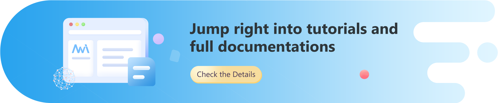

<div align="center">

</div>

<br/>

[](LICENSE)
[](https://github.com/Microsoft/nni/issues?q=is%3Aissue+is%3Aopen)
[](https://github.com/Microsoft/nni/issues?q=is%3Aissue+is%3Aopen+label%3Abug)
[](https://github.com/Microsoft/nni/pulls?q=is%3Apr+is%3Aopen)
[](https://github.com/Microsoft/nni/releases)
[](https://nni.readthedocs.io/en/stable/?badge=stable)
[](https://github.com/microsoft/nni/graphs/contributors)


[](https://nni.readthedocs.io/en/stable)

NNI automates feature engineering, neural architecture search, hyperparameter tuning, and model compression for deep learning. Find the latest features, API, examples and tutorials in our **[official documentation](https://nni.readthedocs.io/) ([简体中文版点这里](https://nni.readthedocs.io/zh/stable))**.

## What's NEW! &nbsp;<a href="#nni-released-reminder"></a>

* **New release**: [v3.0 preview is available](https://github.com/microsoft/nni/releases/tag/v3.0rc1) - _released on May-5-2022_
* **New demo available**: [Youtube entry](https://www.youtube.com/channel/UCKcafm6861B2mnYhPbZHavw) | [Bilibili 入口](https://space.bilibili.com/1649051673) - _last updated on June-22-2022_
* **New research paper**: [SparTA: Deep-Learning Model Sparsity via Tensor-with-Sparsity-Attribute](https://www.usenix.org/system/files/osdi22-zheng-ningxin.pdf) - _published in OSDI 2022_
* **New research paper**: [Privacy-preserving Online AutoML for Domain-Specific Face Detection](https://openaccess.thecvf.com/content/CVPR2022/papers/Yan_Privacy-Preserving_Online_AutoML_for_Domain-Specific_Face_Detection_CVPR_2022_paper.pdf) - _published in CVPR 2022_
* **Newly upgraded documentation**: [Doc upgraded](https://nni.readthedocs.io/en/stable)


## Installation

See the [NNI installation guide](https://nni.readthedocs.io/en/stable/installation.html) to install from pip, or build from source.

To install the current release:

```
$ pip install nni
```

To update NNI to the latest version, add `--upgrade` flag to the above commands.

## NNI capabilities in a glance


<table>
<tbody>
<tr align="center" valign="bottom">
<td></td>
<td>
<b>Hyperparameter Tuning</b>

</td>
<td>
<b>Neural Architecture Search</b>

</td>
<td>
<b>Model Compression</b>

</td>
</tr>
<tr valign="top">
<td align="center" valign="middle">
<b>Algorithms</b>
</td>
<td>
<ul>
<li><b>Exhaustive search</b></li>
<ul>
<li><a href="https://nni.readthedocs.io/en/latest/reference/hpo.html#nni.algorithms.hpo.gridsearch_tuner.GridSearchTuner">Grid Search</a></li>
<li><a href="https://nni.readthedocs.io/en/latest/reference/hpo.html#nni.algorithms.hpo.random_tuner.RandomTuner">Random</a></li>
</ul>
<li><b>Heuristic search</b></li>
<ul>
<li><a href="https://nni.readthedocs.io/en/latest/reference/hpo.html#nni.algorithms.hpo.hyperopt_tuner.HyperoptTuner">Anneal</a></li>
<li><a href="https://nni.readthedocs.io/en/latest/reference/hpo.html#nni.algorithms.hpo.evolution_tuner.EvolutionTuner">Evolution</a></li>
<li><a href="https://nni.readthedocs.io/en/latest/reference/hpo.html#nni.algorithms.hpo.hyperband_advisor.Hyperband">Hyperband</a></li>
<li><a href="https://nni.readthedocs.io/en/latest/reference/hpo.html#nni.algorithms.hpo.pbt_tuner.PBTTuner">PBT</a></li>
</ul>
<li><b>Bayesian optimization</b></li>
<ul>
<li><a href="https://nni.readthedocs.io/en/latest/reference/hpo.html#nni.algorithms.hpo.bohb_advisor.BOHB">BOHB</a></li>
<li><a href="https://nni.readthedocs.io/en/latest/reference/hpo.html#nni.algorithms.hpo.dngo_tuner.DNGOTuner">DNGO</a></li>
<li><a href="https://nni.readthedocs.io/en/latest/reference/hpo.html#nni.algorithms.hpo.gp_tuner.GPTuner">GP</a></li>
<li><a href="https://nni.readthedocs.io/en/latest/reference/hpo.html#nni.algorithms.hpo.metis_tuner.MetisTuner">Metis</a></li>
<li><a href="https://nni.readthedocs.io/en/latest/reference/hpo.html#nni.algorithms.hpo.smac_tuner.SMACTuner">SMAC</a></li>
<li><a href="https://nni.readthedocs.io/en/latest/reference/hpo.html#nni.algorithms.hpo.tpe_tuner.TpeTuner">TPE</a></li>
</ul>
</ul>
</td>
<td>
<ul>
<li><b>Multi-trial</b></li>
<ul>
<li><a href="https://nni.readthedocs.io/en/latest/nas/exploration_strategy.html#grid-search-strategy">Grid Search</a></li>
<li><a href="https://nni.readthedocs.io/en/latest/nas/exploration_strategy.html#policy-based-rl-strategy">Policy Based RL</a></li>
<li><a href="https://nni.readthedocs.io/en/latest/nas/exploration_strategy.html#random-strategy">Random</a></li>
<li><a href="https://nni.readthedocs.io/en/latest/nas/exploration_strategy.html#regularized-evolution-strategy">Regularized Evolution</a></li>
<li><a href="https://nni.readthedocs.io/en/latest/nas/exploration_strategy.html#tpe-strategy">TPE</a></li>
</ul>
<li><b>One-shot</b></li>
<ul>
<li><a href="https://nni.readthedocs.io/en/latest/nas/exploration_strategy.html#darts-strategy">DARTS</a></li>
<li><a href="https://nni.readthedocs.io/en/latest/nas/exploration_strategy.html#enas-strategy">ENAS</a></li>
<li><a href="https://nni.readthedocs.io/en/latest/nas/exploration_strategy.html#fbnet-strategy">FBNet</a></li>
<li><a href="https://nni.readthedocs.io/en/latest/nas/exploration_strategy.html#proxylessnas-strategy">ProxylessNAS</a></li>
<li><a href="https://nni.readthedocs.io/en/latest/nas/exploration_strategy.html#spos-strategy">SPOS</a></li>
</ul>
</ul>
</td>
<td>
<ul>
<li><b>Pruning</b></li>
<ul>
<li><a href="https://nni.readthedocs.io/en/latest/compression/pruner.html#level-pruner">Level</a></li>
<li><a href="https://nni.readthedocs.io/en/latest/compression/pruner.html#l1-norm-pruner">L1 Norm</a></li>
<li><a href="https://nni.readthedocs.io/en/latest/compression/pruner.html#taylor-fo-weight-pruner">Taylor FO Weight</a></li>
<li><a href="https://nni.readthedocs.io/en/latest/compression/pruner.html#movement-pruner">Movement</a></li>
<li><a href="https://nni.readthedocs.io/en/latest/compression/pruner.html#agp-pruner">AGP</a></li>
<li><a href="https://nni.readthedocs.io/en/latest/compression/pruner.html#auto-compress-pruner">Auto Compress</a></li>
<li><a href="https://nni.readthedocs.io/en/latest/compression/pruner.html">More...</a></li>
</ul>
<li><b>Quantization</b></li>
<ul>
<li><a href="https://nni.readthedocs.io/en/latest/compression/quantizer.html#naive-quantizer">Naive</a></li>
<li><a href="https://nni.readthedocs.io/en/latest/compression/quantizer.html#qat-quantizer">QAT</a></li>
<li><a href="https://nni.readthedocs.io/en/latest/compression/quantizer.html#lsq-quantizer">LSQ</a></li>
<li><a href="https://nni.readthedocs.io/en/latest/compression/quantizer.html#observer-quantizer">Observer</a></li>
<li><a href="https://nni.readthedocs.io/en/latest/compression/quantizer.html#dorefa-quantizer">DoReFa</a></li>
<li><a href="https://nni.readthedocs.io/en/latest/compression/quantizer.html#bnn-quantizer">BNN</a></li>
</ul>
</ul>
</td>
<tr align="center" valign="bottom">
<td></td>
<td>
<b>Supported Frameworks</b>

</td>
<td>
<b>Training Services</b>

</td>
<td>
<b>Tutorials</b>

</td>
</tr>
<tr valign="top">
<td align="center" valign="middle">
<b>Supports</b>
</td>
<td>
<ul>
<li>PyTorch</li>
<li>TensorFlow</li>
<li>Scikit-learn</li>
<li>XGBoost</li>
<li>LightGBM</li>
<li>MXNet</li>
<li>Caffe2</li>
<li>More...</li>
</ul>
</td>
<td>
<ul>
<li><a href="https://nni.readthedocs.io/en/latest/experiment/local.html">Local machine</a></li>
<li><a href="https://nni.readthedocs.io/en/latest/experiment/remote.html">Remote SSH servers</a></li>
<li><a href="https://nni.readthedocs.io/en/latest/experiment/aml.html">Azure Machine Learning (AML)</a></li>
<li><b>Kubernetes Based</b></li>
<ul>
<li><a href="https://nni.readthedocs.io/en/latest/experiment/openpai.html">OpenAPI</a></li>
<li><a href="https://nni.readthedocs.io/en/latest/experiment/kubeflow.html">Kubeflow</a></li>
<li><a href="https://nni.readthedocs.io/en/latest/experiment/frameworkcontroller.html">FrameworkController</a></li>
<li><a href="https://nni.readthedocs.io/en/latest/experiment/adaptdl.html">AdaptDL</a></li>
<li><a href="https://nni.readthedocs.io/en/latest/experiment/paidlc.html">PAI DLC</a></li>
</ul>
<li><a href="https://nni.readthedocs.io/en/latest/experiment/hybrid.html">Hybrid training services</a></li>
</ul>
</td>
<td>
<ul>
<li><b>HPO</b></li>
<ul>
<li><a href="https://nni.readthedocs.io/en/latest/tutorials/hpo_quickstart_pytorch/main.html">PyTorch</a></li>
<li><a href="https://nni.readthedocs.io/en/latest/tutorials/hpo_quickstart_tensorflow/main.html">TensorFlow</a></li>
</ul>
<li><b>NAS</b></li>
<ul>
<li><a href="https://nni.readthedocs.io/en/latest/tutorials/hello_nas.html">Hello NAS</a></li>
<li><a href="https://nni.readthedocs.io/en/latest/tutorials/nasbench_as_dataset.html">NAS Benchmarks</a></li>
</ul>
<li><b>Compression</b></li>
<ul>
<li><a href="https://nni.readthedocs.io/en/latest/tutorials/pruning_quick_start.html">Pruning</a></li>
<li><a href="https://nni.readthedocs.io/en/latest/tutorials/pruning_speed_up.html">Pruning Speedup</a></li>
<li><a href="https://nni.readthedocs.io/en/latest/tutorials/quantization_quick_start.html">Quantization</a></li>
<li><a href="https://nni.readthedocs.io/en/latest/tutorials/quantization_speed_up.html">Quantization Speedup</a></li>
</ul>
</ul>
</td>
</tbody>
</table>


## Resources

* [NNI Documentation Homepage](https://nni.readthedocs.io/en/stable)
* [NNI Installation Guide](https://nni.readthedocs.io/en/stable/installation.html)
* [NNI Examples](https://nni.readthedocs.io/en/latest/examples.html)
* [Python API Reference](https://nni.readthedocs.io/en/latest/reference/python_api.html)
* [Releases (Change Log)](https://nni.readthedocs.io/en/latest/release.html)
* [Related Research and Publications](https://nni.readthedocs.io/en/latest/notes/research_publications.html)
* [Youtube Channel of NNI](https://www.youtube.com/channel/UCKcafm6861B2mnYhPbZHavw)
* [Bilibili Space of NNI](https://space.bilibili.com/1649051673)
* [Webinar of Introducing Retiarii: A deep learning exploratory-training framework on NNI](https://note.microsoft.com/MSR-Webinar-Retiarii-Registration-Live.html)
* [Community Discussions](https://github.com/microsoft/nni/discussions)

## Contribution guidelines

If you want to contribute to NNI, be sure to review the [contribution guidelines](https://nni.readthedocs.io/en/stable/notes/contributing.html), which includes instructions of submitting feedbacks, best coding practices, and code of conduct.

We use [GitHub issues](https://github.com/microsoft/nni/issues) to track tracking requests and bugs.
Please use [NNI Discussion](https://github.com/microsoft/nni/discussions) for general questions and new ideas.
For questions of specific use cases, please go to [Stack Overflow](https://stackoverflow.com/questions/tagged/nni).

Participating discussions via the following IM groups is also welcomed.

|Gitter||WeChat|
|----|----|----|
|| OR ||

Over the past few years, NNI has received thousands of feedbacks on GitHub issues, and pull requests from hundreds of contributors.
We appreciate all contributions from community to make NNI thrive.


<a href="https://github.com/microsoft/nni/graphs/contributors"></a>

## Test status

### Essentials

| Type | Status |
| :---: | :---: |
| Fast test | [](https://msrasrg.visualstudio.com/NNIOpenSource/_build/latest?definitionId=54&branchName=master) |
| Full test - HPO | [](https://msrasrg.visualstudio.com/NNIOpenSource/_build/latest?definitionId=90&repoName=microsoft%2Fnni&branchName=master) |
| Full test - NAS | [](https://msrasrg.visualstudio.com/NNIOpenSource/_build/latest?definitionId=89&repoName=microsoft%2Fnni&branchName=master) |
| Full test - compression | [](https://msrasrg.visualstudio.com/NNIOpenSource/_build/latest?definitionId=91&repoName=microsoft%2Fnni&branchName=master) |

### Training services

| Type | Status |
| :---: | :---: |
| Local - linux | [](https://msrasrg.visualstudio.com/NNIOpenSource/_build/latest?definitionId=92&branchName=master) |
| Local - windows | [](https://msrasrg.visualstudio.com/NNIOpenSource/_build/latest?definitionId=98&branchName=master) |
| Remote - linux to linux | [](https://msrasrg.visualstudio.com/NNIOpenSource/_build/latest?definitionId=64&branchName=master) |
| Remote - windows to windows | [](https://msrasrg.visualstudio.com/NNIOpenSource/_build/latest?definitionId=99&branchName=master) |
| OpenPAI | [](https://msrasrg.visualstudio.com/NNIOpenSource/_build/latest?definitionId=65&branchName=master) |
| Frameworkcontroller | [](https://msrasrg.visualstudio.com/NNIOpenSource/_build/latest?definitionId=70&branchName=master) |
| Kubeflow | [](https://msrasrg.visualstudio.com/NNIOpenSource/_build/latest?definitionId=69&branchName=master) |
| Hybrid | [](https://msrasrg.visualstudio.com/NNIOpenSource/_build/latest?definitionId=79&branchName=master) |
| AzureML | [](https://msrasrg.visualstudio.com/NNIOpenSource/_build/latest?definitionId=78&branchName=master) |

## Related Projects

Targeting at openness and advancing state-of-art technology, [Microsoft Research (MSR)](https://www.microsoft.com/en-us/research/group/systems-and-networking-research-group-asia/) had also released few other open source projects.

* [OpenPAI](https://github.com/Microsoft/pai) : an open source platform that provides complete AI model training and resource management capabilities, it is easy to extend and supports on-premise, cloud and hybrid environments in various scale.
* [FrameworkController](https://github.com/Microsoft/frameworkcontroller) : an open source general-purpose Kubernetes Pod Controller that orchestrate all kinds of applications on Kubernetes by a single controller.
* [MMdnn](https://github.com/Microsoft/MMdnn) : A comprehensive, cross-framework solution to convert, visualize and diagnose deep neural network models. The "MM" in MMdnn stands for model management and "dnn" is an acronym for deep neural network.
* [SPTAG](https://github.com/Microsoft/SPTAG) : Space Partition Tree And Graph (SPTAG) is an open source library for large scale vector approximate nearest neighbor search scenario.
* [nn-Meter](https://github.com/microsoft/nn-Meter) : An accurate inference latency predictor for DNN models on diverse edge devices.

We encourage researchers and students leverage these projects to accelerate the AI development and research.

## License

The entire codebase is under [MIT license](LICENSE).
