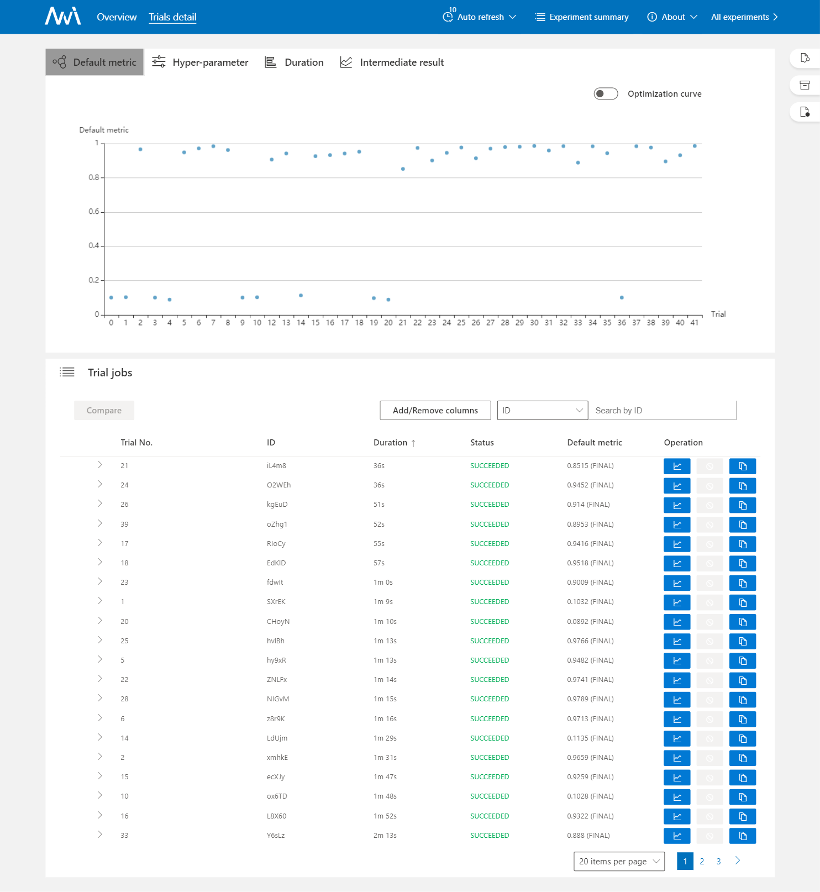

<p align="center">

</p>

-----------

[](LICENSE)
[](https://msrasrg.visualstudio.com/NNIOpenSource/_build/latest?definitionId=62&branchName=master)
[](https://github.com/Microsoft/nni/issues?q=is%3Aissue+is%3Aopen)
[](https://github.com/Microsoft/nni/issues?q=is%3Aissue+is%3Aopen+label%3Abug)
[](https://github.com/Microsoft/nni/pulls?q=is%3Apr+is%3Aopen)
[](https://github.com/Microsoft/nni/releases) [](https://gitter.im/Microsoft/nni?utm_source=badge&utm_medium=badge&utm_campaign=pr-badge&utm_content=badge)
[](https://nni.readthedocs.io/en/latest/?badge=latest)

[NNI Doc](https://nni.readthedocs.io/) | [简体中文](README_zh_CN.md)

**NNI (Neural Network Intelligence)** is a lightweight but powerful toolkit to help users **automate** <a href="docs/en_US/FeatureEngineering/Overview.rst">Feature Engineering</a>, <a href="docs/en_US/NAS/Overview.rst">Neural Architecture Search</a>, <a href="docs/en_US/Tuner/BuiltinTuner.rst">Hyperparameter Tuning</a> and <a href="docs/en_US/Compression/Overview.rst">Model Compression</a>.

The tool manages automated machine learning (AutoML) experiments, **dispatches and runs** experiments' trial jobs generated by tuning algorithms to search the best neural architecture and/or hyper-parameters in **different training environments** like <a href="docs/en_US/TrainingService/LocalMode.rst">Local Machine</a>, <a href="docs/en_US/TrainingService/RemoteMachineMode.rst">Remote Servers</a>, <a href="docs/en_US/TrainingService/PaiMode.rst">OpenPAI</a>, <a href="docs/en_US/TrainingService/KubeflowMode.rst">Kubeflow</a>, <a href="docs/en_US/TrainingService/FrameworkControllerMode.rst">FrameworkController on K8S (AKS etc.)</a>, <a href="docs/en_US/TrainingService/DLTSMode.rst">DLWorkspace (aka. DLTS)</a>, <a href="docs/en_US/TrainingService/AMLMode.rst">AML (Azure Machine Learning)</a>, <a href="docs/en_US/TrainingService/AdaptDLMode.rst">AdaptDL (aka. ADL)</a> , other cloud options and even <a href="docs/en_US/TrainingService/HybridMode.rst">Hybrid mode</a>.

## **Who should consider using NNI**

* Those who want to **try different AutoML algorithms** in their training code/model.
* Those who want to run AutoML trial jobs **in different environments** to speed up search.
* Researchers and data scientists who want to easily **implement and experiment new AutoML algorithms**, may it be: hyperparameter tuning algorithm, neural architect search algorithm or model compression algorithm.
* ML Platform owners who want to **support AutoML in their platform**.

## **What's NEW!** &nbsp;<a href="#nni-released-reminder"></a>
* **New release**: [v2.0 is available](https://github.com/microsoft/nni/releases) - _released on Jan-14-2021_
* **New demo available**: [Youtube entry](https://www.youtube.com/channel/UCKcafm6861B2mnYhPbZHavw) | [Bilibili 入口](https://space.bilibili.com/1649051673) - _last updated on Feb-19-2021_

* **New use case sharing**: [Cost-effective Hyper-parameter Tuning using AdaptDL with NNI](https://medium.com/casl-project/cost-effective-hyper-parameter-tuning-using-adaptdl-with-nni-e55642888761) - _posted on Feb-23-2021_

## **NNI capabilities in a glance**

NNI provides CommandLine Tool as well as an user friendly WebUI to manage training experiments. With the extensible API, you can customize your own AutoML algorithms and training services. To make it easy for new users, NNI also provides a set of build-in state-of-the-art AutoML algorithms and out of box support for popular training platforms.

Within the following table, we summarized the current NNI capabilities, we are gradually adding new capabilities and we'd love to have your contribution.

<p align="center">
  <a href="#nni-has-been-released"></a>
</p>

<table>
  <tbody>
    <tr align="center" valign="bottom">
    <td>
      </td>
      <td>
        <b>Frameworks & Libraries</b>
        
      </td>
      <td>
        <b>Algorithms</b>
        
      </td>
      <td>
        <b>Training Services</b>
        
      </td>
    </tr>
    </tr>
    <tr valign="top">
    <td align="center" valign="middle">
    <b>Built-in</b>
      </td>
      <td>
      <ul><li><b>Supported Frameworks</b></li>
        <ul>
          <li>PyTorch</li>
          <li>Keras</li>
          <li>TensorFlow</li>
          <li>MXNet</li>
          <li>Caffe2</li>
          <a href="docs/en_US/SupportedFramework_Library.rst">More...</a><br/>
        </ul>
        </ul>
      <ul>
        <li><b>Supported Libraries</b></li>
          <ul>
           <li>Scikit-learn</li>
           <li>XGBoost</li>
           <li>LightGBM</li>
           <a href="docs/en_US/SupportedFramework_Library.rst">More...</a><br/>
          </ul>
      </ul>
        <ul>
        <li><b>Examples</b></li>
         <ul>
           <li><a href="examples/trials/mnist-pytorch">MNIST-pytorch</li></a>
           <li><a href="examples/trials/mnist-tfv1">MNIST-tensorflow</li></a>
           <li><a href="examples/trials/mnist-keras">MNIST-keras</li></a>
           <li><a href="docs/en_US/TrialExample/GbdtExample.rst">Auto-gbdt</a></li>
           <li><a href="docs/en_US/TrialExample/Cifar10Examples.rst">Cifar10-pytorch</li></a>
           <li><a href="docs/en_US/TrialExample/SklearnExamples.rst">Scikit-learn</a></li>
           <li><a href="docs/en_US/TrialExample/EfficientNet.rst">EfficientNet</a></li>
           <li><a href="docs/en_US/TrialExample/OpEvoExamples.rst">Kernel Tunning</li></a>
              <a href="docs/en_US/SupportedFramework_Library.rst">More...</a><br/>
          </ul>
        </ul>
      </td>
      <td align="left" >
        <a href="docs/en_US/Tuner/BuiltinTuner.rst">Hyperparameter Tuning</a>
        <ul>
          <b>Exhaustive search</b>
          <ul>
            <li><a href="docs/en_US/Tuner/BuiltinTuner.rst#Random">Random Search</a></li>
            <li><a href="docs/en_US/Tuner/BuiltinTuner.rst#GridSearch">Grid Search</a></li>
            <li><a href="docs/en_US/Tuner/BuiltinTuner.rst#Batch">Batch</a></li>
            </ul>
          <b>Heuristic search</b>
          <ul>
            <li><a href="docs/en_US/Tuner/BuiltinTuner.rst#Evolution">Naïve Evolution</a></li>
            <li><a href="docs/en_US/Tuner/BuiltinTuner.rst#Anneal">Anneal</a></li>
            <li><a href="docs/en_US/Tuner/BuiltinTuner.rst#Hyperband">Hyperband</a></li>
            <li><a href="docs/en_US/Tuner/BuiltinTuner.rst#PBTTuner">PBT</a></li>
          </ul>
          <b>Bayesian optimization</b>
            <ul>
              <li><a href="docs/en_US/Tuner/BuiltinTuner.rst#BOHB">BOHB</a></li>
              <li><a href="docs/en_US/Tuner/BuiltinTuner.rst#TPE">TPE</a></li>
            <li><a href="docs/en_US/Tuner/BuiltinTuner.rst#SMAC">SMAC</a></li>
            <li><a href="docs/en_US/Tuner/BuiltinTuner.rst#MetisTuner">Metis Tuner</a></li>
            <li><a href="docs/en_US/Tuner/BuiltinTuner.rst#GPTuner">GP Tuner</a></li>
            </ul>
          <b>RL Based</b>
          <ul>
            <li><a href="docs/en_US/Tuner/BuiltinTuner.rst#PPOTuner">PPO Tuner</a> </li>
          </ul>
        </ul>
          <a href="docs/en_US/NAS/Overview.rst">Neural Architecture Search</a>
          <ul>
            <ul>
              <li><a href="docs/en_US/NAS/ENAS.rst">ENAS</a></li>
              <li><a href="docs/en_US/NAS/DARTS.rst">DARTS</a></li>
              <li><a href="docs/en_US/NAS/PDARTS.rst">P-DARTS</a></li>
              <li><a href="docs/en_US/NAS/CDARTS.rst">CDARTS</a></li>
              <li><a href="docs/en_US/NAS/SPOS.rst">SPOS</a></li>
              <li><a href="docs/en_US/NAS/Proxylessnas.rst">ProxylessNAS</a></li>
              <li><a href="docs/en_US/Tuner/BuiltinTuner.rst#NetworkMorphism">Network Morphism</a></li>
              <li><a href="docs/en_US/NAS/TextNAS.rst">TextNAS</a></li>
              <li><a href="docs/en_US/NAS/Cream.rst">Cream</a></li>
            </ul>
          </ul>
          <a href="docs/en_US/Compression/Overview.rst">Model Compression</a>
          <ul>
            <b>Pruning</b>
            <ul>
              <li><a href="docs/en_US/Compression/Pruner.rst#agp-pruner">AGP Pruner</a></li>
              <li><a href="docs/en_US/Compression/Pruner.rst#slim-pruner">Slim Pruner</a></li>
              <li><a href="docs/en_US/Compression/Pruner.rst#fpgm-pruner">FPGM Pruner</a></li>
              <li><a href="docs/en_US/Compression/Pruner.rst#netadapt-pruner">NetAdapt Pruner</a></li>
              <li><a href="docs/en_US/Compression/Pruner.rst#simulatedannealing-pruner">SimulatedAnnealing Pruner</a></li>
              <li><a href="docs/en_US/Compression/Pruner.rst#admm-pruner">ADMM Pruner</a></li>
              <li><a href="docs/en_US/Compression/Pruner.rst#autocompress-pruner">AutoCompress Pruner</a></li>
            </ul>
            <b>Quantization</b>
            <ul>
              <li><a href="docs/en_US/Compression/Quantizer.rst#qat-quantizer">QAT Quantizer</a></li>
              <li><a href="docs/en_US/Compression/Quantizer.rst#dorefa-quantizer">DoReFa Quantizer</a></li>
            </ul>
          </ul>
          <a href="docs/en_US/FeatureEngineering/Overview.rst">Feature Engineering (Beta)</a>
          <ul>
          <li><a href="docs/en_US/FeatureEngineering/GradientFeatureSelector.rst">GradientFeatureSelector</a></li>
          <li><a href="docs/en_US/FeatureEngineering/GBDTSelector.rst">GBDTSelector</a></li>
          </ul>
          <a href="docs/en_US/Assessor/BuiltinAssessor.rst">Early Stop Algorithms</a>
          <ul>
          <li><a href="docs/en_US/Assessor/BuiltinAssessor.rst#Medianstop">Median Stop</a></li>
          <li><a href="docs/en_US/Assessor/BuiltinAssessor.rst#Curvefitting">Curve Fitting</a></li>
          </ul>
      </td>
      <td>
      <ul>
        <li><a href="docs/en_US/TrainingService/LocalMode.rst">Local Machine</a></li>
        <li><a href="docs/en_US/TrainingService/RemoteMachineMode.rst">Remote Servers</a></li>
        <li><a href="docs/en_US/TrainingService/HybridMode.rst">Hybrid mode</a></li>
        <li><a href="docs/en_US/TrainingService/AMLMode.rst">AML(Azure Machine Learning)</a></li>
        <li><b>Kubernetes based services</b></li>
        <ul>
          <li><a href="docs/en_US/TrainingService/PaiMode.rst">OpenPAI</a></li>
          <li><a href="docs/en_US/TrainingService/KubeflowMode.rst">Kubeflow</a></li>
          <li><a href="docs/en_US/TrainingService/FrameworkControllerMode.rst">FrameworkController on K8S (AKS etc.)</a></li>
          <li><a href="docs/en_US/TrainingService/DLTSMode.rst">DLWorkspace (aka. DLTS)</a></li>
          <li><a href="docs/en_US/TrainingService/AdaptDLMode.rst">AdaptDL (aka. ADL)</a></li>
        </ul>
      </ul>
      </td>
    </tr>
      <tr align="center" valign="bottom">
      </td>
      </tr>
      <tr valign="top">
       <td valign="middle">
    <b>References</b>
      </td>
     <td style="border-top:#FF0000 solid 0px;">
      <ul>
        <li><a href="https://nni.readthedocs.io/en/latest/autotune_ref.html#trial">Python API</a></li>
        <li><a href="docs/en_US/Tutorial/AnnotationSpec.rst">NNI Annotation</a></li>
         <li><a href="https://nni.readthedocs.io/en/latest/installation.html">Supported OS</a></li>
      </ul>
      </td>
       <td style="border-top:#FF0000 solid 0px;">
      <ul>
        <li><a href="docs/en_US/Tuner/CustomizeTuner.rst">CustomizeTuner</a></li>
        <li><a href="docs/en_US/Assessor/CustomizeAssessor.rst">CustomizeAssessor</a></li>
        <li><a href="docs/en_US/Tutorial/InstallCustomizedAlgos.rst">Install Customized Algorithms as Builtin Tuners/Assessors/Advisors</a></li>
      </ul>
      </td>
        <td style="border-top:#FF0000 solid 0px;">
      <ul>
        <li><a href="docs/en_US/TrainingService/Overview.rst">Support TrainingService</li>
        <li><a href="docs/en_US/TrainingService/HowToImplementTrainingService.rst">Implement TrainingService</a></li>
      </ul>
      </td>
    </tr>
  </tbody>
</table>

## **Installation**

### **Install**

NNI supports and is tested on Ubuntu >= 16.04, macOS >= 10.14.1, and Windows 10 >= 1809. Simply run the following `pip install` in an environment that has `python 64-bit >= 3.6`.

Linux or macOS

```bash
python3 -m pip install --upgrade nni
```

Windows

```bash
python -m pip install --upgrade nni
```

If you want to try latest code, please [install NNI](https://nni.readthedocs.io/en/latest/installation.html) from source code.

For detail system requirements of NNI, please refer to [here](https://nni.readthedocs.io/en/latest/Tutorial/InstallationLinux.html#system-requirements) for Linux & macOS, and [here](https://nni.readthedocs.io/en/latest/Tutorial/InstallationWin.html#system-requirements) for Windows.

Note:

* If there is any privilege issue, add `--user` to install NNI in the user directory.
* Currently NNI on Windows supports local, remote and pai mode. Anaconda or Miniconda is highly recommended to install [NNI on Windows](docs/en_US/Tutorial/InstallationWin.rst).
* If there is any error like `Segmentation fault`, please refer to [FAQ](docs/en_US/Tutorial/FAQ.rst). For FAQ on Windows, please refer to [NNI on Windows](docs/en_US/Tutorial/InstallationWin.rst#faq).

### **Verify installation**

* Download the examples via clone the source code.

  ```bash
  git clone -b v2.0 https://github.com/Microsoft/nni.git
  ```

* Run the MNIST example.

  Linux or macOS

  ```bash
  nnictl create --config nni/examples/trials/mnist-pytorch/config.yml
  ```

  Windows

  ```powershell
  nnictl create --config nni\examples\trials\mnist-pytorch\config_windows.yml
  ```

* Wait for the message `INFO: Successfully started experiment!` in the command line. This message indicates that your experiment has been successfully started. You can explore the experiment using the `Web UI url`.

```text
INFO: Starting restful server...
INFO: Successfully started Restful server!
INFO: Setting local config...
INFO: Successfully set local config!
INFO: Starting experiment...
INFO: Successfully started experiment!
-----------------------------------------------------------------------
The experiment id is egchD4qy
The Web UI urls are: http://223.255.255.1:8080   http://127.0.0.1:8080
-----------------------------------------------------------------------

You can use these commands to get more information about the experiment
-----------------------------------------------------------------------
         commands                       description
1. nnictl experiment show        show the information of experiments
2. nnictl trial ls               list all of trial jobs
3. nnictl top                    monitor the status of running experiments
4. nnictl log stderr             show stderr log content
5. nnictl log stdout             show stdout log content
6. nnictl stop                   stop an experiment
7. nnictl trial kill             kill a trial job by id
8. nnictl --help                 get help information about nnictl
-----------------------------------------------------------------------
```

* Open the `Web UI url` in your browser, you can view detail information of the experiment and all the submitted trial jobs as shown below. [Here](docs/en_US/Tutorial/WebUI.rst) are more Web UI pages.

<table style="border: none">
    <th></th>
    <th></th>
</table>

## **Releases and Contributing**
NNI has a monthly release cycle (major releases). Please let us know if you encounter a bug by [filling an issue](https://github.com/microsoft/nni/issues/new/choose).

We appreciate all contributions. If you are planning to contribute any bug-fixes, please do so without further discussions.

If you plan to contribute new features, new tuners, new training services, etc. please first open an issue or reuse an exisiting issue, and discuss the feature with us. We will discuss with you on the issue timely or set up conference calls if needed.

To learn more about making a contribution to NNI, please refer to our [How-to contribution page](https://nni.readthedocs.io/en/stable/contribution.html). 

We appreciate all contributions and thank all the contributors!

<a href="https://github.com/microsoft/nni/graphs/contributors"></a>


## **Feedback**
* [File an issue](https://github.com/microsoft/nni/issues/new/choose) on GitHub.
* Discuss on the NNI [Gitter](https://gitter.im/Microsoft/nni?utm_source=badge&utm_medium=badge&utm_campaign=pr-badge&utm_content=badge) in NNI.

Join IM discussion groups:
|Gitter||WeChat|
|----|----|----|
|| OR ||


## Related Projects

Targeting at openness and advancing state-of-art technology, [Microsoft Research (MSR)](https://www.microsoft.com/en-us/research/group/systems-and-networking-research-group-asia/) had also released few other open source projects.

* [OpenPAI](https://github.com/Microsoft/pai) : an open source platform that provides complete AI model training and resource management capabilities, it is easy to extend and supports on-premise, cloud and hybrid environments in various scale.
* [FrameworkController](https://github.com/Microsoft/frameworkcontroller) : an open source general-purpose Kubernetes Pod Controller that orchestrate all kinds of applications on Kubernetes by a single controller.
* [MMdnn](https://github.com/Microsoft/MMdnn) : A comprehensive, cross-framework solution to convert, visualize and diagnose deep neural network models. The "MM" in MMdnn stands for model management and "dnn" is an acronym for deep neural network.
* [SPTAG](https://github.com/Microsoft/SPTAG) : Space Partition Tree And Graph (SPTAG) is an open source library for large scale vector approximate nearest neighbor search scenario.

We encourage researchers and students leverage these projects to accelerate the AI development and research.

## **License**

The entire codebase is under [MIT license](LICENSE)
