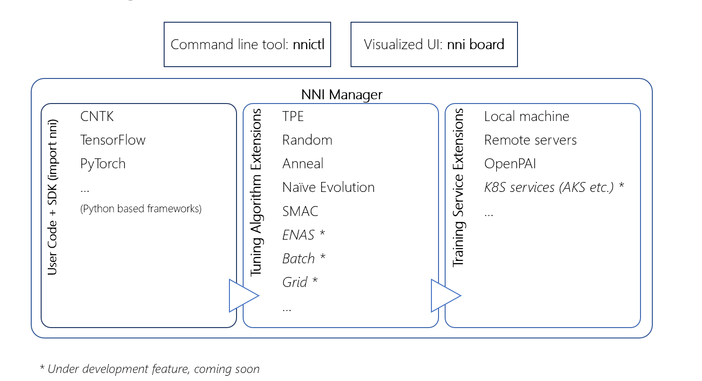
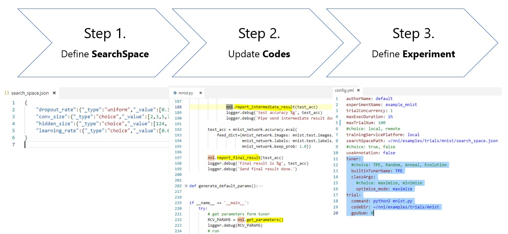

# Neural Network Intelligence

[](https://travis-ci.org/Microsoft/nni)

NNI (Neural Network Intelligence) is a toolkit to help users run automated machine learning experiments. 
The tool dispatches and runs trial jobs that generated by tuning algorithms to search the best neural architecture and/or hyper-parameters in different environments (e.g. local machine, remote servers and cloud).

<p align="center">

</p>

## **Who should consider using NNI**
* You want to try different AutoML algorithms for your training code (model) at local
* You want to run AutoML trial jobs in different environments to speed up search (e.g. remote servers and cloud)
* As a researcher and data scientist, you want to implement your own AutoML algorithms and compare with other algorithms
* As a ML platform owner, you want to support AutoML in your platform

# Get Started with NNI

## **Installation**
pip Installation Prerequisites
* linux (ubuntu 16.04 or newer version has been well tested)
* python >= 3.5
* git, wget

```
python3 -m pip install -v --user git+https://github.com/Microsoft/nni.git@v0.2
source ~/.bashrc
```

## **Quick start: run your first experiment at local**
It only requires 3 steps to start an experiment on NNI:



NNI provides a set of examples in the package to get you familiar with the above process. In the following example [/examples/trials/mnist], we had already set up the configuration and updated the training codes for you. You can directly run the following command to start an experiment. 

**NOTE**: The following example is an experiment built on TensorFlow, make sure you have **TensorFlow installed** before running the following command.

Try it out:
```bash
    nnictl create --config ~/nni/examples/trials/mnist/config.yml
```

In the command output, find out the **Web UI url** and open it in your browser. You can analyze your experiment through WebUI, or browse trials' tensorboard. 

To learn more about how this example was constructed and how to analyze the experiment results in NNI Web UI, please refer to [How to write a trial run on NNI (MNIST as an example)?](docs/WriteYourTrial.md)

## **Please refer to [Get Started Tutorial](docs/GetStarted.md) for more detailed information.**
## More tutorials

* [Tutorial of NNI python annotation.](tools/nni_annotation/README.md)
* [Tuners supported by NNI.](src/sdk/pynni/nni/README.md)
* [How to enable early stop (i.e. assessor) in an experiment?](docs/EnableAssessor.md)
* [How to run an experiment on multiple machines?](docs/RemoteMachineMode.md)
* [How to run an experiment on OpenPAI?](docs/PAIMode.md)
* [How to write a customized tuner?](docs/CustomizedTuner.md)
* [How to write a customized assessor?](examples/assessors/README.md)
* [How to resume an experiment?](docs/NNICTLDOC.md)
* [Tutorial of the command tool *nnictl*.](docs/NNICTLDOC.md)

# Contributing
This project welcomes contributions and suggestions, please refer to our [contributing](./docs/CONTRIBUTING.md) document for the same.

We use [GitHub issues](https://github.com/Microsoft/nni/issues) for tracking requests and bugs.

# License 
The entire codebase is under [MIT license](https://github.com/Microsoft/nni/blob/master/LICENSE)

