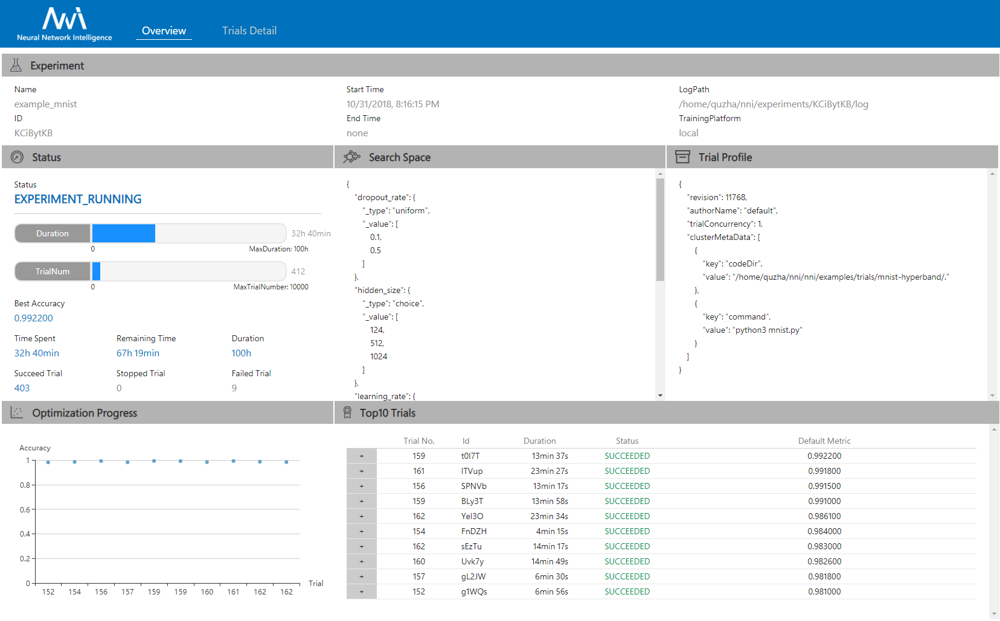

<p align="center">

</p>

-----------

[](LICENSE)
[](https://msrasrg.visualstudio.com/NNIOpenSource/_build/latest?definitionId=6)
[](https://github.com/Microsoft/nni/issues?q=is%3Aissue+is%3Aopen)
[](https://github.com/Microsoft/nni/issues?q=is%3Aissue+is%3Aopen+label%3Abug)
[](https://github.com/Microsoft/nni/pulls?q=is%3Apr+is%3Aopen)
[](https://github.com/Microsoft/nni/releases) [](https://gitter.im/Microsoft/nni?utm_source=badge&utm_medium=badge&utm_campaign=pr-badge&utm_content=badge)
[](https://nni.readthedocs.io/en/latest/?badge=latest)

[简体中文](README_zh_CN.md)

NNI (Neural Network Intelligence) is a toolkit to help users run automated machine learning (AutoML) experiments.
The tool dispatches and runs trial jobs generated by tuning algorithms to search the best neural architecture and/or hyper-parameters in different environments like local machine, remote servers and cloud.


### **NNI [v0.9](https://github.com/Microsoft/nni/releases) has been released! &nbsp;<a href="#nni-released-reminder"></a>**

<p align="center">
  <a href="#nni-has-been-released"></a>
</p>

<table>
  <tbody>
    <tr align="center" valign="bottom">
    <td>
      </td>
      <td>
        <b>Frameworks & Libraries</b>
        
      </td>
      <td>
        <b>Tuning Algorithms</b>
        
      </td>
      <td>
        <b>Training Services</b>
        
      </td>
    </tr>
    </tr>
    <tr valign="top">
    <td align="center" valign="middle">
    <b>Built-in</b>
      </td>
      <td>
      <ul><li><b>Supported Frameworks</b></li>
        <ul>
          <li>PyTorch</li>
          <li>Keras</li>
          <li>TensorFlow</li>
          <li>MXNet</li>
          <li>Caffe2</li>
          <a href="docs/en_US/SupportedFramework_Library.md">More...</a><br/>
        </ul>
        </ul>
      <ul>
        <li><b>Supported Libraries</b></li>
          <ul>
           <li>Scikit-learn</li>
           <li>XGBoost</li>
           <li>LightGBM</li>
           <a href="docs/en_US/SupportedFramework_Library.md">More...</a><br/>
          </ul>
      </ul>
        <ul>
        <li><b>Examples</b></li>
         <ul>
           <li><a href="examples/trials/mnist-distributed-pytorch">MNIST-pytorch</li></a>
           <li><a href="examples/trials/mnist-distributed">MNIST-tensorflow</li></a>
           <li><a href="examples/trials/mnist-keras">MNIST-keras</li></a>
           <li><a href="docs/en_US/TrialExample/GbdtExample.md">Auto-gbdt</a></li>
           <li><a href="docs/en_US/TrialExample/Cifar10Examples.md">Cifar10-pytorch</li></a>
           <li><a href="docs/en_US/TrialExample/SklearnExamples.md">Scikit-learn</a></li>
              <a href="docs/en_US/SupportedFramework_Library.md">More...</a><br/>
          </ul>
        </ul>
      </td>
      <td align="left" >
        <a href="docs/en_US/Tuner/BuiltinTuner.md">Tuner</a>
        <ul>
          <li><b>General Tuner</b></li>
          <ul>
          <li><a href="docs/en_US/Tuner/BuiltinTuner.md#Random">Random Search</a></li>
          <li><a href="docs/en_US/Tuner/BuiltinTuner.md#Evolution">Naïve Evolution</a></li>
          </ul>    
          <li><b>Tuner for <a href="docs/en_US/CommunitySharings/HpoComparision.md">HPO</a></b></li>
          <ul>
          <li><a href="docs/en_US/Tuner/BuiltinTuner.md#TPE">TPE</a></li>
          <li><a href="docs/en_US/Tuner/BuiltinTuner.md#Anneal">Anneal</a></li>
          <li><a href="docs/en_US/Tuner/BuiltinTuner.md#SMAC">SMAC</a></li>
          <li><a href="docs/en_US/Tuner/BuiltinTuner.md#Batch">Batch</a></li>
          <li><a href="docs/en_US/Tuner/BuiltinTuner.md#GridSearch">Grid Search</a></li>
          <li><a href="docs/en_US/Tuner/BuiltinTuner.md#Hyperband">Hyperband</a></li>
          <li><a href="docs/en_US/Tuner/BuiltinTuner.md#MetisTuner">Metis Tuner</a></li>
          <li><a href="docs/en_US/Tuner/BuiltinTuner.md#BOHB">BOHB</a></li>
          <li><a href="docs/en_US/Tuner/BuiltinTuner.md#GPTuner">GP Tuner</a></li>
          </ul>
          <li><b>Tuner for <a href="docs/en_US/CommunitySharings/NasComparision.md">NAS</a></b></li>
          <ul>
          <li><a href="docs/en_US/Tuner/BuiltinTuner.md#NetworkMorphism">Network Morphism</a></li>
          <li><a href="examples/tuners/enas_nni/README.md">ENAS</a></li>
          </ul>
        </ul>
          <a href="docs/en_US/Assessor/BuiltinAssessor.md">Assessor</a>
          <ul>
          <ul>
          <li><a href="docs/en_US/Assessor/BuiltinAssessor.md#Medianstop">Median Stop</a></li>
          <li><a href="docs/en_US/Assessor/BuiltinAssessor.md#Curvefitting">Curve Fitting</a></li>   
          </ul>
          </ul>  
      </td>
      <td>
      <ul>
        <li><a href="docs/en_US/TrainingService/LocalMode.md">Local Machine</a></li>
        <li><a href="docs/en_US/TrainingService/RemoteMachineMode.md">Remote Servers</a></li>
        <li><b>Kubernetes based services</b></li>
            <ul><li><a href="docs/en_US/TrainingService/PaiMode.md">OpenPAI</a></li>
            <li><a href="docs/en_US/TrainingService/KubeflowMode.md">Kubeflow</a></li>
            <li><a href="docs/en_US/TrainingService/FrameworkControllerMode.md">FrameworkController on K8S (AKS etc.)</a></li>
            </ul>
      </ul>
      </td>
    </tr> 
      <tr align="center" valign="bottom">
      </td>
      </tr>
      <tr valign="top">
       <td valign="middle">
    <b>References</b>
      </td>
     <td style="border-top:#FF0000 solid 0px;">
      <ul>
        <li><a href="docs/en_US/sdk_reference.rst">Python API</a></li>
        <li><a href="docs/en_US/Tutorial/AnnotationSpec.md">NNI Annotation</a></li>
         <li><a href="docs/en_US/Tutorial/Installation.md">Supported OS</a></li>
      </ul>
      </td>
       <td style="border-top:#FF0000 solid 0px;">
      <ul>
        <li><a href="docs/en_US/Tuner/CustomizeTuner.md">CustomizeTuner</a></li>
        <li><a href="docs/en_US/Assessor/CustomizeAssessor.md">CustomizeAssessor</a></li>
      </ul>
      </td>
        <td style="border-top:#FF0000 solid 0px;">
      <ul>
        <li><a href="docs/en_US/TrainingService/SupportTrainingService.md">Support TrainingService</li>
        <li><a href="docs/en_US/TrainingService/HowToImplementTrainingService.md">Implement TrainingService</a></li>
      </ul>
      </td>     
    </tr> 
  </tbody>
</table>


## **Who should consider using NNI**

* Those who want to try different AutoML algorithms in their training code (model) at their local machine.
* Those who want to run AutoML trial jobs in different environments to speed up search (e.g. remote servers and cloud).
* Researchers and data scientists who want to implement their own AutoML algorithms and compare it with other algorithms.
* ML Platform owners who want to support AutoML in their platform.

## Related Projects

Targeting at openness and advancing state-of-art technology, [Microsoft Research (MSR)](https://www.microsoft.com/en-us/research/group/systems-research-group-asia/) had also released few other open source projects.

* [OpenPAI](https://github.com/Microsoft/pai) : an open source platform that provides complete AI model training and resource management capabilities, it is easy to extend and supports on-premise, cloud and hybrid environments in various scale.
* [FrameworkController](https://github.com/Microsoft/frameworkcontroller) : an open source general-purpose Kubernetes Pod Controller that orchestrate all kinds of applications on Kubernetes by a single controller.
* [MMdnn](https://github.com/Microsoft/MMdnn) : A comprehensive, cross-framework solution to convert, visualize and diagnose deep neural network models. The "MM" in MMdnn stands for model management and "dnn" is an acronym for deep neural network.
* [SPTAG](https://github.com/Microsoft/SPTAG) : Space Partition Tree And Graph (SPTAG) is an open source library for large scale vector approximate nearest neighbor search scenario.

We encourage researchers and students leverage these projects to accelerate the AI development and research.

## **Install & Verify**

**Install through pip**

* We support Linux, MacOS and Windows(local, remote and pai mode) in current stage, Ubuntu 16.04 or higher, MacOS 10.14.1 along with Windows 10.1809 are tested and supported. Simply run the following `pip install` in an environment that has `python >= 3.5`.

Linux and MacOS

```bash
python3 -m pip install --upgrade nni
```

Windows

```bash
python -m pip install --upgrade nni
```

Note:

* `--user` can be added if you want to install NNI in your home directory, which does not require any special privileges.
* Currently NNI on Windows support local, remote and pai mode. Anaconda or Miniconda is highly recommended to install NNI on Windows.
* If there is any error like `Segmentation fault`, please refer to [FAQ](docs/en_US/Tutorial/FAQ.md)

**Install through source code**

* We support Linux (Ubuntu 16.04 or higher), MacOS (10.14.1) and Windows (10.1809) in our current stage.

Linux and MacOS

* Run the following commands in an environment that has `python >= 3.5`, `git` and `wget`.

```bash
    git clone -b v0.9 https://github.com/Microsoft/nni.git
    cd nni
    source install.sh
```

Windows

* Run the following commands in an environment that has `python >=3.5`, `git` and `PowerShell`

```bash
  git clone -b v0.9 https://github.com/Microsoft/nni.git
  cd nni
  powershell -ExecutionPolicy Bypass -file install.ps1
```

For the system requirements of NNI, please refer to [Install NNI](docs/en_US/Tutorial/Installation.md)

For NNI on Windows, please refer to [NNI on Windows](docs/en_US/Tutorial/NniOnWindows.md)

**Verify install**

The following example is an experiment built on TensorFlow. Make sure you have **TensorFlow installed** before running it.

* Download the examples via clone the source code.

```bash
    git clone -b v0.9 https://github.com/Microsoft/nni.git
```

Linux and MacOS

* Run the MNIST example.

```bash
    nnictl create --config nni/examples/trials/mnist/config.yml
```

Windows

* Run the MNIST example.

```bash
    nnictl create --config nni\examples\trials\mnist\config_windows.yml
```

* Wait for the message `INFO: Successfully started experiment!` in the command line. This message indicates that your experiment has been successfully started. You can explore the experiment using the `Web UI url`.

```text
INFO: Starting restful server...
INFO: Successfully started Restful server!
INFO: Setting local config...
INFO: Successfully set local config!
INFO: Starting experiment...
INFO: Successfully started experiment!
-----------------------------------------------------------------------
The experiment id is egchD4qy
The Web UI urls are: http://223.255.255.1:8080   http://127.0.0.1:8080
-----------------------------------------------------------------------

You can use these commands to get more information about the experiment
-----------------------------------------------------------------------
         commands                       description
1. nnictl experiment show        show the information of experiments
2. nnictl trial ls               list all of trial jobs
3. nnictl top                    monitor the status of running experiments
4. nnictl log stderr             show stderr log content
5. nnictl log stdout             show stdout log content
6. nnictl stop                   stop an experiment
7. nnictl trial kill             kill a trial job by id
8. nnictl --help                 get help information about nnictl
-----------------------------------------------------------------------
```

* Open the `Web UI url` in your browser, you can view detail information of the experiment and all the submitted trial jobs as shown below. [Here](docs/en_US/Tutorial/WebUI.md) are more Web UI pages.

<table style="border: none">
    <th></th>
    <th></th>
</table>

## **Documentation**
Our primary documentation is at [here](https://nni.readthedocs.io/en/latest/Overview.html) and is generated from this repository.<br/>
Maybe you want to read:

* [NNI overview](docs/en_US/Overview.md)
* [Quick start](docs/en_US/Tutorial/QuickStart.md)
* [WebUI tutorial](docs/en_US/Tutorial/WebUI.md)
* [Contributing](docs/en_US/Tutorial/Contributing.md)


## **How to**

* [Install NNI](docs/en_US/Tutorial/Installation.md)
* [Use command line tool nnictl](docs/en_US/Tutorial/Nnictl.md)
* [Define a trial](docs/en_US/TrialExample/Trials.md)
* [Config an experiment](docs/en_US/Tutorial/ExperimentConfig.md)
* [Define search space](docs/en_US/Tutorial/SearchSpaceSpec.md)
* [choose tuner/search-algorithm](docs/en_US/Tuner/BuiltinTuner.md)
* [Use annotation](docs/en_US/TrialExample/Trials.md#nni-python-annotation)
* [Use NNIBoard](docs/en_US/Tutorial/WebUI.md)


## **Tutorials**

* [Run an experiment on local (with multiple GPUs)](docs/en_US/TrainingService/LocalMode.md)
* [Run an experiment on OpenPAI](docs/en_US/TrainingService/PaiMode.md)
* [Run an experiment on Kubeflow](docs/en_US/TrainingService/KubeflowMode.md)
* [Run an experiment on multiple machines](docs/en_US/TrainingService/RemoteMachineMode.md)
* [Try different tuners](docs/en_US/Tuner/BuiltinTuner.md)
* [Try different assessors](docs/en_US/Assessor/BuiltinAssessor.md)
* [Implement a customized tuner](docs/en_US/Tuner/CustomizeTuner.md)
* [Implement a customized assessor](docs/en_US/Assessor/CustomizeAssessor.md)
* [Implement TrainingService in NNI](docs/en_US/TrainingService/HowToImplementTrainingService.md)
* [Use Genetic Algorithm to find good model architectures for Reading Comprehension task](docs/en_US/TrialExample/SquadEvolutionExamples.md)
* [Advanced Neural Architecture Search](docs/en_US/AdvancedFeature/AdvancedNas.md)


## **Contribute**
This project welcomes contributions and there are many ways in which you can participate in the project, for example:
* Open [bug reports](https://github.com/microsoft/nni/issues/new/choose).
* Request a [new feature](https://github.com/microsoft/nni/issues/new/choose).
* Suggest or ask some questions on the [How to Debug](docs/en_US/Tutorial/HowToDebug.md) guidance document.
* Find the issues tagged with ['good first issue'](https://github.com/Microsoft/nni/issues?q=is%3Aissue+is%3Aopen+label%3A%22good+first+issue%22) or ['help-wanted'](https://github.com/microsoft/nni/issues?q=is%3Aopen+is%3Aissue+label%3A%22help+wanted%22), these are simple and easy to start , we recommend new contributors to start with.


Before providing your hacks, you can review the [Contributing Instruction](docs/en_US/Tutorial/Contributing.md) to get more information. In addition, we also provide you with the following documents:
* [NNI developer environment installation tutorial](docs/en_US/Tutorial/SetupNniDeveloperEnvironment.md)
* [How to debug](docs/en_US/Tutorial/HowToDebug.md)
* [Customize Your Own Advisor](docs/en_US/Tuner/CustomizeAdvisor.md)
* [Customize Your Own Tuner](docs/en_US/Tuner/CustomizeTuner.md)
* [Implement customized TrainingService](docs/en_US/TrainingService/HowToImplementTrainingService.md)


## **External Repositories**
Now we have some external usage examples run in NNI from our contributors. Thanks our lovely contributors. And welcome more and more people to join us!
* Run [ENAS](examples/tuners/enas_nni/README.md) in NNI
* Run [Neural Network Architecture Search](examples/trials/nas_cifar10/README.md) in NNI 
* [Automatic Feature Engineering](examples/trials/auto-feature-engineering/README.md) in NNI

## **Feedback**
* Discuss on the NNI [Gitter](https://gitter.im/Microsoft/nni?utm_source=badge&utm_medium=badge&utm_campaign=pr-badge&utm_content=badge) in NNI
* Ask a question with NNI tags on [Stack Overflow](https://stackoverflow.com/questions/tagged/nni?sort=Newest&edited=true)
* [File an issue](https://github.com/microsoft/nni/issues/new/choose) on GitHub.


## **License**

The entire codebase is under [MIT license](LICENSE)

