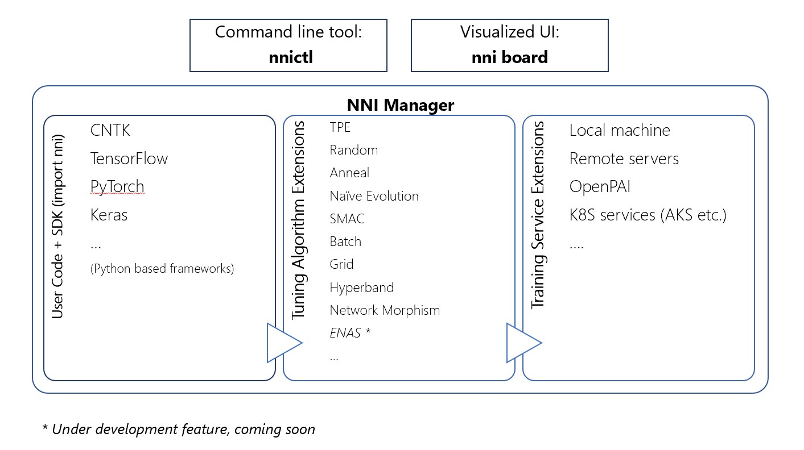

# Neural Network Intelligence

[](https://msrasrg.visualstudio.com/NNIOpenSource/_build/latest?definitionId=6)
[](https://github.com/Microsoft/nni/issues?q=is%3Aissue+is%3Aopen)
[](https://github.com/Microsoft/nni/issues?q=is%3Aissue+is%3Aopen+label%3Abug)
[](https://github.com/Microsoft/nni/pulls?q=is%3Apr+is%3Aopen)
[](https://github.com/Microsoft/nni/releases)

NNI (Neural Network Intelligence) is a toolkit to help users run automated machine learning experiments. 
The tool dispatches and runs trial jobs that generated by tuning algorithms to search the best neural architecture and/or hyper-parameters in different environments (e.g. local machine, remote servers and cloud).

<p align="center">

</p>

## **Who should consider using NNI**
* You want to try different AutoML algorithms for your training code (model) at local
* You want to run AutoML trial jobs in different environments to speed up search (e.g. remote servers and cloud)
* As a researcher and data scientist, you want to implement your own AutoML algorithms and compare with other algorithms
* As a ML platform owner, you want to support AutoML in your platform

## **Install & Verify**

**pip install** 
* We only support Linux in current stage, Ubuntu 16.04 or higher are tested and supported. Simply run the following `pip install` in an environment that has `python >= 3.5`, `git` and `wget`.
```
python3 -m pip install -v --user git+https://github.com/Microsoft/nni.git@v0.2
source ~/.bashrc
```

**verify install**
* The following example is an experiment built on TensorFlow, make sure you have `TensorFlow installed` before running it.
```bash
    nnictl create --config ~/nni/examples/trials/mnist/config.yml
```

* In the command terminal, waiting for the message `Info: Start experiment success!` which indicates your experiment had been successfully started. You are able to explore the experiment using the `Web UI url`.
```diff
    Info: Checking experiment...
    ...
    Info: Starting experiment...
    Info: Checking web ui...
    Info: Starting web ui...
    Info: Starting web ui success!
+   Info: Web UI url: http://127.0.0.1:8080   http://10.172.141.6:8080
+   Info: Start experiment success! The experiment id is LrNK4hae, and the restful server post is 51188.
```

## **Documentation**
* [Overview](docs/Overview.md)
* [Get started](docs/GetStarted.md)
## **How to**
* [Installation](docs/InstallNNI_Ubuntu.md)
* [Use command line tool nnictl](docs/NNICTLDOC.md)
* [Use NNIBoard](docs/WebUI.md)
* [Define search space](docs/SearchSpaceSpec.md)
* [Use NNI sdk] - *coming soon*
* [Config an experiment](docs/ExperimentConfig.md)
* [Use annotation]- *coming soon*
* [Debug](docs/HowToDebug.md)
## **Tutorials**
* [How to run an experiment on local (with multiple GPUs)?](docs/tutorial_1_CR_exp_local_api.md)
* [How to run an experiment on multiple machines?](docs/tutorial_2_RemoteMachineMode.md)
* [How to run an experiment on OpenPAI?](docs/PAIMode.md)
* [Try different tuners and assessors] - *coming soon*
* [How to run an experiment on K8S services?] - *coming soon*
* [Implement a customized tuner] - *coming soon*
* [Implement a customized assessor] - *coming soon*
* [Implement a custmoized weight sharing algorithm] - *coming soon*
* [How to integrate NNI with your own custmoized training service] - *coming soon*
### **Best practice**
* [Compare different AutoML algorithms] - *coming soon*
* [Serve NNI as a capability of a ML Platform] - *coming soon*

## **Contribute**
This project welcomes contributions and suggestions, we are constructing the contribution guidelines, stay tuned =).

We use [GitHub issues](https://github.com/Microsoft/nni/issues) for tracking requests and bugs.

## **License** 
The entire codebase is under [MIT license](https://github.com/Microsoft/nni/blob/master/LICENSE)

