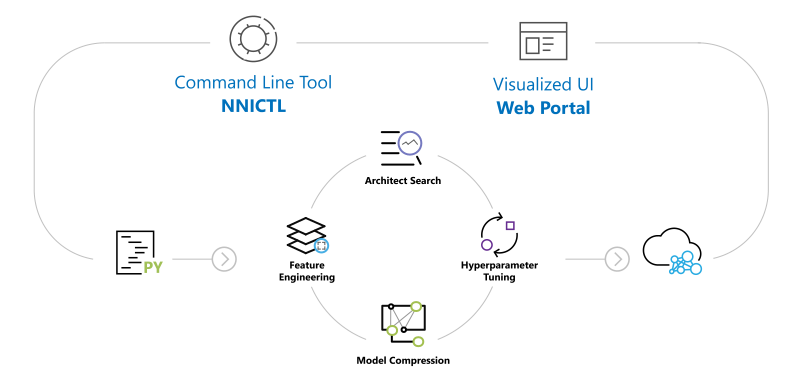
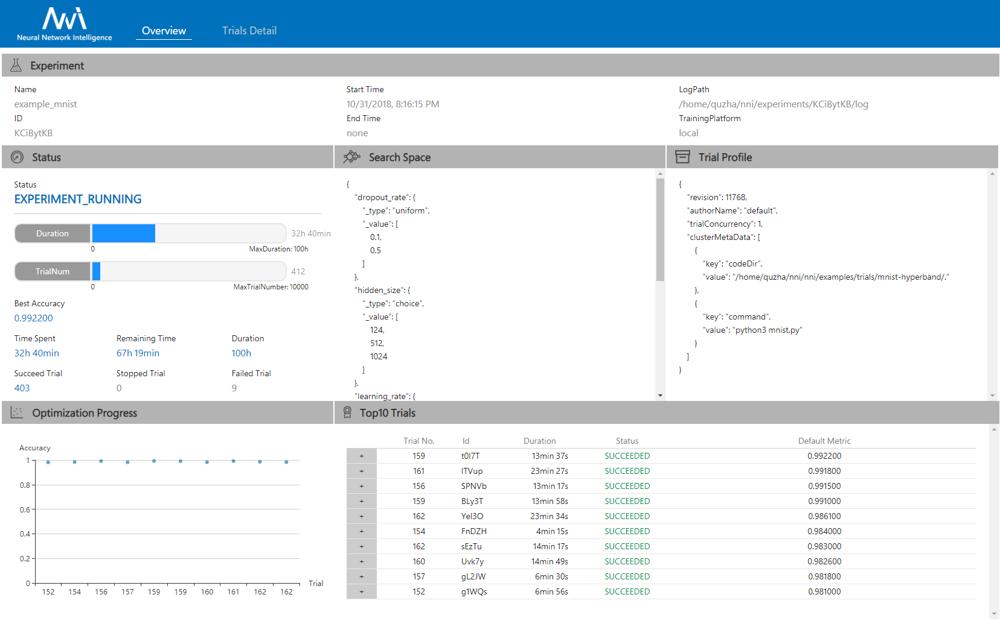
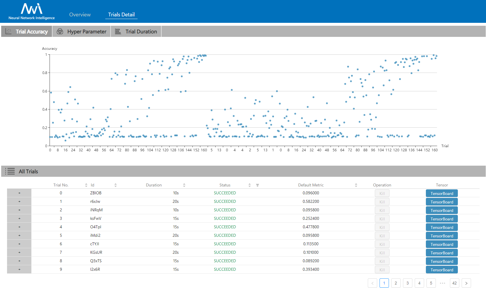

<p align="center">

</p>

* * *

[](LICENSE) [](https://msrasrg.visualstudio.com/NNIOpenSource/_build/latest?definitionId=17&branchName=master) [](https://github.com/Microsoft/nni/issues?q=is%3Aissue+is%3Aopen) [](https://github.com/Microsoft/nni/issues?q=is%3Aissue+is%3Aopen+label%3Abug) [](https://github.com/Microsoft/nni/pulls?q=is%3Apr+is%3Aopen) [](https://github.com/Microsoft/nni/releases) [](https://gitter.im/Microsoft/nni?utm_source=badge&utm_medium=badge&utm_campaign=pr-badge&utm_content=badge) [](https://nni.readthedocs.io/zh/latest/?badge=latest)

[English](README.md)

**NNI (Neural Network Intelligence)** 是一个轻量但强大的工具包，帮助用户**自动**的进行[特征工程](docs/zh_CN/FeatureEngineering/Overview.md)，[神经网络架构搜索](docs/zh_CN/NAS/Overview.md)，[超参调优](docs/zh_CN/Tuner/BuiltinTuner.md)以及[模型压缩](docs/zh_CN/Compressor/Overview.md)。

NNI 管理自动机器学习 (AutoML) 的 Experiment，**调度运行**由调优算法生成的 Trial 任务来找到最好的神经网络架构和/或超参，支持**各种训练环境**，如[本机](docs/zh_CN/TrainingService/LocalMode.md)，[远程服务器](docs/zh_CN/TrainingService/RemoteMachineMode.md)，[OpenPAI](docs/zh_CN/TrainingService/PaiMode.md)，[Kubeflow](docs/zh_CN/TrainingService/KubeflowMode.md)，[基于 K8S 的 FrameworkController（如，AKS 等)](docs/zh_CN/TrainingService/FrameworkControllerMode.md)， [DLWorkspace](docs/zh_CN/TrainingService/DLTSMode.md) (又称 DLTS)</a>, [AML](docs/zh_CN/TrainingService/AMLMode.md) (Azure Machine Learning) 以及其它环境。

## **使用场景**

* 想要在自己的代码、模型中试验**不同的自动机器学习算法**。
* 想要在**不同的环境中**加速运行自动机器学习。
* 想要更容易**实现或试验新的自动机器学习算法**的研究员或数据科学家，包括：超参调优算法，神经网络搜索算法以及模型压缩算法。
* 在机器学习平台中**支持自动机器学习**。

### **[NNI v1.8 已发布！](https://github.com/microsoft/nni/releases) &nbsp;[](#nni-released-reminder)**

## **NNI 功能一览**

NNI 提供命令行工具以及友好的 WebUI 来管理训练的 Experiment。 通过可扩展的 API，可定制自动机器学习算法和训练平台。 为了方便新用户，NNI 内置了最新的自动机器学习算法，并为流行的训练平台提供了开箱即用的支持。

下表中，包含了 NNI 的功能，同时在不断地增添新功能，也非常希望您能贡献其中。

<p align="center">
  <a href="#nni-has-been-released"></a>
</p>

<table>
  <tbody>
    <tr align="center" valign="bottom">
    <td>
      </td>
      <td>
        <b>支持的框架和库</b>
        
      </td>
      <td>
        <b>算法</b>
        
      </td>
      <td>
        <b>训练平台</b>
        
      </td>
    </tr>
    </tr>
    <tr valign="top">
    <td align="center" valign="middle">
    <b>内置</b>
      </td>
      <td>
      <ul><li><b>支持的框架</b></li>
        <ul>
          <li>PyTorch</li>
          <li>Keras</li>
          <li>TensorFlow</li>
          <li>MXNet</li>
          <li>Caffe2</li>
          <a href="docs/zh_CN/SupportedFramework_Library.md">更多...</a><br/>
        </ul>
        </ul>
      <ul>
        <li><b>支持的库</b></li>
          <ul>
           <li>Scikit-learn</li>
           <li>XGBoost</li>
           <li>LightGBM</li>
           <a href="docs/zh_CN/SupportedFramework_Library.md">更多...</a><br/>
          </ul>
      </ul>
        <ul>
        <li><b>示例</b></li>
         <ul>
           <li><a href="examples/trials/mnist-pytorch">MNIST-pytorch</li></a>
           <li><a href="examples/trials/mnist-tfv1">MNIST-tensorflow</li></a>
           <li><a href="examples/trials/mnist-keras">MNIST-keras</li></a>
           <li><a href="docs/zh_CN/TrialExample/GbdtExample.md">Auto-gbdt</a></li>
           <li><a href="docs/zh_CN/TrialExample/Cifar10Examples.md">Cifar10-pytorch</li></a>
           <li><a href="docs/zh_CN/TrialExample/SklearnExamples.md">Scikit-learn</a></li>
           <li><a href="docs/zh_CN/TrialExample/EfficientNet.md">EfficientNet</a></li>
           <li><a href="docs/zh_CN/TrialExample/OpEvoExamples.md">GPU Kernel 调优</li></a>
              <a href="docs/zh_CN/SupportedFramework_Library.md">更多...</a><br/>
          </ul>
        </ul>
      </td>
      <td align="left" >
        <a href="docs/zh_CN/Tuner/BuiltinTuner.md">超参调优</a>
        <ul>
          <b>穷举搜索</b>
          <ul>
            <li><a href="docs/zh_CN/Tuner/BuiltinTuner.md#Random">Random Search（随机搜索）</a></li>
            <li><a href="docs/zh_CN/Tuner/BuiltinTuner.md#GridSearch">Grid Search（遍历搜索）</a></li>
            <li><a href="docs/zh_CN/Tuner/BuiltinTuner.md#Batch">Batch（批处理）</a></li>
            </ul>
          <b>启发式搜索</b>
          <ul>
            <li><a href="docs/zh_CN/Tuner/BuiltinTuner.md#Evolution">Naïve Evolution（朴素进化）</a></li>
            <li><a href="docs/zh_CN/Tuner/BuiltinTuner.md#Anneal">Anneal（退火算法）</a></li>
            <li><a href="docs/zh_CN/Tuner/BuiltinTuner.md#Hyperband">Hyperband</a></li>
            <li><a href="docs/zh_CN/Tuner/BuiltinTuner.md#PBTTuner">PBT</a></li>
          </ul>
          <b>贝叶斯优化</b>
            <ul>
              <li><a href="docs/zh_CN/Tuner/BuiltinTuner.md#BOHB">BOHB</a></li>
              <li><a href="docs/zh_CN/Tuner/BuiltinTuner.md#TPE">TPE</a></li>
            <li><a href="docs/zh_CN/Tuner/BuiltinTuner.md#SMAC">SMAC</a></li>
            <li><a href="docs/zh_CN/Tuner/BuiltinTuner.md#MetisTuner">Metis Tuner</a></li>
            <li><a href="docs/zh_CN/Tuner/BuiltinTuner.md#GPTuner">GP Tuner</a></li>
            </ul>
          <b>基于强化学习</b>
          <ul>
            <li><a href="docs/zh_CN/Tuner/BuiltinTuner.md#PPOTuner">PPO Tuner</a> </li>
          </ul>
        </ul>
          <a href="docs/zh_CN/NAS/Overview.md">神经网络架构搜索</a>
          <ul>
            <ul>
              <li><a href="docs/zh_CN/NAS/ENAS.md">ENAS</a></li>
              <li><a href="docs/zh_CN/NAS/DARTS.md">DARTS</a></li>
              <li><a href="docs/zh_CN/NAS/PDARTS.md">P-DARTS</a></li>
              <li><a href="docs/zh_CN/NAS/CDARTS.md">CDARTS</a></li>
              <li><a href="docs/zh_CN/NAS/SPOS.md">SPOS</a></li>
              <li><a href="docs/zh_CN/NAS/Proxylessnas.md">ProxylessNAS</a></li>
              <li><a href="docs/zh_CN/Tuner/BuiltinTuner.md#NetworkMorphism">Network Morphism</a></li>
              <li><a href="docs/zh_CN/NAS/TextNAS.md">TextNAS</a></li>
            </ul>
          </ul>
          <a href="docs/zh_CN/Compressor/Overview.md">模型压缩</a>
          <ul>
            <b>剪枝</b>
            <ul>
              <li><a href="docs/zh_CN/Compressor/Pruner.md#agp-pruner">AGP Pruner</a></li>
              <li><a href="docs/zh_CN/Compressor/Pruner.md#slim-pruner">Slim Pruner</a></li>
              <li><a href="docs/zh_CN/Compressor/Pruner.md#fpgm-pruner">FPGM Pruner</a></li>
              <li><a href="docs/zh_CN/Compressor/Pruner.md#netadapt-pruner">NetAdapt Pruner</a></li>
              <li><a href="docs/zh_CN/Compressor/Pruner.md#simulatedannealing-pruner">SimulatedAnnealing Pruner</a></li>
              <li><a href="docs/zh_CN/Compressor/Pruner.md#admm-pruner">ADMM Pruner</a></li>
              <li><a href="docs/zh_CN/Compressor/Pruner.md#autocompress-pruner">AutoCompress Pruner</a></li>
            </ul>
            <b>量化</b>
            <ul>
              <li><a href="docs/zh_CN/Compressor/Quantizer.md#qat-quantizer">QAT Quantizer</a></li>
              <li><a href="docs/zh_CN/Compressor/Quantizer.md#dorefa-quantizer">DoReFa Quantizer</a></li>
            </ul>
          </ul>
          <a href="docs/zh_CN/FeatureEngineering/Overview.md">特征工程（测试版）</a>
          <ul>
          <li><a href="docs/zh_CN/FeatureEngineering/GradientFeatureSelector.md">GradientFeatureSelector</a></li>
          <li><a href="docs/zh_CN/FeatureEngineering/GBDTSelector.md">GBDTSelector</a></li>
          </ul>
          <a href="docs/zh_CN/Assessor/BuiltinAssessor.md">提前终止算法</a>
          <ul>
          <li><a href="docs/zh_CN/Assessor/BuiltinAssessor.md#Medianstop">Median Stop（中位数终止）</a></li>
          <li><a href="docs/zh_CN/Assessor/BuiltinAssessor.md#Curvefitting">Curve Fitting（曲线拟合）</a></li>
          </ul>
      </td>
      <td>
      <ul>
        <li><a href="docs/zh_CN/TrainingService/LocalMode.md">本机</a></li>
        <li><a href="docs/zh_CN/TrainingService/RemoteMachineMode.md">远程计算机</a></li>
        <li><a href="docs/zh_CN/TrainingService/AMLMode.md">AML(Azure Machine Learning)</a></li>
        <li><b>基于 Kubernetes 的平台</b></li>
            <ul><li><a href="docs/zh_CN/TrainingService/PaiMode.md">OpenPAI</a></li>
            <li><a href="docs/zh_CN/TrainingService/KubeflowMode.md">Kubeflow</a></li>
            <li><a href="docs/zh_CN/TrainingService/FrameworkControllerMode.md">基于 Kubernetes（AKS 等）的 FrameworkController</a></li>
            </ul>
            <ul><li><a href="docs/zh_CN/TrainingService/DLTSMode.md">DLWorkspace (又称 DLTS)</a></li>
      </ul>
      </td>
    </tr>
      <tr align="center" valign="bottom">
      </td>
      </tr>
      <tr valign="top">
       <td valign="middle">
    <b>参考</b>
      </td>
     <td style="border-top:#FF0000 solid 0px;">
      <ul>
        <li><a href="https://nni.readthedocs.io/zh/latest/autotune_ref.html#trial">Python API</a></li>
        <li><a href="docs/zh_CN/Tutorial/AnnotationSpec.md">NNI Annotation</a></li>
         <li><a href="https://nni.readthedocs.io/zh/latest/installation.html">支持的操作系统</a></li>
      </ul>
      </td>
       <td style="border-top:#FF0000 solid 0px;">
      <ul>
        <li><a href="docs/zh_CN/Tuner/CustomizeTuner.md">自定义 Tuner</a></li>
        <li><a href="docs/zh_CN/Assessor/CustomizeAssessor.md">自定义 Assessor</a></li>
        <li><a href="docs/zh_CN/Tutorial/InstallCustomizedAlgos.md">安装自定义的 Tuner，Assessor，Advisor</a></li>
      </ul>
      </td>
        <td style="border-top:#FF0000 solid 0px;">
      <ul>
        <li><a href="docs/zh_CN/TrainingService/Overview.md">支持训练平台</li>
        <li><a href="docs/zh_CN/TrainingService/HowToImplementTrainingService.md">实现训练平台</a></li>
      </ul>
      </td>
    </tr>
  </tbody>
</table>

## **安装**

### **安装**

NNI 支持并在 Ubuntu >= 16.04, macOS >= 10.14.1, 和 Windows 10 >= 1809 通过了测试。 在 `python 64-bit >= 3.6` 的环境中，只需要运行 `pip install` 即可完成安装。

Linux 或 macOS

```bash
python3 -m pip install --upgrade nni
```

Windows

```bash
python -m pip install --upgrade nni
```

如果想试试最新代码，可参考从源代码[安装 NNI](https://nni.readthedocs.io/zh/latest/installation.html)。

Linux 和 macOS 下 NNI 系统需求[参考这里](https://nni.readthedocs.io/zh/latest/Tutorial/InstallationLinux.html#system-requirements) ，Windows [参考这里](https://nni.readthedocs.io/zh/latest/Tutorial/InstallationWin.html#system-requirements)。

注意：

* 如果遇到任何权限问题，可添加 `--user` 在用户目录中安装 NNI。
* 目前，Windows 上的 NNI 支持本机，远程和 OpenPAI 模式。 强烈推荐使用 Anaconda 或 Miniconda [在 Windows 上安装 NNI](docs/zh_CN/Tutorial/InstallationWin.md)。
* 如果遇到如 `Segmentation fault` 等错误参考[常见问题](docs/zh_CN/Tutorial/FAQ.md)。 Windows 上的 FAQ 参考[在 Windows 上使用 NNI](docs/zh_CN/Tutorial/InstallationWin.md#faq)。

### **验证安装**

以下示例基于 TensorFlow 1.x 。确保运行环境中使用的的是 ** TensorFlow 1.x**。

* 通过克隆源代码下载示例。
   
   ```bash
   git clone -b v1.8 https://github.com/Microsoft/nni.git
   ```

* 运行 MNIST 示例。
   
   Linux 或 macOS
   
   ```bash
   nnictl create --config nni/examples/trials/mnist-tfv1/config.yml
   ```
   
   Windows
   
   ```bash
   nnictl create --config nni\examples\trials\mnist-tfv1\config_windows.yml
   ```

* 在命令行中等待输出 `INFO: Successfully started experiment!`。 此消息表明 Experiment 已成功启动。 通过命令行输出的 `Web UI url` 来访问 Experiment 的界面。

```text
INFO: Starting restful server...
INFO: Successfully started Restful server!
INFO: Setting local config...
INFO: Successfully set local config!
INFO: Starting experiment...
INFO: Successfully started experiment!
-----------------------------------------------------------------------
The experiment id is egchD4qy
The Web UI urls are: http://223.255.255.1:8080   http://127.0.0.1:8080
-----------------------------------------------------------------------

You can use these commands to get more information about the experiment
-----------------------------------------------------------------------
         commands                       description

1. nnictl experiment show        show the information of experiments
2. nnictl trial ls               list all of trial jobs
3. nnictl top                    monitor the status of running experiments
4. nnictl log stderr             show stderr log content
5. nnictl log stdout             show stdout log content
6. nnictl stop                   stop an experiment
7. nnictl trial kill             kill a trial job by id
8. nnictl --help                 get help information about nnictl
-----------------------------------------------------------------------
```

* 在浏览器中打开 `Web UI url`，可看到下图的 Experiment 详细信息，以及所有的 Trial 任务。 查看[这里](docs/zh_CN/Tutorial/WebUI.md)的更多页面。

<table style="border: none">
    <th></th>
    <th></th>
</table>

## **文档**

* 要了解 NNI，请阅读 [NNI 概述](https://nni.readthedocs.io/zh/latest/Overview.html)。
* 要熟悉如何使用 NNI，请阅读[文档](https://nni.readthedocs.io/zh/latest/index.html)。
* 要安装并使用 NNI，参考[安装指南](https://nni.readthedocs.io/zh/latest/installation.html)。

## **贡献**

本项目欢迎任何贡献和建议。 大多数贡献都需要你同意参与者许可协议（CLA），来声明你有权，并实际上授予我们有权使用你的贡献。 有关详细信息，请访问 https://cla.microsoft.com。

当你提交拉取请求时，CLA机器人会自动检查你是否需要提供CLA，并修饰这个拉取请求(例如，标签、注释)。 只需要按照机器人提供的说明进行操作即可。 CLA 只需要同意一次，就能应用到所有的代码仓库上。

该项目采用了 [ Microsoft 开源行为准则 ](https://opensource.microsoft.com/codeofconduct/)。 有关详细信息，请参阅[常见问题解答](https://opensource.microsoft.com/codeofconduct/faq/)，如有任何疑问或意见可联系 opencode@microsoft.com。

熟悉贡献协议后，即可按照 NNI 开发人员教程，创建第一个 PR：

* 推荐新贡献者先从简单的问题开始：['good first issue'](https://github.com/Microsoft/nni/issues?q=is%3Aissue+is%3Aopen+label%3A%22good+first+issue%22) 或 ['help-wanted'](https://github.com/microsoft/nni/issues?q=is%3Aopen+is%3Aissue+label%3A%22help+wanted%22)。
* [NNI 开发环境安装教程](docs/zh_CN/Tutorial/SetupNniDeveloperEnvironment.md)
* [如何调试](docs/zh_CN/Tutorial/HowToDebug.md)
* 如果有使用上的问题，可先查看[常见问题解答](https://github.com/microsoft/nni/blob/master/docs/zh_CN/Tutorial/FAQ.md)。如果没能解决问题，可通过 [Gitter](https://gitter.im/Microsoft/nni?utm_source=badge&utm_medium=badge&utm_campaign=pr-badge&utm_content=badge) 联系 NNI 开发团队或在 GitHub 上 [报告问题](https://github.com/microsoft/nni/issues/new/choose)。
* [自定义 Tuner](docs/zh_CN/Tuner/CustomizeTuner.md)
* [实现定制的训练平台](docs/zh_CN/TrainingService/HowToImplementTrainingService.md)
* [在 NNI 上实现新的 NAS Trainer](docs/zh_CN/NAS/Advanced.md)
* [自定义 Advisor](docs/zh_CN/Tuner/CustomizeAdvisor.md)

## **其它代码库和参考**

经作者许可的一些 NNI 用法示例和相关文档。

* ### **外部代码库** ### 
   * 在 NNI 中运行 [ENAS](examples/nas/enas/README_zh_CN.md)
   * [NNI 中的自动特征工程](examples/feature_engineering/auto-feature-engineering/README_zh_CN.md)
   * 使用 NNI 的 [矩阵分解超参调优](https://github.com/microsoft/recommenders/blob/master/notebooks/04_model_select_and_optimize/nni_surprise_svd.ipynb)
   * [scikit-nni](https://github.com/ksachdeva/scikit-nni) 使用 NNI 为 scikit-learn 开发的超参搜索。
* ### **相关文章** ### 
   * [超参数优化的对比](docs/zh_CN/CommunitySharings/HpoComparison.md)
   * [神经网络结构搜索的对比](docs/zh_CN/CommunitySharings/NasComparison.md)
   * [并行化顺序算法：TPE](docs/zh_CN/CommunitySharings/ParallelizingTpeSearch.md)
   * [使用 NNI 为 SVD 自动调参](docs/zh_CN/CommunitySharings/RecommendersSvd.md)
   * [使用 NNI 为 SPTAG 自动调参](docs/zh_CN/CommunitySharings/SptagAutoTune.md)
   * [使用 NNI 为 scikit-learn 查找超参](https://towardsdatascience.com/find-thy-hyper-parameters-for-scikit-learn-pipelines-using-microsoft-nni-f1015b1224c1)
   * **博客** - [AutoML 工具（Advisor，NNI 与 Google Vizier）的对比](http://gaocegege.com/Blog/%E6%9C%BA%E5%99%A8%E5%AD%A6%E4%B9%A0/katib-new#%E6%80%BB%E7%BB%93%E4%B8%8E%E5%88%86%E6%9E%90) 作者：[@gaocegege](https://github.com/gaocegege) - kubeflow/katib 的设计与实现的总结与分析章节
   * **博客** - [NNI 2019 新功能汇总](https://mp.weixin.qq.com/s/7_KRT-rRojQbNuJzkjFMuA) by @squirrelsc

## **反馈**

* [在 GitHub 上提交问题](https://github.com/microsoft/nni/issues/new/choose)。
* 在 [Stack Overflow](https://stackoverflow.com/questions/tagged/nni?sort=Newest&edited=true) 上使用 nni 标签提问。
* 在 [Gitter](https://gitter.im/Microsoft/nni?utm_source=badge&utm_medium=badge&utm_campaign=pr-badge&utm_content=badge) 中参与讨论。

加入聊天组： 

| Gitter                                                                                                      |   | 微信                                                                      |
| ----------------------------------------------------------------------------------------------------------- | - | ----------------------------------------------------------------------- |
|  | 或 |  |

## 相关项目

以探索先进技术和开放为目标，[Microsoft Research (MSR)](https://www.microsoft.com/en-us/research/group/systems-research-group-asia/) 还发布了一些相关的开源项目。

* [OpenPAI](https://github.com/Microsoft/pai)：作为开源平台，提供了完整的 AI 模型训练和资源管理能力，能轻松扩展，并支持各种规模的私有部署、云和混合环境。
* [FrameworkController](https://github.com/Microsoft/frameworkcontroller)：开源的通用 Kubernetes Pod 控制器，通过单个控制器来编排 Kubernetes 上所有类型的应用。
* [MMdnn](https://github.com/Microsoft/MMdnn)：一个完整、跨框架的解决方案，能够转换、可视化、诊断深度神经网络模型。 MMdnn 中的 "MM" 表示 model management（模型管理），而 "dnn" 是 deep neural network（深度神经网络）的缩写。
* [SPTAG](https://github.com/Microsoft/SPTAG) : Space Partition Tree And Graph (SPTAG) 是用于大规模向量的最近邻搜索场景的开源库。

我们鼓励研究人员和学生利用这些项目来加速 AI 开发和研究。

## **许可协议**

代码库遵循 [MIT 许可协议](LICENSE)