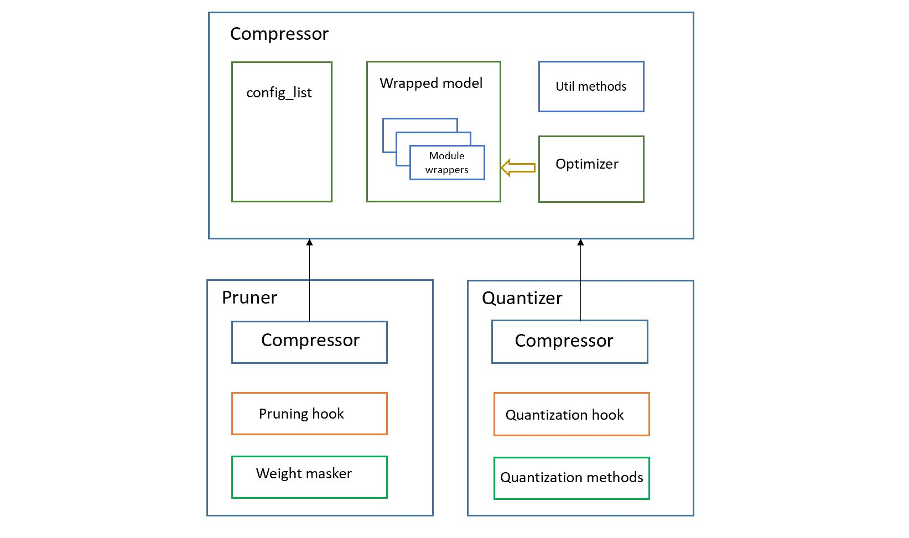

# 模型压缩框架概述

```eval_rst
.. contents::
```

下图展示了模型压缩框架的组件概览。



NNI 模型压缩框架中主要有三个组件/类：`Compressor`, `Pruner` 和 `Quantizer`。 下面会逐个详细介绍：

## Compressor

Compressor 是 Pruner 和 Quantizer 的基类，提供了统一的接口，可用同样的方式使用它们。 例如，使用 Pruner：

```python
from nni.compression.torch import LevelPruner

# 读取预训练的模型，或在使用 Pruner 前进行训练。

configure_list = [{
    'sparsity': 0.7,
    'op_types': ['Conv2d', 'Linear'],
}]

optimizer = torch.optim.SGD(model.parameters(), lr=0.001, momentum=0.9, weight_decay=1e-4)
pruner = LevelPruner(model, configure_list, optimizer)
model = pruner.compress()

# 剪枝已准备好，开始调优模型，
# 模型会在训练过程中自动剪枝
```

使用 Quantizer：
```python
from nni.compression.torch import DoReFaQuantizer

configure_list = [{
    'quant_types': ['weight'],
    'quant_bits': {
        'weight': 8,
    },
    'op_types':['Conv2d', 'Linear']
}]
optimizer = torch.optim.SGD(model.parameters(), lr=0.001, momentum=0.9, weight_decay=1e-4)
quantizer = DoReFaQuantizer(model, configure_list, optimizer)
quantizer.compress()

```
查看[示例代码](https://github.com/microsoft/nni/tree/master/examples/model_compress)了解更多信息。

`Compressor` 类提供了一些工具函数：

### 设置包装的属性

有时，`calc_mask` 需要保存一些状态数据，可以像 PyTorch 的 module 一样，使用 `set_wrappers_attribute` API 来注册属性。 这些缓存会注册到 `module 包装`中。 用户可以通过 `module 包装`来直接访问这些缓存。 在上述示例中，使用了 `set_wrappers_attribute` 类设置缓冲 `if_calculated`，它用来标识某层的掩码是否已经计算过了。

### 在 forward 时收集数据

有时，需要在 forward 方法中收集数据，例如，需要激活的平均值。 可通过向 module 中添加定制的 Collector 来做到。

```python
class MyMasker(WeightMasker):
    def __init__(self, model, pruner):
        super().__init__(model, pruner)
        # 为所有包装类设置 `collected_activation` 属性
        # 保存所有层的激活值
        self.pruner.set_wrappers_attribute("collected_activation", [])
        self.activation = torch.nn.functional.relu

        def collector(wrapper, input_, output):
            # 通过每个包装的 collected_activation 属性，来评估收到的激活值
            wrapper.collected_activation.append(self.activation(output.detach().cpu()))

        self.pruner.hook_id = self.pruner.add_activation_collector(collector)
```

收集函数会在每次 forward 方法运行时调用。

还可这样来移除收集方法：

```python
# 保存 Collector 的标识
collector_id = self.pruner.add_activation_collector(collector)

# 当 Collector 不再需要后，可以通过保存的 Collector 标识来删除
self.pruner.remove_activation_collector(collector_id)
```

***

## Pruner

Pruner 接收 `model`, `config_list` 以及 `optimizer` 参数。 通过往 `optimizer.step()` 上增加回调，在训练过程中根据 `config_list` 来对模型剪枝。

Pruner 类是 Compressor 的子类，因此它包含了 Compressor 的所有功能，并添加了剪枝所需要的组件，包括：

### 权重掩码

`权重掩码`是剪枝算法的实现，可将由 `module 包装`所包装起来的一层根据稀疏度进行修建。

### 剪枝模块包装

`剪枝 module 的包装` 包含：

1. 原始的 module
2. `calc_mask` 使用的一些缓存
3. 新的 forward 方法，用于在运行原始的 forward 方法前应用掩码。

使用 `module 包装`的原因：

1. 计算掩码所需要的 `calc_mask` 方法需要一些缓存，这些缓存需要注册在 `module 包装`里，这样就不需要修改原始的 module。
2. 新的 `forward` 方法用来在原始 `forward` 调用前，将掩码应用到权重上。

### 剪枝回调

当 Pruner 构造时会添加剪枝的回调，用来在 `optimizer.step()` 被调用时，调用 Pruner 的 calc_mask。


***

## Quantizer

Quantizer 也是 `Compressor` 的子类，用来通过减少权重或激活值的位宽来压缩模型，这样可以减少模型推理时的计算时间。 它包含：

### 量化 module 包装

模型中每个要量化的模块和层，都需要量化包装，它通过提供 `forward` 方法来量化原始模型的权重、输入和输出。

### 量化回调

量化回调会在调用 `optimizer.step()` 时设置。

### 量化相关函数

`Quantizer` 类为子类提供一下方法来实现量化算法：

```python
class Quantizer(Compressor):
    """
    PyTorch 的量化基类
    """
    def quantize_weight(self, weight, wrapper, **kwargs):
        """
        重载此方法实现权重的量化。
        此方法挂载于模型的 :meth:`forward`。
        Parameters
        ----------
        weight : Tensor
            需要量化的权重
        wrapper : QuantizerModuleWrapper
            原始 module 的包装
        """
        raise NotImplementedError('Quantizer must overload quantize_weight()')

    def quantize_output(self, output, wrapper, **kwargs):
        """
        重载此方法实现输出的量化。
        此方法挂载于模型的 :meth:`forward`。
        Parameters
        ----------
        output : Tensor
            需要量化的输出
        wrapper : QuantizerModuleWrapper
            原始 module 的包装
        """
        raise NotImplementedError('Quantizer must overload quantize_output()')

    def quantize_input(self, *inputs, wrapper, **kwargs):
        """
        重载此方法实现输入的量化。
        此方法挂载于模型的 :meth:`forward`。
        Parameters
        ----------
        inputs : Tensor
            需要量化的输入
        wrapper : QuantizerModuleWrapper
            原始 module 的包装
        """
        raise NotImplementedError('Quantizer must overload quantize_input()')

```

***

## 多 GPU 支持

在多 GPU 训练中，缓存和参数会在每次 `forward` 方法被调用时，复制到多个 GPU 上。 如果缓存和参数要在 `forward` 更新，就需要通过`原地`更新来提高效率。 因为 `calc_mask` 会在 `optimizer.step` 方法中的调用，会在 `forward` 方法后才被调用，且只会发生在单 GPU 上，因此它天然的就支持多 GPU 的情况。

