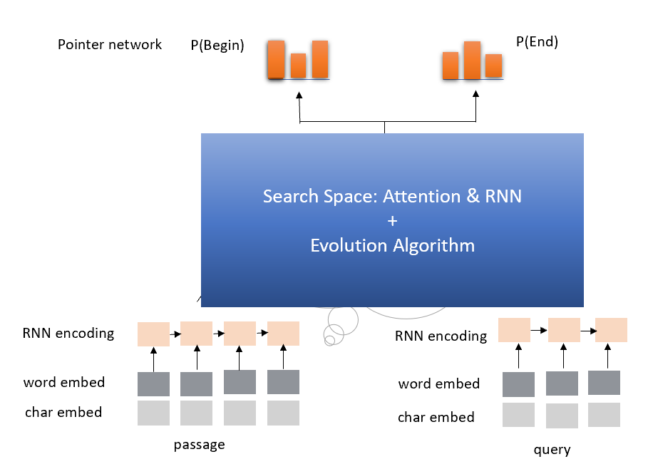

# Automatic Model Architecture Search for Reading Comprehension
This example shows us how to use Genetic Algorithm to find good model architectures for Reading Comprehension task.

## Search Space
Since attention and recurrent neural network (RNN) module have been proven effective in Reading Comprehension.
We conclude the search space as follow:

1. IDENTITY (Effectively means keep training).
2. INSERT-RNN-LAYER (Inserts a LSTM. Comparing the performance of GRU and LSTM in our experiment, we decided to use LSTM here.)
3. REMOVE-RNN-LAYER
4. INSERT-ATTENTION-LAYER(Inserts a attention layer.)
5. REMOVE-ATTENTION-LAYER
6. ADD-SKIP (Identity between random layers).
7. REMOVE-SKIP (Removes random skip).



## New version
Also we have another version which time cost is less and performance is better. We will release soon.

# How to run this example?

## Run this example on local or remote

### Use downloading script to download data

Execute the following command to download needed files
using the downloading script:

```
chmod +x ./download.sh
./download.sh
```

### Download manually

1. download "dev-v1.1.json" and "train-v1.1.json" in https://rajpurkar.github.io/SQuAD-explorer/

    ```bash
    wget https://rajpurkar.github.io/SQuAD-explorer/dataset/train-v1.1.json
    wget https://rajpurkar.github.io/SQuAD-explorer/dataset/dev-v1.1.json
    ```

2. download "glove.840B.300d.txt" in https://nlp.stanford.edu/projects/glove/

    ```bash
    wget http://nlp.stanford.edu/data/glove.840B.300d.zip
    unzip glove.840B.300d.zip
    ```

### Update configuration
Modify `nni/examples/trials/ga_squad/config.yml`, here is the default configuration:

```
authorName: default
experimentName: example_ga_squad
trialConcurrency: 1
maxExecDuration: 1h
maxTrialNum: 1
#choice: local, remote
trainingServicePlatform: local
#choice: true, false
useAnnotation: false
tuner:
  codeDir: ~/nni/examples/tuners/ga_customer_tuner
  classFileName: customer_tuner.py
  className: CustomerTuner
  classArgs:
    optimize_mode: maximize
trial:
  command: python3 trial.py
  codeDir: ~/nni/examples/trials/ga_squad
  gpuNum: 0
```

In the "trial" part, if you want to use GPU to perform the architecture search, change `gpuNum` from `0` to `1`. You need to increase the `maxTrialNum` and `maxExecDuration`, according to how long you want to wait for the search result.

`trialConcurrency` is the number of trials running concurrently, which is the number of GPUs you want to use, if you are setting `gpuNum` to 1.

### submit this job

```
nnictl create --config ~/nni/examples/trials/ga_squad/config.yml
```

## Run this example on OpenPAI

Due to the memory limitation of upload, we only upload the source code and complete the data download and training on OpenPAI. This experiment requires sufficient memory that `memoryMB >= 32G`, and the training may last for several hours.

### Update configuration
Modify `nni/examples/trials/ga_squad/config_pai.yml`, here is the default configuration:

```
authorName: default
experimentName: example_ga_squad
trialConcurrency: 1
maxExecDuration: 1h
maxTrialNum: 10
#choice: local, remote, pai
trainingServicePlatform: pai
#choice: true, false
useAnnotation: false
#Your nni_manager ip
nniManagerIp: 10.10.10.10
tuner:
  codeDir: ../../tuners/ga_customer_tuner
  classFileName: customer_tuner.py
  className: CustomerTuner
  classArgs:
    optimize_mode: maximize
trial:
  command: chmod +x ./download.sh && ./download.sh && python3 trial.py
  codeDir: .
  gpuNum: 0
  cpuNum: 1
  memoryMB: 32869
  #The docker image to run NNI job on OpenPAI
  image: msranni/nni:latest
paiConfig:
  #The username to login OpenPAI
  userName: username
  #The password to login OpenPAI
  passWord: password
  #The host of restful server of OpenPAI
  host: 10.10.10.10
```

Please change the default value to your personal account and machine information. Including `nniManagerIp`, `userName`, `passWord` and `host`.

In the "trial" part, if you want to use GPU to perform the architecture search, change `gpuNum` from `0` to `1`. You need to increase the `maxTrialNum` and `maxExecDuration`, according to how long you want to wait for the search result.

`trialConcurrency` is the number of trials running concurrently, which is the number of GPUs you want to use, if you are setting `gpuNum` to 1.

### submit this job

```
nnictl create --config ~/nni/examples/trials/ga_squad/config_pai.yml
```

# Techinal details about the trial

## How does it works
The evolution-algorithm based architecture for question answering has two different parts just like any other examples: the trial and the tuner.

### The trial

The trial has a lot of different files, functions and classes. Here we will only give most of those files a brief introduction:

* `attention.py` contains an implementation for attention mechanism in Tensorflow.
* `data.py` contains functions for data preprocessing.
* `evaluate.py` contains the evaluation script.
* `graph.py` contains the definition of the computation graph.
* `rnn.py` contains an implementation for GRU in Tensorflow.
* `train_model.py` is a wrapper for the whole question answering model.

Among those files, `trial.py` and `graph_to_tf.py` is special.

`graph_to_tf.py` has a function named as `graph_to_network`, here is its skeleton code:

```
def graph_to_network(input1,
                     input2,
                     input1_lengths,
                     input2_lengths,
                     graph,
                     dropout_rate,
                     is_training,
                     num_heads=1,
                     rnn_units=256):
    topology = graph.is_topology()
    layers = dict()
    layers_sequence_lengths = dict()
    num_units = input1.get_shape().as_list()[-1]
    layers[0] = input1*tf.sqrt(tf.cast(num_units, tf.float32)) + \
        positional_encoding(input1, scale=False, zero_pad=False)
    layers[1] = input2*tf.sqrt(tf.cast(num_units, tf.float32))
    layers[0] = dropout(layers[0], dropout_rate, is_training)
    layers[1] = dropout(layers[1], dropout_rate, is_training)
    layers_sequence_lengths[0] = input1_lengths
    layers_sequence_lengths[1] = input2_lengths
    for _, topo_i in enumerate(topology):
        if topo_i == '|':
            continue
        if graph.layers[topo_i].graph_type == LayerType.input.value:
            # ......
        elif graph.layers[topo_i].graph_type == LayerType.attention.value:
            # ......
        # More layers to handle
```

As we can see, this function is actually a compiler, that converts the internal model DAG configuration (which will be introduced in the `Model configuration format` section) `graph`, to a Tensorflow computation graph.

```
topology = graph.is_topology()
```

performs topological sorting on the internal graph representation, and the code inside the loop:

```
for _, topo_i in enumerate(topology):
```

performs actually conversion that maps each layer to a part in Tensorflow computation graph.

### The tuner

The tuner is much more simple than the trial. They actually share the same `graph.py`. Besides, the tuner has a `customer_tuner.py`, the most important class in which is `CustomerTuner`:

```
class CustomerTuner(Tuner):
    # ......

    def generate_parameters(self, parameter_id):
        """Returns a set of trial graph config, as a serializable object.
        parameter_id : int
        """
        if len(self.population) <= 0:
            logger.debug("the len of poplution lower than zero.")
            raise Exception('The population is empty')
        pos = -1
        for i in range(len(self.population)):
            if self.population[i].result == None:
                pos = i
                break
        if pos != -1:
            indiv = copy.deepcopy(self.population[pos])
            self.population.pop(pos)
            temp = json.loads(graph_dumps(indiv.config))
        else:
            random.shuffle(self.population)
            if self.population[0].result > self.population[1].result:
                self.population[0] = self.population[1]
            indiv = copy.deepcopy(self.population[0])
            self.population.pop(1)
            indiv.mutation()
            graph = indiv.config
            temp =  json.loads(graph_dumps(graph))

    # ......
```

As we can see, the overloaded method `generate_parameters` implements a pretty naive mutation algorithm. The code lines:

```
            if self.population[0].result > self.population[1].result:
                self.population[0] = self.population[1]
            indiv = copy.deepcopy(self.population[0])
```

controls the mutation process. It will always take two random individuals in the population, only keeping and mutating the one with better result.

## Model configuration format

Here is an example of the model configuration, which is passed from the tuner to the trial in the architecture search procedure.

```
{
    "max_layer_num": 50,
    "layers": [
        {
            "input_size": 0,
            "type": 3,
            "output_size": 1,
            "input": [],
            "size": "x",
            "output": [4, 5],
            "is_delete": false
        },
        {
            "input_size": 0,
            "type": 3,
            "output_size": 1,
            "input": [],
            "size": "y",
            "output": [4, 5],
            "is_delete": false
        },
        {
            "input_size": 1,
            "type": 4,
            "output_size": 0,
            "input": [6],
            "size": "x",
            "output": [],
            "is_delete": false
        },
        {
            "input_size": 1,
            "type": 4,
            "output_size": 0,
            "input": [5],
            "size": "y",
            "output": [],
            "is_delete": false
        },
        {"Comment": "More layers will be here for actual graphs."}
    ]
}
```

Every model configuration will has a "layers" section, which is a JSON list of layer definitions. The definition of each layer is also a JSON object, where:

 * `type` is the type of the layer. 0, 1, 2, 3, 4 correspond to attention, self-attention, RNN, input and output layer respectively.
 * `size` is the length of the output. "x", "y" correspond to document length / question length, respectively.
 * `input_size` is the number of inputs the layer has.
 * `input` is the indices of layers taken as input of this layer.
 * `output` is the indices of layers use this layer's output as their input.
 * `is_delete` means whether the layer is still available.
