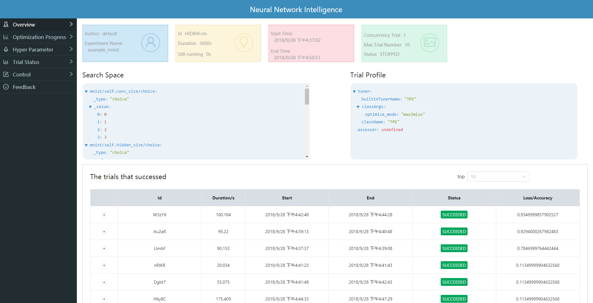

# NNI Overview

NNI (Neural Network Intelligence) is a toolkit to help users run automated machine learning experiments. For each experiment, user only need to define a search space and update a few lines of code, and then leverage NNI build-in algorithms and training services to search the best hyper parameters and/or neural architecture.

After user submits the experiment through a command line tool [nnictl](../tools/README.md), a demon process (NNI manager) take care of search process. NNI manager continuously get search settings that generated by tuning algorithms, then NNI manager asks the training service component to dispatch and run trial jobs in a targeted training environment (e.g. local machine, remote servers and cloud). The results of trials jobs such as model accurate will send back to tuning algorithms for generating more meaningful search settings. NNI manager stops the search process after it find the best models.

## Architecture Overview

User can use the nnictl and/or a visualized Web UI nniboard to monitor and debug a given experiment.

NNI provides a set of examples in the package to get you familiar with the above process. In the following example [/examples/trials/mnist], we had already set up the configuration and updated the training codes for you. You can directly run the following command to start an experiment. 

## Key Concepts

**Experiment** in NNI is a method for testing different assumptions (hypotheses) by Trials under conditions constructed and controlled by NNI. During the experiment, one or more conditions are allowed to change in an organized manner and effects of these changes on associated conditions.

### **Trial**
**Trial** in NNI is an individual attempt at applying a set of parameters on a model. 

### **Tuner**
**Tuner** in NNI is an implementation of Tuner API for a special tuning algorithm. [Read more about the Tuners supported in the latest NNI release](../src/sdk/pynni/nni/README.md)

### **Assessor**
**Assessor** in NNI is an implementation of Assessor API for optimizing the execution of experiment.

## Learn More
* [Get started](GetStarted.md)
### **How to**
* [Installation](InstallNNI_Ubuntu.md)
* [Use command line tool nnictl](InstallNNI_Ubuntu.md)
* [Use NNIBoard](InstallNNI_Ubuntu.md)
* [Define search space](InstallNNI_Ubuntu.md)
* [Use NNI sdk](InstallNNI_Ubuntu.md)
* [Config an experiment](InstallNNI_Ubuntu.md)
* [Use annotation](InstallNNI_Ubuntu.md)
* [Debug](InstallNNI_Ubuntu.md)
### **Tutorials**
* [Try different tuners and assessors]()
* [How to run an experiment on local (with multiple GPUs)?]()
* [How to run an experiment on multiple machines?]()
* [How to run an experiment on OpenPAI?]()
* [How to run an experiment on K8S services?]()
* [Implement a customized tuner]()
* [Implement a customized assessor]()
* [Implement a custmoized weight sharing algorithm]()
* [How to integrate NNI with your own custmoized training service]()
### **Best practice**
1. [Create and Run your first experiement at local with NNI API](tutorial_1_CR_exp_local_api.md)
2. [Run an experiment on multiple machines](tutorial_2_RemoteMachineMode.md)
3. [Compare different AutoML algorithms] - *coming soon*
4. [Serve NNI as a capability of a ML Platform] - *coming soon*
