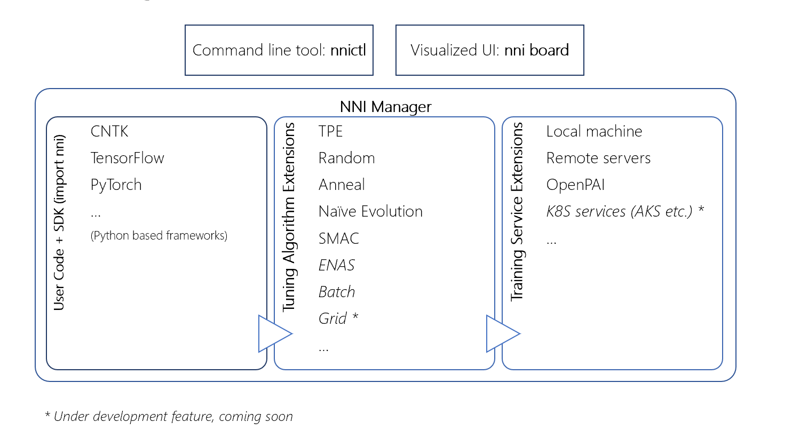

# NNI Overview

NNI (Neural Network Intelligence) is a toolkit to help users run automated machine learning experiments. For each experiemnt, user only need to define a search space and update a few lines of code, and then leverage exsited build-in algorithms and training services to search the best hyper parameters and/or neural architecture.

After user submits the experiment thourgh a command line tool nnictl, a demeon process (NNI manager) take care of search process. NNI manager continiously get search settings that generated by tuning algorithms, then NNI manager asks the training service component to dispatches and runs trial jobs in a targeted training environment (e.g. local machine, remote servers and cloud). The results of trials jobs such as model accurate will send back to tuning algorithms for generating more meaningful search settings. NNI manager stops the search process after it find the best models.

## Architecture Overview

User can use the nnictl and/or a visulized Web UI nniboard to monitor and debug a given experiment.

##Web UI (to be added)

NNI provides a set of examples in the package to get you familiar with the above process. In the following example [/examples/trials/mnist], we had already set up the configuration and updated the training codes for you. You can directly run the following command to start an experiment. 

## Key Concepts

**Experiment** in NNI is a method for testing different assumptions (hypotheses) by Trials under conditions constructed and controlled by NNI. During the experiment, one or more conditions are allowed to change in an organized manner and effects of these changes on associated conditions.

### **Trial**
**Trial** in NNI is an individual attempt at applying a set of parameters on a model. 

### **Tuner**
**Tuner** in NNI is an implementation of Tuner API for a special tuning algorithm.

[Read more about the Tuners supported in the latest NNI release](../src/sdk/pynni/nni/README.md)

### **Assessor**
**Assessor** in NNI is an implementation of Assessor API for optimizing the execution of experiment.

### **Read More**

### **nnictl**
[*nnictl*](NNICTLDOC.md)

### **NNI Python Annotation**
[NNI Python Annotation Usage](../tools/nni_annotation/README.md)

## Get Startted
* [How to write a Trial?](howto_1_WriteTrial.md)
* [How to write an experiment?] - *coming soon*
* [How to write a customized Tuner?](howto_2_CustomizedTuner.md)
* [How to write a customized Assessor?](../examples/assessors/README.md)
* [How to resume an experiment?] - *coming soon*
* [How to enable Assessor for early stop in an experiment?](EnableAssessor.md)

## What's New
* **07/09/2018:** NNI launched!

