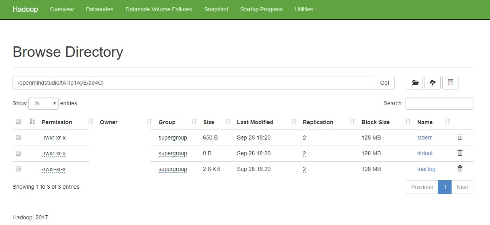

**Run an Experiment on OpenPAI**
===
NNI supports running an experiment on [OpenPAI](https://github.com/Microsoft/pai) (aka pai), called pai mode. Before starting to use NNI pai mode, you should have an account to access an [OpenPAI](https://github.com/Microsoft/pai) cluster. See [here](https://github.com/Microsoft/pai#how-to-deploy) if you don't have any OpenPAI account and want to deploy an OpenPAI cluster. In pai mode, your trial program will run in pai's container created by Docker. 

## Setup environment
Install NNI, follow the install guide [here](GetStarted.md).

## Run an experiment
Use `examples/trials/mnist-annotation` as an example. The nni config yaml file's content is like: 
```
authorName: your_name
experimentName: auto_mnist
# how many trials could be concurrently running
trialConcurrency: 2
# maximum experiment running duration
maxExecDuration: 3h
# empty means never stop
maxTrialNum: 100
# choice: local, remote, pai
trainingServicePlatform: pai
# choice: true, false  
useAnnotation: true
tuner:
  builtinTunerName: TPE
  classArgs:
    optimize_mode: maximize
trial:
  command: python3 mnist.py
  codeDir: ~/nni/examples/trials/mnist-annotation
  gpuNum: 0
  cpuNum: 1
  memoryMB: 8196
  image: openpai/pai.example.tensorflow
  dataDir: hdfs://10.1.1.1:9000/nni
  outputDir: hdfs://10.1.1.1:9000/nni
# Configuration to access OpenPAI Cluster
paiConfig:
  userName: your_pai_nni_user
  passWord: your_pai_password
  host: 10.1.1.1
```
Note: You should set `trainingServicePlatform: pai` in nni config yaml file if you want to start experiment in pai mode. 

Compared with LocalMode and [RemoteMachineMode](RemoteMachineMode.md), trial configuration in pai mode have five additional keys:
* cpuNum
    * Required key. Should be positive number based on your trial program's CPU  requirement
* memoryMB
    * Required key. Should be positive number based on your trial program's memory requirement
* image
    * Required key. In pai mode, your trial program will be scheduled by OpenPAI to run in [Docker container](https://www.docker.com/). This key is used to specify the Docker image used to create the container in which your traill will run. 
    * We already build a docker image [nnimsra/nni](https://hub.docker.com/r/msranni/nni/) on [Docker Hub](https://hub.docker.com/). It contains NNI python packages, Node modules and javascript artifact files required to start experiment, and all of NNI dependencies. The docker file used to build this image can be found at [here](../deployment/Dockerfile.build.base). You can either use this image directly in your config file, or build your own image based on it.
* dataDir
    * Optional key. It specifies the HDFS data direcotry for trial to download data. The format should be something like hdfs://{your HDFS host}:9000/{your data directory}
* outputDir 
    * Optional key. It specifies the HDFS output direcotry for trial. Once the trial is completed (either succeed or fail), trial's stdout, stderr will be copied to this directory by NNI sdk automatically. The format should be something like hdfs://{your HDFS host}:9000/{your output directory}

Once complete to fill nni experiment config file and save (for example, save as exp_pai.yaml), then run the following command
```
nnictl create --config exp_pai.yaml
```
to start the experiment in pai mode. NNI will create OpanPAI job for each trial, and the job name format is something like `nni_exp_{experiment_id}_trial_{trial_id}`. 
You can see the pai jobs created by NNI in your OpenPAI cluster's web portal, like:


Notice: By default, NNIManager will start a rest server and listen on `8081` port in pai mode, to receive metrics from trial job running in PAI container. So you should `turn on 8081` TCP port in firewall rule to allow incoming traffic. In addition, since NNI supports running multiple experiments on the same machine from v0.3, if you use `--port [portNum]` command line option to let NNI manager listen on a different port other than 8080, you should also turn on `portNum + 1` port in firewall rule. For example, you use 'nnictl create -c config.yaml --port 30010' to launch nnimanager and listen on 30010, you should also turn on 30011 in firewall rule to receive trial job metrics.

Once a trial job is completed, you can goto NNI WebUI's overview page (like http://localhost:8080/oview) to check trial's information. 

Expand a trial information in trial list view, click the logPath link like:


And you will be redirected to HDFS web portal to browse the output files of that trial in HDFS:


You can see there're three fils in output folder: stderr, stdout, and trial.log

If you also want to save trial's other output into HDFS, like model files, you can use environment variable `NNI_OUTPUT_DIR` in your trial code to save your own output files, and NNI SDK will copy all the files in `NNI_OUTPUT_DIR` from trial's container to HDFS. 

Any problems when using NNI in pai mode, plesae create issues on [NNI github repo](https://github.com/Microsoft/nni), or send mail to nni@microsoft.com

