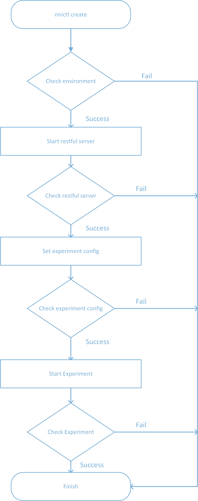

How to start an experiment
===
## 1.Introduce
There are few steps to start an new experiment of nni, here are the process.

## 2.Details
### 2.1 Check environment
1. Check if there is an old experiment running 
2. Check if the port of restfurl server is free. 
3. Validate the content of config yaml file. 
4. Prepare a config file to to record the information of this experiment. 

### 2.2 Start restful server
Start an restful server process to manage nni experiment, the default port is 8080.

### 2.3 Check restful server
Check whether restful server process is successfully started and could get a response when send message to restful server.

### 2.4 Set experiment config
Call restful server to set experiment config before starting an experiment, experiment config includes the config values in config yaml file.

### 2.5 Check experiment cofig
Check the response content of restful server,  if the status code of response is 200, the config is successfully set.

### 2.6 Start Experiment
Call restful server process to setup an experiment.

### 2.7 Check experiment
1. Check the response of restful server.
2. Handle error information.
3. Print success or error information to screen.
4. Save configuration information to config file of nnictl.
