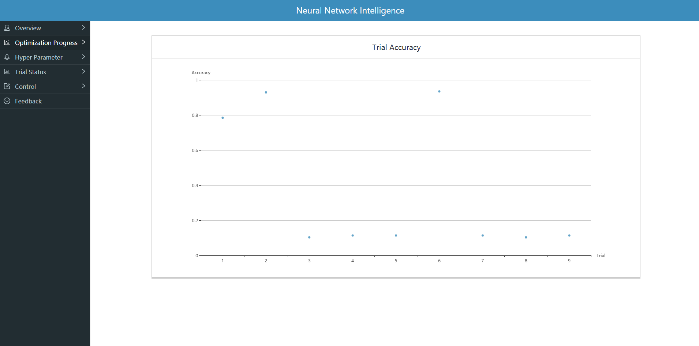
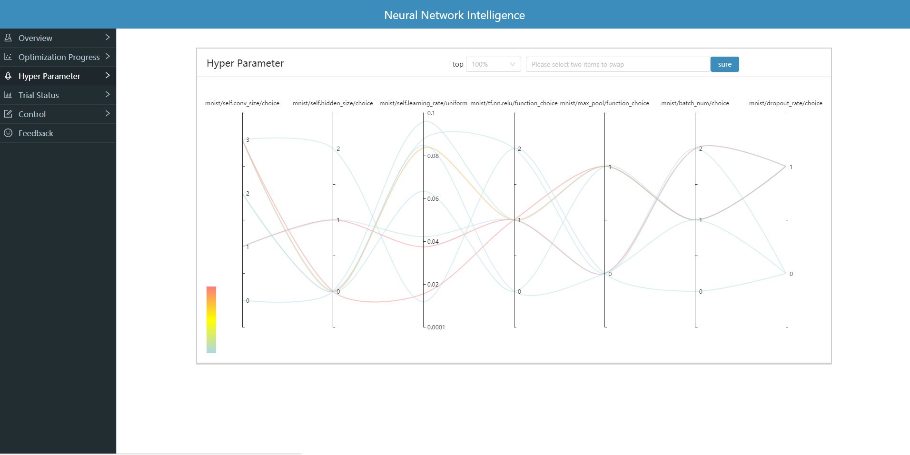
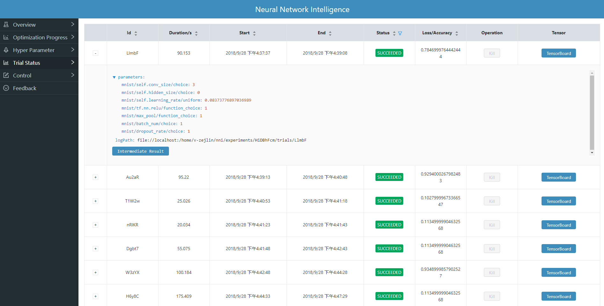
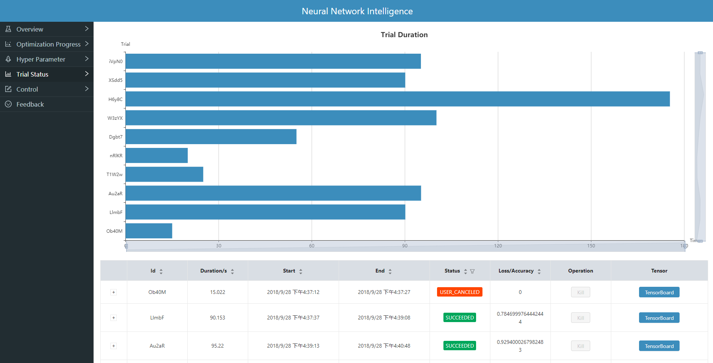
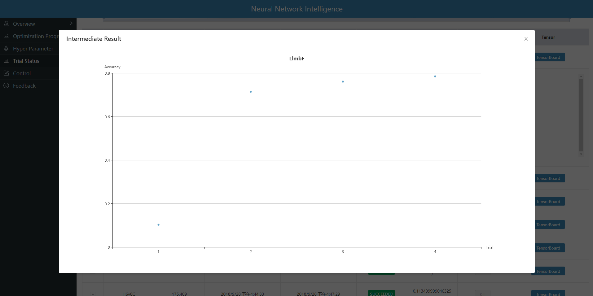
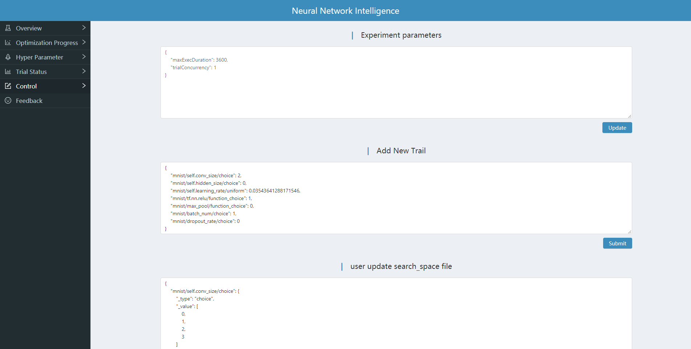

# WebUI

NNI is a research platform for metalearning. It provides easy-to-use interface so that you could perform neural architecture search, hyperparameter optimization and optimizer design for your own problems and models.
Web UI allows user to monitor the status of the NNI system using a graphical interface.

## Deployment

### To start the webui

* cd webui

> $ yarn

> $ yarn build

* cd build

> $ yarn start

## Usage

### View summary page

Click the tab "Overview".

* See the experiment parameters.
* See search_space json.
* See good performance trial.

### View job accuracy

Click the tab "Optimization Progress" to see the point graph of all trials. Hover every point to see its specific accuracy.

### View hyper parameter

Click the tab "Hyper Parameter" to see the parallel graph.

* You can select the percentage to see top trials.
* Choose two axis to swap its positions

### View trial status 

Click the tab "Trial Status" to see the status of the all trials. Specifically:

* Trial duration: trial's duration in the bar graph.
* Trial detail: trial's id, trial's duration, start time, end time, status, accuracy and search space file.

* Kill: you can kill a job that status is running.
* Tensor: you can see a job in the tensorflow graph, it will link to the Tensorboard page.

* Intermediate Result Graph.

### Control 

Click the tab "Control" to add a new trial or update the search_space file and some experiment parameters.

### Feedback

[Known Issues](https://github.com/Microsoft/nni/issues).