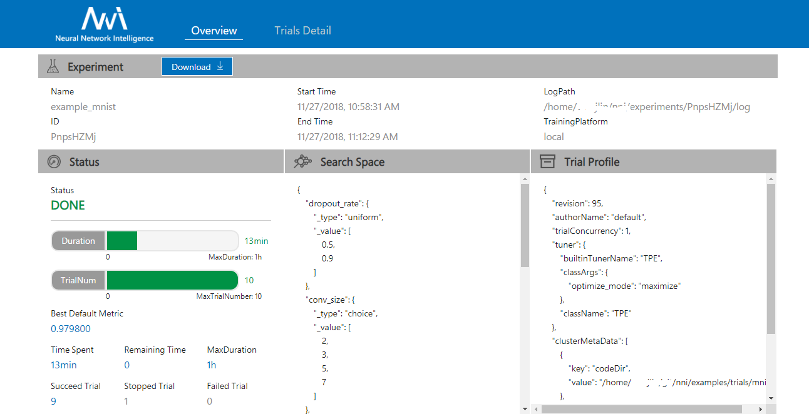
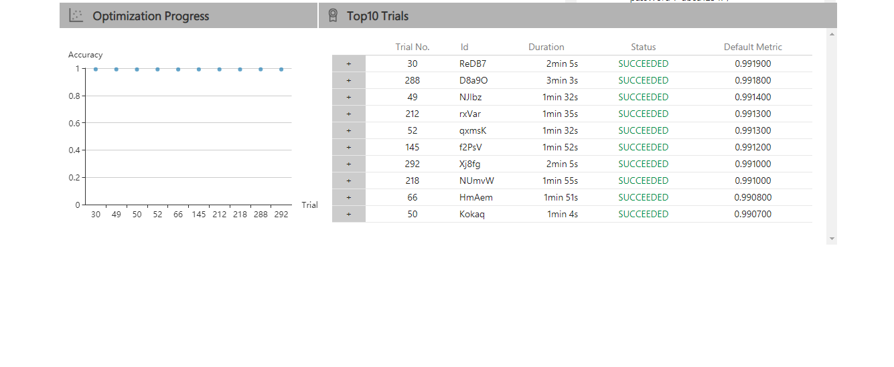
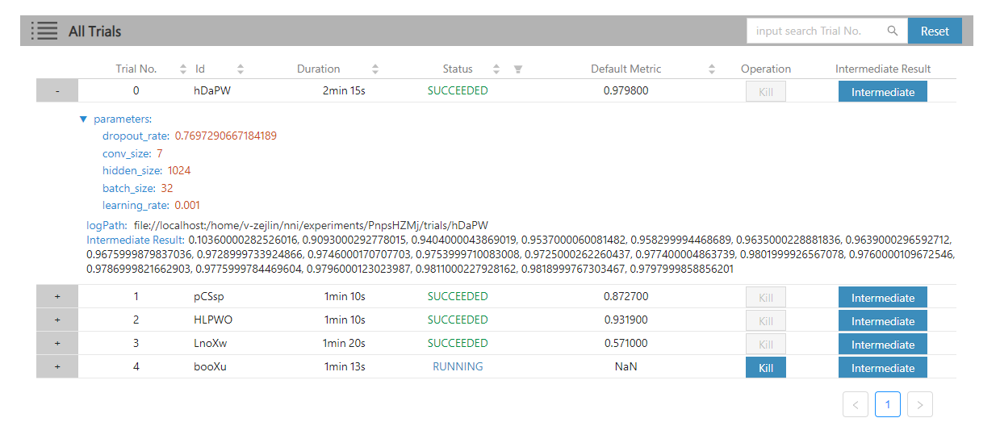

# WebUI

## View summary page

Click the tab "Overview".

* See the experiment trial profile and search space message.

* See good performance trials.

## View job accuracy

Click the tab "Trial Accuracy" to see the point graph of all trials. Hover every point to see its specific accuracy.

## View hyper parameter

Click the tab "Hyper Parameter" to see the parallel graph.

* You can select the percentage to see top trials.
* Choose two axis to swap its positions

## View Trial Duration

Click the tab "Trial Duration" to see the bar graph.

## View trials status 

Click the tab "Trials Detail" to see the status of the all trials. Specifically:

* Trial detail: trial's id, trial's duration, start time, end time, status, accuracy and search space file.

* Kill: you can kill a job that status is running.
* Tensor: you can see a job in the tensorflow graph, it will link to the Tensorboard page.
* Intermediate Result Graph.

