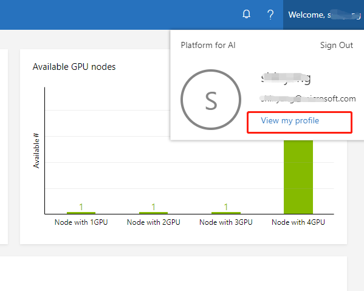
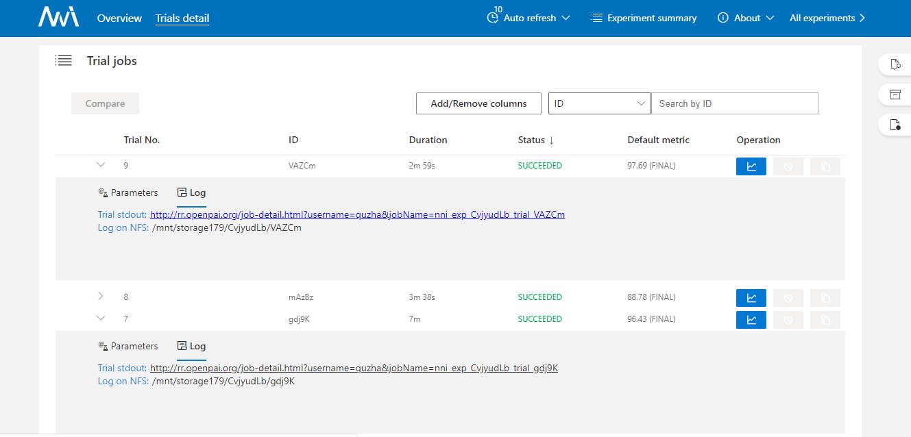

.. role:: raw-html(raw)
   :format: html

**Run an Experiment on OpenPAI**
====================================

NNI supports running an experiment on `OpenPAI <https://github.com/Microsoft/pai>`__\ , called pai mode. Before starting to use NNI pai mode, you should have an account to access an `OpenPAI <https://github.com/Microsoft/pai>`__ cluster. See `here <https://github.com/Microsoft/pai#how-to-deploy>`__ if you don't have any OpenPAI account and want to deploy an OpenPAI cluster. In pai mode, your trial program will run in pai's container created by Docker.

.. toctree::

Setup environment
-----------------

**Step 1. Install NNI, follow the install guide** `here <../Tutorial/QuickStart.rst>`__.   

**Step 2. Get token.**

Open web portal of OpenPAI, and click ``My profile`` button in the top-right side.

Click ``copy`` button in the page to copy a jwt token.

.. image:: ../../img/pai_token.jpg
   :scale: 67%

**Step 3. Mount NFS storage to local machine.**  

Click ``Submit job`` button in web portal.

.. image:: ../../img/pai_job_submission_page.jpg
   :scale: 50%

Find the data management region in job submission page.

.. image:: ../../img/pai_data_management_page.jpg
   :scale: 33%  

The ``Preview container paths`` is the NFS host and path that OpenPAI provided, you need to mount the corresponding host and path to your local machine first, then NNI could use the OpenPAI's NFS storage.\ :raw-html:` `
For example, use the following command:

.. code-block:: bash

   sudo mount -t nfs4 gcr-openpai-infra02:/pai/data /local/mnt

Then the ``/data`` folder in container will be mounted to ``/local/mnt`` folder in your local machine.\ :raw-html:` `
You could use the following configuration in your NNI's config file:

.. code-block:: yaml

   localStorageMountPoint: /local/mnt

**Step 4. Get OpenPAI's storage config name and localStorageMountPoint**

The ``Team share storage`` field is storage configuration used to specify storage value in OpenPAI. You can get ``storageConfigName`` and ``containerStorageMountPoint`` field in ``Team share storage``\ , for example:

.. code-block:: yaml

   storageConfigName: confignfs-data
   containerStorageMountPoint: /mnt/confignfs-data

Run an experiment
-----------------

Use ``examples/trials/mnist-pytorch`` as an example. The NNI config YAML file's content is like:

.. code-block:: yaml

   searchSpaceFile: search_space.json
   trialCommand: python3 mnist.py
   trialGpuNumber: 0
   trialConcurrency: 1
   maxTrialNumber: 10
   tuner:
     name: TPE
     classArgs:
       optimize_mode: maximize
   trainingService:
     platform: openpai
     host: http://123.123.123.123
     username: ${your user name}
     token: ${your token}
     dockerImage: msranni/nni
     trialCpuNumber: 1
     trialMemorySize: 8GB
     storageConfigName: ${your storage config name}
     localStorageMountPoint: ${NFS mount point on local machine}
     containerStorageMountPoint: ${NFS mount point inside Docker container}

Note: You should set ``platform: pai`` in NNI config YAML file if you want to start experiment in pai mode. The host field in configuration file is PAI's job submission page uri, like ``10.10.5.1``\ , the default protocol in NNI is HTTPS, if your PAI's cluster disabled https, please use the uri in ``http://10.10.5.1`` format.

OpenPai configurations
^^^^^^^^^^^^^^^^^^^^^^

Compared with `LocalMode <LocalMode.rst>`__ and `RemoteMachineMode <RemoteMachineMode.rst>`__\ , ``trainingService`` configuration in pai mode has the following additional keys:

* 
  username

  Required key. User name of OpenPAI platform.

* 
  token

  Required key. Authentication key of OpenPAI platform.

* 
  host

  Required key. The host of OpenPAI platform. It's OpenPAI's job submission page uri, like ``10.10.5.1``\ , the default protocol in NNI is HTTPS, if your OpenPAI cluster disabled https, please use the uri in ``http://10.10.5.1`` format.

* 
  trialCpuNumber

  Optional key. Should be positive number based on your trial program's CPU  requirement. If it is not set in trial configuration, it should be set in the config specified in ``openpaiConfig`` or ``openpaiConfigFile`` field.

* 
  trialMemorySize

  Optional key. Should be in format like ``2gb`` based on your trial program's memory requirement. If it is not set in trial configuration, it should be set in the config specified in ``openpaiConfig`` or ``openpaiConfigFile`` field.

* 
  dockerImage

  Optional key. In OpenPai mode, your trial program will be scheduled by OpenPAI to run in `Docker container <https://www.docker.com/>`__. This key is used to specify the Docker image used to create the container in which your trial will run.

  We already build a docker image :githublink:`nnimsra/nni <deployment/docker/Dockerfile>`. You can either use this image directly in your config file, or build your own image based on it. If it is not set in trial configuration, it should be set in the config specified in ``openpaiConfig`` or ``openpaiConfigFile`` field.

.. cannot find :githublink:`nnimsra/nni <deployment/docker/Dockerfile>`

* 
  virtualCluster

  Optional key. Set the virtualCluster of OpenPAI. If omitted, the job will run on default virtual cluster.

* 
  localStorageMountPoint

  Required key. Set the mount path in the machine you run nnictl.

* 
  containerStorageMountPoint

  Required key. Set the mount path in your container used in OpenPAI.

* 
  storageConfigName:

  Optional key. Set the storage name used in OpenPAI. If it is not set in trial configuration, it should be set in the config specified in ``openpaiConfig`` or ``openpaiConfigFile`` field.

* 
  openpaiConfigFile

  Optional key. Set the file path of OpenPAI job configuration, the file is in yaml format.

  If users set ``openpaiConfigFile`` in NNI's configuration file, no need to specify the fields ``storageConfigName``, ``virtualCluster``, ``dockerImage``, ``trialCpuNumber``, ``trialGpuNumber``, ``trialMemorySize`` in configuration. These fields will use the values from the config file specified by  ``openpaiConfigFile``.

*
  openpaiConfig

  Optional key. Similar to ``openpaiConfigFile``, but instead of referencing an external file, using this field you embed the content into NNI's config YAML.

  Note:

  #. 
     The job name in OpenPAI's configuration file will be replaced by a new job name, the new job name is created by NNI, the name format is ``nni_exp_{this.experimentId}_trial_{trialJobId}`` .

  #. 
     If users set multiple taskRoles in OpenPAI's configuration file, NNI will wrap all of these taksRoles and start multiple tasks in one trial job, users should ensure that only one taskRole report metric to NNI, otherwise there might be some conflict error.

Once complete to fill NNI experiment config file and save (for example, save as exp_pai.yml), then run the following command

.. code-block:: bash

   nnictl create --config exp_pai.yml

to start the experiment in pai mode. NNI will create OpenPAI job for each trial, and the job name format is something like ``nni_exp_{experiment_id}_trial_{trial_id}``.
You can see jobs created by NNI in the OpenPAI cluster's web portal, like:

.. image:: ../../img/nni_pai_joblist.jpg
   :target: ../../img/nni_pai_joblist.jpg
   :alt: 

Notice: In pai mode, NNIManager will start a rest server and listen on a port which is your NNI WebUI's port plus 1. For example, if your WebUI port is ``8080``\ , the rest server will listen on ``8081``\ , to receive metrics from trial job running in Kubernetes. So you should ``enable 8081`` TCP port in your firewall rule to allow incoming traffic.

Once a trial job is completed, you can goto NNI WebUI's overview page (like http://localhost:8080/oview) to check trial's information.

Expand a trial information in trial list view, click the logPath link like:

And you will be redirected to HDFS web portal to browse the output files of that trial in HDFS:

.. image:: ../../img/nni_trial_hdfs_output.jpg
   :scale: 80%

You can see there're three fils in output folder: stderr, stdout, and trial.log

data management
---------------

Before using NNI to start your experiment, users should set the corresponding mount data path in your nniManager machine. OpenPAI has their own storage(NFS, AzureBlob ...), and the storage will used in OpenPAI will be mounted to the container when it start a job. Users should set the OpenPAI storage type by ``paiStorageConfigName`` field to choose a storage in OpenPAI. Then users should mount the storage to their nniManager machine, and set the ``nniManagerNFSMountPath`` field in configuration file, NNI will generate bash files and copy data in ``codeDir`` to the ``nniManagerNFSMountPath`` folder, then NNI will start a trial job. The data in ``nniManagerNFSMountPath`` will be sync to OpenPAI storage, and will be mounted to OpenPAI's container. The data path in container is set in ``containerNFSMountPath``\ , NNI will enter this folder first, and then run scripts to start a trial job. 

version check
-------------

NNI support version check feature in since version 0.6. It is a policy to insure the version of NNIManager is consistent with trialKeeper, and avoid errors caused by version incompatibility.
Check policy:

#. NNIManager before v0.6 could run any version of trialKeeper, trialKeeper support backward compatibility.
#. Since version 0.6, NNIManager version should keep same with triakKeeper version. For example, if NNIManager version is 0.6, trialKeeper version should be 0.6 too.
#. Note that the version check feature only check first two digits of version.For example, NNIManager v0.6.1 could use trialKeeper v0.6 or trialKeeper v0.6.2, but could not use trialKeeper v0.5.1 or trialKeeper v0.7.

If you could not run your experiment and want to know if it is caused by version check, you could check your webUI, and there will be an error message about version check.

.. image:: ../../img/webui-img/experimentError.png
   :scale: 80%
