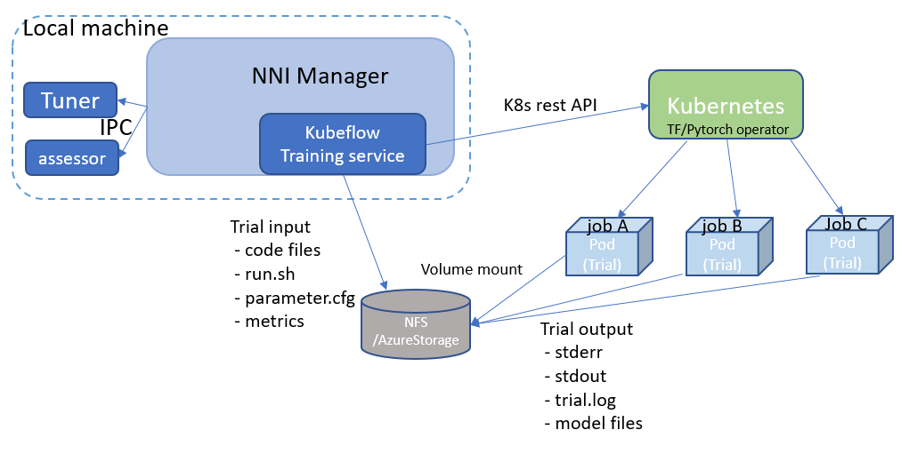

# Run an Experiment on Kubeflow

===

Now NNI supports running experiment on [Kubeflow](https://github.com/kubeflow/kubeflow), called kubeflow mode. Before starting to use NNI kubeflow mode, you should have a Kubernetes cluster, either on-premises or [Azure Kubernetes Service(AKS)](https://azure.microsoft.com/en-us/services/kubernetes-service/), a Ubuntu machine on which [kubeconfig](https://kubernetes.io/docs/concepts/configuration/organize-cluster-access-kubeconfig/) is setup to connect to your Kubernetes cluster. If you are not familiar with Kubernetes, [here](https://kubernetes.io/docs/tutorials/kubernetes-basics/) is a good start. In kubeflow mode, your trial program will run as Kubeflow job in Kubernetes cluster.

## Prerequisite for on-premises Kubernetes Service

1. A **Kubernetes** cluster using Kubernetes 1.8 or later. Follow this [guideline](https://kubernetes.io/docs/setup/) to set up Kubernetes
2. Download, set up, and deploy **Kubeflow** to your Kubernetes cluster. Follow this [guideline](https://www.kubeflow.org/docs/started/getting-started/) to setup Kubeflow.
3. Prepare a **kubeconfig** file, which will be used by NNI to interact with your Kubernetes API server. By default, NNI manager will use $(HOME)/.kube/config as kubeconfig file's path. You can also specify other kubeconfig files by setting the **KUBECONFIG** environment variable. Refer this [guideline]( https://kubernetes.io/docs/concepts/configuration/organize-cluster-access-kubeconfig) to learn more about kubeconfig.
4. If your NNI trial job needs GPU resource, you should follow this [guideline](https://github.com/NVIDIA/k8s-device-plugin) to configure **Nvidia device plugin for Kubernetes**.
5. Prepare a **NFS server** and export a general purpose mount (we recommend to map your NFS server path in `root_squash option`, otherwise permission issue may raise when NNI copy files to NFS. Refer this [page](https://linux.die.net/man/5/exports) to learn what root_squash option is), or **Azure File Storage**.
6. Install **NFS client** on the machine where you install NNI and run nnictl to create experiment. Run this command to install NFSv4 client:
    ```
    apt-get install nfs-common
    ```

7. Install **NNI**, follow the install guide [here](../Tutorial/QuickStart.md).

## Prerequisite for Azure Kubernetes Service

1. NNI support Kubeflow based on Azure Kubernetes Service, follow the [guideline](https://azure.microsoft.com/en-us/services/kubernetes-service/) to set up Azure Kubernetes Service.
2. Install [Azure CLI](https://docs.microsoft.com/en-us/cli/azure/install-azure-cli?view=azure-cli-latest) and __kubectl__.  Use `az login` to set azure account, and connect kubectl client to AKS, refer this [guideline](https://docs.microsoft.com/en-us/azure/aks/kubernetes-walkthrough#connect-to-the-cluster).
3. Deploy Kubeflow on Azure Kubernetes Service, follow the [guideline](https://www.kubeflow.org/docs/started/getting-started/).
4. Follow the [guideline](https://docs.microsoft.com/en-us/azure/storage/common/storage-quickstart-create-account?tabs=portal) to create azure file storage account. If you use Azure Kubernetes Service, NNI need Azure Storage Service to store code files and the output files.
5. To access Azure storage service, NNI need the access key of the storage account, and NNI use [Azure Key Vault](https://azure.microsoft.com/en-us/services/key-vault/) Service to protect your private key. Set up Azure Key Vault Service, add a secret to Key Vault to store the access key of Azure storage account. Follow this [guideline](https://docs.microsoft.com/en-us/azure/key-vault/quick-create-cli) to store the access key.

## Design


Kubeflow training service instantiates a Kubernetes rest client to interact with your K8s cluster's API server.

For each trial, we will upload all the files in your local codeDir path (configured in nni_config.yml) together with NNI generated files like parameter.cfg into a storage volumn. Right now we support two kinds of storage volumes: [nfs](https://en.wikipedia.org/wiki/Network_File_System) and [azure file storage](https://azure.microsoft.com/en-us/services/storage/files/), you should configure the storage volumn in NNI config YAML file. After files are prepared, Kubeflow training service will call K8S rest API to create Kubeflow jobs ([tf-operator](https://github.com/kubeflow/tf-operator) job or [pytorch-operator](https://github.com/kubeflow/pytorch-operator) job) in K8S, and mount your storage volume into the job's pod. Output files of Kubeflow job, like stdout, stderr, trial.log or model files, will also be copied back to the storage volumn. NNI will show the storage volumn's URL for each trial in WebUI, to allow user browse the log files and job's output files.

## Supported operator

NNI only support tf-operator and pytorch-operator of Kubeflow, other operators is not tested.
Users could set operator type in config file.
The setting of tf-operator:

```yaml
kubeflowConfig:
  operator: tf-operator
```

The setting of pytorch-operator:

```yaml
kubeflowConfig:
  operator: pytorch-operator
```

If users want to use tf-operator, he could set `ps` and `worker` in trial config. If users want to use pytorch-operator, he could set `master` and `worker` in trial config.

## Supported storage type

NNI support NFS and Azure Storage to store the code and output files, users could set storage type in config file and set the corresponding config.

The setting for NFS storage are as follows:

```yaml
kubeflowConfig:
  storage: nfs
  nfs:
    # Your NFS server IP, like 10.10.10.10
    server: {your_nfs_server_ip}
    # Your NFS server export path, like /var/nfs/nni
    path: {your_nfs_server_export_path}
```

If you use Azure storage, you should  set `kubeflowConfig` in your config YAML file as follows:

```yaml
kubeflowConfig:
  storage: azureStorage
  keyVault:
    vaultName: {your_vault_name}
    name: {your_secert_name}
  azureStorage:
    accountName: {your_storage_account_name}
    azureShare: {your_azure_share_name}
```

## Run an experiment

Use `examples/trials/mnist-tfv1` as an example. This is a tensorflow job, and use tf-operator of Kubeflow. The NNI config YAML file's content is like:

```yaml
authorName: default
experimentName: example_mnist
trialConcurrency: 2
maxExecDuration: 1h
maxTrialNum: 20
#choice: local, remote, pai, kubeflow
trainingServicePlatform: kubeflow
searchSpacePath: search_space.json
#choice: true, false
useAnnotation: false
tuner:
  #choice: TPE, Random, Anneal, Evolution
  builtinTunerName: TPE
  classArgs:
    #choice: maximize, minimize
    optimize_mode: maximize
assessor:
  builtinAssessorName: Medianstop
  classArgs:
    optimize_mode: maximize
trial:
  codeDir: .
  worker:
    replicas: 2
    command: python3 dist_mnist.py
    gpuNum: 1
    cpuNum: 1
    memoryMB: 8196
    image: msranni/nni:latest
  ps:
    replicas: 1
    command: python3 dist_mnist.py
    gpuNum: 0
    cpuNum: 1
    memoryMB: 8196
    image: msranni/nni:latest
kubeflowConfig:
  operator: tf-operator
  apiVersion: v1alpha2
  storage: nfs
  nfs:
    # Your NFS server IP, like 10.10.10.10
    server: {your_nfs_server_ip}
    # Your NFS server export path, like /var/nfs/nni
    path: {your_nfs_server_export_path}
```

Note: You should explicitly set `trainingServicePlatform: kubeflow` in NNI config YAML file if you want to start experiment in kubeflow mode.

If you want to run PyTorch jobs, you could set your config files as follow:

```yaml
authorName: default
experimentName: example_mnist_distributed_pytorch
trialConcurrency: 1
maxExecDuration: 1h
maxTrialNum: 10
#choice: local, remote, pai, kubeflow
trainingServicePlatform: kubeflow
searchSpacePath: search_space.json
#choice: true, false
useAnnotation: false
tuner:
  #choice: TPE, Random, Anneal, Evolution
  builtinTunerName: TPE
  classArgs:
    #choice: maximize, minimize
    optimize_mode: minimize
trial:
  codeDir: .
  master:
    replicas: 1
    command: python3 dist_mnist.py
    gpuNum: 1
    cpuNum: 1
    memoryMB: 2048
    image: msranni/nni:latest
  worker:
    replicas: 1
    command: python3 dist_mnist.py
    gpuNum: 0
    cpuNum: 1
    memoryMB: 2048
    image: msranni/nni:latest
kubeflowConfig:
  operator: pytorch-operator
  apiVersion: v1alpha2
  nfs:
    # Your NFS server IP, like 10.10.10.10
    server: {your_nfs_server_ip}
    # Your NFS server export path, like /var/nfs/nni
    path: {your_nfs_server_export_path}
```

Trial configuration in kubeflow mode have the following configuration keys:

* codeDir
  * code directory, where you put training code and config files
* worker (required). This config section is used to configure tensorflow worker role
  * replicas
    * Required key. Should be positive number depends on how many replication your want to run for tensorflow worker role.
  * command
    * Required key. Command to launch your trial job, like ```python mnist.py```
  * memoryMB
    * Required key. Should be positive number based on your trial program's memory requirement
  * cpuNum
  * gpuNum
  * image
    * Required key. In kubeflow mode, your trial program will be scheduled by Kubernetes to run in [Pod](https://kubernetes.io/docs/concepts/workloads/pods/pod/). This key is used to specify the Docker image used to create the pod where your trail program will run.
    * We already build a docker image [msranni/nni](https://hub.docker.com/r/msranni/nni/) on [Docker Hub](https://hub.docker.com/). It contains NNI python packages, Node modules and javascript artifact files required to start experiment, and all of NNI dependencies. The docker file used to build this image can be found at [here](https://github.com/Microsoft/nni/tree/v1.9/deployment/docker/Dockerfile). You can either use this image directly in your config file, or build your own image based on it.
  * privateRegistryAuthPath
    * Optional field, specify `config.json` file path that holds an authorization token of docker registry, used to pull image from private registry. [Refer](https://kubernetes.io/docs/tasks/configure-pod-container/pull-image-private-registry/).
  * apiVersion
    * Required key. The API version of your Kubeflow.
* ps (optional). This config section is used to configure Tensorflow parameter server role.
* master(optional). This config section is used to configure PyTorch parameter server role.

Once complete to fill NNI experiment config file and save (for example, save as exp_kubeflow.yml), then run the following command

```bash
nnictl create --config exp_kubeflow.yml
```

to start the experiment in kubeflow mode. NNI will create Kubeflow tfjob or pytorchjob for each trial, and the job name format is something like `nni_exp_{experiment_id}_trial_{trial_id}`.
You can see the Kubeflow tfjob created by NNI in your Kubernetes dashboard.

Notice: In kubeflow mode, NNIManager will start a rest server and listen on a port which is your NNI WebUI's port plus 1. For example, if your WebUI port is `8080`, the rest server will listen on `8081`, to receive metrics from trial job running in Kubernetes. So you should `enable 8081` TCP port in your firewall rule to allow incoming traffic.

Once a trial job is completed, you can go to NNI WebUI's overview page (like http://localhost:8080/oview) to check trial's information.

## version check

NNI support version check feature in since version 0.6, [refer](PaiMode.md)

Any problems when using NNI in Kubeflow mode, please create issues on [NNI Github repo](https://github.com/Microsoft/nni).
