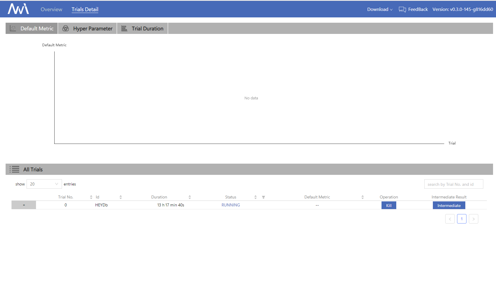
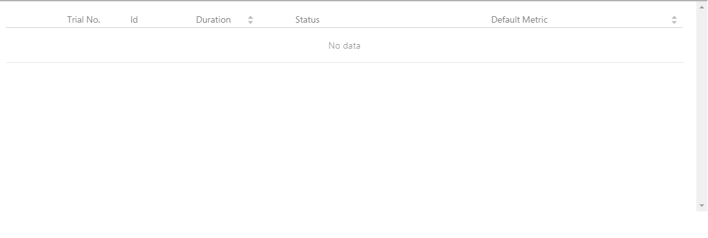

# CIFAR10 examples

The CIFAR-10 dataset is a collection of images that are commonly used to train machine learning and computer vision algorithms. It is one of the most widely used datasets for machine learning research. The CIFAR-10 dataset contains 60,000 32x32 color images in 10 different classes. There are 6,000 images of each class. Thus, we use CIFAR10 as example to introduce using NNI in the field of computer vision.

**cifar10 with NNI**

This example requires pytorch. pytorch install package should be chosen based on python version and cuda version.

Here is an example of the environment python==3.5 and cuda == 8.0, then using the following commands to install pytorch:

```bash
python3 -m pip install http://download.pytorch.org/whl/cu80/torch-0.4.1-cp35-cp35m-linux_x86_64.whl
python3 -m pip install torchvision
```

In this experiment, we will search the optimal hyperparamters for **learning rates**, **optimizeation methods** and **network structures**.

We give the choices for these three hyperparameters in `search_space.json` below. That is, NNI will select a set of parameters (For example: {'lr': 0.01, 'optimizer': Adam, 'model': resnet18}) on each trial base on the specified tuning algorithm.

```json
{
    "lr":{"_type":"choice", "_value":[0.1, 0.01, 0.001, 0.0001]},
    "optimizer":{"_type":"choice", "_value":["SGD", "Adadelta", "Adagrad", "Adam", "Adamax"]},
    "model":{"_type":"choice", "_value":["vgg", "resnet18", "googlenet", "densenet121", "mobilenet", "dpn92", "senet18"]}
}
```

In addition, as we mentioned in the example in QuickStart, you also need to write the corresponding trial and config code. You can see the examples we have implemented in [examples/trials/cifar10_pytorch/][1]

When these things are done, **run the config.yml file from your command line to start the experiment**.

 ```bash
    nnictl create --config nni/examples/trials/cifar10_pytorch/config.yml
```

The following is the result of this experiment on WebUI. Please note that due to our tuner may have some exploration, the results of each run will not be exactly the same.

* NNI help us to run 10 trials automatically, and you can see the detailed information and result of each trial



* In overview, you can find the optimal hyperparameter sets.
  
As you can see, after we run 10 trials, we find the best hyperparameters set is {'lr': 0.01, 'optimizer': Adam, 'model': resnet18}}



[1]: https://github.com/Microsoft/nni/tree/master/examples/trials/cifar10_pytorch