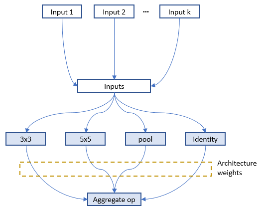

# General Programming Interface for Neural Architecture Search (experimental feature)

_*This is an experimental feature, currently, we only implemented the general NAS programming interface. Weight sharing will be supported in the following releases._

Automatic neural architecture search is taking an increasingly important role on finding better models. Recent research works have proved the feasibility of automatic NAS, and also found some models that could beat manually designed and tuned models. Some of representative works are [NASNet][2], [ENAS][1], [DARTS][3], [Network Morphism][4], and [Evolution][5]. There are new innovations keeping emerging. However, it takes great efforts to implement those algorithms, and it is hard to reuse code base of one algorithm for implementing another.

To facilitate NAS innovations (e.g., design/implement new NAS models, compare different NAS models side-by-side), an easy-to-use and flexible programming interface is crucial.

<a name="ProgInterface"></a>

## Programming interface

 A new programming interface for designing and searching for a model is often demanded in two scenarios. 1) When designing a neural network, the designer may have multiple choices for a layer, sub-model, or connection, and not sure which one or a combination performs the best. It would be appealing to have an easy way to express the candidate layers/sub-models they want to try. 2) For the researchers who are working on automatic NAS, they want to have an unified way to express the search space of neural architectures. And making unchanged trial code adapted to different searching algorithms.

 We designed a simple and flexible programming interface based on [NNI annotation](../Tutorial/AnnotationSpec.md). It is elaborated through examples below.

### Example: choose an operator for a layer

When designing the following model there might be several choices in the fourth layer that may make this model perform well. In the script of this model, we can use annotation for the fourth layer as shown in the figure. In this annotation, there are five fields in total:


* __layer_choice__: It is a list of function calls, each function should have defined in user's script or imported libraries. The input arguments of the function should follow the format: `def XXX(inputs, arg2, arg3, ...)`, where inputs is a list with two elements. One is the list of `fixed_inputs`, and the other is a list of the chosen inputs from `optional_inputs`. `conv` and `pool` in the figure are examples of function definition. For the function calls in this list, no need to write the first argument (i.e., input). Note that only one of the function calls are chosen for this layer.
* __fixed_inputs__: It is a list of variables, the variable could be an output tensor from a previous layer. The variable could be `layer_output` of another `nni.mutable_layer` before this layer, or other python variables before this layer. All the variables in this list will be fed into the chosen function in `layer_choice` (as the first element of the input list).
* __optional_inputs__: It is a list of variables, the variable could be an output tensor from a previous layer. The variable could be `layer_output` of another `nni.mutable_layer` before this layer, or other python variables before this layer. Only `optional_input_size` variables will be fed into the chosen function in `layer_choice` (as the second element of the input list).
* __optional_input_size__: It indicates how many inputs are chosen from `input_candidates`. It could be a number or a range. A range [1,3] means it chooses 1, 2, or 3 inputs.
* __layer_output__: The name of the output(s) of this layer, in this case it represents the return of the function call in `layer_choice`. This will be a variable name that can be used in the following python code or `nni.mutable_layer`.

There are two ways to write annotation for this example. For the upper one, input of the function calls is `[[],[out3]]`. For the bottom one, input is `[[out3],[]]`.

__Debugging__: We provided an `nnictl trial codegen` command to help debugging your code of NAS programming on NNI. If your trial with trial_id `XXX` in your experiment `YYY` is failed, you could run `nnictl trial codegen YYY --trial_id XXX` to generate an executable code for this trial under your current directory. With this code, you can directly run the trial command without NNI to check why this trial is failed. Basically, this command is to compile your trial code and replace the NNI NAS code with the real chosen layers and inputs.

### Example: choose input connections for a layer

Designing connections of layers is critical for making a high performance model. With our provided interface, users could annotate which connections a layer takes (as inputs). They could choose several ones from a set of connections. Below is an example which chooses two inputs from three candidate inputs for `concat`. Here `concat` always takes the output of its previous layer using `fixed_inputs`.


### Example: choose both operators and connections

In this example, we choose one from the three operators and choose two connections for it. As there are multiple variables in inputs, we call `concat` at the beginning of the functions.


### Example: [ENAS][1] macro search space

To illustrate the convenience of the programming interface, we use the interface to implement the trial code of "ENAS + macro search space". The left figure is the macro search space in ENAS paper.


## Unified NAS search space specification

After finishing the trial code through the annotation above, users have implicitly specified the search space of neural architectures in the code. Based on the code, NNI will automatically generate a search space file which could be fed into tuning algorithms. This search space file follows the following JSON format.

```javascript
{
    "mutable_1": {
        "_type": "mutable_layer",
        "_value": {
            "layer_1": {
                "layer_choice": ["conv(ch=128)", "pool", "identity"],
                "optional_inputs": ["out1", "out2", "out3"],
                "optional_input_size": 2
            },
            "layer_2": {
                ...
            }
        }
    }
}
```

Accordingly, a specified neural architecture (generated by tuning algorithm) is expressed as follows:

```javascript
{
    "mutable_1": {
        "layer_1": {
            "chosen_layer": "pool",
            "chosen_inputs": ["out1", "out3"]
        },
        "layer_2": {
            ...
        }
    }
}
```

With the specification of the format of search space and architecture (choice) expression, users are free to implement various (general) tuning algorithms for neural architecture search on NNI. One future work is to provide a general NAS algorithm.

## Support of One-Shot NAS

One-Shot NAS is a popular approach to find good neural architecture within a limited time and resource budget. Basically, it builds a full graph based on the search space, and uses gradient descent to at last find the best subgraph. There are different training approaches, such as [training subgraphs (per mini-batch)][1], [training full graph through dropout][6], [training with architecture weights (regularization)][3]. 

NNI has supported the general NAS as demonstrated above. From users' point of view, One-Shot NAS and NAS have the same search space specification, thus, they could share the same programming interface as demonstrated above, just different training modes. NNI provides four training modes:

**\*classic_mode\***: this mode is described [above](#ProgInterface), in this mode, each subgraph runs as a trial job. To use this mode, you should enable NNI annotation and specify a tuner for nas in experiment config file. [Here](https://github.com/microsoft/nni/tree/master/examples/trials/mnist-nas) is an example to show how to write trial code and the config file. And [here](https://github.com/microsoft/nni/tree/master/examples/tuners/random_nas_tuner) is a simple tuner for nas.

**\*enas_mode\***: following the training approach in [enas paper][1]. It builds the full graph based on neural architrecture search space, and only activate one subgraph that generated by the controller for each mini-batch. [Detailed Description](#ENASMode). (currently only supported on tensorflow). 

To use enas_mode, you should add one more field in the `trial` config as shown below.
```diff
trial:
    command: your command to run the trial
    codeDir: the directory where the trial's code is located
    gpuNum: the number of GPUs that one trial job needs
+   #choice: classic_mode, enas_mode, oneshot_mode
+   nasMode: enas_mode
```
Similar to classic_mode, in enas_mode you need to specify a tuner for nas, as it also needs to receive subgraphs from tuner (or controller using the terminology in the paper). Since this trial job needs to receive multiple subgraphs from tuner, each one for a mini-batch, two lines need to be added to the trial code to receive the next subgraph (i.e., `nni.training_update`) and report the result of the current subgraph. Below is an example:
```python
for _ in range(num):
    # here receives and enables a new subgraph
    """@nni.training_update(tf=tf, session=self.session)"""
    loss, _ = self.session.run([loss_op, train_op])
    # report the loss of this mini-batch
    """@nni.report_final_result(loss)"""
```
Here, `nni.training_update` is to do some update on the full graph. In enas_mode, the update means receiving a subgraph and enabling it on the next mini-batch. While in darts_mode, the update means training the architecture weights (details in darts_mode). In enas_mode, you need to pass the imported tensorflow package to `tf` and the session to `session`.

**\*oneshot_mode\***: following the training approach in [this paper][6]. Different from enas_mode which trains the full graph by training large numbers of subgraphs, in oneshot_mode the full graph is built and dropout is added to candidate inputs and also added to candidate ops' outputs. Then this full graph is trained like other DL models. [Detailed Description](#OneshotMode). (currently only supported on tensorflow). 

To use oneshot_mode, you should add one more field in the `trial` config as shown below. In this mode, though there is no need to use tuner, you still need to specify a tuner (any tuner) in the config file for now. Also, no need to add `nni.training_update` in this mode, because no special processing (or update) is needed during training.
```diff
trial:
    command: your command to run the trial
    codeDir: the directory where the trial's code is located
    gpuNum: the number of GPUs that one trial job needs
+   #choice: classic_mode, enas_mode, oneshot_mode
+   nasMode: oneshot_mode
```

**\*darts_mode\***: following the training approach in [this paper][3]. It is similar to oneshot_mode. There are two differences, one is that darts_mode only add architecture weights to the outputs of candidate ops, the other is that it trains model weights and architecture weights in an interleaved manner. [Detailed Description](#DartsMode).

To use darts_mode, you should add one more field in the `trial` config as shown below. In this mode, though there is no need to use tuner, you still need to specify a tuner (any tuner) in the config file for now.
```diff
trial:
    command: your command to run the trial
    codeDir: the directory where the trial's code is located
    gpuNum: the number of GPUs that one trial job needs
+   #choice: classic_mode, enas_mode, oneshot_mode
+   nasMode: darts_mode
```

When using darts_mode, you need to call `nni.training_update` as shown below when architecture weights should be updated. Updating architecture weights need `loss` for updating the weights as well as the training data (i.e., `feed_dict`) for it.
```python
for _ in range(num):
    # here trains the architecture weights
    """@nni.training_update(tf=tf, session=self.session, loss=loss, feed_dict=feed_dict)"""
    loss, _ = self.session.run([loss_op, train_op])
```

**Note:** for enas_mode, oneshot_mode, and darts_mode, NNI only works on the training phase. They also have their own inference phase which is not handled by NNI. For enas_mode, the inference phase is to generate new subgraphs through the controller. For oneshot_mode, the inference phase is sampling new subgraphs randomly and choosing good ones. For darts_mode, the inference phase is pruning a proportion of candidates ops based on architecture weights.

<a name="ENASMode"></a>

### enas_mode

In enas_mode, the compiled trial code builds the full graph (rather than subgraph), it receives a chosen architecture and training this architecture on the full graph for a mini-batch, then request another chosen architecture. It is supported by [NNI multi-phase](./MultiPhase.md).

Specifically, for trials using tensorflow, we create and use tensorflow variable as signals, and tensorflow conditional functions to control the search space (full-graph) to be more flexible, which means it can be changed into different sub-graphs (multiple times) depending on these signals. [Here](https://github.com/microsoft/nni/tree/master/examples/trials/mnist-nas/enas_mode) is an example for enas_mode.

<a name="OneshotMode"></a>

### oneshot_mode

Below is the figure to show where dropout is added to the full graph for one layer in `nni.mutable_layers`, input 1-k are candidate inputs, the four ops are candidate ops.


As suggested in the [paper][6], a dropout method is implemented to the inputs for every layer. The dropout rate is set to r^(1/k), where 0 < r < 1 is a hyper-parameter of the model (default to be 0.01) and k is number of optional inputs for a specific layer. The higher the fan-in, the more likely each possible input is to be dropped out. However, the probability of dropping out all optional_inputs of a layer is kept constant regardless of its fan-in. Suppose r = 0.05. If a layer has k = 2 optional_inputs then each one will independently be dropped out with probability 0.051/2 ≈ 0.22 and will be retained with probability 0.78. If a layer has k = 7 optional_inputs then each one will independently be dropped out with probability 0.051/7 ≈ 0.65 and will be retained with probability 0.35. In both cases, the probability of dropping out all of the layer's optional_inputs is 5%. The outputs of candidate ops are dropped out through the same way. [Here](https://github.com/microsoft/nni/tree/master/examples/trials/mnist-nas/oneshot_mode) is an example for oneshot_mode.

<a name="DartsMode"></a>

### darts_mode

Below is the figure to show where architecture weights are added to the full graph for one layer in `nni.mutable_layers`, output of each candidate op is multiplied by a weight which is called architecture weight.



In `nni.training_update`, tensorflow MomentumOptimizer is used to train the architecture weights based on the pass `loss` and `feed_dict`. [Here](https://github.com/microsoft/nni/tree/master/examples/trials/mnist-nas/darts_mode) is an example for darts_mode.

### [__TODO__] Multiple trial jobs for One-Shot NAS

One-Shot NAS usually has only one trial job with the full graph. However, running multiple such trial jobs leads to benefits. For example, in enas_mode multiple trial jobs could share the weights of the full graph to speedup the model training (or converge). Some One-Shot approaches are not stable, running multiple trial jobs increase the possibility of finding better models.

NNI natively supports running multiple such trial jobs. The figure below shows how multiple trial jobs run on NNI.


=============================================================

## System design of NAS on NNI

### Basic flow of experiment execution

NNI's annotation compiler transforms the annotated trial code to the code that could receive architecture choice and build the corresponding model (i.e., graph). The NAS search space can be seen as a full graph (here, full graph means enabling all the provided operators and connections to build a graph), the architecture chosen by the tuning algorithm is a subgraph in it. By default, the compiled trial code only builds and executes the subgraph.


The above figure shows how the trial code runs on NNI. `nnictl` processes user trial code to generate a search space file and compiled trial code. The former is fed to tuner, and the latter is used to run trials. 

[Simple example of NAS on NNI](https://github.com/microsoft/nni/tree/master/examples/trials/mnist-nas).

### [__TODO__] Weight sharing

Sharing weights among chosen architectures (i.e., trials) could speedup model search. For example, properly inheriting weights of completed trials could speedup the converge of new trials. One-Shot NAS (e.g., ENAS, Darts) is more aggressive, the training of different architectures (i.e., subgraphs) shares the same copy of the weights in full graph.


We believe weight sharing (transferring) plays a key role on speeding up NAS, while finding efficient ways of sharing weights is still a hot research topic. We provide a key-value store for users to store and load weights. Tuners and Trials use a provided KV client lib to access the storage.

Example of weight sharing on NNI.

## General tuning algorithms for NAS

Like hyperparameter tuning, a relatively general algorithm for NAS is required. The general programming interface makes this task easier to some extent. We have an [RL tuner based on PPO algorithm](https://github.com/microsoft/nni/tree/master/src/sdk/pynni/nni/ppo_tuner) for NAS. We expect efforts from community to design and implement better NAS algorithms.

## [__TODO__] Export best neural architecture and code

After the NNI experiment is done, users could run `nnictl experiment export --code` to export the trial code with the best neural architecture.

## Conclusion and Future work

There could be different NAS algorithms and execution modes, but they could be supported with the same programming interface as demonstrated above.

There are many interesting research topics in this area, both system and machine learning.

[1]: https://arxiv.org/abs/1802.03268
[2]: https://arxiv.org/abs/1707.07012
[3]: https://arxiv.org/abs/1806.09055
[4]: https://arxiv.org/abs/1806.10282
[5]: https://arxiv.org/abs/1703.01041
[6]: http://proceedings.mlr.press/v80/bender18a/bender18a.pdf
