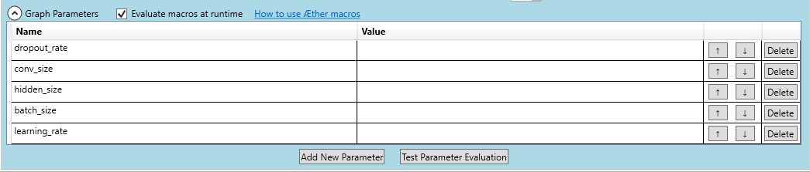

# Training Serice for Aether

## Install

### Install from source code
#### Dependencies
* [.NET Framework v4.6.2](https://dotnet.microsoft.com/download/dotnet-framework/net462)
    * with [Developer Pack](https://www.microsoft.com/en-us/download/details.aspx?id=53321)
* [Visual Studio 2017](https://visualstudio.microsoft.com/) with `.NET Desktop Development` support.
    * Add `${Visual Studio Install Path}\MSBuild\15.0\Bin` to `PATH` environment variable

#### Instructions
There are other details, please refer to [Windows Local Mode (experimental feature)](https://nni.readthedocs.io/en/latest/WindowsLocalMode.html)
```
git clone -b dev-restTS https://msasg.visualstudio.com/DefaultCollection/Bing_and_IPG/_git/nni
cd nni
```
* Open `src\nni_manager\training_service\aether\cslib\AetherClient.sln` with Visual Studio 2017
    * In Solution Explorer, right-click References and choose **Manage NuGet Packages**.
    
    * Then click **restore** to install nuget packages, during which **authentication** will be required. 

* After Nuget packages installed, run `./install.ps1` to install.

### Install with pip wheel
Currently we provide a wheel file hosted [here](http://168.62.174.169:8080/nni/). Users can just download the wheel file and run:
```powershell
pip install nni-0.5.1-py3-none-win_amd64.whl
```

## Usage
Besides as introduced in [QuickStart](https://nni.readthedocs.io/en/latest/QuickStart.html), the users also need:
* A search space file `search_space.json` that tells NNI which parameters to tune and its prior range. For example:
    ```json
    {
        "dropout_rate":{"_type":"uniform","_value":[0.5, 0.9]},
        "conv_size":{"_type":"choice","_value":[2,3,5,7]},
        "hidden_size":{"_type":"choice","_value":[124, 512, 1024]},
        "batch_size": {"_type":"choice", "_value": [1, 4, 8, 16, 32]},
        "learning_rate":{"_type":"choice","_value":[0.0001, 0.001, 0.01, 0.1]}
    }
    ```
    For details, please refer to: [Reference/Search Space](https://nni.readthedocs.io/en/latest/SearchSpaceSpec.html)
* Aether Graph File, by saving the experiment with *File > Save As* in Aether Client X.
    * The experiment must have **Graph Paramters** corresponding to `search_space.json`, for example, with search space file above, the experiment should have the following Graph Parameters:
    
    

* The output location of metrics, which currently **must be** a single line of float number, specifically:
    * Alias of output node
    * Output name of the node
    

* Last, fill `config.yml` with the above information:
    ```yaml
    trainingServicePlatform: aether     # submit job to AEther
    trial:
        codeDir: .
        baseGraph: hello.json   # AEther Graph File
        outputNodeAlias: 184eb95a 
        outputName: OutputFile
    ```