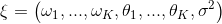

# Curve Fitting Assessor on NNI

## Introduction

The Curve Fitting Assessor is an LPA (learning, predicting, assessing) algorithm. It stops a pending trial X at step S if the prediction of the final epoch's performance is worse than the best final performance in the trial history.

In this algorithm, we use 12 curves to fit the learning curve. The set of parametric curve models are chosen from this [reference paper][1]. The learning curves' shape coincides with our prior knowledge about the form of learning curves: They are typically increasing, saturating functions.


We combine all learning curve models into a single, more powerful model. This combined model is given by a weighted linear combination:


with the new combined parameter vector



Assuming additive Gaussian noise and the noise parameter being initialized to its maximum likelihood estimate.

We determine the maximum probability value of the new combined parameter vector by learning the historical data. We use such a value to predict future trial performance and stop the inadequate experiments to save computing resources.

Concretely, this algorithm goes through three stages of learning, predicting, and assessing.

* Step1: Learning. We will learn about the trial history of the current trial and determine the \xi at the Bayesian angle. First of all, We fit each curve using the least-squares method, implemented by `fit_theta`. After we obtained the parameters, we filter the curve and remove the outliers, implemented by `filter_curve`. Finally, we use the MCMC sampling method. implemented by `mcmc_sampling`, to adjust the weight of each curve. Up to now, we have determined all the parameters in \xi.

* Step2: Predicting. It calculates the expected final result accuracy, implemented by `f_comb`, at the target position (i.e., the total number of epochs) by \xi and the formula of the combined model.

* Step3: If the fitting result doesn't converge, the predicted value will be `None`. In this case, we return `AssessResult.Good` to ask for future accuracy information and predict again. Furthermore, we will get a positive value from the `predict()` function. If this value is strictly greater than the best final performance in history * `THRESHOLD`(default value = 0.95), return `AssessResult.Good`, otherwise, return  `AssessResult.Bad`

The figure below is the result of our algorithm on MNIST trial history data, where the green point represents the data obtained by Assessor, the blue point represents the future but unknown data, and the red line is the Curve predicted by the Curve fitting assessor.


## Usage

To use Curve Fitting Assessor, you should add the following spec in your experiment's YAML config file:

```yaml
assessor:
  builtinAssessorName: Curvefitting
  classArgs:
    # (required)The total number of epoch.
    #  We need to know the number of epoch to determine which point we need to predict.
    epoch_num: 20
    # (optional) In order to save our computing resource, we start to predict when we have more than only after receiving start_step number of reported intermediate results.
    # The default value of start_step is 6.
    start_step: 6
    # (optional) The threshold that we decide to early stop the worse performance curve.
    # For example: if threshold = 0.95, best performance in the history is 0.9, then we will stop the trial which predict value is lower than 0.95 * 0.9 = 0.855.
    # The default value of threshold is 0.95.
    threshold: 0.95
    # (optional) The gap interval between Assesor judgements.
    # For example: if gap = 2, start_step = 6, then we will assess the result when we get 6, 8, 10, 12...intermedian result.
    # The default value of gap is 1.
    gap: 1
```

## Limitation

According to the original paper, only incremental functions are supported. Therefore this assessor can only be used to maximize optimization metrics. For example, it can be used for accuracy, but not for loss.

## File Structure

The assessor has a lot of different files, functions, and classes. Here we briefly describe a few of them.

* `curvefunctions.py` includes all the function expressions and default parameters.
* `modelfactory.py` includes learning and predicting; the corresponding calculation part is also implemented here.
* `curvefitting_assessor.py` is the assessor which receives the trial history and assess whether to early stop the trial.

## TODO

* Further improve the accuracy of the prediction and test it on more models.

[1]: http://aad.informatik.uni-freiburg.de/papers/15-IJCAI-Extrapolation_of_Learning_Curves.pdf
