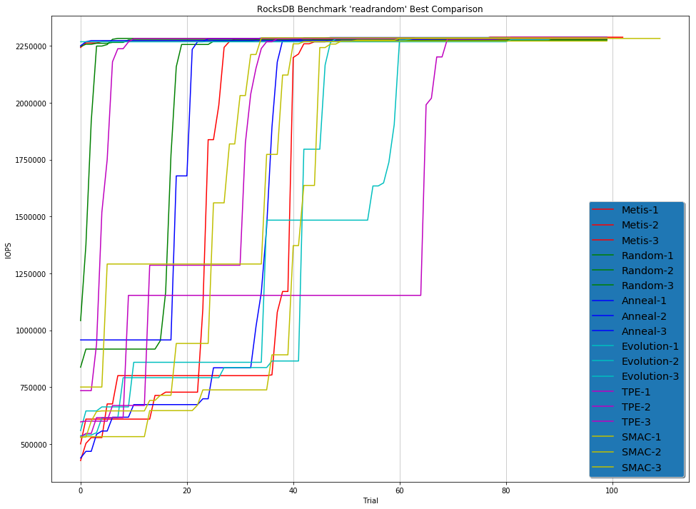

# Hyperparameter Optimization Comparison
*Posted by Anonymous Author*

Comparison of Hyperparameter Optimization algorithms on several problems.

Hyperparameter Optimization algorithms are list below:

- [Random Search](../Builtin_Tuner.md#Random)
- [Grid Search](../Builtin_Tuner.md#Random)
- [Evolution](../Builtin_Tuner.md#Evolution)
- [Anneal](../Builtin_Tuner.md#Anneal)
- [Metis](../Builtin_Tuner.md#MetisTuner)
- [TPE](../Builtin_Tuner.md#TPE)
- [SMAC](../Builtin_Tuner.md#SMAC)
- [HyperBand](../Builtin_Tuner.md#Hyperband)
- [BOHB](../Builtin_Tuner.md#BOHB)

All algorithms run in NNI local environment。

Machine Environment：

```
OS: Linux Ubuntu 16.04 LTS
CPU: Intel(R) Xeon(R) CPU E5-2690 v3 @ 2.60GHz 2600 MHz
Memory: 112 GB
NNI Version: v0.7
NNI Mode(local|pai|remote): local
Python version: 3.6
Is conda or virtualenv used?: Conda
is running in docker?: no
```

## AutoGBDT Example

### Problem Description

Nonconvex problem on the hyper-parameter search of [AutoGBDT](../gbdt_example.md) example.

### Search Space

```json
{
  "num_leaves": {
    "_type": "choice",
    "_value": [10, 12, 14, 16, 18, 20, 22, 24, 28, 32, 48, 64, 96, 128]
  },
  "learning_rate": {
    "_type": "choice",
    "_value": [0.00001, 0.0001, 0.001, 0.01, 0.05, 0.1, 0.2, 0.5]
  },
  "max_depth": {
    "_type": "choice",
    "_value": [-1, 2, 3, 4, 5, 6, 8, 10, 12, 14, 16, 18, 20, 22, 24, 28, 32, 48, 64, 96, 128]
  },
  "feature_fraction": {
    "_type": "choice",
    "_value": [0.9, 0.8, 0.7, 0.6, 0.5, 0.4, 0.3, 0.2]
  },
  "bagging_fraction": {
    "_type": "choice",
    "_value": [0.9, 0.8, 0.7, 0.6, 0.5, 0.4, 0.3, 0.2]
  },
  "bagging_freq": {
    "_type": "choice",
    "_value": [1, 2, 4, 8, 10, 12, 14, 16]
  }
}
```

The total search space is 1,204,224, we set the number of maximum trial to 1000. The time limitation is 48 hours.

### Results

| Algorithm     | TOP1 Loss    | **TOP2** Loss | **TOP3 **Loss | **TOP4 **Loss | **TOP5 **Loss | **TOP6** Loss | **TOP7 **Loss | **TOP8 **Loss | **TOP9 **Loss | **TOP10 **Loss |
| ------------- | ------------ | ------------- | ------------- | ------------- | ------------- | ------------- | ------------- | ------------- | ------------- | -------------- |
| Random Search | 0.418854     | 0.419595      | 0.419945      | 0.421683      | 0.421685      | 0.422116      | 0.422528      | 0.422983      | 0.423035      | 0.423108       |
| Random Search | 0.417364     | 0.419173      | 0.420747      | 0.421403      | 0.421433      | 0.421437      | 0.421759      | 0.421788      | 0.422371      | 0.422493       |
| Random Search | 0.417861     | 0.41816       | 0.420704      | 0.420736      | 0.421258      | 0.421312      | 0.421417      | 0.421427      | 0.421469      | 0.422079       |
| Grid Search   | 0.498166     | 0.498166      | 0.498166      | 0.498166      | 0.498166      | 0.498166      | 0.498167      | 0.498167      | 0.498167      | 0.498167       |
| Evolution     | 0.409887     | 0.409887      | 0.409887      | 0.409887      | 0.409887      | 0.409887      | 0.409887      | 0.409887      | 0.409887      | 0.409887       |
| Evolution     | 0.413620     | 0.413620      | 0.413620      | 0.414258      | 0.414258      | 0.414258      | 0.414258      | 0.414258      | 0.414258      | 0.414258       |
| Evolution     | 0.409887     | 0.409887      | 0.409887      | 0.409887      | 0.409887      | 0.409887      | 0.409887      | 0.409887      | 0.409887      | 0.409887       |
| Anneal        | 0.414877     | 0.416751      | 0.417743      | 0.418002      | 0.419073      | 0.419225      | 0.419285      | 0.419285      | 0.419285      | 0.419285       |
| Anneal        | 0.409887     | 0.409887      | 0.409887      | 0.409887      | 0.409887      | 0.409887      | 0.410464      | 0.410464      | 0.410464      | 0.410464       |
| Anneal        | 0.413683     | 0.417766      | 0.417766      | 0.417766      | 0.417766      | 0.417766      | 0.417766      | 0.417766      | 0.418663      | 0.418663       |
| Metis         | 0.416273     | 0.419946      | 0.420192      | 0.422823      | 0.422823      | 0.423395      | 0.423898      | 0.424424      | 0.424950      | 0.425076       |
| Metis         | 0.420262     | 0.422190      | 0.423942      | 0.424236      | 0.425243      | 0.425919      | 0.426157      | 0.426588      | 0.426690      | 0.426931       |
| Metis         | 0.421027     | 0.424222      | 0.424589      | 0.425349      | 0.425675      | 0.426296      | 0.427059      | 0.427166      | 0.427427      | 0.428334       |
| TPE           | 0.414478     | 0.414478      | 0.414478      | 0.414478      | 0.414478      | 0.414478      | 0.414478      | 0.414478      | 0.414478      | 0.414478       |
| TPE           | 0.415077     | 0.416594      | 0.419297      | 0.419480      | 0.419480      | 0.419480      | 0.419480      | 0.419480      | 0.419480      | 0.420124       |
| TPE           | 0.415077     | 0.417007      | 0.417125      | 0.417677      | 0.418157      | 0.418295      | 0.418556      | 0.419201      | 0.419717      | 0.419717       |
| SMAC          | **0.408386** | 0.408386      | 0.408386      | 0.408386      | 0.408386      | 0.408386      | 0.408386      | 0.408386      | 0.408386      | 0.408386       |
| SMAC          | 0.414012     | 0.414012      | 0.414012      | 0.414012      | 0.414012      | 0.414012      | 0.414012      | 0.414012      | 0.414012      | 0.414012       |
| SMAC          | **0.408386** | 0.408386      | 0.408386      | 0.408386      | 0.408386      | 0.408386      | 0.408386      | 0.408386      | 0.408386      | 0.408386       |
| BOHB          | 0.410464     | 0.411563      | 0.415848      | 0.41936       | 0.41936       | 0.419557      | 0.419946      | 0.420449      | 0.420449      | 0.420549       |
| BOHB          | 0.418995     | 0.418995      | 0.420547      | 0.420692      | 0.42211       | 0.42211       | 0.425604      | 0.425664      | 0.425664      | 0.425664       |
| BOHB          | 0.415149     | 0.418463      | 0.418568      | 0.419091      | 0.419091      | 0.419385      | 0.419654      | 0.419654      | 0.420133      | 0.420133       |
| HyperBand     | 0.414065     | 0.414065      | 0.414065      | 0.416957      | 0.416957      | 0.419717      | 0.419717      | 0.420001      | 0.420001      | 0.420735       |
| HyperBand     | 0.416807     | 0.416807      | 0.416807      | 0.418662      | 0.418662      | 0.419305      | 0.419305      | 0.419305      | 0.420806      | 0.421810       |
| HyperBand     | 0.415550     | 0.415859      | 0.415859      | 0.415859      | 0.416757      | 0.418090      | 0.418090      | 0.418245      | 0.418245      | 0.419304       |

For Metis, there are about 300 trials because it runs slowly due to its high time complexity O(n^3) in Gaussian Process.

## RocksDB Benchmark 'fillrandom' and 'readrandom'

### Problem Description

[DB_Bench](<https://github.com/facebook/rocksdb/wiki/Benchmarking-tools>) is the main tool that is used to benchmark [RocksDB](https://rocksdb.org/)'s performance. It has so many hapermeter to tune.

The performance of `DB_Bench` is associated with the machine configuration and installation method. We run the `DB_Bench`in the Linux machine and install the Rock in shared library.

#### Machine configuration

```
RocksDB:    version 6.1
CPU:        6 * Intel(R) Xeon(R) CPU E5-2690 v4 @ 2.60GHz
CPUCache:   35840 KB
Keys:       16 bytes each
Values:     100 bytes each (50 bytes after compression)
Entries:    1000000
```

#### Storage performance

**Latency**: each IO request will take some time to complete, this is called the average latency. There are several factors that would affect this time including network connection quality and hard disk IO performance.

**IOPS**: **IO operations per second**, which means the amount of _read or write operations_ that could be done in one seconds time.

**IO size**: **the size of each IO request**. Depending on the operating system and the application/service that needs disk access it will issue a request to read or write a certain amount of data at the same time.

**Throughput (in MB/s) = Average IO size x IOPS **

IOPS is related to online processing ability and we use the IOPS as the metric in my experiment.

### Search Space

```json
{
  "max_background_compactions": {
    "_type": "quniform",
    "_value": [1, 256, 1]
  },
  "block_size": {
    "_type": "quniform",
    "_value": [1, 500000, 1]
  },
  "write_buffer_size": {
    "_type": "quniform",
    "_value": [1, 130000000, 1]
  },
  "max_write_buffer_number": {
    "_type": "quniform",
    "_value": [1, 128, 1]
  },
  "min_write_buffer_number_to_merge": {
    "_type": "quniform",
    "_value": [1, 32, 1]
  },
  "level0_file_num_compaction_trigger": {
    "_type": "quniform",
    "_value": [1, 256, 1]
  },
  "level0_slowdown_writes_trigger": {
    "_type": "quniform",
    "_value": [1, 1024, 1]
  },
  "level0_stop_writes_trigger": {
    "_type": "quniform",
    "_value": [1, 1024, 1]
  },
  "cache_size": {
    "_type": "quniform",
    "_value": [1, 30000000, 1]
  },
  "compaction_readahead_size": {
    "_type": "quniform",
    "_value": [1, 30000000, 1]
  },
  "new_table_reader_for_compaction_inputs": {
    "_type": "randint",
    "_value": [1]
  }
}
```

The search space is enormous (about 10^40) and we set the maximum number of trial to 100 to limit the computation resource.

### Results

#### fillrandom' Benchmark

| Model     | Best IOPS (Repeat 1) | Best IOPS (Repeat 2) | Best IOPS (Repeat 3) |
| --------- | -------------------- | -------------------- | -------------------- |
| Random    | 449901               | 427620               | 477174               |
| Anneal    | 461896               | 467150               | 437528               |
| Evolution | 436755               | 389956               | 389790               |
| TPE       | 378346               | 482316               | 468989               |
| SMAC      | 491067               | 490472               | **491136**           |
| Metis     | 444920               | 457060               | 454438               |

Figure:


#### 'readrandom' Benchmark

| Model     | Best IOPS (Repeat 1) | Best IOPS (Repeat 2) | Best IOPS (Repeat 3) |
| --------- | -------------------- | -------------------- | -------------------- |
| Random    | 2276157              | 2285301              | 2275142              |
| Anneal    | 2286330              | 2282229              | 2284012              |
| Evolution | 2286524              | 2283673              | 2283558              |
| TPE       | 2287366              | 2282865              | 2281891              |
| SMAC      | 2270874              | 2284904              | 2282266              |
| Metis     | **2287696**          | 2283496              | 2277701              |

Figure:


