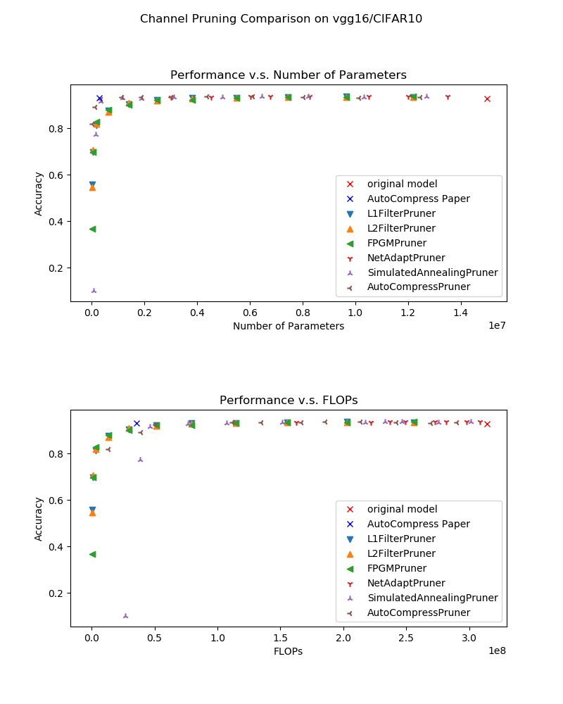
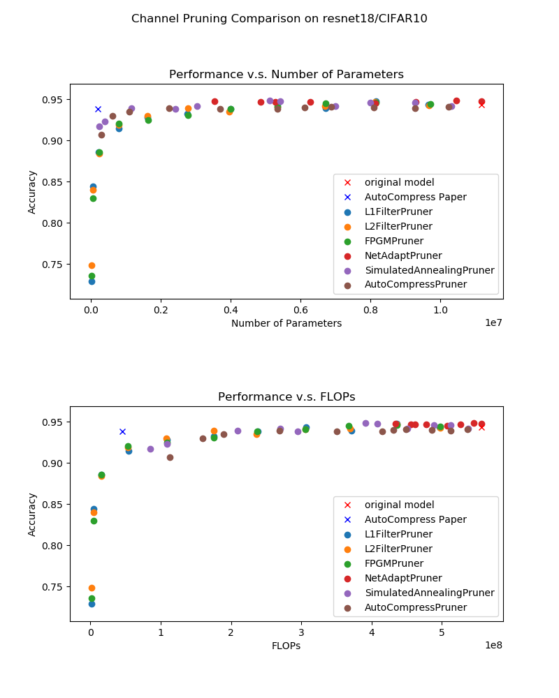
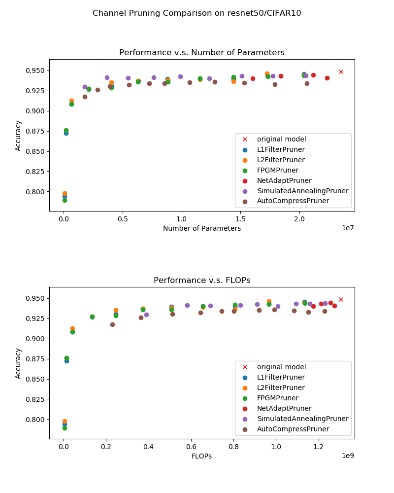

Comparison of Filter Pruning Algorithms
=======================================

To provide an initial insight into the performance of various filter pruning algorithms, 
we conduct extensive experiments with various pruning algorithms on some benchmark models and datasets.
We present the experiment result in this document.
In addition, we provide friendly instructions on the re-implementation of these experiments to facilitate further contributions to this effort.

Experiment Setting
------------------

The experiments are performed with the following pruners/datasets/models:

* 
  Models: :githublink:`VGG16, ResNet18, ResNet50 <examples/model_compress/models/cifar10>`

* 
  Datasets: CIFAR-10

* 
  Pruners: 

  * These pruners are included:

    * Pruners with scheduling : ``SimulatedAnnealing Pruner``\ , ``NetAdapt Pruner``\ , ``AutoCompress Pruner``.
      Given the overal sparsity requirement, these pruners can automatically generate a sparsity distribution among different layers.
    * One-shot pruners: ``L1Filter Pruner``\ , ``L2Filter Pruner``\ , ``FPGM Pruner``.
      The sparsity of each layer is set the same as the overall sparsity in this experiment.

  * 
    Only **filter pruning** performances are compared here. 

    For the pruners with scheduling, ``L1Filter Pruner`` is used as the base algorithm. That is to say, after the sparsities distribution is decided by the scheduling algorithm, ``L1Filter Pruner`` is used to performn real pruning.

  * 
    All the pruners listed above are implemented in :githublink:`nni <docs/en_US/Compression/Overview.rst>`.

Experiment Result
-----------------

For each dataset/model/pruner combination, we prune the model to different levels by setting a series of target sparsities for the pruner. 

Here we plot both **Number of Weights - Performances** curve and** FLOPs - Performance** curve. 
As a reference, we also plot the result declared in the paper `AutoCompress: An Automatic DNN Structured Pruning Framework for Ultra-High Compression Rates <http://arxiv.org/abs/1907.03141>`__ for models VGG16 and ResNet18 on CIFAR-10.

The experiment result are shown in the following figures:

CIFAR-10, VGG16:

CIFAR-10, ResNet18:

CIFAR-10, ResNet50:

Analysis
--------

From the experiment result, we get the following conclusions:

* Given the constraint on the number of parameters, the pruners with scheduling ( ``AutoCompress Pruner`` , ``SimualatedAnnealing Pruner`` ) performs better than the others when the constraint is strict. However, they have no such advantage in FLOPs/Performances comparison since only number of parameters constraint is considered in the optimization process; 
* The basic algorithms ``L1Filter Pruner`` , ``L2Filter Pruner`` , ``FPGM Pruner`` performs very similarly in these experiments; 
* ``NetAdapt Pruner`` can not achieve very high compression rate. This is caused by its mechanism that it prunes only one layer each pruning iteration. This leads to un-acceptable complexity if the sparsity per iteration is much lower than the overall sparisity constraint.

Experiments Reproduction
------------------------

Implementation Details
^^^^^^^^^^^^^^^^^^^^^^

* 
  The experiment results are all collected with the default configuration of the pruners in nni, which means that when we call a pruner class in nni, we don't change any default class arguments.

* 
  Both FLOPs and the number of parameters are counted with :githublink:`Model FLOPs/Parameters Counter <docs/en_US/Compression/CompressionUtils.md#model-flopsparameters-counter>` after :githublink:`model speed up <docs/en_US/Compression/ModelSpeedup.rst>`.
  This avoids potential issues of counting them of masked models.

* 
  The experiment code can be found :githublink:`here <examples/model_compress/auto_pruners_torch.py>`.

Experiment Result Rendering
^^^^^^^^^^^^^^^^^^^^^^^^^^^

* 
  If you follow the practice in the :githublink:`example <examples/model_compress/auto_pruners_torch.py>`\ , for every single pruning experiment, the experiment result will be saved in JSON format as follows:

  .. code-block:: json

       {
           "performance": {"original": 0.9298, "pruned": 0.1, "speedup": 0.1, "finetuned": 0.7746}, 
           "params": {"original": 14987722.0, "speedup": 167089.0}, 
           "flops": {"original": 314018314.0, "speedup": 38589922.0}
       }

* 
  The experiment results are saved :githublink:`here <examples/model_compress/comparison_of_pruners>`. 
  You can refer to :githublink:`analyze <examples/model_compress/comparison_of_pruners/analyze.py>` to plot new performance comparison figures.

Contribution
------------

TODO Items
^^^^^^^^^^

* Pruners constrained by FLOPS/latency
* More pruning algorithms/datasets/models

Issues
^^^^^^

For algorithm implementation & experiment issues, please `create an issue <https://github.com/microsoft/nni/issues/new/>`__.
