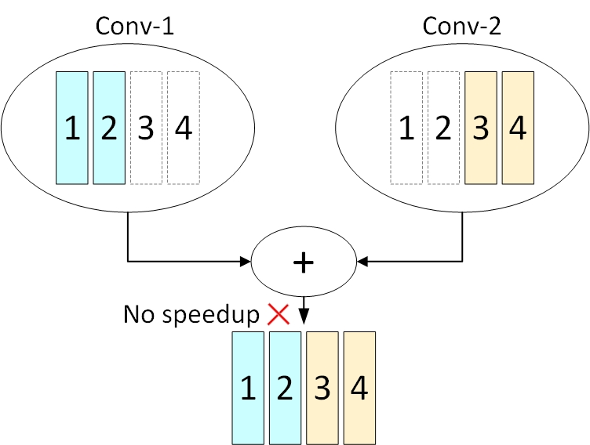
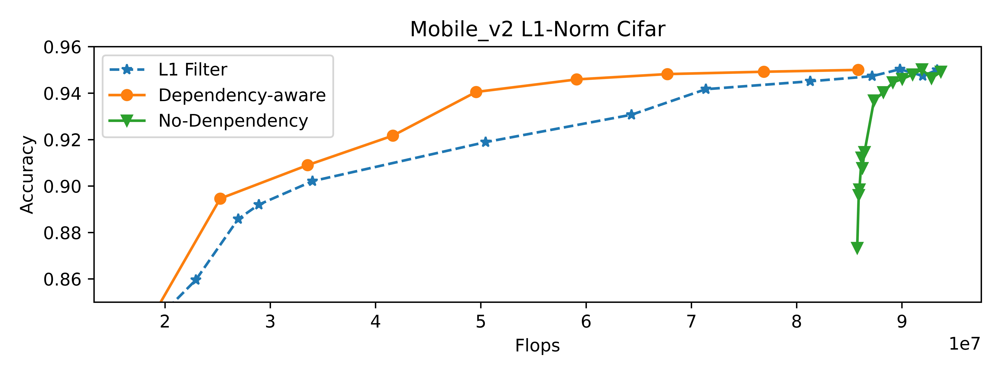

Dependency-aware Mode for Filter Pruning
========================================

Currently, we have several filter pruning algorithm for the convolutional layers: FPGM Pruner, L1Filter Pruner, L2Filter Pruner, Activation APoZ Rank Filter Pruner, Activation Mean Rank Filter Pruner, Taylor FO On Weight Pruner. In these filter pruning algorithms, the pruner will prune each convolutional layer separately. While pruning a convolution layer, the algorithm will quantify the importance of each filter based on some specific rules(such as l1-norm), and prune the less important filters.

As `dependency analysis utils <./CompressionUtils.md>`__ shows, if the output channels of two convolutional layers(conv1, conv2) are added together, then these two conv layers have channel dependency with each other(more details please see `Compression Utils <./CompressionUtils.rst>`__\ ). Take the following figure as an example.

If we prune the first 50% of output channels(filters) for conv1, and prune the last 50% of output channels for conv2. Although both layers have pruned 50% of the filters, the speedup module still needs to add zeros to align the output channels. In this case, we cannot harvest the speed benefit from the model pruning.

 To better gain the speed benefit of the model pruning, we add a dependency-aware mode for the Filter Pruner. In the dependency-aware mode, the pruner prunes the model not only based on the l1 norm of each filter, but also the topology of the whole network architecture.

In the dependency-aware mode(\ ``dependency_aware`` is set ``True``\ ), the pruner will try to prune the same output channels for the layers that have the channel dependencies with each other, as shown in the following figure.

.. image:: ../../img/dependency-aware.jpg
   :target: ../../img/dependency-aware.jpg
   :alt: 

Take the dependency-aware mode of L1Filter Pruner as an example. Specifically, the pruner will calculate the L1 norm (for example) sum of all the layers in the dependency set for each channel. Obviously, the number of channels that can actually be pruned of this dependency set in the end is determined by the minimum sparsity of layers in this dependency set(denoted by ``min_sparsity``\ ). According to the L1 norm sum of each channel, the pruner will prune the same ``min_sparsity`` channels for all the layers. Next, the pruner will additionally prune ``sparsity`` - ``min_sparsity`` channels for each convolutional layer based on its own L1 norm of each channel. For example, suppose the output channels of ``conv1`` , ``conv2`` are added together and the configured sparsities of ``conv1`` and ``conv2`` are 0.3, 0.2 respectively. In this case, the ``dependency-aware pruner`` will 

.. code-block:: bash

   - First, prune the same 20% of channels for `conv1` and `conv2` according to L1 norm sum of `conv1` and `conv2`. 
   - Second, the pruner will additionally prune 10% channels for `conv1` according to the L1 norm of each channel of `conv1`.

In addition, for the convolutional layers that have more than one filter group, ``dependency-aware pruner`` will also try to prune the same number of the channels for each filter group. Overall, this pruner will prune the model according to the L1 norm of each filter and try to meet the topological constrains(channel dependency, etc) to improve the final speed gain after the speedup process. 

In the dependency-aware mode, the pruner will provide a better speed gain from the model pruning.

Usage
-----

In this section, we will show how to enable the dependency-aware mode for the filter pruner. Currently, only the one-shot pruners such as FPGM Pruner, L1Filter Pruner, L2Filter Pruner, Activation APoZ Rank Filter Pruner, Activation Mean Rank Filter Pruner, Taylor FO On Weight Pruner, support the dependency-aware mode.

To enable the dependency-aware mode for ``L1FilterPruner``\ :

.. code-block:: python

   from nni.algorithms.compression.pytorch.pruning import L1FilterPruner
   config_list = [{ 'sparsity': 0.8, 'op_types': ['Conv2d'] }]
   # dummy_input is necessary for the dependency_aware mode
   dummy_input = torch.ones(1, 3, 224, 224).cuda()
   pruner = L1FilterPruner(model, config_list, dependency_aware=True, dummy_input=dummy_input)
   # for L2FilterPruner
   # pruner = L2FilterPruner(model, config_list, dependency_aware=True, dummy_input=dummy_input)
   # for FPGMPruner
   # pruner = FPGMPruner(model, config_list, dependency_aware=True, dummy_input=dummy_input)
   # for ActivationAPoZRankFilterPruner
   # pruner = ActivationAPoZRankFilterPruner(model, config_list, statistics_batch_num=1, , dependency_aware=True, dummy_input=dummy_input)
   # for ActivationMeanRankFilterPruner
   # pruner = ActivationMeanRankFilterPruner(model, config_list, statistics_batch_num=1, dependency_aware=True, dummy_input=dummy_input)
   # for TaylorFOWeightFilterPruner
   # pruner = TaylorFOWeightFilterPruner(model, config_list, statistics_batch_num=1, dependency_aware=True, dummy_input=dummy_input)

   pruner.compress()

Evaluation
----------

In order to compare the performance of the pruner with or without the dependency-aware mode, we use L1FilterPruner to prune the Mobilenet_v2 separately when the dependency-aware mode is turned on and off. To simplify the experiment, we use the uniform pruning which means we allocate the same sparsity for all convolutional layers in the model.
We trained a Mobilenet_v2 model on the cifar10 dataset and prune the model based on this pretrained checkpoint. The following figure shows the accuracy and FLOPs of the model pruned by different pruners.

In the figure, the ``Dependency-aware`` represents the L1FilterPruner with dependency-aware mode enabled. ``L1 Filter`` is the normal ``L1FilterPruner`` without the dependency-aware mode, and the ``No-Dependency`` means  pruner only prunes the layers that has no channel dependency with other layers. As we can see in the figure, when the dependency-aware mode enabled, the pruner can bring higher accuracy under the same Flops.
