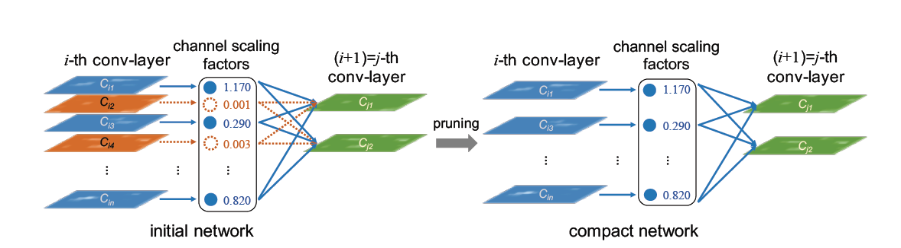
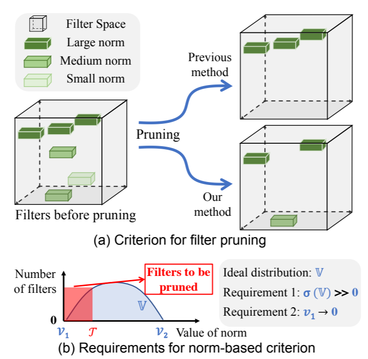
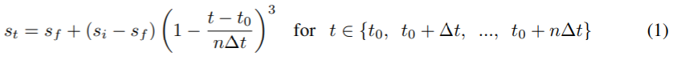
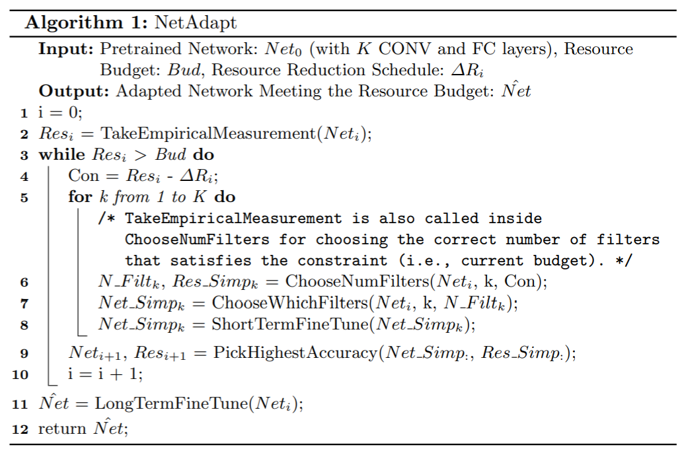
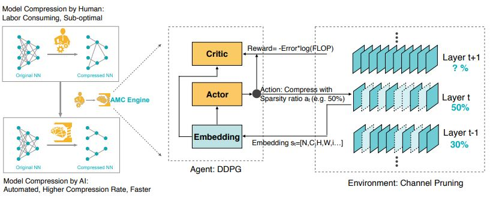
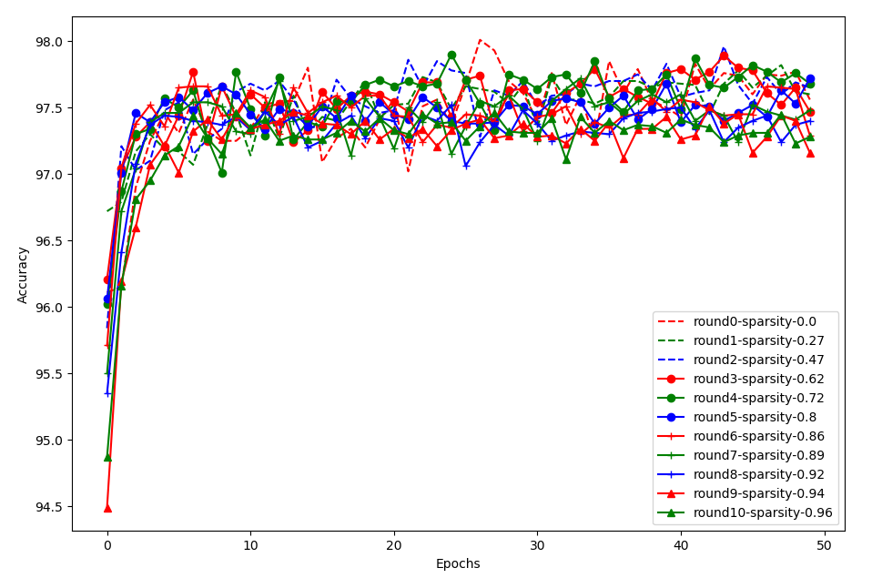

# Supported Pruning Algorithms on NNI

We provide several pruning algorithms that support fine-grained weight pruning and structural filter pruning. **Fine-grained Pruning** generally results in  unstructured models, which need specialized haredware or software to speed up the sparse network. **Filter Pruning** achieves acceleratation by removing the entire filter.  We also provide an algorithm to control the **pruning schedule**.


**Fine-grained Pruning**
* [Level Pruner](#level-pruner)
  
**Filter Pruning**
* [Slim Pruner](#slim-pruner)
* [FPGM Pruner](#fpgm-pruner)
* [L1Filter Pruner](#l1filter-pruner)
* [L2Filter Pruner](#l2filter-pruner)
* [Activation APoZ Rank Filter Pruner](#activationAPoZRankFilter-pruner)
* [Activation Mean Rank Filter Pruner](#activationmeanrankfilter-pruner)
* [Taylor FO On Weight Pruner](#taylorfoweightfilter-pruner)

**Pruning Schedule**
* [AGP Pruner](#agp-pruner)
* [NetAdapt Pruner](#netadapt-pruner)
* [SimulatedAnnealing Pruner](#simulatedannealing-pruner)
* [AutoCompress Pruner](#autocompress-pruner)
* [AMC Pruner](#amc-pruner)
* [Sensitivity Pruner](#sensitivity-pruner)

**Others**
* [ADMM Pruner](#admm-pruner)
* [Lottery Ticket Hypothesis](#lottery-ticket-hypothesis)

## Level Pruner

This is one basic one-shot pruner: you can set a target sparsity level (expressed as a fraction, 0.6 means we will prune 60% of the weight parameters). 

We first sort the weights in the specified layer by their absolute values. And then mask to zero the smallest magnitude weights until the desired sparsity level is reached.

### Usage

Tensorflow code
```python
from nni.algorithms.compression.tensorflow.pruning import LevelPruner
config_list = [{ 'sparsity': 0.8, 'op_types': ['default'] }]
pruner = LevelPruner(model, config_list)
pruner.compress()
```

PyTorch code
```python
from nni.algorithms.compression.pytorch.pruning import LevelPruner
config_list = [{ 'sparsity': 0.8, 'op_types': ['default'] }]
pruner = LevelPruner(model, config_list)
pruner.compress()
```

#### User configuration for Level Pruner

##### PyTorch

```eval_rst
..  autoclass:: nni.algorithms.compression.pytorch.pruning.LevelPruner
```

##### Tensorflow

```eval_rst
..  autoclass:: nni.algorithms.compression.tensorflow.pruning.LevelPruner
```


## Slim Pruner

This is an one-shot pruner, In ['Learning Efficient Convolutional Networks through Network Slimming'](https://arxiv.org/pdf/1708.06519.pdf), authors Zhuang Liu, Jianguo Li, Zhiqiang Shen, Gao Huang, Shoumeng Yan and Changshui Zhang.



> Slim Pruner **prunes channels in the convolution layers by masking corresponding scaling factors in the later BN layers**, L1 regularization on the scaling factors should be applied in batch normalization (BN) layers while training, scaling factors of BN layers are **globally ranked** while pruning, so the sparse model can be automatically found given sparsity.

### Usage

PyTorch code

```python
from nni.algorithms.compression.pytorch.pruning import SlimPruner
config_list = [{ 'sparsity': 0.8, 'op_types': ['BatchNorm2d'] }]
pruner = SlimPruner(model, config_list)
pruner.compress()
```

#### User configuration for Slim Pruner

##### PyTorch

```eval_rst
..  autoclass:: nni.algorithms.compression.pytorch.pruning.SlimPruner
```

### Reproduced Experiment

We implemented one of the experiments in ['Learning Efficient Convolutional Networks through Network Slimming'](https://arxiv.org/pdf/1708.06519.pdf), we pruned $70\%$ channels in the **VGGNet** for CIFAR-10 in the paper, in which $88.5\%$ parameters are pruned. Our experiments results are as follows:

| Model         | Error(paper/ours) | Parameters | Pruned    |
| ------------- | ----------------- | ---------- | --------- |
| VGGNet        | 6.34/6.40     | 20.04M   |           |
| Pruned-VGGNet | 6.20/6.26     | 2.03M    | 88.5% |

The experiments code can be found at [examples/model_compress]( https://github.com/microsoft/nni/tree/v1.9/examples/model_compress/)

***

## FPGM Pruner

This is an one-shot pruner, FPGM Pruner is an implementation of paper [Filter Pruning via Geometric Median for Deep Convolutional Neural Networks Acceleration](https://arxiv.org/pdf/1811.00250.pdf)

FPGMPruner prune filters with the smallest geometric median.

 

>Previous works utilized “smaller-norm-less-important” criterion to prune filters with smaller norm values in a convolutional neural network. In this paper, we analyze this norm-based criterion and point out that its effectiveness depends on two requirements that are not always met: (1) the norm deviation of the filters should be large; (2) the minimum norm of the filters should be small. To solve this problem, we propose a novel filter pruning method, namely Filter Pruning via Geometric Median (FPGM), to compress the model regardless of those two requirements. Unlike previous methods, FPGM compresses CNN models by pruning filters with redundancy, rather than those with “relatively less” importance. 

We also provide a dependency-aware mode for this pruner to get better speedup from the pruning. Please reference [dependency-aware](./DependencyAware.md) for more details.

### Usage

PyTorch code
```python
from nni.algorithms.compression.pytorch.pruning import FPGMPruner
config_list = [{
    'sparsity': 0.5,
    'op_types': ['Conv2d']
}]
pruner = FPGMPruner(model, config_list)
pruner.compress()
```

#### User configuration for FPGM Pruner

##### PyTorch
```eval_rst
..  autoclass:: nni.algorithms.compression.pytorch.pruning.FPGMPruner
```

## L1Filter Pruner

This is an one-shot pruner, In ['PRUNING FILTERS FOR EFFICIENT CONVNETS'](https://arxiv.org/abs/1608.08710), authors Hao Li, Asim Kadav, Igor Durdanovic, Hanan Samet and Hans Peter Graf.


> L1Filter Pruner prunes filters in the **convolution layers**
>
> The procedure of pruning m filters from the ith convolutional layer is as follows:
>
> 1. For each filter , calculate the sum of its absolute kernel weights
> 2. Sort the filters by .
> 3. Prune  filters with the smallest sum values and their corresponding feature maps. The
>      kernels in the next convolutional layer corresponding to the pruned feature maps are also
>        removed.
> 4. A new kernel matrix is created for both the th and th layers, and the remaining kernel
>      weights are copied to the new model.

In addition, we also provide a dependency-aware mode for the L1FilterPruner. For more details about the dependency-aware mode, please reference [dependency-aware mode](./DependencyAware.md).

### Usage

PyTorch code

```python
from nni.algorithms.compression.pytorch.pruning import L1FilterPruner
config_list = [{ 'sparsity': 0.8, 'op_types': ['Conv2d'] }]
pruner = L1FilterPruner(model, config_list)
pruner.compress()
```

#### User configuration for L1Filter Pruner

##### PyTorch
```eval_rst
..  autoclass:: nni.algorithms.compression.pytorch.pruning.L1FilterPruner
```

### Reproduced Experiment

We implemented one of the experiments in ['PRUNING FILTERS FOR EFFICIENT CONVNETS'](https://arxiv.org/abs/1608.08710) with **L1FilterPruner**, we pruned **VGG-16** for CIFAR-10 to **VGG-16-pruned-A** in the paper, in which $64\%$ parameters are pruned. Our experiments results are as follows:

| Model           | Error(paper/ours) | Parameters      | Pruned   |
| --------------- | ----------------- | --------------- | -------- |
| VGG-16          | 6.75/6.49     | 1.5x10^7 |          |
| VGG-16-pruned-A | 6.60/6.47     | 5.4x10^6 | 64.0% |

The experiments code can be found at [examples/model_compress]( https://github.com/microsoft/nni/tree/v1.9/examples/model_compress/)

***

## L2Filter Pruner

This is a structured pruning algorithm that prunes the filters with the smallest L2 norm of the weights. It is implemented as a one-shot pruner.

We also provide a dependency-aware mode for this pruner to get better speedup from the pruning. Please reference [dependency-aware](./DependencyAware.md) for more details.

### Usage

PyTorch code

```python
from nni.algorithms.compression.pytorch.pruning import L2FilterPruner
config_list = [{ 'sparsity': 0.8, 'op_types': ['Conv2d'] }]
pruner = L2FilterPruner(model, config_list)
pruner.compress()
```


### User configuration for L2Filter Pruner

##### PyTorch
```eval_rst
..  autoclass:: nni.algorithms.compression.pytorch.pruning.L2FilterPruner
```
***


## ActivationAPoZRankFilter Pruner

ActivationAPoZRankFilter Pruner is a pruner which prunes the filters with the smallest importance criterion `APoZ` calculated from the output activations of convolution layers to achieve a preset level of network sparsity. The pruning criterion `APoZ` is explained in the paper [Network Trimming: A Data-Driven Neuron Pruning Approach towards Efficient Deep Architectures](https://arxiv.org/abs/1607.03250).

The APoZ is defined as:


We also provide a dependency-aware mode for this pruner to get better speedup from the pruning. Please reference [dependency-aware](./DependencyAware.md) for more details.

### Usage

PyTorch code

```python
from nni.algorithms.compression.pytorch.pruning import ActivationAPoZRankFilterPruner
config_list = [{
    'sparsity': 0.5,
    'op_types': ['Conv2d']
}]
pruner = ActivationAPoZRankFilterPruner(model, config_list, statistics_batch_num=1)
pruner.compress()
```

Note: ActivationAPoZRankFilterPruner is used to prune convolutional layers within deep neural networks, therefore the `op_types` field supports only convolutional layers.

You can view [example](https://github.com/microsoft/nni/blob/v1.9/examples/model_compress/model_prune_torch.py) for more information.


### User configuration for ActivationAPoZRankFilter Pruner

##### PyTorch
```eval_rst
..  autoclass:: nni.algorithms.compression.pytorch.pruning.ActivationAPoZRankFilterPruner
```
***


## ActivationMeanRankFilter Pruner

ActivationMeanRankFilterPruner is a pruner which prunes the filters with the smallest importance criterion `mean activation` calculated from the output activations of convolution layers to achieve a preset level of network sparsity. The pruning criterion `mean activation` is explained in section 2.2 of the paper[Pruning Convolutional Neural Networks for Resource Efficient Inference](https://arxiv.org/abs/1611.06440). Other pruning criteria mentioned in this paper will be supported in future release.

We also provide a dependency-aware mode for this pruner to get better speedup from the pruning. Please reference [dependency-aware](./DependencyAware.md) for more details.

### Usage

PyTorch code

```python
from nni.algorithms.compression.pytorch.pruning import ActivationMeanRankFilterPruner
config_list = [{
    'sparsity': 0.5,
    'op_types': ['Conv2d']
}]
pruner = ActivationMeanRankFilterPruner(model, config_list, statistics_batch_num=1)
pruner.compress()
```

Note: ActivationMeanRankFilterPruner is used to prune convolutional layers within deep neural networks, therefore the `op_types` field supports only convolutional layers.

You can view [example](https://github.com/microsoft/nni/blob/v1.9/examples/model_compress/model_prune_torch.py) for more information.


### User configuration for ActivationMeanRankFilterPruner

##### PyTorch
```eval_rst
..  autoclass:: nni.algorithms.compression.pytorch.pruning.ActivationMeanRankFilterPruner
```
***


## TaylorFOWeightFilter Pruner

TaylorFOWeightFilter Pruner is a pruner which prunes convolutional layers based on estimated importance calculated from the first order taylor expansion on weights to achieve a preset level of network sparsity. The estimated importance of filters is defined as the paper [Importance Estimation for Neural Network Pruning](http://jankautz.com/publications/Importance4NNPruning_CVPR19.pdf). Other pruning criteria mentioned in this paper will be supported in future release.

> 


We also provide a dependency-aware mode for this pruner to get better speedup from the pruning. Please reference [dependency-aware](./DependencyAware.md) for more details.

### Usage

PyTorch code

```python
from nni.algorithms.compression.pytorch.pruning import TaylorFOWeightFilterPruner
config_list = [{
    'sparsity': 0.5,
    'op_types': ['Conv2d']
}]
pruner = TaylorFOWeightFilterPruner(model, config_list, statistics_batch_num=1)
pruner.compress()
```


#### User configuration for TaylorFOWeightFilter Pruner

##### PyTorch
```eval_rst
..  autoclass:: nni.algorithms.compression.pytorch.pruning.TaylorFOWeightFilterPruner
```
***


## AGP Pruner

This is an iterative pruner, In [To prune, or not to prune: exploring the efficacy of pruning for model compression](https://arxiv.org/abs/1710.01878), authors Michael Zhu and Suyog Gupta provide an algorithm to prune the weight gradually.

>We introduce a new automated gradual pruning algorithm in which the sparsity is increased from an initial sparsity value si (usually 0) to a final sparsity value sf over a span of n pruning steps, starting at training step t0 and with pruning frequency ∆t:


>The binary weight masks are updated every ∆t steps as the network is trained to gradually increase the sparsity of the network while allowing the network training steps to recover from any pruning-induced loss in accuracy. In our experience, varying the pruning frequency ∆t between 100 and 1000 training steps had a negligible impact on the final model quality. Once the model achieves the target sparsity sf , the weight masks are no longer updated. The intuition behind this sparsity function in equation (1).

### Usage

You can prune all weight from 0% to 80% sparsity in 10 epoch with the code below.

PyTorch code
```python
from nni.algorithms.compression.pytorch.pruning import AGPPruner
config_list = [{
    'initial_sparsity': 0,
    'final_sparsity': 0.8,
    'start_epoch': 0,
    'end_epoch': 10,
    'frequency': 1,
    'op_types': ['default']
}]

# load a pretrained model or train a model before using a pruner
# model = MyModel()
# model.load_state_dict(torch.load('mycheckpoint.pth'))

# AGP pruner prunes model while fine tuning the model by adding a hook on
# optimizer.step(), so an optimizer is required to prune the model.
optimizer = torch.optim.SGD(model.parameters(), lr=0.001, momentum=0.9, weight_decay=1e-4)

pruner = AGPPruner(model, config_list, optimizer, pruning_algorithm='level')
pruner.compress()
```

AGP pruner uses `LevelPruner` algorithms to prune the weight by default, however you can set `pruning_algorithm` parameter to other values to use other pruning algorithms:
* `level`: LevelPruner
* `slim`: SlimPruner
* `l1`: L1FilterPruner
* `l2`: L2FilterPruner
* `fpgm`: FPGMPruner
* `taylorfo`: TaylorFOWeightFilterPruner
* `apoz`: ActivationAPoZRankFilterPruner
* `mean_activation`: ActivationMeanRankFilterPruner

You should add code below to update epoch number when you finish one epoch in your training code.

PyTorch code
```python
pruner.update_epoch(epoch)
```
You can view [example](https://github.com/microsoft/nni/blob/v1.9/examples/model_compress/model_prune_torch.py) for more information.

#### User configuration for AGP Pruner

##### PyTorch

```eval_rst
..  autoclass:: nni.algorithms.compression.pytorch.pruning.AGPPruner
```

***

## NetAdapt Pruner
NetAdapt allows a user to automatically simplify a pretrained network to meet the resource budget. 
Given the overall sparsity, NetAdapt will automatically generate the sparsities distribution among different layers by iterative pruning.

For more details, please refer to [NetAdapt: Platform-Aware Neural Network Adaptation for Mobile Applications](https://arxiv.org/abs/1804.03230).



#### Usage

PyTorch code

```python
from nni.algorithms.compression.pytorch.pruning import NetAdaptPruner
config_list = [{
    'sparsity': 0.5,
    'op_types': ['Conv2d']
}]
pruner = NetAdaptPruner(model, config_list, short_term_fine_tuner=short_term_fine_tuner, evaluator=evaluator,base_algo='l1', experiment_data_dir='./')
pruner.compress()
```

You can view [example](https://github.com/microsoft/nni/blob/v1.9/examples/model_compress/auto_pruners_torch.py) for more information.

#### User configuration for NetAdapt Pruner

##### PyTorch

```eval_rst
..  autoclass:: nni.algorithms.compression.pytorch.pruning.NetAdaptPruner
```


## SimulatedAnnealing Pruner

We implement a guided heuristic search method, Simulated Annealing (SA) algorithm, with enhancement on guided search based on prior experience. 
The enhanced SA technique is based on the observation that a DNN layer with more number of weights often has a higher degree of model compression with less impact on overall accuracy.

- Randomly initialize a pruning rate distribution (sparsities).
- While current_temperature < stop_temperature:
    1. generate a perturbation to current distribution
    2. Perform fast evaluation on the perturbated distribution
    3. accept the perturbation according to the performance and probability, if not accepted, return to step 1
    4. cool down, current_temperature <- current_temperature * cool_down_rate

For more details, please refer to [AutoCompress: An Automatic DNN Structured Pruning Framework for Ultra-High Compression Rates](https://arxiv.org/abs/1907.03141).

#### Usage

PyTorch code

```python
from nni.algorithms.compression.pytorch.pruning import SimulatedAnnealingPruner
config_list = [{
    'sparsity': 0.5,
    'op_types': ['Conv2d']
}]
pruner = SimulatedAnnealingPruner(model, config_list, evaluator=evaluator, base_algo='l1', cool_down_rate=0.9, experiment_data_dir='./')
pruner.compress()
```

You can view [example](https://github.com/microsoft/nni/blob/v1.9/examples/model_compress/auto_pruners_torch.py) for more information.

#### User configuration for SimulatedAnnealing Pruner

##### PyTorch

```eval_rst
..  autoclass:: nni.algorithms.compression.pytorch.pruning.SimulatedAnnealingPruner
```

            
## AutoCompress Pruner
For each round, AutoCompressPruner prune the model for the same sparsity to achive the overall sparsity:
        1. Generate sparsities distribution using SimulatedAnnealingPruner
        2. Perform ADMM-based structured pruning to generate pruning result for the next round.
           Here we use `speedup` to perform real pruning.

For more details, please refer to [AutoCompress: An Automatic DNN Structured Pruning Framework for Ultra-High Compression Rates](https://arxiv.org/abs/1907.03141).

#### Usage

PyTorch code

```python
from nni.algorithms.compression.pytorch.pruning import ADMMPruner
config_list = [{
        'sparsity': 0.5,
        'op_types': ['Conv2d']
    }]
pruner = AutoCompressPruner(
            model, config_list, trainer=trainer, evaluator=evaluator,
            dummy_input=dummy_input, num_iterations=3, optimize_mode='maximize', base_algo='l1',
            cool_down_rate=0.9, admm_num_iterations=30, admm_training_epochs=5, experiment_data_dir='./')
pruner.compress()
```

You can view [example](https://github.com/microsoft/nni/blob/v1.9/examples/model_compress/auto_pruners_torch.py) for more information.

#### User configuration for AutoCompress Pruner

##### PyTorch

```eval_rst
..  autoclass:: nni.algorithms.compression.pytorch.pruning.AutoCompressPruner
```

## AMC Pruner

AMC pruner leverages reinforcement learning to provide the model compression policy.
This learning-based compression policy outperforms conventional rule-based compression policy by having higher compression ratio,
better preserving the accuracy and freeing human labor.



For more details, please refer to [AMC: AutoML for Model Compression and Acceleration on Mobile Devices](https://arxiv.org/pdf/1802.03494.pdf).


#### Usage

PyTorch code

```python
from nni.algorithms.compression.pytorch.pruning import AMCPruner
config_list = [{
        'op_types': ['Conv2d', 'Linear']
    }]
pruner = AMCPruner(model, config_list, evaluator, val_loader, flops_ratio=0.5)
pruner.compress()
```

You can view [example](https://github.com/microsoft/nni/blob/v1.9/examples/model_compress/amc/) for more information.

#### User configuration for AutoCompress Pruner

##### PyTorch

```eval_rst
..  autoclass:: nni.algorithms.compression.pytorch.pruning.AMCPruner
```

### Reproduced Experiment

We implemented one of the experiments in [AMC: AutoML for Model Compression and Acceleration on Mobile Devices](https://arxiv.org/pdf/1802.03494.pdf), we pruned **MobileNet** to 50% FLOPS for ImageNet in the paper. Our experiments results are as follows:

| Model         | Top 1 acc.(paper/ours) | Top 5 acc. (paper/ours) | FLOPS |
| ------------- | --------------| -------------- | ----- |
| MobileNet     | 70.5% / 69.9% | 89.3% / 89.1%  | 50%   |

The experiments code can be found at [examples/model_compress]( https://github.com/microsoft/nni/tree/v1.9/examples/model_compress/amc/)

## ADMM Pruner
Alternating Direction Method of Multipliers (ADMM) is a mathematical optimization technique,
by decomposing the original nonconvex problem into two subproblems that can be solved iteratively. In weight pruning problem, these two subproblems are solved via 1) gradient descent algorithm and 2) Euclidean projection respectively. 

During the process of solving these two subproblems, the weights of the original model will be changed. An one-shot pruner will then be applied to prune the model according to the config list given.

This solution framework applies both to non-structured and different variations of structured pruning schemes.

For more details, please refer to [A Systematic DNN Weight Pruning Framework using Alternating Direction Method of Multipliers](https://arxiv.org/abs/1804.03294).

#### Usage

PyTorch code

```python
from nni.algorithms.compression.pytorch.pruning import ADMMPruner
config_list = [{
            'sparsity': 0.8,
            'op_types': ['Conv2d'],
            'op_names': ['conv1']
        }, {
            'sparsity': 0.92,
            'op_types': ['Conv2d'],
            'op_names': ['conv2']
        }]
pruner = ADMMPruner(model, config_list, trainer=trainer, num_iterations=30, epochs=5)
pruner.compress()
```

You can view [example](https://github.com/microsoft/nni/blob/v1.9/examples/model_compress/auto_pruners_torch.py) for more information.

#### User configuration for ADMM Pruner

##### PyTorch

```eval_rst
..  autoclass:: nni.algorithms.compression.pytorch.pruning.ADMMPruner
```


## Lottery Ticket Hypothesis
[The Lottery Ticket Hypothesis: Finding Sparse, Trainable Neural Networks](https://arxiv.org/abs/1803.03635), authors Jonathan Frankle and Michael Carbin,provides comprehensive measurement and analysis, and articulate the *lottery ticket hypothesis*: dense, randomly-initialized, feed-forward networks contain subnetworks (*winning tickets*) that -- when trained in isolation -- reach test accuracy comparable to the original network in a similar number of iterations.

In this paper, the authors use the following process to prune a model, called *iterative prunning*:
>1. Randomly initialize a neural network f(x;theta_0) (where theta_0 follows D_{theta}).
>2. Train the network for j iterations, arriving at parameters theta_j.
>3. Prune p% of the parameters in theta_j, creating a mask m.
>4. Reset the remaining parameters to their values in theta_0, creating the winning ticket f(x;m*theta_0).
>5. Repeat step 2, 3, and 4.

If the configured final sparsity is P (e.g., 0.8) and there are n times iterative pruning, each iterative pruning prunes 1-(1-P)^(1/n) of the weights that survive the previous round.

### Usage

PyTorch code
```python
from nni.algorithms.compression.pytorch.pruning import LotteryTicketPruner
config_list = [{
    'prune_iterations': 5,
    'sparsity': 0.8,
    'op_types': ['default']
}]
pruner = LotteryTicketPruner(model, config_list, optimizer)
pruner.compress()
for _ in pruner.get_prune_iterations():
    pruner.prune_iteration_start()
    for epoch in range(epoch_num):
        ...
```

The above configuration means that there are 5 times of iterative pruning. As the 5 times iterative pruning are executed in the same run, LotteryTicketPruner needs `model` and `optimizer` (**Note that should add `lr_scheduler` if used**) to reset their states every time a new prune iteration starts. Please use `get_prune_iterations` to get the pruning iterations, and invoke `prune_iteration_start` at the beginning of each iteration. `epoch_num` is better to be large enough for model convergence, because the hypothesis is that the performance (accuracy) got in latter rounds with high sparsity could be comparable with that got in the first round.


*Tensorflow version will be supported later.*

#### User configuration for LotteryTicket Pruner

##### PyTorch

```eval_rst
..  autoclass:: nni.algorithms.compression.pytorch.pruning.LotteryTicketPruner
```

### Reproduced Experiment

We try to reproduce the experiment result of the fully connected network on MNIST using the same configuration as in the paper. The code can be referred [here](https://github.com/microsoft/nni/tree/v1.9/examples/model_compress/lottery_torch_mnist_fc.py). In this experiment, we prune 10 times, for each pruning we train the pruned model for 50 epochs.



The above figure shows the result of the fully connected network. `round0-sparsity-0.0` is the performance without pruning. Consistent with the paper, pruning around 80% also obtain similar performance compared to non-pruning, and converges a little faster. If pruning too much, e.g., larger than 94%, the accuracy becomes lower and convergence becomes a little slower. A little different from the paper, the trend of the data in the paper is relatively more clear.


## Sensitivity Pruner
For each round, SensitivityPruner prunes the model based on the sensitivity to the accuracy of each layer until meeting the final configured sparsity of the whole model:
        1. Analyze the sensitivity of each layer in the current state of the model.
        2. Prune each layer according to the sensitivity.

For more details, please refer to [Learning both Weights and Connections for Efficient Neural Networks ](https://arxiv.org/abs/1506.02626).

#### Usage

PyTorch code

```python
from nni.algorithms.compression.pytorch.pruning import SensitivityPruner
config_list = [{
        'sparsity': 0.5,
        'op_types': ['Conv2d']
    }]
pruner = SensitivityPruner(model, config_list, finetuner=fine_tuner, evaluator=evaluator)
# eval_args and finetune_args are the parameters passed to the evaluator and finetuner respectively
pruner.compress(eval_args=[model], finetune_args=[model])
```


#### User configuration for Sensitivity Pruner

##### PyTorch

```eval_rst
..  autoclass:: nni.algorithms.compression.pytorch.pruning.SensitivityPruner
```
