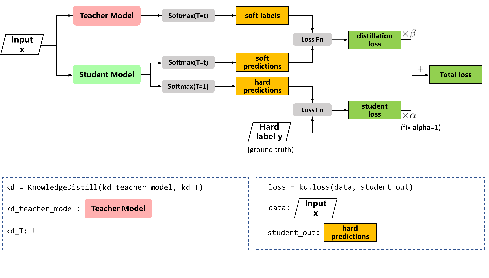

Knowledge Distillation on NNI Compressor
===

## KnowledgeDistill

Knowledge distillation support while fine-tuning the compressed model, in [Distilling the Knowledge in a Neural Network](https://arxiv.org/abs/1503.02531),  the compressed model is trained to mimic a pre-trained, larger model.  This training setting is also referred to as "teacher-student",  where the large model is the teacher and the small model is the student.



### Usage

PyTorch code

```python
from nni.compression.torch import KnowledgeDistill
kd = KnowledgeDistill(kd_teacher_model, kd_T=5, kd_beta=1)

for batch_idx, (data, target) in enumerate(train_loader):
    data, target = data.to(device), target.to(device)
    optimizer.zero_grad()
    output = model(data)
    loss = F.cross_entropy(output, target)
    # you only to add the following line to fine-tune with knowledge distillation
    loss = kd.loss(student_loss=loss, data=data, student_out=output)
    loss.backward()
```

#### User configuration for Level Pruner
* **kd_teacher_model:** The pre-trained teacher model 
* **kd_T:** Temperature for smoothing teacher model's output
* **kd_beta:** Weight of knowledge distillation loss relative to the training loss
