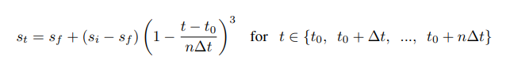

Pruner on NNI Compressor
===
## LevelPruner

This is one basic pruner: you can set a target sparsity level(expressed as a fraction, 0.6 means we will prune 60%). 

We first sort the weights in the specified layer by their absolute values. And then mask to zero the smallest magnitude weights until the desired sparsity level is reached.

### Usage

Tensorflow code
```
pruner = nni.compressors.tf_compressor.LevelPruner([{'sparsity':0.8,'support_type': 'default'}])
pruner(model_graph)
```

Pytorch code
```
pruner = nni.compressors.torch_compressor.LevelPruner([{'sparsity':0.8,'support_type': 'default'}])
pruner(model)
```

***

## AGPruner
In [To prune, or not to prune: exploring the efficacy of pruning for model compression](https://arxiv.org/abs/1710.01878), authors Michael Zhu and Suyog Gupta provide an algorithm to prune the weight gradually.

>We introduce a new automated gradual pruning algorithm in which the sparsity is increased from an initial sparsity value si (usually 0) to a final sparsity value sf over a span of n pruning steps, starting at training step t0 and with pruning frequency ∆t:

>The binary weight masks are updated every ∆t steps as the network is trained to gradually increase the sparsity of the network while allowing the network training steps to recover from any pruning-induced loss in accuracy. In our experience, varying the pruning frequency ∆t between 100 and 1000 training steps had a negligible impact on the final model quality. Once the model achieves the target sparsity sf , the weight masks are no longer updated. The intuition behind this sparsity function in equation

### Usage
You can prune all weight from %0 to 80% sparsity in 10 epoch with the code below.

First, you should import pruner and add mask to model.

Tensorflow code
```
from nni.compressors.tfCompressor import AGPruner
pruner = AGPruner(initial_sparsity=0, final_sparsity=0.8, start_epoch=1, end_epoch=10, frequency=1)
pruner(tf.get_default_graph())
```
Pytorch code
```
from nni.compressors.torchCompressor import AGPruner
pruner = AGPruner(initial_sparsity=0, final_sparsity=0.8, start_epoch=1, end_epoch=10, frequency=1)
pruner(model)
```

Second, you should add code below to update epoch number when you finish one epoch in your training code.

Tensorflow code 
```
pruner.update_epoch(epoch, sess)
```
Pytorch code
```
pruner.update_epoch(epoch)
```
You can view example for more information
***

## SensitivityPruner
In [Learning both Weights and Connections for Efficient Neural Networks](https://arxiv.org/abs/1506.02626), author Song Han and provide an algorithm to find the sensitivity of each layer and set the pruning threshold to each layer.

>We used the sensitivity results to find each layer’s threshold: for example, the smallest threshold was applied to the most sensitive layer, which is the first convolutional layer... The pruning threshold is chosen as a quality parameter multiplied by the standard deviation of a layer’s weights

### Usage
You can prune weight step by step and reach one target sparsity by SensitivityPruner with the code below.

Tensorflow code
```
from nni.compressors.tfCompressor import SensitivityPruner

pruner = SensitivityPruner(sparsity = 0.8)
pruner(tf.get_default_graph())
```
Pytorch code
```
from nni.compressors.torchCompressor import SensitivityPruner

pruner = SensitivityPruner(sparsity = 0.8)
pruner(model)
```
Like AGPruner, you should update mask information every epoch by adding code below

Tensorflow code 
```
pruner.update_epoch(epoch, sess)
```
Pytorch code
```
pruner.update_epoch(epoch)
```
You can view example for more information
***
