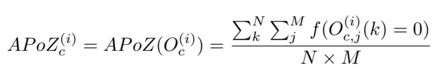
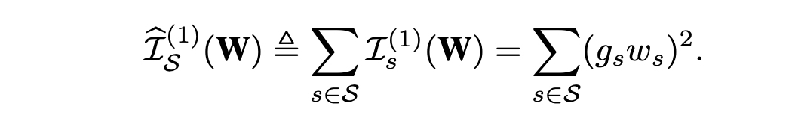

# Supported Pruning Algorithms on NNI

We provide several pruning algorithms that support fine-grained weight pruning and structural filter pruning. **Weight pruning** generally results in  unstructured models, which need specialized haredware or software to speed up the sparse network. **Filter Pruning** achieves acceleratation by removing the entire filter.  We also provide an algorithm to control the **pruning schedule**.


**Weight Pruning**
* [Level Pruner](#level-pruner)
* [Lottery Ticket Hypothesis](#lottery-ticket-hypothesis)
  
**Filter Pruning**
* [Slim Pruner](#slim-pruner)
* [Filter Pruners with Weight Rank](#weightrankfilterpruner)
    * [FPGM Pruner](#fpgm-pruner)
    * [L1Filter Pruner](#l1filter-pruner)
    * [L2Filter Pruner](#l2filter-pruner)
* [Filter Pruners with Activation Rank](#activationrankfilterpruner)
    * [APoZ Rank Pruner](#activationapozrankfilterpruner)
    * [Activation Mean Rank Pruner](#activationmeanrankfilterpruner)
* [Filter Pruners with Gradient Rank](#gradientrankfilterpruner)
    * [Taylor FO On Weight Pruner](#taylorfoweightfilterpruner)
* [ADMM Pruner](#admm-pruner)

  
**Pruning Schedule**
* [AGP Pruner](#agp-pruner)
* [NetAdapt Pruner](#netadapt-pruner)
* [SimulatedAnnealing Pruner](#simulatedannealing-pruner)
* [AutoCompress Pruner](#autocompress-pruner)

## Level Pruner

This is one basic one-shot pruner: you can set a target sparsity level (expressed as a fraction, 0.6 means we will prune 60%). 

We first sort the weights in the specified layer by their absolute values. And then mask to zero the smallest magnitude weights until the desired sparsity level is reached.

### Usage

Tensorflow code
```python
from nni.compression.tensorflow import LevelPruner
config_list = [{ 'sparsity': 0.8, 'op_types': ['default'] }]
pruner = LevelPruner(model_graph, config_list)
pruner.compress()
```

PyTorch code
```python
from nni.compression.torch import LevelPruner
config_list = [{ 'sparsity': 0.8, 'op_types': ['default'] }]
pruner = LevelPruner(model, config_list)
pruner.compress()
```

#### User configuration for Level Pruner
* **sparsity:** This is to specify the sparsity operations to be compressed to

***

## AGP Pruner
This is an iterative pruner, In [To prune, or not to prune: exploring the efficacy of pruning for model compression](https://arxiv.org/abs/1710.01878), authors Michael Zhu and Suyog Gupta provide an algorithm to prune the weight gradually.

>We introduce a new automated gradual pruning algorithm in which the sparsity is increased from an initial sparsity value si (usually 0) to a final sparsity value sf over a span of n pruning steps, starting at training step t0 and with pruning frequency ∆t:

>The binary weight masks are updated every ∆t steps as the network is trained to gradually increase the sparsity of the network while allowing the network training steps to recover from any pruning-induced loss in accuracy. In our experience, varying the pruning frequency ∆t between 100 and 1000 training steps had a negligible impact on the final model quality. Once the model achieves the target sparsity sf , the weight masks are no longer updated. The intuition behind this sparsity function in equation

### Usage
You can prune all weight from 0% to 80% sparsity in 10 epoch with the code below.

Tensorflow code
```python
from nni.compression.tensorflow import AGP_Pruner
config_list = [{
    'initial_sparsity': 0,
    'final_sparsity': 0.8,
    'start_epoch': 0,
    'end_epoch': 10,
    'frequency': 1,
    'op_types': 'default'
}]
pruner = AGP_Pruner(tf.get_default_graph(), config_list)
pruner.compress()
```
PyTorch code
```python
from nni.compression.torch import AGP_Pruner
config_list = [{
    'initial_sparsity': 0,
    'final_sparsity': 0.8,
    'start_epoch': 0,
    'end_epoch': 10,
    'frequency': 1,
    'op_types': ['default']
}]
pruner = AGP_Pruner(model, config_list, pruning_algorithm='level')
pruner.compress()
```

AGP pruner uses `LevelPruner` algorithms to prune the weight by default, however you can set `pruning_algorithm` parameter to other values to use other pruning algorithms:
* `level`: LevelPruner
* `slim`: SlimPruner
* `l1`: L1FilterPruner
* `l2`: L2FilterPruner
* `fpgm`: FPGMPruner
* `taylorfo`: TaylorFOWeightFilterPruner
* `apoz`: ActivationAPoZRankFilterPruner
* `mean_activation`: ActivationMeanRankFilterPruner

You should add code below to update epoch number when you finish one epoch in your training code.

Tensorflow code 
```python
pruner.update_epoch(epoch, sess)
```
PyTorch code
```python
pruner.update_epoch(epoch)
```
You can view example for more information

#### User configuration for AGP Pruner
* **initial_sparsity:** This is to specify the sparsity when compressor starts to compress
* **final_sparsity:** This is to specify the sparsity when compressor finishes to compress
* **start_epoch:** This is to specify the epoch number when compressor starts to compress, default start from epoch 0
* **end_epoch:** This is to specify the epoch number when compressor finishes to compress
* **frequency:** This is to specify every *frequency* number epochs compressor compress once, default frequency=1

***

## Lottery Ticket Hypothesis
[The Lottery Ticket Hypothesis: Finding Sparse, Trainable Neural Networks](https://arxiv.org/abs/1803.03635), authors Jonathan Frankle and Michael Carbin,provides comprehensive measurement and analysis, and articulate the *lottery ticket hypothesis*: dense, randomly-initialized, feed-forward networks contain subnetworks (*winning tickets*) that -- when trained in isolation -- reach test accuracy comparable to the original network in a similar number of iterations.

In this paper, the authors use the following process to prune a model, called *iterative prunning*:
>1. Randomly initialize a neural network f(x;theta_0) (where theta_0 follows D_{theta}).
>2. Train the network for j iterations, arriving at parameters theta_j.
>3. Prune p% of the parameters in theta_j, creating a mask m.
>4. Reset the remaining parameters to their values in theta_0, creating the winning ticket f(x;m*theta_0).
>5. Repeat step 2, 3, and 4.

If the configured final sparsity is P (e.g., 0.8) and there are n times iterative pruning, each iterative pruning prunes 1-(1-P)^(1/n) of the weights that survive the previous round.

### Usage

PyTorch code
```python
from nni.compression.torch import LotteryTicketPruner
config_list = [{
    'prune_iterations': 5,
    'sparsity': 0.8,
    'op_types': ['default']
}]
pruner = LotteryTicketPruner(model, config_list, optimizer)
pruner.compress()
for _ in pruner.get_prune_iterations():
    pruner.prune_iteration_start()
    for epoch in range(epoch_num):
        ...
```

The above configuration means that there are 5 times of iterative pruning. As the 5 times iterative pruning are executed in the same run, LotteryTicketPruner needs `model` and `optimizer` (**Note that should add `lr_scheduler` if used**) to reset their states every time a new prune iteration starts. Please use `get_prune_iterations` to get the pruning iterations, and invoke `prune_iteration_start` at the beginning of each iteration. `epoch_num` is better to be large enough for model convergence, because the hypothesis is that the performance (accuracy) got in latter rounds with high sparsity could be comparable with that got in the first round.


*Tensorflow version will be supported later.*

#### User configuration for LotteryTicketPruner

* **prune_iterations:** The number of rounds for the iterative pruning, i.e., the number of iterative pruning.
* **sparsity:** The final sparsity when the compression is done.

### Reproduced Experiment

We try to reproduce the experiment result of the fully connected network on MNIST using the same configuration as in the paper. The code can be referred [here](https://github.com/microsoft/nni/tree/master/examples/model_compress/lottery_torch_mnist_fc.py). In this experiment, we prune 10 times, for each pruning we train the pruned model for 50 epochs.


The above figure shows the result of the fully connected network. `round0-sparsity-0.0` is the performance without pruning. Consistent with the paper, pruning around 80% also obtain similar performance compared to non-pruning, and converges a little faster. If pruning too much, e.g., larger than 94%, the accuracy becomes lower and convergence becomes a little slower. A little different from the paper, the trend of the data in the paper is relatively more clear.

***

## Slim Pruner

This is an one-shot pruner, In ['Learning Efficient Convolutional Networks through Network Slimming'](https://arxiv.org/pdf/1708.06519.pdf), authors Zhuang Liu, Jianguo Li, Zhiqiang Shen, Gao Huang, Shoumeng Yan and Changshui Zhang.


> Slim Pruner **prunes channels in the convolution layers by masking corresponding scaling factors in the later BN layers**, L1 regularization on the scaling factors should be applied in batch normalization (BN) layers while training, scaling factors of BN layers are **globally ranked** while pruning, so the sparse model can be automatically found given sparsity.

### Usage

PyTorch code

```python
from nni.compression.torch import SlimPruner
config_list = [{ 'sparsity': 0.8, 'op_types': ['BatchNorm2d'] }]
pruner = SlimPruner(model, config_list)
pruner.compress()
```

#### User configuration for Slim Pruner

- **sparsity:** This is to specify the sparsity operations to be compressed to
- **op_types:** Only BatchNorm2d is supported in Slim Pruner

### Reproduced Experiment

We implemented one of the experiments in ['Learning Efficient Convolutional Networks through Network Slimming'](https://arxiv.org/pdf/1708.06519.pdf), we pruned $70\%$ channels in the **VGGNet** for CIFAR-10 in the paper, in which $88.5\%$ parameters are pruned. Our experiments results are as follows:

| Model         | Error(paper/ours) | Parameters | Pruned    |
| ------------- | ----------------- | ---------- | --------- |
| VGGNet        | 6.34/6.40     | 20.04M   |           |
| Pruned-VGGNet | 6.20/6.26     | 2.03M    | 88.5% |

The experiments code can be found at [examples/model_compress]( https://github.com/microsoft/nni/tree/master/examples/model_compress/)

***

## WeightRankFilterPruner
WeightRankFilterPruner is a series of pruners which prune the filters with the smallest importance criterion calculated from the weights in convolution layers to achieve a preset level of network sparsity

### FPGM Pruner

This is an one-shot pruner, FPGM Pruner is an implementation of paper [Filter Pruning via Geometric Median for Deep Convolutional Neural Networks Acceleration](https://arxiv.org/pdf/1811.00250.pdf)

FPGMPruner prune filters with the smallest geometric median

 

>Previous works utilized “smaller-norm-less-important” criterion to prune filters with smaller norm values in a convolutional neural network. In this paper, we analyze this norm-based criterion and point out that its effectiveness depends on two requirements that are not always met: (1) the norm deviation of the filters should be large; (2) the minimum norm of the filters should be small. To solve this problem, we propose a novel filter pruning method, namely Filter Pruning via Geometric Median (FPGM), to compress the model regardless of those two requirements. Unlike previous methods, FPGM compresses CNN models by pruning filters with redundancy, rather than those with “relatively less” importance.

#### Usage

Tensorflow code
```python
from nni.compression.tensorflow import FPGMPruner
config_list = [{
    'sparsity': 0.5,
    'op_types': ['Conv2D']
}]
pruner = FPGMPruner(model, config_list)
pruner.compress()
```
PyTorch code
```python
from nni.compression.torch import FPGMPruner
config_list = [{
    'sparsity': 0.5,
    'op_types': ['Conv2d']
}]
pruner = FPGMPruner(model, config_list)
pruner.compress()
```
Note: FPGM Pruner is used to prune convolutional layers within deep neural networks, therefore the `op_types` field supports only convolutional layers.

You should add code below to update epoch number at beginning of each epoch.

Tensorflow code
```python
pruner.update_epoch(epoch, sess)
```
PyTorch code
```python
pruner.update_epoch(epoch)
```
You can view example for more information

#### User configuration for FPGM Pruner
* **sparsity:** How much percentage of convolutional filters are to be pruned.

***

### L1Filter Pruner

This is an one-shot pruner, In ['PRUNING FILTERS FOR EFFICIENT CONVNETS'](https://arxiv.org/abs/1608.08710), authors Hao Li, Asim Kadav, Igor Durdanovic, Hanan Samet and Hans Peter Graf.


> L1Filter Pruner prunes filters in the **convolution layers**
>
> The procedure of pruning m filters from the ith convolutional layer is as follows:
>
> 1. For each filter , calculate the sum of its absolute kernel weights
> 2. Sort the filters by .
> 3. Prune  filters with the smallest sum values and their corresponding feature maps. The
>      kernels in the next convolutional layer corresponding to the pruned feature maps are also
>        removed.
> 4. A new kernel matrix is created for both the th and th layers, and the remaining kernel
>      weights are copied to the new model.

#### Usage

PyTorch code

```python
from nni.compression.torch import L1FilterPruner
config_list = [{ 'sparsity': 0.8, 'op_types': ['Conv2d'] }]
pruner = L1FilterPruner(model, config_list)
pruner.compress()
```

#### User configuration for L1Filter Pruner

- **sparsity:** This is to specify the sparsity operations to be compressed to
- **op_types:** Only Conv1d and Conv2d is supported in L1Filter Pruner

#### Reproduced Experiment

We implemented one of the experiments in ['PRUNING FILTERS FOR EFFICIENT CONVNETS'](https://arxiv.org/abs/1608.08710) with **L1FilterPruner**, we pruned **VGG-16** for CIFAR-10 to **VGG-16-pruned-A** in the paper, in which $64\%$ parameters are pruned. Our experiments results are as follows:

| Model           | Error(paper/ours) | Parameters      | Pruned   |
| --------------- | ----------------- | --------------- | -------- |
| VGG-16          | 6.75/6.49     | 1.5x10^7 |          |
| VGG-16-pruned-A | 6.60/6.47     | 5.4x10^6 | 64.0% |

The experiments code can be found at [examples/model_compress]( https://github.com/microsoft/nni/tree/master/examples/model_compress/)

***

### L2Filter Pruner

This is a structured pruning algorithm that prunes the filters with the smallest L2 norm of the weights. It is implemented as a one-shot pruner.

#### Usage

PyTorch code

```python
from nni.compression.torch import L2FilterPruner
config_list = [{ 'sparsity': 0.8, 'op_types': ['Conv2d'] }]
pruner = L2FilterPruner(model, config_list)
pruner.compress()
```

#### User configuration for L2Filter Pruner

- **sparsity:** This is to specify the sparsity operations to be compressed to
- **op_types:** Only Conv1d and Conv2d is supported in L2Filter Pruner

***

## ActivationRankFilterPruner
ActivationRankFilterPruner is a series of pruners which prune the filters with the smallest importance criterion calculated from the output activations of convolution layers to achieve a preset level of network sparsity.

### ActivationAPoZRankFilterPruner

We implemented it as a one-shot pruner, it prunes convolutional layers based on the criterion `APoZ` which is explained in the paper [Network Trimming: A Data-Driven Neuron Pruning Approach towards Efficient Deep Architectures](https://arxiv.org/abs/1607.03250). Iterative pruning based on `APoZ` will be supported in future release.

The APoZ is defined as:



#### Usage

PyTorch code

```python
from nni.compression.torch import ActivationAPoZRankFilterPruner
config_list = [{
    'sparsity': 0.5,
    'op_types': ['Conv2d']
}]
pruner = ActivationAPoZRankFilterPruner(model, config_list, statistics_batch_num=1)
pruner.compress()
```

Note: ActivationAPoZRankFilterPruner is used to prune convolutional layers within deep neural networks, therefore the `op_types` field supports only convolutional layers.

You can view example for more information

#### User configuration for ActivationAPoZRankFilterPruner

- **sparsity:** How much percentage of convolutional filters are to be pruned.
- **op_types:** Only Conv2d is supported in ActivationAPoZRankFilterPruner

***

### ActivationMeanRankFilterPruner

We implemented it as a one-shot pruner, it prunes convolutional layers based on the criterion `mean activation` which is explained in section 2.2 of the paper[Pruning Convolutional Neural Networks for Resource Efficient Inference](https://arxiv.org/abs/1611.06440). Other pruning criteria mentioned in this paper will be supported in future release.

#### Usage

PyTorch code

```python
from nni.compression.torch import ActivationMeanRankFilterPruner
config_list = [{
    'sparsity': 0.5,
    'op_types': ['Conv2d']
}]
pruner = ActivationMeanRankFilterPruner(model, config_list)
pruner.compress()
```

Note: ActivationMeanRankFilterPruner is used to prune convolutional layers within deep neural networks, therefore the `op_types` field supports only convolutional layers.

You can view example for more information

#### User configuration for ActivationMeanRankFilterPruner

- **sparsity:** How much percentage of convolutional filters are to be pruned.
- **op_types:** Only Conv2d is supported in ActivationMeanRankFilterPruner.

***

## GradientRankFilterPruner

GradientRankFilterPruner is a series of pruners which prune the filters with the smallest importance criterion calculated from the gradients of convolution layers to achieve a preset level of network sparsity.

### TaylorFOWeightFilterPruner

We implemented it as a one-shot pruner, it prunes convolutional layers based on the first order taylor expansion on weights. The estimated importance of filters is defined as the paper [Importance Estimation for Neural Network Pruning](http://jankautz.com/publications/Importance4NNPruning_CVPR19.pdf). Other pruning criteria mentioned in this paper will be supported in future release.

> 



#### Usage

PyTorch code

```python
from nni.compression.torch import TaylorFOWeightFilterPruner
config_list = [{
    'sparsity': 0.5,
    'op_types': ['Conv2d']
}]
pruner = TaylorFOWeightFilterPruner(model, config_list, optimizer)
pruner.compress()
```

You can view example for more information

#### User configuration for GradientWeightSumFilterPruner

- **sparsity:** How much percentage of convolutional filters are to be pruned.
- **op_types:** Currently only Conv2d is supported in TaylorFOWeightFilterPruner.


## NetAdapt Pruner
NetAdapt allows a user to automatically simplify a pretrained network to meet the resource budget. 
Given the overall sparsity, NetAdapt will automatically generate the sparsities distribution among different layers by iterative pruning.

For more details, please refer to [NetAdapt: Platform-Aware Neural Network Adaptation for Mobile Applications](https://arxiv.org/abs/1804.03230).


#### Usage

PyTorch code

```python
from nni.compression.torch import NetAdaptPruner
config_list = [{
    'sparsity': 0.5,
    'op_types': ['Conv2d']
}]
pruner = NetAdaptPruner(model, config_list, short_term_fine_tuner=short_term_fine_tuner, evaluator=evaluator,base_algo='l1', experiment_data_dir='./')
pruner.compress()
```

You can view [example](https://github.com/microsoft/nni/blob/master/examples/model_compress/auto_pruners_torch.py) for more information.

#### User configuration for NetAdapt Pruner

- **sparsity:** The target overall sparsity.
- **op_types:** The operation type to prune. If `base_algo` is `l1` or `l2`, then only `Conv2d` is supported as `op_types`.
- **short_term_fine_tuner:** Function to short-term fine tune the masked model.
This function should include `model` as the only parameter, and fine tune the model for a short term after each pruning iteration.
- **evaluator:** Function to evaluate the masked model. This function should include `model` as the only parameter, and returns a scalar value.
- **optimize_mode:** Optimize mode, `maximize` or `minimize`, by default `maximize`.
- **base_algo:** Base pruning algorithm. `level`, `l1` or `l2`, by default `l1`.
- **sparsity_per_iteration:** The sparsity to prune in each iteration. NetAdapt Pruner prune the model by the same level in each iteration to meet the resource budget progressively.
- **experiment_data_dir:** PATH to save experiment data, including the config_list generated for the base pruning algorithm and the performance of the pruned model.


## SimulatedAnnealing Pruner

We implement a guided heuristic search method, Simulated Annealing (SA) algorithm, with enhancement on guided search based on prior experience. 
The enhanced SA technique is based on the observation that a DNN layer with more number of weights often has a higher degree of model compression with less impact on overall accuracy.

- Randomly initialize a pruning rate distribution (sparsities).
- While current_temperature < stop_temperature:
    1. generate a perturbation to current distribution
    2. Perform fast evaluation on the perturbated distribution
    3. accept the perturbation according to the performance and probability, if not accepted, return to step 1
    4. cool down, current_temperature <- current_temperature * cool_down_rate

For more details, please refer to [AutoCompress: An Automatic DNN Structured Pruning Framework for Ultra-High Compression Rates](https://arxiv.org/abs/1907.03141).

#### Usage

PyTorch code

```python
from nni.compression.torch import SimulatedAnnealingPruner
config_list = [{
    'sparsity': 0.5,
    'op_types': ['Conv2d']
}]
pruner = SimulatedAnnealingPruner(model, config_list, evaluator=evaluator, base_algo='l1', cool_down_rate=0.9, experiment_data_dir='./')
pruner.compress()
```

You can view [example](https://github.com/microsoft/nni/blob/master/examples/model_compress/auto_pruners_torch.py) for more information.

#### User configuration for SimulatedAnnealing Pruner

- **sparsity:** The target overall sparsity.
- **op_types:** The operation type to prune. If `base_algo` is `l1` or `l2`, then only `Conv2d` is supported as `op_types`.
- **evaluator:** Function to evaluate the masked model. This function should include `model` as the only parameter, and returns a scalar value.
- **optimize_mode:** Optimize mode, `maximize` or `minimize`, by default `maximize`.
- **base_algo:** Base pruning algorithm. `level`, `l1` or `l2`, by default `l1`.
- **start_temperature:** Simualated Annealing related parameter.
- **stop_temperature:** Simualated Annealing related parameter.
- **cool_down_rate:** Simualated Annealing related parameter.
- **perturbation_magnitude:** Initial perturbation magnitude to the sparsities. The magnitude decreases with current temperature.
- **experiment_data_dir:** PATH to save experiment data, including the config_list generated for the base pruning algorithm, the performance of the pruned model and the pruning history.


## ADMM Pruner
Alternating Direction Method of Multipliers (ADMM) is a mathematical optimization technique,
by decomposing the original nonconvex problem into two subproblems that can be solved iteratively. In weight pruning problem, these two subproblems are solved via 1) gradient descent algorithm and 2) Euclidean projection respectively. This solution framework applies both to non-structured and different variations of structured pruning schemes.

For more details, please refer to [A Systematic DNN Weight Pruning Framework using Alternating Direction Method of Multipliers](https://arxiv.org/abs/1804.03294).

#### Usage

PyTorch code

```python
from nni.compression.torch import ADMMPruner
config_list = [{
            'sparsity': 0.8,
            'op_types': ['Conv2d'],
            'op_names': ['conv1']
        }, {
            'sparsity': 0.92,
            'op_types': ['Conv2d'],
            'op_names': ['conv2']
        }]
pruner = ADMMPruner(model, config_list, trainer=trainer, num_iterations=30, epochs=5)
pruner.compress()
```

You can view [example](https://github.com/microsoft/nni/blob/master/examples/model_compress/auto_pruners_torch.py) for more information.

#### User configuration for ADMM Pruner

- **sparsity:** This is to specify the sparsity operations to be compressed to.
- **op_types:** The operation type to prune. If `base_algo` is `l1` or `l2`, then only `Conv2d` is supported as `op_types`.
- **trainer:** Function used for the first subproblem.
Users should write this function as a normal function to train the Pytorch model and include `model, optimizer, criterion, epoch, callback` as function arguments.
Here `callback` acts as an L2 regulizer as presented in the formula (7) of the original paper.
The logic of `callback` is implemented inside the Pruner, users are just required to insert `callback()` between `loss.backward()` and `optimizer.step()`.
- **num_iterations:** Total number of iterations.
- **training_epochs:** Training epochs of the first subproblem.
- **row:** Penalty parameters for ADMM training.
- **base_algo:** Base pruning algorithm. `level`, `l1` or `l2`, by default `l1`.
            

## AutoCompress Pruner
For each round, AutoCompressPruner prune the model for the same sparsity to achive the ovrall sparsity:
        1. Generate sparsities distribution using SimualtedAnnealingPruner
        2. Perform ADMM-based structured pruning to generate pruning result for the next round.
           Here we use `speedup` to perform real pruning.

For more details, please refer to [AutoCompress: An Automatic DNN Structured Pruning Framework for Ultra-High Compression Rates](https://arxiv.org/abs/1907.03141).

#### Usage

PyTorch code

```python
from nni.compression.torch import ADMMPruner
config_list = [{
        'sparsity': 0.5,
        'op_types': ['Conv2d']
    }]
pruner = AutoCompressPruner(
            model, config_list, trainer=trainer, evaluator=evaluator,
            dummy_input=dummy_input, num_iterations=3, optimize_mode='maximize', base_algo='l1',
            cool_down_rate=0.9, admm_num_iterations=30, admm_training_epochs=5, experiment_data_dir='./')
pruner.compress()
```

You can view [example](https://github.com/microsoft/nni/blob/master/examples/model_compress/auto_pruners_torch.py) for more information.

#### User configuration for AutoCompress Pruner

- **sparsity:** The target overall sparsity.
- **op_types:** The operation type to prune. If `base_algo` is `l1` or `l2`, then only `Conv2d` is supported as `op_types`.
- **trainer:** Function used for the first subproblem.
Users should write this function as a normal function to train the Pytorch model and include `model, optimizer, criterion, epoch, callback` as function arguments.
Here `callback` acts as an L2 regulizer as presented in the formula (7) of the original paper.
The logic of `callback` is implemented inside the Pruner, users are just required to insert `callback()` between `loss.backward()` and `optimizer.step()`.
- **evaluator:** Function to evaluate the masked model. This function should include `model` as the only parameter, and returns a scalar value.
- **dummy_input:** The dummy input for model speed up, users should put it on right device before pass in.
- **iterations:** The number of overall iterations.
- **optimize_mode:** Optimize mode, `maximize` or `minimize`, by default `maximize`.
- **base_algo:** Base pruning algorithm. `level`, `l1` or `l2`, by default `l1`.
- **start_temperature:** Simualated Annealing related parameter.
- **stop_temperature:** Simualated Annealing related parameter.
- **cool_down_rate:** Simualated Annealing related parameter.
- **perturbation_magnitude:** Initial perturbation magnitude to the sparsities. The magnitude decreases with current temperature.
- **admm_num_iterations:** Number of iterations of ADMM Pruner.
- **admm_training_epochs:** Training epochs of the first optimization subproblem of ADMMPruner.
- **experiment_data_dir:** PATH to store temporary experiment data.
