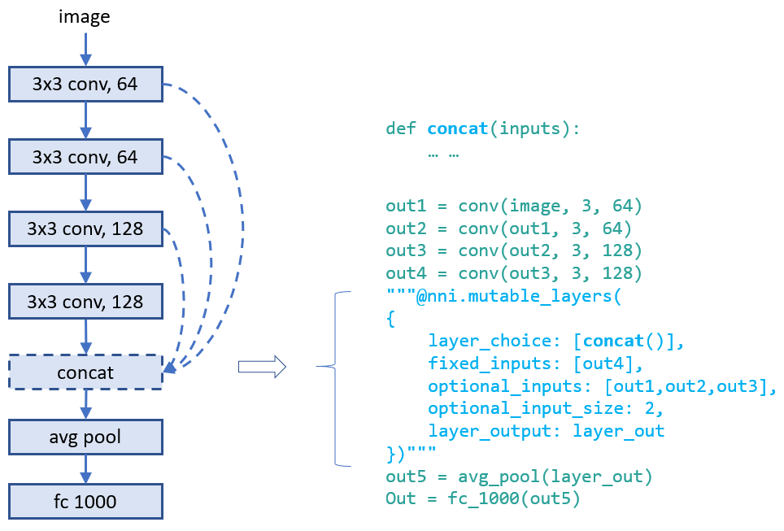

# General Programming Interface for Neural Architecture Search

Automatic neural architecture search is taking an increasingly important role on finding better models. Recent research works have proved the feasibility of automatic NAS, and also found some models that could beat manually designed and tuned models. Some of representative works are [NASNet][2], [ENAS][1], [DARTS][3], [Network Morphism][4], and [Evolution][5]. There are new innovations keeping emerging. However, it takes great efforts to implement those algorithms, and it is hard to reuse code base of one algorithm for implementing another.

To facilitate NAS innovations (e.g., design/implement new NAS models, compare different NAS models side-by-side), an easy-to-use and flexibile programming interface is crucial.

## Programming interface

 A new programming interface for designing and searching for a model is often demanded in two scenarios. 1) When designing a neural network, the designer may have multiple choices for a layer, sub-model, or connection, and not sure which one or a combination performs the best. It would be appealing to have an easy way to express the candidate layers/sub-models they want to try. 2) For the researchers who are working on automatic NAS, they want to have an unified way to express the search space of neural architectures. And making unchanged trial code adapted to different searching algorithms.

 We designed a simple and flexible programming interface based on [NNI annotation](./AnnotationSpec.md). It is elaborated through examples below.

 ### Example: choose an operator for a layer

When designing the following model there might be several choices in the fourth layer that may make this model perform good. In the script of this model, we can use annotation for the fourth layer as shown in the figure. In this annotation, there are five fields in total:

* __layer_choice__: It is a list of function calls, each function should have defined in user's script or imported libraries. The input arguments of the function should follow the format: `def XXX(inputs, arg2, arg3, ...)`, where `inputs` is a list with two elements. One is the list of `fixed_inputs`, and the other is a list of the chosen inputs from the next field `input_candidates`. `conv` and `pool` in the figure are examples of function definition. In the function calls in this field, no need to write the first argument (i.e., `inputs`). Note that only one of the function calls are chosen for this layer.
* __fixed_inputs__: It is a list of variables, the variable could be an output tensor from a previous layer. The variable could be `layer_output` of another nni.mutable_layer before this layer, or other python variables before this layer. All the variables in this list will be fed into the chosen function in `layer_choice`.
* __input_candidates__: It is a list of variables, the variable could be an output tensor from a previous layer. The variable could be `layer_output` of another nni.mutable_layer before this layer, or other python variables before this layer. Only `input_num` variables will be fed into the chosen function in `layer_choice`.
* __input_num__: It indicates how many inputs are chosen from `input_candidates`. It could be a number or a range. A range [1,3] means it chooses 1, 2, or 3 inputs.
* __layer_output__: The name of the output(s) of this layer, in this case it represents the return of the function call in `layer_choice`. This will be a variable name that can be used in the following python code or nni.mutable_layer(s).

There are two ways to write annotation for this example. For the upper one, `input` of the function calls is `[[],[out3]]`. For the bottom one, `input` is `[[out3],[]]`.

### Example: choose input connections for a layer

Designing connections of layers is critical for making a high performance model. With our provided interface, users could annotate which connections a layer takes (as inputs). They could choose several ones from a set of connections. Below is an example which chooses two inputs from three candidate inputs for `concat`. Here `concat` always takes the output of its previous layer using the input argument `connected_out`.

### Example: auxiliary functions for annotation

Basically, with the approach of expressing OPs and connections (i.e., the above two examples), users could express most choices of architectures they want to try through our annotation. To make expressing NAS search space easier, we provide two optional fields in `nni.mutable_layer`:

* __input_aggregate__ (optional): It is a function call whose definition should follow the same rule as the ones in `layer_choice`. If it is specified, the inputs of this function call are the chosen inputs from `input_candidates`, its return is fed into the chosen function (from `layer_choice`) as the first input argument. Users could do some preprocessing (e.g., concating inputs, reshaping inputs) in this function.
* __post_process__ (optional): It is a function call whose definition should follow the same rule as the ones in `layer_choice`. The first input argument of this function would be a list with only two elements. The frist element is the return of the chosen function (from `layer_choice`), the second element is the chosen inputs from `input_candidates`.

With these two fields, user could easily add some necessary preprocess and postprocess logic without writing more `nni.mutable_layer`.

### Example: [ENAS][1] macro search space

## Unified NAS search space representation

[1]: https://arxiv.org/abs/1802.03268
[2]: https://arxiv.org/abs/1707.07012
[3]: https://arxiv.org/abs/1806.09055
[4]: https://arxiv.org/abs/1806.10282
[5]: https://arxiv.org/abs/1703.01041 
