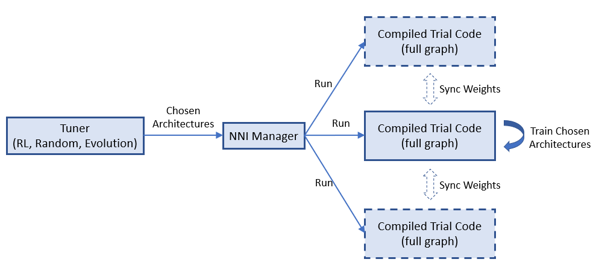

# General Programming Interface for Neural Architecture Search

Automatic neural architecture search is taking an increasingly important role on finding better models. Recent research works have proved the feasibility of automatic NAS, and also found some models that could beat manually designed and tuned models. Some of representative works are [NASNet][2], [ENAS][1], [DARTS][3], [Network Morphism][4], and [Evolution][5]. There are new innovations keeping emerging. However, it takes great efforts to implement those algorithms, and it is hard to reuse code base of one algorithm for implementing another.

To facilitate NAS innovations (e.g., design/implement new NAS models, compare different NAS models side-by-side), an easy-to-use and flexibile programming interface is crucial.

## Programming interface

 A new programming interface for designing and searching for a model is often demanded in two scenarios. 1) When designing a neural network, the designer may have multiple choices for a layer, sub-model, or connection, and not sure which one or a combination performs the best. It would be appealing to have an easy way to express the candidate layers/sub-models they want to try. 2) For the researchers who are working on automatic NAS, they want to have an unified way to express the search space of neural architectures. And making unchanged trial code adapted to different searching algorithms.

 We designed a simple and flexible programming interface based on [NNI annotation](./AnnotationSpec.md). It is elaborated through examples below.

 ### Example: choose an operator for a layer

When designing the following model there might be several choices in the fourth layer that may make this model perform good. In the script of this model, we can use annotation for the fourth layer as shown in the figure. In this annotation, there are five fields in total:


* __layer_choice__: It is a list of function calls, each function should have defined in user's script or imported libraries. The input arguments of the function should follow the format: `def XXX(inputs, arg2, arg3, ...)`, where `inputs` is a list with two elements. One is the list of `fixed_inputs`, and the other is a list of the chosen inputs from `input_candidates`. `conv` and `pool` in the figure are examples of function definition. For the function calls in this list, no need to write the first argument (i.e., `input`). Note that only one of the function calls are chosen for this layer.
* __fixed_inputs__: It is a list of variables, the variable could be an output tensor from a previous layer. The variable could be `layer_output` of another nni.mutable_layer before this layer, or other python variables before this layer. All the variables in this list will be fed into the chosen function in `layer_choice` (as the first element of the `input` list).
* __input_candidates__: It is a list of variables, the variable could be an output tensor from a previous layer. The variable could be `layer_output` of another nni.mutable_layer before this layer, or other python variables before this layer. Only `input_num` variables will be fed into the chosen function in `layer_choice` (as the second element of the `input` list).
* __input_num__: It indicates how many inputs are chosen from `input_candidates`. It could be a number or a range. A range [1,3] means it chooses 1, 2, or 3 inputs.
* __layer_output__: The name of the output(s) of this layer, in this case it represents the return of the function call in `layer_choice`. This will be a variable name that can be used in the following python code or nni.mutable_layer(s).

There are two ways to write annotation for this example. For the upper one, `input` of the function calls is `[[],[out3]]`. For the bottom one, `input` is `[[out3],[]]`.

### Example: choose input connections for a layer

Designing connections of layers is critical for making a high performance model. With our provided interface, users could annotate which connections a layer takes (as inputs). They could choose several ones from a set of connections. Below is an example which chooses two inputs from three candidate inputs for `concat`. Here `concat` always takes the output of its previous layer using `fixed_inputs`.


### Example: choose both operators and connections

In this example, we choose one from the three operators and choose two connections for it. As there are multiple variables in `inputs`, we call `concat` at the beginning of the functions.


### Example: [ENAS][1] macro search space

To illustrate the convenience of the programming interface, we use the interface to implement the trial code of "ENAS + macro search space". The left figure is the macro search space in ENAS paper.


## Unified NAS search space specification

After finishing the trial code through the annotation above, users have implicitly specified the search space of neural architectures in the code. Based on the code, NNI will automatcailly generate a search space file which could be fed into tuning algorithms. This search space file follows the following `json` format.

```json
mutable_1: {
    layer_1: {
        layer_choice: [A, B, C],
        input_candidates: [a, b, c],
        input_num: 2,
    }
    layer_2: {
        ...
    }
}
```

Accordingly, a specified neural architecture (generated by tuning algorithm) is expressed as follows:

```json
mutable_1: {
    layer_1: {
        layer_choice: A,
        input_choice: [a, c]
    }
    layer_2: {
        ...
    }
}
```

With the specification of the format of search space and architecture (choice) expression, users are free to implement various (general) tuning algorithms for neural architecture search on NNI. We have implemented a [general NAS algorihtm]() by extracting the RNN controller from ENAS.


## Neural architecture search on NNI

### Basic flow of experiment execution

NNI's annotation compiler transforms the annotated trial code to the code that could receive architecture choice and build the corresponding model (i.e., graph). The NAS search space can be seen as a full graph, the architecture chosen by the tuning algorithm is a subgraph in it. By default, the compiled trial code only builds and executes the subgraph.


The above figure shows how the trial code runs on NNI. `nnictl` processes user trial code to generate a search space file and compiled trial code. The former is fed to tuner, and the latter is used to run trilas. 

### Weight sharing

Sharing weights among chosen architectures (i.e., trials) could speedup model search. For example, properly inheriting weights of completed trials could speedup the converge of new trials. One-Shot NAS (e.g., ENAS, Darts) is more aggressive, the training of different architectures (i.e., subgraphs) shares the same copy of the weights in full graph.


We believe weight sharing (transferring) plays a key role on speeding up NAS, while finding efficient ways of sharing weights is still a hot research topic. We provide a key-value store for users to store and load weights. Tuners and Trials use a provided KV client lib to access the storage.

### Support of One-Shot NAS

One-Shot




## General tuning algorithms for NAS


## Export best neural architecture and code


## Future works


[1]: https://arxiv.org/abs/1802.03268
[2]: https://arxiv.org/abs/1707.07012
[3]: https://arxiv.org/abs/1806.09055
[4]: https://arxiv.org/abs/1806.10282
[5]: https://arxiv.org/abs/1703.01041 
