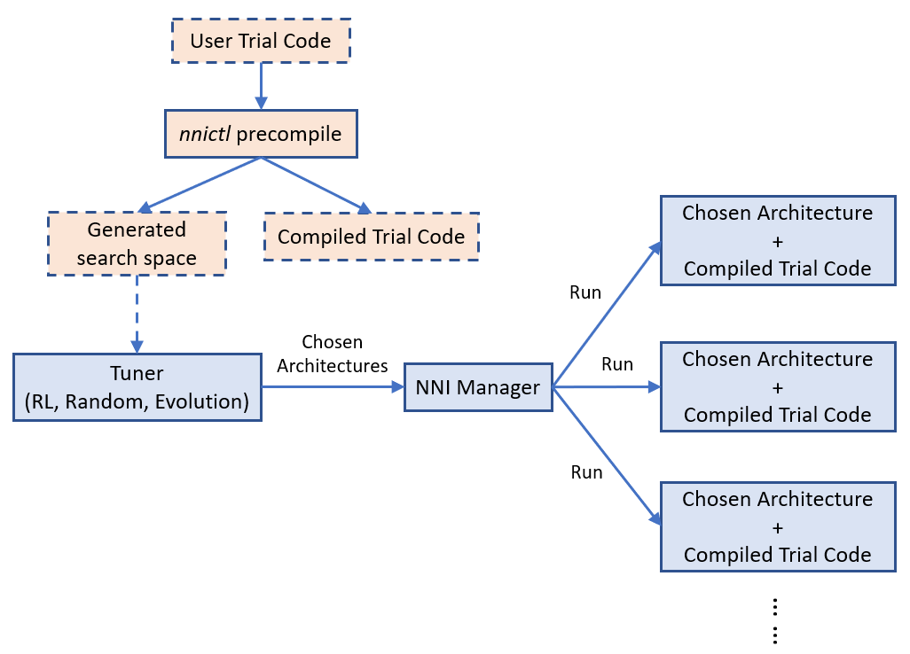

# General Programming Interface for Neural Architecture Search (experimental feature)

_*This is an experimental feature, currently, we only implemented the general NAS programming interface. Weight sharing and one-shot NAS based on this programming interface will be supported in the following releases._

Automatic neural architecture search is taking an increasingly important role on finding better models. Recent research works have proved the feasibility of automatic NAS, and also found some models that could beat manually designed and tuned models. Some of representative works are [NASNet][2], [ENAS][1], [DARTS][3], [Network Morphism][4], and [Evolution][5]. There are new innovations keeping emerging. However, it takes great efforts to implement those algorithms, and it is hard to reuse code base of one algorithm for implementing another.

To facilitate NAS innovations (e.g., design/implement new NAS models, compare different NAS models side-by-side), an easy-to-use and flexible programming interface is crucial.

## Programming interface

 A new programming interface for designing and searching for a model is often demanded in two scenarios. 1) When designing a neural network, the designer may have multiple choices for a layer, sub-model, or connection, and not sure which one or a combination performs the best. It would be appealing to have an easy way to express the candidate layers/sub-models they want to try. 2) For the researchers who are working on automatic NAS, they want to have an unified way to express the search space of neural architectures. And making unchanged trial code adapted to different searching algorithms.

 We designed a simple and flexible programming interface based on [NNI annotation](./AnnotationSpec.md). It is elaborated through examples below.

### Example: choose an operator for a layer

When designing the following model there might be several choices in the fourth layer that may make this model perform good. In the script of this model, we can use annotation for the fourth layer as shown in the figure. In this annotation, there are five fields in total:


* __layer_choice__: It is a list of function calls, each function should have defined in user's script or imported libraries. The input arguments of the function should follow the format: `def XXX(inputs, arg2, arg3, ...)`, where inputs is a list with two elements. One is the list of `fixed_inputs`, and the other is a list of the chosen inputs from `optional_inputs`. `conv` and `pool` in the figure are examples of function definition. For the function calls in this list, no need to write the first argument (i.e., input). Note that only one of the function calls are chosen for this layer.
* __fixed_inputs__: It is a list of variables, the variable could be an output tensor from a previous layer. The variable could be `layer_output` of another `nni.mutable_layer` before this layer, or other python variables before this layer. All the variables in this list will be fed into the chosen function in `layer_choice` (as the first element of the input list).
* __optional_inputs__: It is a list of variables, the variable could be an output tensor from a previous layer. The variable could be `layer_output` of another `nni.mutable_layer` before this layer, or other python variables before this layer. Only `optional_input_size` variables will be fed into the chosen function in `layer_choice` (as the second element of the input list).
* __optional_input_size__: It indicates how many inputs are chosen from `input_candidates`. It could be a number or a range. A range [1,3] means it chooses 1, 2, or 3 inputs.
* __layer_output__: The name of the output(s) of this layer, in this case it represents the return of the function call in `layer_choice`. This will be a variable name that can be used in the following python code or `nni.mutable_layer`.

There are two ways to write annotation for this example. For the upper one, input of the function calls is `[[],[out3]]`. For the bottom one, input is `[[out3],[]]`.

__Debugging__: We provided an `nnictl trial codegen` command to help debugging your code of NAS programming on NNI. If your trial with trial_id `XXX` in your experiment `YYY` is failed, you could run `nnictl trial codegen YYY --trial_id XXX` to generate an executable code for this trial under your current directory. With this code, you can directly run the trial command without NNI to check why this trial is failed. Basically, this command is to compile your trial code and replace the NNI NAS code with the real chosen layers and inputs.

### Example: choose input connections for a layer

Designing connections of layers is critical for making a high performance model. With our provided interface, users could annotate which connections a layer takes (as inputs). They could choose several ones from a set of connections. Below is an example which chooses two inputs from three candidate inputs for `concat`. Here `concat` always takes the output of its previous layer using `fixed_inputs`.


### Example: choose both operators and connections

In this example, we choose one from the three operators and choose two connections for it. As there are multiple variables in inputs, we call `concat` at the beginning of the functions.


### Example: [ENAS][1] macro search space

To illustrate the convenience of the programming interface, we use the interface to implement the trial code of "ENAS + macro search space". The left figure is the macro search space in ENAS paper.


## Unified NAS search space specification

After finishing the trial code through the annotation above, users have implicitly specified the search space of neural architectures in the code. Based on the code, NNI will automatically generate a search space file which could be fed into tuning algorithms. This search space file follows the following JSON format.

```json
{
    "mutable_1": {
        "layer_1": {
            "layer_choice": ["conv(ch=128)", "pool", "identity"],
            "optional_inputs": ["out1", "out2", "out3"],
            "optional_input_size": 2
        },
        "layer_2": {
            ...
        }
    }
}
```

Accordingly, a specified neural architecture (generated by tuning algorithm) is expressed as follows:

```json
{
    "mutable_1": {
        "layer_1": {
            "chosen_layer": "pool",
            "chosen_inputs": ["out1", "out3"]
        },
        "layer_2": {
            ...
        }
    }
}
```

With the specification of the format of search space and architecture (choice) expression, users are free to implement various (general) tuning algorithms for neural architecture search on NNI. One future work is to provide a general NAS algorithm.

=============================================================

## Neural architecture search on NNI

### Basic flow of experiment execution

NNI's annotation compiler transforms the annotated trial code to the code that could receive architecture choice and build the corresponding model (i.e., graph). The NAS search space can be seen as a full graph (here, full graph means enabling all the provided operators and connections to build a graph), the architecture chosen by the tuning algorithm is a subgraph in it. By default, the compiled trial code only builds and executes the subgraph.



The above figure shows how the trial code runs on NNI. `nnictl` processes user trial code to generate a search space file and compiled trial code. The former is fed to tuner, and the latter is used to run trials. 

[Simple example of NAS on NNI](https://github.com/microsoft/nni/tree/v0.8/examples/trials/mnist-nas).

### [__TODO__] Weight sharing

Sharing weights among chosen architectures (i.e., trials) could speedup model search. For example, properly inheriting weights of completed trials could speedup the converge of new trials. One-Shot NAS (e.g., ENAS, Darts) is more aggressive, the training of different architectures (i.e., subgraphs) shares the same copy of the weights in full graph.


We believe weight sharing (transferring) plays a key role on speeding up NAS, while finding efficient ways of sharing weights is still a hot research topic. We provide a key-value store for users to store and load weights. Tuners and Trials use a provided KV client lib to access the storage.

Example of weight sharing on NNI.

### [__TODO__] Support of One-Shot NAS

One-Shot NAS is a popular approach to find good neural architecture within a limited time and resource budget. Basically, it builds a full graph based on the search space, and uses gradient descent to at last find the best subgraph. There are different training approaches, such as [training subgraphs (per mini-batch)][1], [training full graph through dropout][6], [training with architecture weights (regularization)][3]. Here we focus on the first approach, i.e., training subgraphs (ENAS).

With the same annotated trial code, users could choose One-Shot NAS as execution mode on NNI. Specifically, the compiled trial code builds the full graph (rather than subgraph demonstrated above), it receives a chosen architecture and training this architecture on the full graph for a mini-batch, then request another chosen architecture. It is supported by [NNI multi-phase](./multiPhase.md). We support this training approach because training a subgraph is very fast, building the graph every time training a subgraph induces too much overhead.


The design of One-Shot NAS on NNI is shown in the above figure. One-Shot NAS usually only has one trial job with full graph. NNI supports running multiple such trial jobs each of which runs independently. As One-Shot NAS is not stable, running multiple instances helps find better model. Moreover, trial jobs are also able to synchronize weights during running (i.e., there is only one copy of weights, like asynchronous parameter-server mode). This may speedup converge.

Example of One-Shot NAS on NNI.


## [__TODO__] General tuning algorithms for NAS

Like hyperparameter tuning, a relatively general algorithm for NAS is required. The general programming interface makes this task easier to some extent. We have a RL-based tuner algorithm for NAS from our contributors. We expect efforts from community to design and implement better NAS algorithms.

More tuning algorithms for NAS.

## [__TODO__] Export best neural architecture and code

After the NNI experiment is done, users could run `nnictl experiment export --code` to export the trial code with the best neural architecture.

## Conclusion and Future work

There could be different NAS algorithms and execution modes, but they could be supported with the same programming interface as demonstrated above.

There are many interesting research topics in this area, both system and machine learning.

[1]: https://arxiv.org/abs/1802.03268
[2]: https://arxiv.org/abs/1707.07012
[3]: https://arxiv.org/abs/1806.09055
[4]: https://arxiv.org/abs/1806.10282
[5]: https://arxiv.org/abs/1703.01041
[6]: http://proceedings.mlr.press/v80/bender18a/bender18a.pdf
