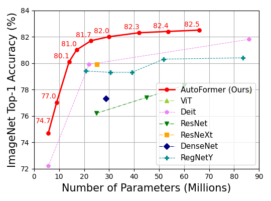
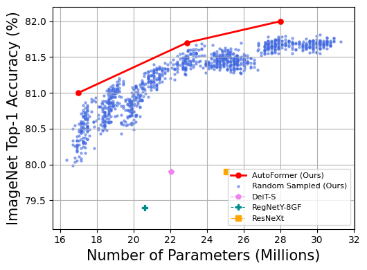

AutoFormer: Searching Transformers for Visual Recognition
===========================

* `Paper <https://openaccess.thecvf.com/content/ICCV2021/papers/Chen_AutoFormer_Searching_Transformers_for_Visual_Recognition_ICCV_2021_paper.pdf>`__
* `Models-Github <https://github.com/silent-chen/AutoFormer-model-zoo/releases>`__
* `Models-Google Drive <https://drive.google.com/drive/folders/1HqzY3afqQUMI6pJ5_BgR2RquJU_b_3eg?usp=sharing>`__
* `BibTex <https://scholar.googleusercontent.com/scholar.bib?q=info:uVE0aYZPbq4J:scholar.google.com/&output=citation&scisdr=CgUmooSCEO-o3SJbHUM:AAGBfm0AAAAAYa9dBUM_GY4F66gh9gncq3kh97AsBRzG&scisig=AAGBfm0AAAAAYa9dBfdIZekUI938zpgyRfsTag4Nis25&scisf=4&ct=citation&cd=-1&hl=zh-CN>`__

Introduction
------------
AutoFormer is new one-shot architecture search framework dedicated to vision transformer search. It entangles the weights of different vision transformer blocks in the same layers during supernet training. 
Benefiting from the strategy, the trained supernet allows thousands of subnets to be very well-trained. Specifically, the performance of these subnets with weights inherited from the supernet is comparable to those retrained from scratch.

.. image:: https://github.com/microsoft/AutoML/releases/download/static_files/autoformer_overview.gif
    :scale: 45 %
.. image:: https://github.com/microsoft/AutoML/releases/download/static_files/autoformer_details.gif
    :scale: 45 %

Reproduced Results
------------------
The code could reproduce the official results with Top-1 Accuracy on ImageNet. 
For evaluation, we provide the checkpoints of our models in 
`Google Drive <https://drive.google.com/drive/folders/1HqzY3afqQUMI6pJ5_BgR2RquJU_b_3eg?usp=sharing>`__
and `GitHub <https://github.com/silent-chen/AutoFormer-model-zoo>`__, as below

.. list-table::
   :header-rows: 1
   :widths: auto

   * - Model
     - Params.
     - Top-1 Acc. %
     - Top-5 Acc. %
     - Download link
   * - AutoFormer-T
     - 5.8M
     - 75.3
     - 92.7 
     - `Google Drive <https://drive.google.com/file/d/1uRCW3doQHgn2H-LjyalYEZ4CvmnQtr6Q/view?usp=sharing>`__, `GitHub <https://github.com/silent-chen/AutoFormer-model-zoo/releases/download/v1.0/supernet-tiny.pth>`__
   * - AutoFormer-S
     - 22.9M
     - 81.7
     - 95.7
     - `Google Drive <https://drive.google.com/file/d/1JTBmLR_nW7-ZbTKafWFvSl8J2orJXiNa/view?usp=sharing>`__, `GitHub <https://github.com/silent-chen/AutoFormer-model-zoo/releases/download/v1.0/supernet-small.pth>`__
   * - AutoFormer-B
     - 53.7M
     - 82.4
     - 95.7
     - `Google Drive <https://drive.google.com/file/d/1KPjUshk0SbqkaTzlirjPHM9pu19N5w0e/view?usp=sharing>`__, `GitHub <https://github.com/silent-chen/AutoFormer-model-zoo/releases/download/v1.0/supernet-base.pth>`__

Examples
--------

`Example code <https://github.com/microsoft/nni/tree/master/examples/nas/oneshot/autoformer>`__

Please run the following scripts in the example folder.

Data Preparation
----------------

Here, we take ImageNet as an example. 
You need to first download the `ImageNet-2012 <http://www.image-net.org/>`__ to the folder ``./data/imagenet`` and move the validation set to the subfolder ``./data/imagenet/val``.
To move the validation set, you cloud use `the following script <https://raw.githubusercontent.com/soumith/imagenetloader.torch/master/valprep.sh>`__.

The directory structure is the standard layout as following.

.. code-block:: bash

    /path/to/imagenet/
        train/
            class1/
                img1.jpeg
            class2/
                img2.jpeg
        val/
            class1/
                img3.jpeg
            class/2
                img4.jpeg

Please note that you could replace ImageNet with any dataset you need, but remember to follow the above layout.

Quick Start
-----------

We provide Supernet Train, Search, Test code of AutoFormer as follows.

0. Environment Setup
^^^^^^^^^

First, build environments for autoformer.

.. code-block:: bash

   pip install -r ./requirements

1. Supernet Train
^^^^^^^^^

To train the supernet-T/S/B, we provided the corresponding supernet configuration files in ``/experiments/supernet/``. 
Now, we support to search the ratio of MLP(MLP_RATIO), the numebr of heads(NUM_HEADS), the network depth(DEPTH) and the embedding dimension(EMBED_DIM).
You can build your search space by creating your own supernet config. 
Taking supernet-B as an example, the search space is as follow:

.. code-block:: bash

    SEARCH_SPACE:
        MLP_RATIO:
            - 3.0
            - 3.5
            - 4.0
        NUM_HEADS:
            - 9
            - 10
        DEPTH:
            - 14
            - 15
            - 16
        EMBED_DIM:
            - 528
            - 576
            - 624
The MLP_RATIO have three choices: 3.0, 3.5 and 4.0. Others follow the same format.

To train the supernet-B, you can run the following command. The default output path is ``./``, 
you can specify the path with argument ``--output_dir``.

.. code-block:: bash

    python -m torch.distributed.launch --nproc_per_node=8 --use_env supernet_train.py --data-path /PATH/TO/IMAGENT --gp \
    --change_qk --relative_position --mode super --dist-eval --cfg ./experiments/supernet/supernet-B.yaml --epochs 500 --warmup-epochs 20 \
    --output_dir /OUTPUT_PATH --batch-size 128

1. Search
^^^^^^^^^

We run our evolution search on part of the ImageNet training dataset and use the validation set of ImageNet as the test set for fair comparison. 
To generate the subImagenet in ``/PATH/TO/IMAGENET``, you could simply run:

.. code-block:: bash
    
    python ./lib/subImageNet.py --data-path /PATH/TO/IMAGENT

After obtaining the subImageNet and training of the supernet. We could perform the evolution search using below command. 
Please remember to config the specific constraint in this evolution search using ``--min-param-limits`` and ``--param-limits``:

.. code-block:: bash

    python -m torch.distributed.launch --nproc_per_node=8 --use_env evolution.py --data-path /PATH/TO/IMAGENT --gp \
    --change_qk --relative_position --dist-eval --cfg ./experiments/supernet/supernet-B.yaml --resume /PATH/TO/CHECKPOINT \
    --min-param-limits YOUR/CONFIG --param-limits YOUR/CONFIG --data-set EVO_IMNET

3. Test
^^^^^^^^^

To test our trained models, you need to put the downloaded model in ``/PATH/TO/CHECKPOINT``. 
After that you could use the following command to test the model (Please change your config file and model checkpoint according to different models. Here we use the AutoFormer-B as an example).

.. code-block:: bash

    python -m torch.distributed.launch --nproc_per_node=8 --use_env supernet_train.py --data-path /PATH/TO/IMAGENT --gp \
    --change_qk --relative_position --mode retrain --dist-eval --cfg ./experiments/subnet/AutoFormer-B.yaml --resume /PATH/TO/CHECKPOINT --eval 

Performance
------------
Left: Top-1 accuracy on ImageNet. Our method achieves very competitive performance, being superior to the recent DeiT and ViT. 
Right: 1000 random sampled good architectures in the supernet-S. The supernet trained under our strategy allows subnets to be well optimized.

