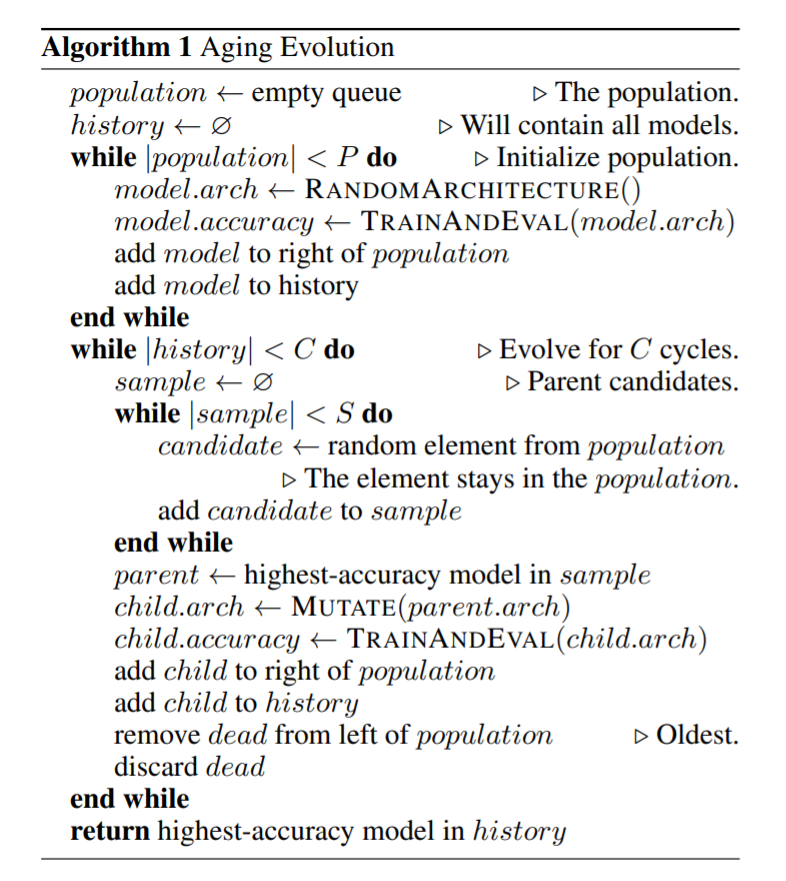

.. role:: raw-html(raw)
   :format: html

Classic NAS Algorithms
======================

In classic NAS algorithms, each architecture is trained as a trial and the NAS algorithm acts as a tuner. Thus, this training mode naturally fits within the NNI hyper-parameter tuning framework, where Tuner generates new architecture for the next trial and trials run in the training service.

Quick Start
-----------

The following example shows how to use classic NAS algorithms. You can see it is quite similar to NNI hyper-parameter tuning.

.. code-block:: python

   model = Net()

   # get the chosen architecture from tuner and apply it on model
   get_and_apply_next_architecture(model)
   train(model)  # your code for training the model
   acc = test(model)  # test the trained model
   nni.report_final_result(acc)  # report the performance of the chosen architecture

First, instantiate the model. Search space has been defined in this model through ``LayerChoice`` and ``InputChoice``. After that, user should invoke ``get_and_apply_next_architecture(model)`` to settle down to a specific architecture. This function receives the architecture from tuner (i.e., the classic NAS algorithm) and applies the architecture to ``model``. At this point, ``model`` becomes a specific architecture rather than a search space. Then users are free to train this model just like training a normal PyTorch model. After get the accuracy of this model, users should invoke ``nni.report_final_result(acc)`` to report the result to the tuner.

At this point, trial code is ready. Then, we can prepare an NNI experiment, i.e., search space file and experiment config file. Different from NNI hyper-parameter tuning, search space file is automatically generated from the trial code by running the command (the detailed usage of this command can be found `here <../Tutorial/Nnictl.rst>`__\ ):

``nnictl ss_gen --trial_command="the command for running your trial code"``

A file named ``nni_auto_gen_search_space.json`` is generated by this command. Then put the path of the generated search space in the field ``searchSpacePath`` of the experiment config file. The other fields of the config file can be filled by referring `this tutorial <../Tutorial/QuickStart.rst>`__.

Currently, we only support :githublink:`PPO Tuner <examples/tuners/random_nas_tuner>` for classic NAS. More classic NAS algorithms will be supported soon.

The complete examples can be found :githublink:`here <examples/nas/classic_nas>` for PyTorch and :githublink:`here <examples/nas/classic_nas-tf>` for TensorFlow.

Standalone mode for easy debugging
----------------------------------

We support a standalone mode for easy debugging, where you can directly run the trial command without launching an NNI experiment. This is for checking whether your trial code can correctly run. The first candidate(s) are chosen for ``LayerChoice`` and ``InputChoice`` in this standalone mode.

:raw-html:``

Regularized Evolution Tuner
---------------------------

This is a tuner geared for NNI’s Neural Architecture Search (NAS) interface. It uses the `evolution algorithm <https://arxiv.org/pdf/1802.01548.pdf>`__.

The tuner first randomly initializes the number of ``population`` models and evaluates them. After that, every time to produce a new architecture, the tuner randomly chooses the number of ``sample`` architectures from ``population``\ , then mutates the best model in ``sample``\ , the parent model, to produce the child model. The mutation includes the hidden mutation and the op mutation. The hidden state mutation consists of replacing a hidden state with another hidden state from within the cell, subject to the constraint that no loops are formed. The op mutation behaves like the hidden state mutation as far as replacing one op with another op from the op set. Note that keeping the child model the same as its parent is not allowed. After evaluating the child model, it is added to the tail of the ``population``\ , then pops the front one.

Note that **trial concurrency should be less than the population of the model**\ , otherwise NO_MORE_TRIAL exception will be raised.

The whole procedure is summarized by the pseudocode below.

