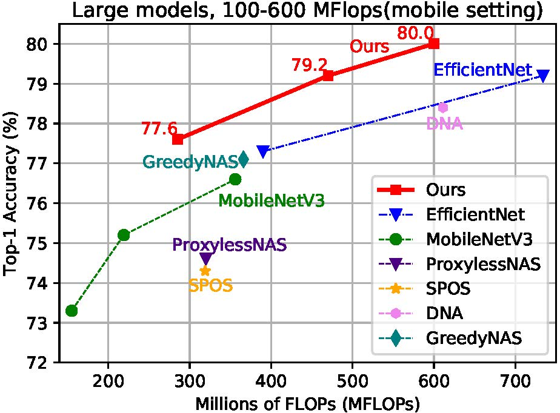

# Cream of the Crop: Distilling Prioritized Paths For One-Shot Neural Architecture Search

## Introduction
One-shot weight sharing methods have recently drawn great attention in neural architecture search due to high efficiency and competitive performance. However, weight sharing across models has an inherent deficiency, i.e., insufficient training of subnetworks in the hypernetwork. To alleviate this problem, we present a simple yet effective architecture distillation method. The central idea is that subnetworks can learn collaboratively and teach each other throughout the training process, aiming to boost the convergence of individual models. We introduce the concept of prioritized path, which refers to the architecture candidates exhibiting superior performance during training. Distilling knowledge from the prioritized paths is able to boost the training of subnetworks. Since the prioritized paths are changed on the fly depending on their performance and complexity, the final obtained paths are the cream of the crop. We directly select the most promising one from the prioritized paths as the final architecture, without using other complex search methods, such as reinforcement learning or evolution algorithms. The experiments on ImageNet verify such path distillation method can improve the convergence ratio and performance of the hypernetwork, as well as boosting the training of subnetworks. The discovered architectures achieve superior performance compared to the recent MobileNetV3 and EfficientNet families under aligned settings. Moreover, the experiments on object detection and more challenging search space show the generality and robustness of the proposed method. For more details, please refer to the paper (coming soon).

<div align="left">
  <br/>
  <!-- <p>Example SiamFC, SiamRPN and SiamMask outputs.</p> -->
</div>

## Reproduction Results
Top-1 Accuracy on ImageNet. The top-1 accuracy of Cream search algorithm surpasses MobileNetV3 and EfficientNet-B0/B1 on ImageNet.
The training with 16 Gpus is a little bit superior than 8 Gpus, as below.

| Model (M Flops) |  8Gpus | 16Gpus | 
| ---- |:-------------:| :-----:|
| 14M | 59.3 | 59.6 |
| 42M | 65.8 | 66.5 |
| 114M | 72.1 | 72.8 |
| 285M | 76.7 | 77.6 |
| 470M | 78.9 | 79.2 |
| 600M | 79.4 | 80.0 |

<table style="border: none">
    <th></th>
    <th></th>
</table>


## Requirements
* python >= 3.6
* torch >= 1.2
* torchscope
* apex

## Examples

[Example code](https://github.com/microsoft/nni/tree/master/examples/nas/cream)

Please run the following scripts in the example folder.

## Data Preparation

You need to first download the [ImageNet-2012](http://www.image-net.org/) to the folder `./data/imagenet` and move the validation set to the subfolder `./data/imagenet/val`. To move the validation set, you cloud use the following script: <https://raw.githubusercontent.com/soumith/imagenetloader.torch/master/valprep.sh> 

Put the imagenet data in `./data`. It should be like following:

```
./data/imagenet/train
./data/imagenet/val
...
```

## Quick Start

### I. Search

First, build environments for searching.

```
pip install -r ./requirements.txt
```

To search for an architecture, you need to configure the parameters `flops_minimum` and `flops_maximum` to specify the desired model flops, such as [0,600]MB flops. You can specify the flops interval by changing these two parameters in `./run.sh`

```
--flops_minimum 0 # Minimum Flops of Architecture
--flops_maximum 600 # Maximum Flops of Architecture
```

For example, if you expect to search an architecture with model flops <= 200M, please set the `flops_minimum` and `flops_maximum` to be `0` and `200`.

After you specify the flops of the architectures you would like to search, you can search an architecture now by running:

```
sh ./run.sh
```

The searched architectures need to be retrained and obtain the final model. The final model is saved in `.pth.tar` format. Retraining code will be released soon.

### II. Test

To test our trained of models, you need to use `model_selection` in `./test.sh` to specify which model to test.

```
--model_selection 42 # test 42m model
--model_selection 470 # test 470m model
......
```

After specifying the flops of the model, you need to write the path to the resume model in `./test.sh`.

```
--resume './data/ckpts/42.pth.tar'
--resume './data/ckpts/470.pth.tar'
......
```

We provide 14M/42M/114M/285M/470M/600M pretrained models in [google drive](https://drive.google.com/drive/folders/1CQjyBryZ4F20Rutj7coF8HWFcedApUn2).

After downloading the pretrained models and adding `--model_selection` and `--resume` in './test.sh', you need to use the following command to test the model.

```
sh ./test.sh
```

The test result will be saved in `./retrain`. You can configure the `--output` in `./test.sh` to specify a path for it.

```eval_rst
..  autoclass:: nni.nas.pytorch.cream.CreamSupernetTrainer
    :members:

..  autoclass:: nni.nas.pytorch.cdarts.CreamSupernetTrainingMutator
    :members:
    
```
