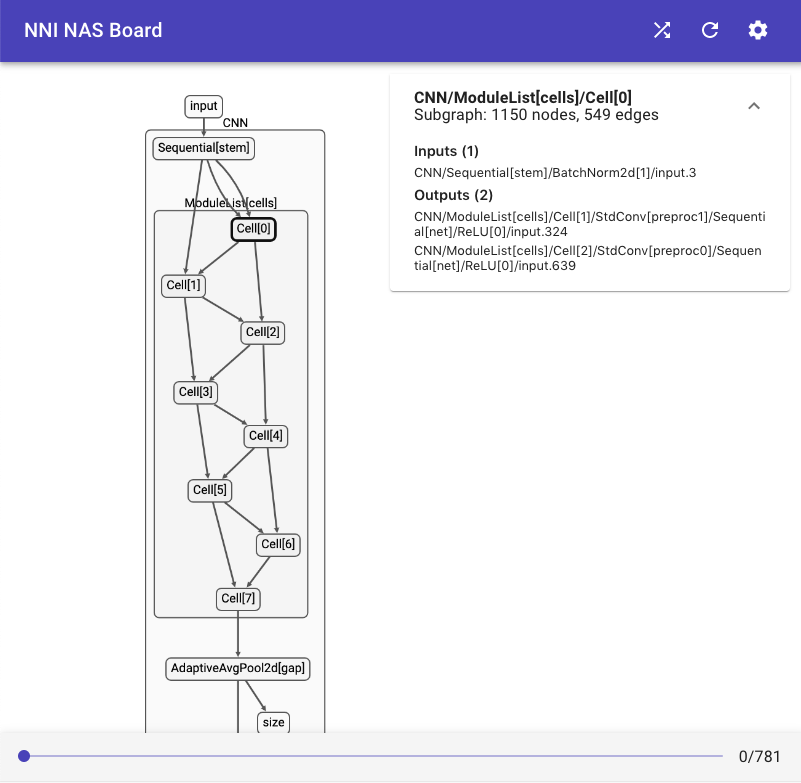
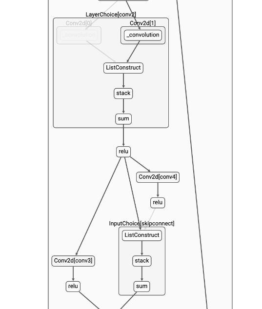

NAS Visualization (Experimental)
================================

Built-in Trainers Support
-------------------------

Currently, only ENAS and DARTS support visualization. Examples of `ENAS <./ENAS.md>`__ and `DARTS <./DARTS.rst>`__ has demonstrated how to enable visualization in your code, namely, adding this before ``trainer.train()``\ :

.. code-block:: python

   trainer.enable_visualization()

This will create a directory ``logs/<current_time_stamp>`` in your working folder, in which you will find two files ``graph.json`` and ``log``.

You don't have to wait until your program finishes to launch NAS UI, but it's important that these two files have been already created. Launch NAS UI with

.. code-block:: bash

   nnictl webui nas --logdir logs/<current_time_stamp> --port <port>

Visualize a Customized Trainer
------------------------------

If you are interested in how to customize a trainer, please read this `doc <./Advanced.rst#extend-the-ability-of-one-shot-trainers>`__.

You should do two modifications to an existing trainer to enable visualization:

#. Export your graph before training, with

.. code-block:: python

   vis_graph = self.mutator.graph(inputs)
   # `inputs` is a dummy input to your model. For example, torch.randn((1, 3, 32, 32)).cuda()
   # If your model has multiple inputs, it should be a tuple.
   with open("/path/to/your/logdir/graph.json", "w") as f:
       json.dump(vis_graph, f)

#. Logging the choices you've made. You can do it once per epoch, once per mini-batch or whatever frequency you'd like.

.. code-block:: python

   def __init__(self):
       # ...
       self.status_writer = open("/path/to/your/logdir/log", "w")  # create a writer

   def train(self):
       # ...
       print(json.dumps(self.mutator.status()), file=self.status_writer, flush=True)  # dump a record of status

If you are implementing your customized trainer inheriting ``Trainer``. We have provided ``enable_visualization()`` and ``_write_graph_status()`` for easy-to-use purposes. All you need to do is calling ``trainer.enable_visualization()`` before start, and ``trainer._write_graph_status()`` each time you want to do the logging. But remember both of these APIs are experimental and subject to change in future.

Last but not least, invode NAS UI with

.. code-block:: bash

   nnictl webui nas --logdir /path/to/your/logdir

NAS UI Preview
--------------

Limitations
-----------

* NAS visualization only works with PyTorch >=1.4. We've tested it on PyTorch 1.3.1 and it doesn't work.
* We rely on PyTorch support for tensorboard for graph export, which relies on ``torch.jit``. It will not work if your model doesn't support ``jit``.
* There are known performance issues when loading a moderate-size graph with many op choices (like DARTS search space).

Feedback
--------

NAS UI is currently experimental. We welcome your feedback. `Here <https://github.com/microsoft/nni/pull/2085>`__ we have listed all the to-do items of NAS UI in the future. Feel free to comment (or `submit a new issue <https://github.com/microsoft/nni/issues/new?template=enhancement.rst>`__\ ) if you have other suggestions.
