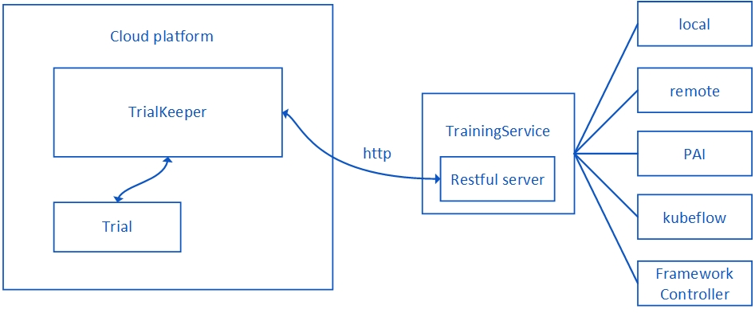

# How to Implement Training Service in NNI

## Overview

TrainingService is a module related to platform management and job schedule in NNI. TrainingService is designed to be easily implemented, we define an abstract class TrainingService as the parent class of all kinds of TrainingService, users just need to inherit the parent class and complete their own child class if they want to implement customized TrainingService.

## System architecture


The brief system architecture of NNI is shown in the picture. NNIManager is the core management module of system, in charge of calling TrainingService to manage trial jobs and the communication between different modules. Dispatcher is a message processing center responsible for message dispatch. TrainingService is a module to manage trial jobs, it communicates with nniManager module, and has different instance according to different training platform. For the time being, NNI supports [local platfrom](LocalMode.md), [remote platfrom](RemoteMachineMode.md), [PAI platfrom](PaiMode.md), [kubeflow platform](KubeflowMode.md) and [FrameworkController platfrom](FrameworkControllerMode.md).

In this document, we introduce the brief design of TrainingService. If users want to add a new TrainingService instance, they just need to complete a child class to implement TrainingService, don't need to understand the code detail of NNIManager, Dispatcher or other modules.

## Folder structure of code
NNI's folder structure is shown below:
```
nni
  |- deployment
  |- docs
  |- examaples
  |- src
  | |- nni_manager
  | | |- common
  | | |- config
  | | |- core
  | | |- coverage
  | | |- dist
  | | |- rest_server
  | | |- training_service
  | | | |- common
  | | | |- kubernetes
  | | | |- local
  | | | |- pai
  | | | |- remote_machine
  | | | |- test
  | |- sdk
  | |- webui
  |- test
  |- tools
  | |-nni_annotation
  | |-nni_cmd
  | |-nni_gpu_tool
  | |-nni_trial_tool
```
`nni/src/` folder stores the most source code of NNI. The code in this folder is related to NNIManager, TrainingService, SDK, WebUI and other modules. Users could find the abstract class of TrainingService in `nni/src/nni_manager/common/trainingService.ts` file, and they should put their own implemented TrainingService in `nni/src/nni_manager/training_service` folder. If users have implemented their own TrainingService code, they should also supplement the unit test of the code, and place them in `nni/src/nni_manager/training_service/test` folder.

## Function annotation of TrainingService
```
abstract class TrainingService {
    public abstract listTrialJobs(): Promise<TrialJobDetail[]>;
    public abstract getTrialJob(trialJobId: string): Promise<TrialJobDetail>;
    public abstract addTrialJobMetricListener(listener: (metric: TrialJobMetric) => void): void;
    public abstract removeTrialJobMetricListener(listener: (metric: TrialJobMetric) => void): void;
    public abstract submitTrialJob(form: JobApplicationForm): Promise<TrialJobDetail>;
    public abstract updateTrialJob(trialJobId: string, form: JobApplicationForm): Promise<TrialJobDetail>;
    public abstract get isMultiPhaseJobSupported(): boolean;
    public abstract cancelTrialJob(trialJobId: string, isEarlyStopped?: boolean): Promise<void>;
    public abstract setClusterMetadata(key: string, value: string): Promise<void>;
    public abstract getClusterMetadata(key: string): Promise<string>;
    public abstract cleanUp(): Promise<void>;
    public abstract run(): Promise<void>;
}
```
The parent class of TrainingService has a few abstract functions, users need to inherit the parent class and implement all of these abstract functions.

__setClusterMetadata(key: string, value: string)__

ClusterMetadata is the data related to platform details, for examples, the ClusterMetadata defined in remote machine server is:
```
export class RemoteMachineMeta {
    public readonly ip : string;
    public readonly port : number;
    public readonly username : string;
    public readonly passwd?: string;
    public readonly sshKeyPath?: string;
    public readonly passphrase?: string;
    public gpuSummary : GPUSummary | undefined;
    /* GPU Reservation info, the key is GPU index, the value is the job id which reserves this GPU*/
    public gpuReservation : Map<number, string>;

    constructor(ip : string, port : number, username : string, passwd : string,
        sshKeyPath : string, passphrase : string) {
        this.ip = ip;
        this.port = port;
        this.username = username;
        this.passwd = passwd;
        this.sshKeyPath = sshKeyPath;
        this.passphrase = passphrase;
        this.gpuReservation = new Map<number, string>();
    }
}
```
The metadata includes the host address, the username or other configuration related to the platform. Users need to define their own metadata format, and set the metadata instance in this function. This function is called before the experiment is started to set the configuration of remote machines.

__getClusterMetadata(key: string)__

This function will return the metadata value according to the values, it could be left empty if users don't need to use it.

__submitTrialJob(form: JobApplicationForm)__

SubmitTrialJob is a function to submit new trial jobs, users should generate a job instance in TrialJobDetail type. TrialJobDetail is defined as follow:
```
interface TrialJobDetail {
    readonly id: string;
    readonly status: TrialJobStatus;
    readonly submitTime: number;
    readonly startTime?: number;
    readonly endTime?: number;
    readonly tags?: string[];
    readonly url?: string;
    readonly workingDirectory: string;
    readonly form: JobApplicationForm;
    readonly sequenceId: number;
    isEarlyStopped?: boolean;
}
```
According to different kinds of implementation, users could put the job detail into a job queue, and keep  fetching the job from the queue and start preparing and running them. Or they could finish preparing and running process in this function, and return job detail after the submit work.

__cancelTrialJob(trialJobId: string, isEarlyStopped?: boolean)__

If this function is called, the trial started by the platform should be canceled. Different kind of platform has diffenent methods to calcel a running job, this function should be implemented according to specific platform.

__updateTrialJob(trialJobId: string, form: JobApplicationForm)__

This function is called to update the trial job's status, trial job's status should be detected according to different platform, and be updated to `RUNNING`, `SUCCEED`, `FAILED` etc.

__getTrialJob(trialJobId: string)__

This function returns a trialJob detail instance according to trialJobId.

__listTrialJobs()__

Users should put all of trial job detail information into a list, and return the list.

__addTrialJobMetricListener(listener: (metric: TrialJobMetric) => void)__

NNI will hold an EventEmitter to get job metrics, if there is new job metrics detected, the EventEmitter will be triggered. Users should start the EventEmitter in this function.

__removeTrialJobMetricListener(listener: (metric: TrialJobMetric) => void)__

Close the EventEmitter.

__run()__

The run() function is a main loop function in TrainingService, users could set a while loop to execute their logic code, and finish executing them when the experiment is stopped.

__cleanUp()__

This function is called to clean up the environment when a experiment is stopped. Users should do the platform-related cleaning operation in this function.

## TrialKeeper tool

NNI offers a TrialKeeper tool to help maintaining trial jobs. Users can find the source code in `nni/tools/nni_trial_tool`. If users want to run trial jobs in cloud platform, this tool will be a fine choice to help keeping trial running in the platform.

The running architecture of TrialKeeper is show as follow:



When users submit a trial job to cloud platform, they should wrap their trial command into TrialKeeper, and start a TrialKeeper process in cloud platform. Notice that TrialKeeper use restful server to communicate with TrainingService, users should start a restful server in local machine to receive metrics sent from TrialKeeper. The source code about restful server could be found in `nni/src/nni_manager/training_service/common/clusterJobRestServer.ts`.

## Reference

For more information about how to debug, please [refer](../Tutorial/HowToDebug.md).

The guideline of how to contribute, please [refer](../Tutorial/Contributing.md).
