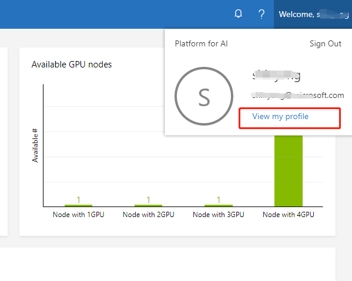
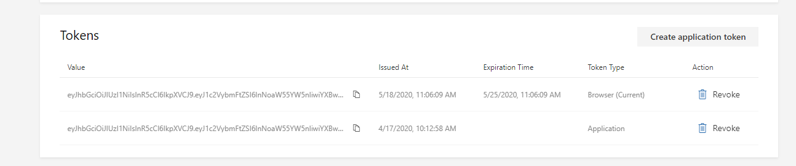
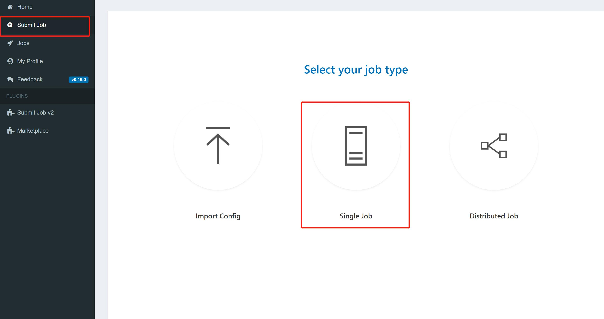
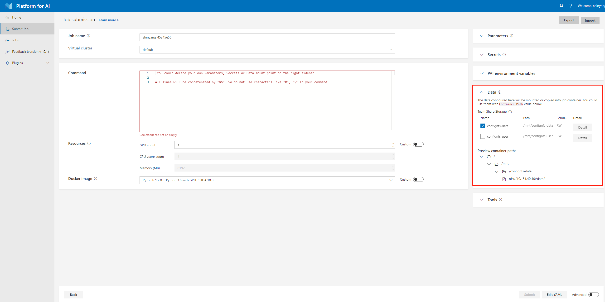
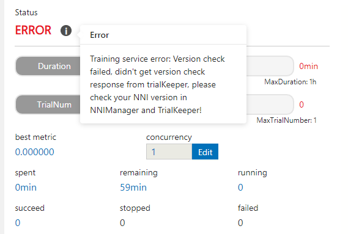

**Run an Experiment on OpenPAI**
===
NNI supports running an experiment on [OpenPAI](https://github.com/Microsoft/pai), called pai mode. Before starting to use NNI pai mode, you should have an account to access an [OpenPAI](https://github.com/Microsoft/pai) cluster. See [here](https://github.com/Microsoft/pai#how-to-deploy) if you don't have any OpenPAI account and want to deploy an OpenPAI cluster. In pai mode, your trial program will run in pai's container created by Docker.

[toc]

## Setup environment

**Step 1. Install NNI, follow the install guide [here](../Tutorial/QuickStart.md).**   

**Step 2. Get token.**

Open web portal of OpenPAI, and click `My profile` button in the top-right side.


Click `copy` button in the page to copy a jwt token.


**Step 3. Mount NFS storage to local machine.**  

  Click `Submit job` button in web portal.


  Find the data management region in job submission page.
  

The `Preview container paths` is the NFS host and path that OpenPAI provided, you need to mount the corresponding host and path to your local machine first, then NNI could use the OpenPAI's NFS storage.  
For example, use the following command:

```bash
sudo mount -t nfs4 gcr-openpai-infra02:/pai/data /local/mnt
```
Then the `/data` folder in container will be mounted to `/local/mnt` folder in your local machine.  
You could use the following configuration in your NNI's config file:

```yaml
nniManagerNFSMountPath: /local/mnt
```

**Step 4. Get OpenPAI's storage config name and nniManagerMountPath**

The `Team share storage` field is storage configuration used to specify storage value in OpenPAI. You can get `paiStorageConfigName` and `containerNFSMountPath` field in `Team share storage`, for example:

```yaml
paiStorageConfigName: confignfs-data
containerNFSMountPath: /mnt/confignfs-data
```


## Run an experiment

Use `examples/trials/mnist-annotation` as an example. The NNI config YAML file's content is like:

```yaml
authorName: your_name
experimentName: auto_mnist
# how many trials could be concurrently running
trialConcurrency: 2
# maximum experiment running duration
maxExecDuration: 3h
# empty means never stop
maxTrialNum: 100
# choice: local, remote, pai
trainingServicePlatform: pai
# search space file
searchSpacePath: search_space.json
# choice: true, false
useAnnotation: true
tuner:
  builtinTunerName: TPE
  classArgs:
    optimize_mode: maximize
trial:
  command: python3 mnist.py
  codeDir: ~/nni/examples/trials/mnist-annotation
  gpuNum: 0
  cpuNum: 1
  memoryMB: 8196
  image: msranni/nni:latest
  virtualCluster: default
  nniManagerNFSMountPath: /local/mnt
  containerNFSMountPath: /mnt/confignfs-data
  paiStorageConfigName: confignfs-data
# Configuration to access OpenPAI Cluster
paiConfig:
  userName: your_pai_nni_user
  token: your_pai_token
  host: 10.1.1.1
  # optional, experimental feature.
  reuse: true
```

Note: You should set `trainingServicePlatform: pai` in NNI config YAML file if you want to start experiment in pai mode. The host field in configuration file is PAI's job submission page uri, like `10.10.5.1`, the default http protocol in NNI is `http`, if your PAI's cluster enabled https, please use the uri in `https://10.10.5.1` format.


### Trial configurations

Compared with [LocalMode](LocalMode.md) and [RemoteMachineMode](RemoteMachineMode.md), `trial` configuration in pai mode has the following additional keys:

* cpuNum

  Optional key. Should be positive number based on your trial program's CPU  requirement. If it is not set in trial configuration, it should be set in the config file specified in `paiConfigPath` field.

* memoryMB

  Optional key. Should be positive number based on your trial program's memory requirement. If it is not set in trial configuration, it should be set in the config file specified in `paiConfigPath` field.

* image

  Optional key. In pai mode, your trial program will be scheduled by OpenPAI to run in [Docker container](https://www.docker.com/). This key is used to specify the Docker image used to create the container in which your trial will run.

  We already build a docker image [nnimsra/nni](https://hub.docker.com/r/msranni/nni/) on [Docker Hub](https://hub.docker.com/). It contains NNI python packages, Node modules and javascript artifact files required to start experiment, and all of NNI dependencies. The docker file used to build this image can be found at [here](https://github.com/Microsoft/nni/tree/v1.9/deployment/docker/Dockerfile). You can either use this image directly in your config file, or build your own image based on it. If it is not set in trial configuration, it should be set in the config file specified in `paiConfigPath` field.

* virtualCluster

  Optional key. Set the virtualCluster of OpenPAI. If omitted, the job will run on default virtual cluster.

* nniManagerNFSMountPath

  Required key. Set the mount path in your nniManager machine.

* containerNFSMountPath

  Required key. Set the mount path in your container used in OpenPAI.

* paiStorageConfigName:

  Optional key. Set the storage name used in OpenPAI. If it is not set in trial configuration, it should be set in the config file specified in `paiConfigPath` field.

* command

  Optional key. Set the commands used in OpenPAI container.

* paiConfigPath
  Optional key. Set the file path of OpenPAI job configuration, the file is in yaml format.

  If users set `paiConfigPath` in NNI's configuration file, no need to specify the fields `command`, `paiStorageConfigName`, `virtualCluster`, `image`, `memoryMB`, `cpuNum`, `gpuNum` in `trial` configuration. These fields will use the values from the config file specified by  `paiConfigPath`.

  Note:
  1. The job name in OpenPAI's configuration file will be replaced by a new job name, the new job name is created by NNI, the name format is nni_exp_${this.experimentId}_trial_${trialJobId}.

  2. If users set multiple taskRoles in OpenPAI's configuration file, NNI will wrap all of these taksRoles and start multiple tasks in one trial job, users should ensure that only one taskRole report metric to NNI, otherwise there might be some conflict error.


### OpenPAI configurations

`paiConfig` includes OpenPAI specific configurations,

* userName

  Required key. User name of OpenPAI platform.

* token

  Required key. Authentication key of OpenPAI platform.

* host

  Required key. The host of OpenPAI platform. It's OpenPAI's job submission page uri, like `10.10.5.1`, the default http protocol in NNI is `http`, if your OpenPAI cluster enabled https, please use the uri in `https://10.10.5.1` format.

* reuse (experimental feature)

  Optional key, default is false. If it's true, NNI will reuse OpenPAI jobs to run as many as possible trials. It can save time of creating new jobs. User needs to make sure each trial can run independent in same job, for example, avoid loading checkpoint from previous trials.

Once complete to fill NNI experiment config file and save (for example, save as exp_pai.yml), then run the following command

```bash
nnictl create --config exp_pai.yml
```

to start the experiment in pai mode. NNI will create OpenPAI job for each trial, and the job name format is something like `nni_exp_{experiment_id}_trial_{trial_id}`.
You can see jobs created by NNI in the OpenPAI cluster's web portal, like:


Notice: In pai mode, NNIManager will start a rest server and listen on a port which is your NNI WebUI's port plus 1. For example, if your WebUI port is `8080`, the rest server will listen on `8081`, to receive metrics from trial job running in Kubernetes. So you should `enable 8081` TCP port in your firewall rule to allow incoming traffic.

Once a trial job is completed, you can goto NNI WebUI's overview page (like http://localhost:8080/oview) to check trial's information.

Expand a trial information in trial list view, click the logPath link like:


And you will be redirected to HDFS web portal to browse the output files of that trial in HDFS:


You can see there're three fils in output folder: stderr, stdout, and trial.log


## data management

Before using NNI to start your experiment, users should set the corresponding mount data path in your nniManager machine. OpenPAI has their own storage(NFS, AzureBlob ...), and the storage will used in OpenPAI will be mounted to the container when it start a job. Users should set the OpenPAI storage type by `paiStorageConfigName` field to choose a storage in OpenPAI. Then users should mount the storage to their nniManager machine, and set the `nniManagerNFSMountPath` field in configuration file, NNI will generate bash files and copy data in `codeDir` to the `nniManagerNFSMountPath` folder, then NNI will start a trial job. The data in `nniManagerNFSMountPath` will be sync to OpenPAI storage, and will be mounted to OpenPAI's container. The data path in container is set in `containerNFSMountPath`, NNI will enter this folder first, and then run scripts to start a trial job. 


## version check

NNI support version check feature in since version 0.6. It is a policy to insure the version of NNIManager is consistent with trialKeeper, and avoid errors caused by version incompatibility.
Check policy:

1. NNIManager before v0.6 could run any version of trialKeeper, trialKeeper support backward compatibility.
2. Since version 0.6, NNIManager version should keep same with triakKeeper version. For example, if NNIManager version is 0.6, trialKeeper version should be 0.6 too.
3. Note that the version check feature only check first two digits of version.For example, NNIManager v0.6.1 could use trialKeeper v0.6 or trialKeeper v0.6.2, but could not use trialKeeper v0.5.1 or trialKeeper v0.7.

If you could not run your experiment and want to know if it is caused by version check, you could check your webUI, and there will be an error message about version check.


