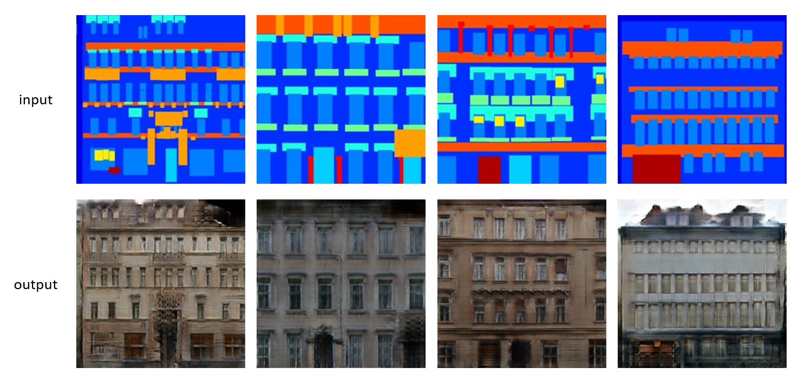

Pix2pix example
=================

Overview
--------

`Pix2pix <https://arxiv.org/abs/1611.07004>`__ is a conditional generative adversial network (conditional GAN) framework proposed by Isola et. al. in 2016 targeting at solving image-to-image translation problems. This framework performs well in a wide range of image generation problems. In the original paper, the authors demonstrate how to use pix2pix to solve the following image translation problems: 1) labels to street scene; 2) labels to facade; 3) BW to Color; 4) Aerial to Map; 5) Day to Night and 6) Edges to Photo. If you are interested, please read more in the `official project page <https://phillipi.github.io/pix2pix/>`__ . In this example, we use pix2pix to introduce how to use NNI for tuning conditional GANs. 

**Goals**
^^^^^^^^^^^^^

Although GANs are known to be able to generate high-resolution realistic images, they are generally fragile and difficult to optimize, and mode collapse can happen during training due to improper optimization setting, loss formulation, model architecture, weight initialization, or even data augmentation patterns. The goal of this tutorial is to leverage NNI hyperparameter tuning tools to automatically find a good setting for these important factors. 

In this example, we aim at selecting the following hyperparameters automatically:

* ``ngf``: number of generator filters in the last conv layer  
* ``ndf``: number of discriminator filters in the first conv layer
* ``netG``: generator architecture
* ``netD``: discriminator architecture
* ``norm``: normalization type
* ``init_type``: weight initialization method
* ``lr``: initial learning rate for adam
* ``beta1``: momentum term of adam
* ``lr_policy``: learning rate policy
* ``gan_mode``: type of GAN objective
* ``lambda_L1``: weight of L1 loss in the generator objective

**Experiments**
^^^^^^^^^^^^^^^^^^^^

Preparations
^^^^^^^^^^^^

This example requires the GPU version of PyTorch. PyTorch installation should be chosen based on system, python version, and cuda version.

Please refer to the detailed instruction of installing `PyTorch <https://pytorch.org/get-started/locally/>`__ 

Next, run the following shell script to clone the repository maintained by the original authors of pix2pix. This example relies on the implementations in this repository. 

.. code-block:: bash

   ./setup.sh

Pix2pix with NNI
^^^^^^^^^^^^^^^^^

**Search Space**

We summarize the range of values for each hyperparameter mentioned above into a single search space json object. 

.. code-block:: json
		
   {
       "ngf": {"_type":"choice","_value":[16, 32, 64, 128, 256]},
       "ndf": {"_type":"choice","_value":[16, 32, 64, 128, 256]},
       "netG": {"_type":"choice","_value":["resnet_9blocks", "unet_256"]},
       "netD": {"_type":"choice","_value":["basic", "pixel", "n_layers"]},
       "norm": {"_type":"choice","_value":["batch", "instance", "none"]},
       "init_type": {"_type":"choice","_value":["xavier", "normal", "kaiming", "orthogonal"]},
       "lr":{"_type":"choice","_value":[0.0001, 0.0002, 0.0005, 0.001, 0.005, 0.01, 0.1]},
       "beta1":{"_type":"uniform","_value":[0, 1]},
       "lr_policy": {"_type":"choice","_value":["linear", "step", "plateau", "cosine"]},
       "gan_mode": {"_type":"choice","_value":["vanilla", "lsgan", "wgangp"]} ,
       "lambda_L1": {"_type":"choice","_value":[1, 5, 10, 100, 250, 500]}
    }

Starting from v2.0, the search space is directly included in the config. Please find the example here: :githublink:`config.yml <examples/trials/pix2pix-pytorch/config.yml>`

**Trial**

To experiment on this set of hyperparameters using NNI, we have to write a trial code, which receives a set of parameter settings from NNI, trains a generator and discriminator using these parameters, and then reports the final scores back to NNI. In the experiment, NNI repeatedly calls this trial code, passing in different set of hyperparameter settings. It is important that the following three lines are incorporated in the trial code: 

* Use ``nni.get_next_parameter()`` to get next hyperparameter set.
* (Optional) Use ``nni.report_intermediate_result(score)`` to report the intermediate result after finishing each epoch.
* Use ``nni.report_final_result(score)`` to report the final result before the trial ends.

Implemented code directory: :githublink:`pix2pix.py <examples/trials/pix2pix-pytorch/pix2pix.py>`

Some notes on the implementation:

* The trial code for this example is adapted from the `repository maintained by the authors of Pix2pix and CycleGAN <https://github.com/junyanz/pytorch-CycleGAN-and-pix2pix>`__ .  You can also use your previous code directly. Please refer to `How to define a trial <Trials.rst>`__ for modifying the code.
* By default, the code uses the dataset "facades". It also supports the datasets "night2day", "edges2handbags", "edges2shoes", and "maps".
* For "facades", 200 epochs are enough for the model to converge to a point where the difference between models trained with different hyperparameters are salient enough for evaluation. If you are using other datasets, please consider increasing the ``n_epochs`` and ``n_epochs_decay`` parameters by either passing them as arguments when calling ``pix2pix.py`` in the config file (discussed below) or changing the ``pix2pix.py`` directly. Also, for "facades", 200 epochs are enought for the final training, while the number may vary for other datasets. 
* In this example, we use L1 loss on the test set as the score to report to NNI. Although L1 is by no means a comprehensive measure of image generation performance, at most times it makes sense for evaluating pix2pix models with similar architectural setup. In this example, for the hyperparameters we experiment on, a higher L1 score generally indicates a higher generation performance. 

**Config**

Here is the example config of running this experiment on local (with a single GPU):

code directory: :githublink:`examples/trials/pix2pix-pytorch/config.yml <examples/trials/pix2pix-pytorch/config.yml>`

To have a full glance on our implementation, check: :githublink:`examples/trials/pix2pix-pytorch/ <examples/trials/pix2pix-pytorch>`

Launch the experiment
^^^^^^^^^^^^^^^^^^^^^

We are ready for the experiment, let's now **run the config.yml file from your command line to start the experiment**.

.. code-block:: bash

   nnictl create --config nni/examples/trials/pix2pix-pytorch/config.yml

Collecting the Results
^^^^^^^^^^^^^^^^^^^^^^

By default, our trial code saves the final trained model for each trial in the ``checkpoints/`` directory in the trial directory of the NNI experiment. The ``latest_net_G.pth`` and ``latest_net_D.pth`` correspond to the save checkpoints for the generator and the discriminator.

To make it easier to run inference and see the generated images, we also incorporate a simple inference code here: :githublink:`test.py <examples/trials/pix2pix-pytorch/test.py>`

To use the code, run the following command:

.. code-block:: bash

   python3 test.py -c CHECKPOINT -p PARAMETER_CFG -d DATASET_NAME -o OUTPUT_DIR

``CHECKPOINT`` is the directory saving the checkpoints (e.g., the ``checkpoints/`` directory in the trial directory). ``PARAMETER_CFG`` is the ``parameter.cfg`` file generated by NNI recording the hyperparameter settings. This file can be found in the trial directory created by NNI. 

Results and Discussions
^^^^^^^^^^^^^^^^^^^^^^^

Following the previous steps, we ran the example for 40 trials using the TPE tuner. We found that the best-performing parameters on the 'facades' dataset to be the following set.

.. code-block:: json
		
   {
       "ngf": 16,
       "ndf": 128,
       "netG": "unet_256",
       "netD": "pixel",
       "norm": "none",
       "init_type": "normal",
       "lr": 0.0002,
       "beta1": 0.6954,
       "lr_policy": "step",
       "gan_mode": "lsgan",
       "lambda_L1": 500
    }

Meanwhile, we compare the results with the model training using the following default empirical hyperparameter settings:

.. code-block:: json
		
   {
       "ngf": 128,
       "ndf": 128,
       "netG": "unet_256",
       "netD": "basic",
       "norm": "batch",
       "init_type": "xavier",
       "lr": 0.0002,
       "beta1": 0.5,
       "lr_policy": "linear",
       "gan_mode": "lsgan",
       "lambda_L1": 100
    }

We can observe that for learning rate (0.0002), the generator architecture (U-Net), and gan objective (LSGAN), the two results agree with each other. This is also consistent with the widely accepted practice on this dataset. Meanwhile, the hyperparameters "beta1", "lambda_L1", "ngf", and "ndf" are slightly changed in the NNI's found solution to fit the target dataset. We found that the parameters searched by NNI outperforms the empirical parameters on the facades dataset both in terms of L1 loss and the visual qualities of the images. While the search hyperparameter has a L1 loss of 0.3317 on the test set of facades, the empirical hyperparameters can only achieve a L1 loss of 0.4148. The following image shows some sample results of facades test set input-output pairs produced by the model with hyperparameters tuned with NNI. 

