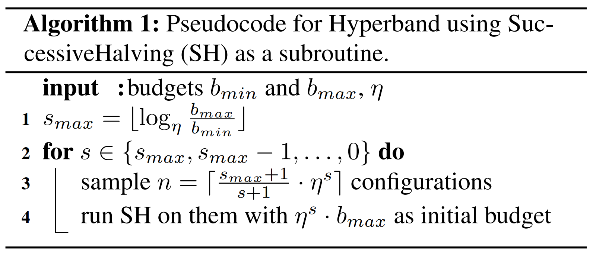
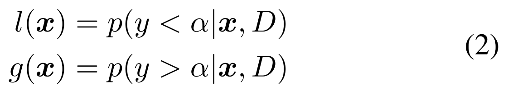
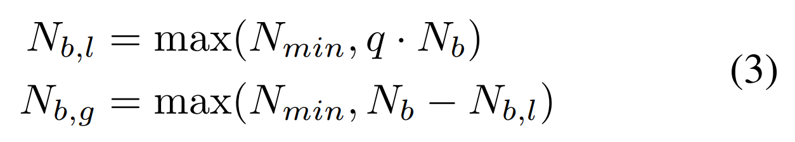
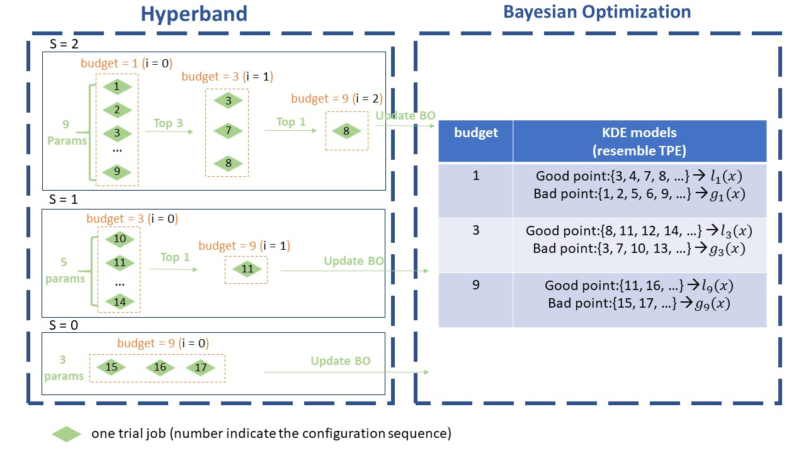
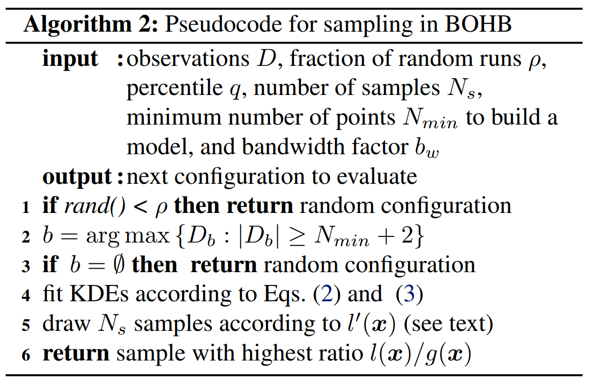
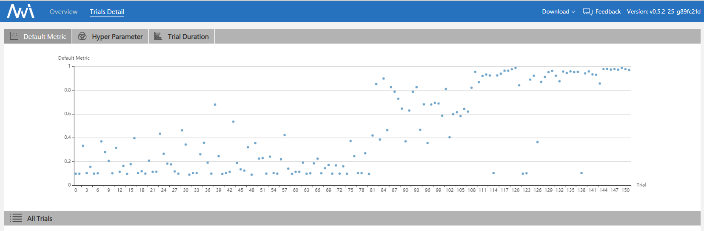

BOHB Advisor on NNI
===================

1. Introduction
---------------

BOHB is a robust and efficient hyperparameter tuning algorithm mentioned in `this reference paper <https://arxiv.org/abs/1807.01774>`__. BO is an abbreviation for "Bayesian Optimization" and HB is an abbreviation for "Hyperband".

BOHB relies on HB (Hyperband) to determine how many configurations to evaluate with which budget, but it **replaces the random selection of configurations at the beginning of each HB iteration by a model-based search (Bayesian Optimization)**. Once the desired number of configurations for the iteration is reached, the standard successive halving procedure is carried out using these configurations. We keep track of the performance of all function evaluations g(x, b) of configurations x on all budgets b to use as a basis for our models in later iterations.

Below we divide the introduction of the BOHB process into two parts:

HB (Hyperband)
^^^^^^^^^^^^^^

We follow Hyperband’s way of choosing the budgets and continue to use SuccessiveHalving. For more details, you can refer to the `Hyperband in NNI <HyperbandAdvisor.rst>`__ and the `reference paper for Hyperband <https://arxiv.org/abs/1603.06560>`__. This procedure is summarized by the pseudocode below.

BO (Bayesian Optimization)
^^^^^^^^^^^^^^^^^^^^^^^^^^

The BO part of BOHB closely resembles TPE with one major difference: we opted for a single multidimensional KDE compared to the hierarchy of one-dimensional KDEs used in TPE in order to better handle interaction effects in the input space.

Tree Parzen Estimator(TPE): uses a KDE (kernel density estimator) to model the densities.

To fit useful KDEs, we require a minimum number of data points Nmin; this is set to d + 1 for our experiments, where d is the number of hyperparameters. To build a model as early as possible, we do not wait until Nb = \|Db\|, where the number of observations for budget b is large enough to satisfy q · Nb ≥ Nmin. Instead, after initializing with Nmin + 2 random configurations, we choose the

best and worst configurations, respectively, to model the two densities.

Note that we also sample a constant fraction named **random fraction** of the configurations uniformly at random.

2. Workflow
-----------

This image shows the workflow of BOHB. Here we set max_budget = 9, min_budget = 1, eta = 3, others as default. In this case, s_max = 2, so we will continuously run the {s=2, s=1, s=0, s=2, s=1, s=0, ...} cycle. In each stage of SuccessiveHalving (the orange box), we will pick the top 1/eta configurations and run them again with more budget, repeating the SuccessiveHalving stage until the end of this iteration. At the same time, we collect the configurations, budgets and final metrics of each trial and use these to build a multidimensional KDEmodel with the key "budget".
 Multidimensional KDE is used to guide the selection of configurations for the next iteration.

The sampling procedure (using Multidimensional KDE to guide selection) is summarized by the pseudocode below.

3. Usage
--------

BOHB advisor requires the `ConfigSpace <https://github.com/automl/ConfigSpace>`__ package. ConfigSpace can be installed using the following command.

.. code-block:: bash

   nnictl package install --name=BOHB

To use BOHB, you should add the following spec in your experiment's YAML config file:

.. code-block:: yaml

   advisor:
     builtinAdvisorName: BOHB
     classArgs:
       optimize_mode: maximize
       min_budget: 1
       max_budget: 27
       eta: 3
       min_points_in_model: 7
       top_n_percent: 15
       num_samples: 64
       random_fraction: 0.33
       bandwidth_factor: 3.0
       min_bandwidth: 0.001

**classArgs Requirements:**

* **optimize_mode** (*maximize or minimize, optional, default = maximize*\ ) - If 'maximize', tuners will try to maximize metrics. If 'minimize', tuner will try to minimize metrics.
* **min_budget** (*int, optional, default = 1*\ ) - The smallest budget to assign to a trial job, (budget can be the number of mini-batches or epochs). Needs to be positive.
* **max_budget** (*int, optional, default = 3*\ ) - The largest budget to assign to a trial job, (budget can be the number of mini-batches or epochs). Needs to be larger than min_budget.
* **eta** (*int, optional, default = 3*\ ) - In each iteration, a complete run of sequential halving is executed. In it, after evaluating each configuration on the same subset size, only a fraction of 1/eta of them 'advances' to the next round. Must be greater or equal to 2.
* **min_points_in_model**\ (*int, optional, default = None*\ ): number of observations to start building a KDE. Default 'None' means dim+1; when the number of completed trials in this budget is equal to or larger than ``max{dim+1, min_points_in_model}``\ , BOHB will start to build a KDE model of this budget then use said KDE model to guide configuration selection. Needs to be positive. (dim means the number of hyperparameters in search space)
* **top_n_percent**\ (*int, optional, default = 15*\ ): percentage (between 1 and 99) of the observations which are considered good. Good points and bad points are used for building KDE models. For example, if you have 100 observed trials and top_n_percent is 15, then the top 15% of points will be used for building the good points models "l(x)". The remaining 85% of points will be used for building the bad point models "g(x)".
* **num_samples**\ (*int, optional, default = 64*\ ): number of samples to optimize EI (default 64). In this case, we will sample "num_samples" points and compare the result of l(x)/g(x). Then we will return the one with the maximum l(x)/g(x) value as the next configuration if the optimize_mode is ``maximize``. Otherwise, we return the smallest one.
* **random_fraction**\ (*float, optional, default = 0.33*\ ): fraction of purely random configurations that are sampled from the prior without the model.
* **bandwidth_factor**\ (*float, optional, default = 3.0*\ ): to encourage diversity, the points proposed to optimize EI are sampled from a 'widened' KDE where the bandwidth is multiplied by this factor. We suggest using the default value if you are not familiar with KDE.
* **min_bandwidth**\ (*float, optional, default = 0.001*\ ): to keep diversity, even when all (good) samples have the same value for one of the parameters, a minimum bandwidth (default: 1e-3) is used instead of zero. We suggest using the default value if you are not familiar with KDE.

*Please note that the float type currently only supports decimal representations. You have to use 0.333 instead of 1/3 and 0.001 instead of 1e-3.*

4. File Structure
-----------------

The advisor has a lot of different files, functions, and classes. Here, we will only give most of those files a brief introduction:

* ``bohb_advisor.py`` Definition of BOHB, handles interaction with the dispatcher, including generating new trials and processing results. Also includes the implementation of the HB (Hyperband) part.
* ``config_generator.py`` Includes the implementation of the BO (Bayesian Optimization) part. The function *get_config* can generate new configurations based on BO; the function *new_result* will update the model with the new result.

5. Experiment
-------------

MNIST with BOHB
^^^^^^^^^^^^^^^

code implementation: :githublink:`examples/trials/mnist-advisor <examples/trials/>`

We chose BOHB to build a CNN on the MNIST dataset. The following is our experimental final results:

More experimental results can be found in the `reference paper <https://arxiv.org/abs/1807.01774>`__. We can see that BOHB makes good use of previous results and has a balanced trade-off in exploration and exploitation.
