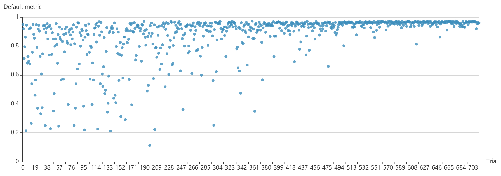
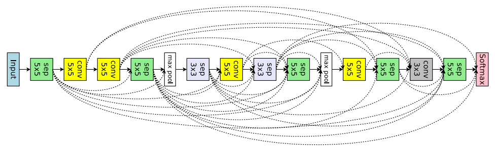
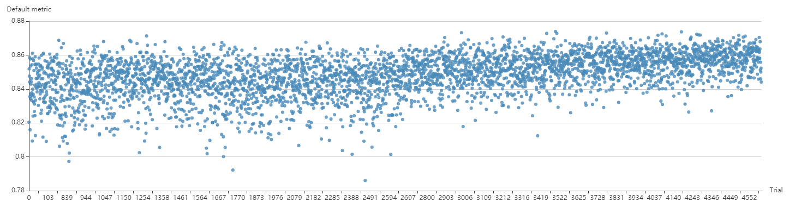

PPO Tuner on NNI
================

PPOTuner
--------

This is a tuner geared for NNI's Neural Architecture Search (NAS) interface. It uses the `ppo algorithm <https://arxiv.org/abs/1707.06347>`__. The implementation inherits the main logic of the ppo2 OpenAI implementation `here <https://github.com/openai/baselines/tree/master/baselines/ppo2>`__ and is adapted for the NAS scenario.

We had successfully tuned the mnist-nas example and has the following result:
**NOTE: we are refactoring this example to the latest NAS interface, will publish the example codes after the refactor.**

We also tune :githublink:`the macro search space for image classification in the enas paper <examples/trials/nas_cifar10>` (with a limited epoch number for each trial, i.e., 8 epochs), which is implemented using the NAS interface and tuned with PPOTuner. Here is Figure 7 from the `enas paper <https://arxiv.org/pdf/1802.03268.pdf>`__ to show what the search space looks like

The figure above was the chosen architecture. Each square is a layer whose operation was chosen from 6 options. Each dashed line is a skip connection, each square layer can choose 0 or 1 skip connections, getting the output from a previous layer. **Note that**\ , in original macro search space, each square layer could choose any number of skip connections, while in our implementation, it is only allowed to choose 0 or 1.

The results are shown in figure below (see the experimenal config :githublink:`here <examples/trials/nas_cifar10/config_ppo.yml>`\ :

