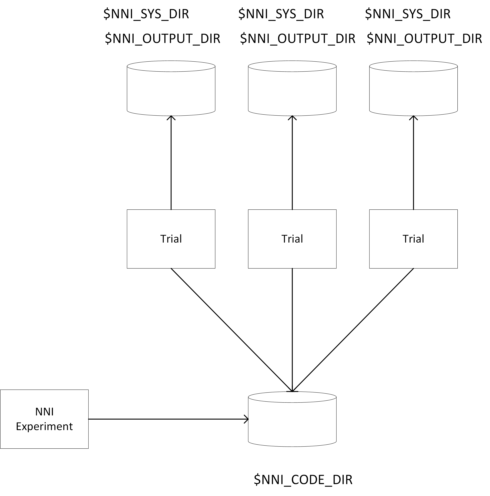

# Data Management in NNI
## overview
In NNI's experiments, users should specify a `codeDir` configuration, this configuration contains the code files and data files, NNI will use data in this folder to start trial jobs. Before a trial is launched, NNI will copy files in `codeDir` to trial's working folder, every trial job has its own working folder and do not share `codeDir`. 

## environment variable
NNI has environment variables including `$NNI_CODE_DIR`, `$NNI_SYS_DIR` and `$NNI_OUTPUT_DIR` to specify different data path. Users could get these environment variables from their python code, for example:
```
import os
print(os.environ['NNI_OUTPUT_DIR'])
```

1. `$NNI_CODE_DIR`.  
    `$NNI_CODE_DIR` is a path which stores users' code data, trial job could use this folder as a sharing folder.
2. `$NNI_SYS_DIR`.  
    `$NNI_SYS_DIR`  is a path which stores trial jobs' metirc file and parameter file, this folder is working directory of a trial, and contains trial job's code files which copied from `$NNI_CODE_DIR`.
3. `$NNI_OUTPUT_DIR`.  
    `NNI_OUTPUT_DIR`  is a path which stores trial jobs' output file, including `stdout`, `stderr` etc.


