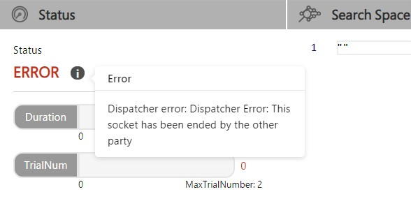

**How to Debug in NNI**
===========================

Overview
--------

There are three parts that might have logs in NNI. They are nnimanager, dispatcher and trial. Here we will introduce them succinctly. More information please refer to `Overview <../Overview.rst>`__.

* **NNI controller**\ : NNI controller (nnictl) is the nni command-line tool that is used to manage experiments (e.g., start an experiment).
* **nnimanager**\ : nnimanager is the core of NNI, whose log is important when the whole experiment fails (e.g., no webUI or training service fails)
* **Dispatcher**\ : Dispatcher calls the methods of **Tuner** and **Assessor**. Logs of dispatcher are related to the tuner or assessor code.

  * **Tuner**\ : Tuner is an AutoML algorithm, which generates a new configuration for the next try. A new trial will run with this configuration.
  * **Assessor**\ : Assessor analyzes trial's intermediate results (e.g., periodically evaluated accuracy on test dataset) to tell whether this trial can be early stopped or not.

* **Trial**\ : Trial code is the code you write to run your experiment, which is an individual attempt at applying a new configuration (e.g., a set of hyperparameter values, a specific nerual architecture).

Where is the log
----------------

There are three kinds of log in NNI. When creating a new experiment, you can specify log level as debug by adding ``--debug``. Besides, you can set more detailed log level in your configuration file by using
``logLevel`` keyword. Available logLevels are: ``trace``\ , ``debug``\ , ``info``\ , ``warning``\ , ``error``\ , ``fatal``.

NNI controller
^^^^^^^^^^^^^^

All possible errors that happen when launching an NNI experiment can be found here.

You can use ``nnictl log stderr`` to find error information. For more options please refer to `NNICTL <Nnictl.rst>`__

Experiment Root Directory
^^^^^^^^^^^^^^^^^^^^^^^^^

Every experiment has a root folder, which is shown on the right-top corner of webUI. Or you could assemble it by replacing the ``experiment_id`` with your actual experiment_id in path ``~/nni-experiments/experiment_id/`` in case of webUI failure. ``experiment_id`` could be seen when you run ``nnictl create ...`` to create a new experiment.

..

   For flexibility, we also offer a ``logDir`` option in your configuration, which specifies the directory to store all experiments (defaults to ``~/nni-experiments``\ ). Please refer to `Configuration <ExperimentConfig.rst>`__ for more details.

Under that directory, there is another directory named ``log``\ , where ``nnimanager.log`` and ``dispatcher.log`` are placed.

Trial Root Directory
^^^^^^^^^^^^^^^^^^^^

Usually in webUI, you can click ``+`` in the left of every trial to expand it to see each trial's log path.

Besides, there is another directory under experiment root directory, named ``trials``\ , which stores all the trials.
Every trial has a unique id as its directory name. In this directory, a file named ``stderr`` records trial error and another named ``trial.log`` records this trial's log.

Different kinds of errors
-------------------------

There are different kinds of errors. However, they can be divided into three categories based on their severity. So when nni fails, check each part sequentially.

Generally, if webUI is started successfully, there is a ``Status`` in the ``Overview`` tab, serving as a possible indicator of what kind of error happens. Otherwise you should check manually.

**NNI** Fails
^^^^^^^^^^^^^^^^^

This is the most serious error. When this happens, the whole experiment fails and no trial will be run. Usually this might be related to some installation problem.

When this happens, you should check ``nnictl``\ 's error output file ``stderr`` (i.e., nnictl log stderr) and then the ``nnimanager``\ 's log to find if there is any error.

**Dispatcher** Fails
^^^^^^^^^^^^^^^^^^^^^^^^

Dispatcher fails. Usually, for some new users of NNI, it means that tuner fails. You could check dispatcher's log to see what happens to your dispatcher. For built-in tuner, some common errors might be invalid search space (unsupported type of search space or inconsistence between initializing args in configuration file and actual tuner's __init__ function args).

Take the later situation as an example. If you write a customized tuner who's __init__ function has an argument called ``optimize_mode``\ , which you do not provide in your configuration file, NNI will fail to run your tuner so the experiment fails. You can see errors in the webUI like:

Here we can see it is a dispatcher error. So we can check dispatcher's log, which might look like:

.. code-block:: bash

   [2019-02-19 19:36:45] DEBUG (nni.main/MainThread) START
   [2019-02-19 19:36:47] ERROR (nni.main/MainThread) __init__() missing 1 required positional arguments: 'optimize_mode'
   Traceback (most recent call last):
     File "/usr/lib/python3.7/site-packages/nni/__main__.py", line 202, in <module>
       main()
     File "/usr/lib/python3.7/site-packages/nni/__main__.py", line 164, in main
       args.tuner_args)
     File "/usr/lib/python3.7/site-packages/nni/__main__.py", line 81, in create_customized_class_instance
       instance = class_constructor(**class_args)
   TypeError: __init__() missing 1 required positional arguments: 'optimize_mode'.

**Trial** Fails
^^^^^^^^^^^^^^^^^^^

In this situation, NNI can still run and create new trials.

It means your trial code (which is run by NNI) fails. This kind of error is strongly related to your trial code. Please check trial's log to fix any possible errors shown there.

A common example of this would be run the mnist example without installing tensorflow. Surely there is an Import Error (that is, not installing tensorflow but trying to import it in your trial code) and thus every trial fails.

.. image:: ../../img/trial_error.jpg
   :target: ../../img/trial_error.jpg
   :alt: 

As it shows, every trial has a log path, where you can find trial's log and stderr.

In addition to experiment level debug, NNI also provides the capability for debugging a single trial without the need to start the entire experiment. Refer to `standalone mode <../TrialExample/Trials#standalone-mode-for-debugging>`__ for more information about debug single trial code.
