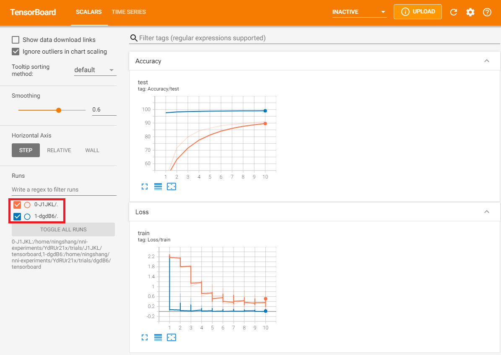
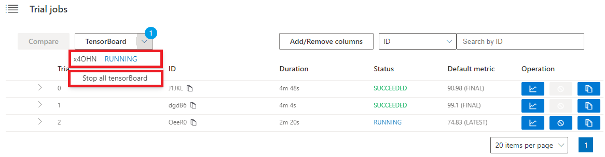

How to Use Tensorboard within WebUI
===================================

You can launch a tensorboard process cross one or multi trials within webui since NNI v2.2. This feature supports local training service and reuse mode training service with shared storage for now, and will support more scenarios in later nni version.

Preparation
-----------

Make sure tensorboard installed in your environment. If you never used tensorboard, here are getting start tutorials for your reference, `tensorboard with tensorflow <https://www.tensorflow.org/tensorboard/get_started>`__, `tensorboard with pytorch <https://pytorch.org/tutorials/recipes/recipes/tensorboard_with_pytorch.html>`__.

Use WebUI Launch Tensorboard
----------------------------

1. Save Logs
^^^^^^^^^^^^

NNI will automatically fetch the ``tensorboard`` subfolder under trial's output folder as tensorboard logdir. So in trial's source code, you need to save the tensorboard logs under ``NNI_OUTPUT_DIR/tensorboard``. This log path can be joined as:

.. code-block:: python

    log_dir = os.path.join(os.environ["NNI_OUTPUT_DIR"], 'tensorboard')

2. Launch Tensorboard
^^^^^^^^^^^^^^^^^^^^^

Like compare, select the trials you want to combine to launch the tensorboard at first, then click the ``Tensorboard`` button.

.. image:: ../../img/Tensorboard_1.PNG
   :target: ../../img/Tensorboard_1.PNG
   :alt: 

After click the ``OK`` button in the pop-up box, you will jump to the tensorboard portal.

.. image:: ../../img/Tensorboard_2.PNG
   :target: ../../img/Tensorboard_2.PNG
   :alt: 

You can see the ``SequenceID-TrialID`` on the tensorboard portal.

3. Stop All
^^^^^^^^^^^^

If you want to open the portal you have already launched, click the tensorboard id. If you don't need the tensorboard anymore, click ``Stop all tensorboard`` button.

