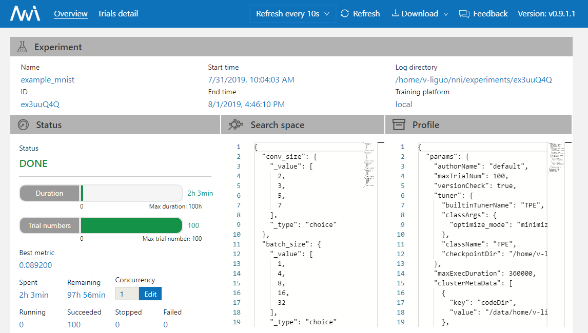
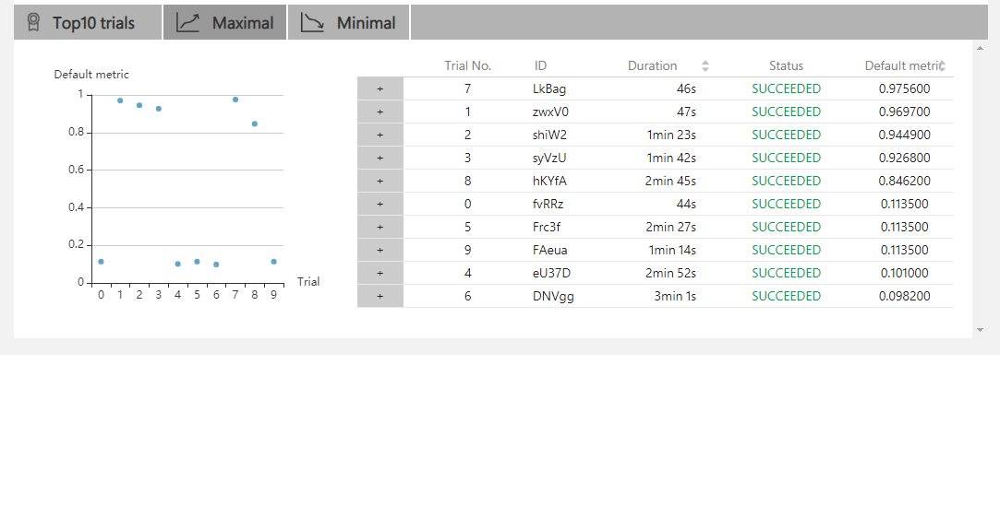
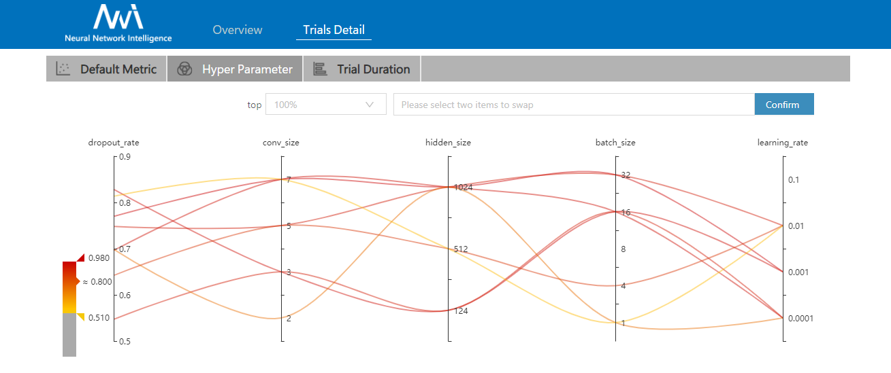
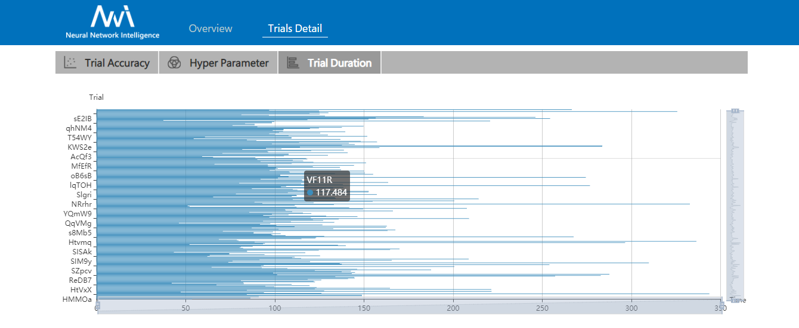
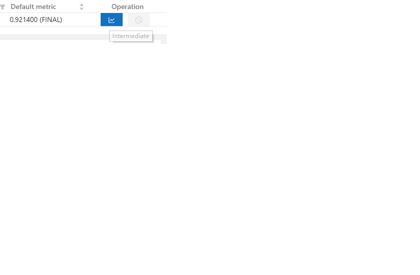
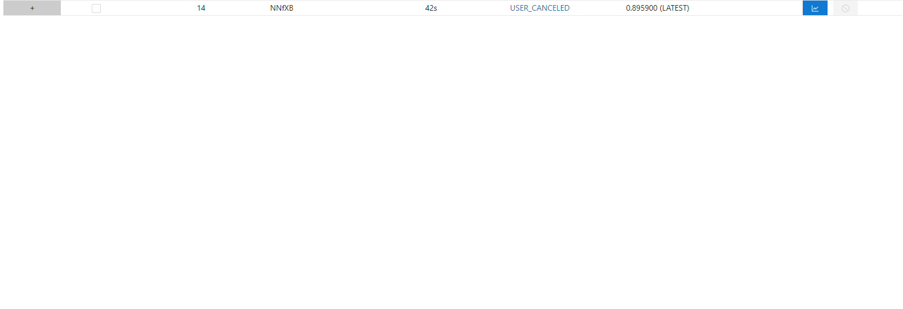

WebUI
=====

View summary page
-----------------

Click the tab "Overview".

* On the overview tab, you can see the experiment trial profile/search space and the performance of top trials.

* If your experiment has many trials, you can change the refresh interval here.

.. image:: ../../img/webui-img/refresh-interval.png
   :target: ../../img/webui-img/refresh-interval.png
   :alt: 

* You can review and download the experiment results and nni-manager/dispatcher log files from the "View" button.

.. image:: ../../img/webui-img/download.png
   :target: ../../img/webui-img/download.png
   :alt: 

* You can click the exclamation point in the error box to see a log message if the experiment's status is an error.

.. image:: ../../img/webui-img/log-error.png
   :target: ../../img/webui-img/log-error.png
   :alt: 

.. image:: ../../img/webui-img/review-log.png
   :target: ../../img/webui-img/review-log.png
   :alt: 

* You can click "Feedback" to report any questions.

View job default metric
-----------------------

* Click the tab "Default Metric" to see the point graph of all trials. Hover to see its specific default metric and search space message.

.. image:: ../../img/webui-img/default-metric.png
   :target: ../../img/webui-img/default-metric.png
   :alt: 

* Click the switch named "optimization curve" to see the experiment's optimization curve.

.. image:: ../../img/webui-img/best-curve.png
   :target: ../../img/webui-img/best-curve.png
   :alt: 

View hyper parameter
--------------------

Click the tab "Hyper Parameter" to see the parallel graph.

* You can select the percentage to see top trials.
* Choose two axis to swap its positions

View Trial Duration
-------------------

Click the tab "Trial Duration" to see the bar graph.

View Trial Intermediate Result Graph
------------------------------------

Click the tab "Intermediate Result" to see the line graph.

.. image:: ../../img/webui-img/trials_intermeidate.png
   :target: ../../img/webui-img/trials_intermeidate.png
   :alt: 

The trial may have many intermediate results in the training process. In order to see the trend of some trials more clearly, we set a filtering function for the intermediate result graph.

You may find that these trials will get better or worse at an intermediate result. This indicates that it is an important and relevant intermediate result. To take a closer look at the point here, you need to enter its corresponding X-value at #Intermediate. Then input the range of metrics on this intermedia result. In the picture below, we choose the No. 4 intermediate result and set the range of metrics to 0.8-1.

.. image:: ../../img/webui-img/filter-intermediate.png
   :target: ../../img/webui-img/filter-intermediate.png
   :alt: 

View trials status
------------------

Click the tab "Trials Detail" to see the status of all trials. Specifically:

* Trial detail: trial's id, trial's duration, start time, end time, status, accuracy, and search space file.

.. image:: ../../img/webui-img/detail-local.png
   :target: ../../img/webui-img/detail-local.png
   :alt: 

* The button named "Add column" can select which column to show on the table. If you run an experiment whose final result is a dict, you can see other keys in the table. You can choose the column "Intermediate count" to watch the trial's progress.

.. image:: ../../img/webui-img/addColumn.png
   :target: ../../img/webui-img/addColumn.png
   :alt: 

* If you want to compare some trials, you can select them and then click "Compare" to see the results.

.. image:: ../../img/webui-img/select-trial.png
   :target: ../../img/webui-img/select-trial.png
   :alt: 

.. image:: ../../img/webui-img/compare.png
   :target: ../../img/webui-img/compare.png
   :alt: 

* Support to search for a specific trial by it's id, status, Trial No. and parameters.

.. image:: ../../img/webui-img/search-trial.png
   :target: ../../img/webui-img/search-trial.png
   :alt: 

* You can use the button named "Copy as python" to copy the trial's parameters.

.. image:: ../../img/webui-img/copyParameter.png
   :target: ../../img/webui-img/copyParameter.png
   :alt: 

* If you run on the OpenPAI or Kubeflow platform, you can also see the hdfsLog.

.. image:: ../../img/webui-img/detail-pai.png
   :target: ../../img/webui-img/detail-pai.png
   :alt: 

* Intermediate Result Graph: you can see the default and other keys in this graph by clicking the operation column button.

.. image:: ../../img/webui-img/intermediate.png
   :target: ../../img/webui-img/intermediate.png
   :alt: 

* Kill: you can kill a job that status is running.

.. image:: ../../img/webui-img/kill-running.png
   :target: ../../img/webui-img/kill-running.png
   :alt: 

