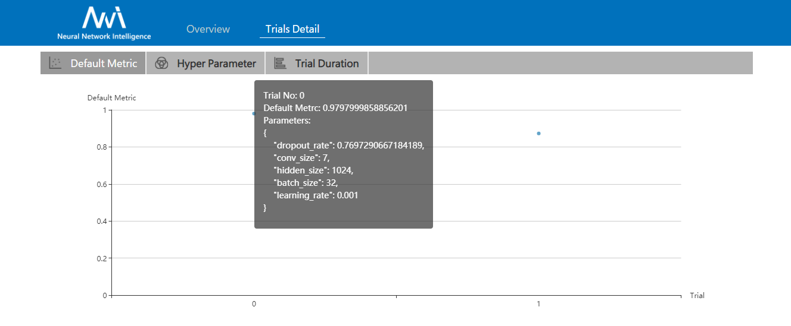
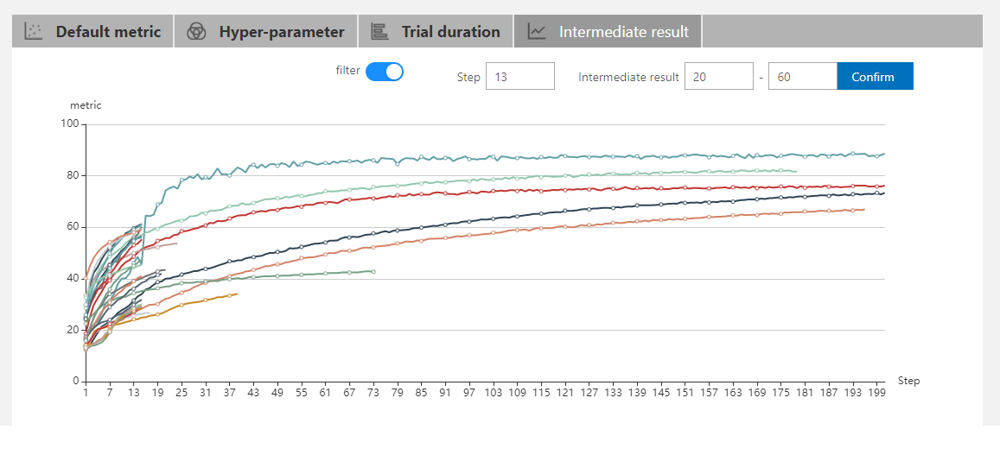

# WebUI

## View summary page

Click the tab "Overview".

* See the experiment trial profile and search space message.
* Support to download the experiment result.
* Support to export nni-manager and dispatcher log file.
* If you have any question, you can click "Feedback" to report it.

* See good performance trials.

## View job default metric

Click the tab "Default Metric" to see the point graph of all trials. Hover to see its specific default metric and search space message.

## View hyper parameter

Click the tab "Hyper Parameter" to see the parallel graph.

* You can select the percentage to see top trials.
* Choose two axis to swap its positions

## View Trial Duration

Click the tab "Trial Duration" to see the bar graph.

## View Trial Intermediate Result Graph

Click the tab "Intermediate Result" to see the lines graph.

The graph has a filter function. You can open the filter button. And then enter your focus point
in the scape input. Simultaneously, intermediate result inputs can limit the intermediate's range.

## View trials status 

Click the tab "Trials Detail" to see the status of the all trials. Specifically:

* Trial detail: trial's id, trial's duration, start time, end time, status, accuracy and search space file.

* The button named "Add column" can select which column to show in the table. If you run an experiment that final result is dict, you can see other keys in the table.

* You can use the button named "Copy as python" to copy trial's parameters.

* If you run on OpenPAI or Kubeflow platform, you can also see the hdfsLog.

* Kill: you can kill a job that status is running.
* Support to search for a specific trial.
* Intermediate Result Graph.

