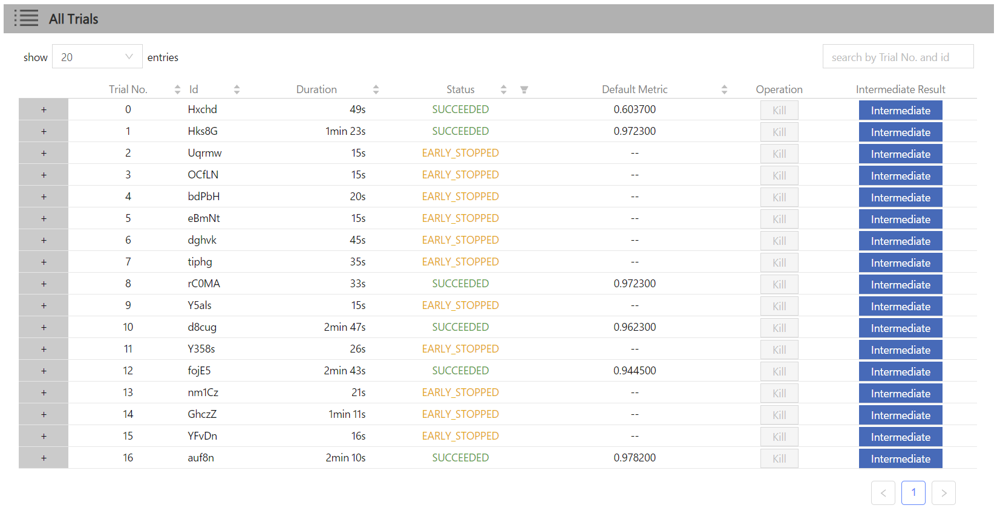

Builtin-Assessors
=================

In order to save on computing resources, NNI supports an early stopping policy and has an interface called **Assessor** to do this job.

Assessor receives the intermediate result from a trial and decides whether the trial should be killed using a specific algorithm. Once the trial experiment meets the early stopping conditions (which means Assessor is pessimistic about the final results), the assessor will kill the trial and the status of the trial will be `EARLY_STOPPED`.

Here is an experimental result of MNIST after using the 'Curvefitting' Assessor in 'maximize' mode. You can see that Assessor successfully **early stopped** many trials with bad hyperparameters in advance. If you use Assessor, you may get better hyperparameters using the same computing resources.

*Implemented code directory: [config_assessor.yml](https://github.com/Microsoft/nni/blob/v1.9/examples/trials/mnist-tfv1/config_assessor.yml)*

..  toctree::
    :maxdepth: 1

    Overview<./Assessor/BuiltinAssessor>
    Medianstop<./Assessor/MedianstopAssessor>
    Curvefitting<./Assessor/CurvefittingAssessor>