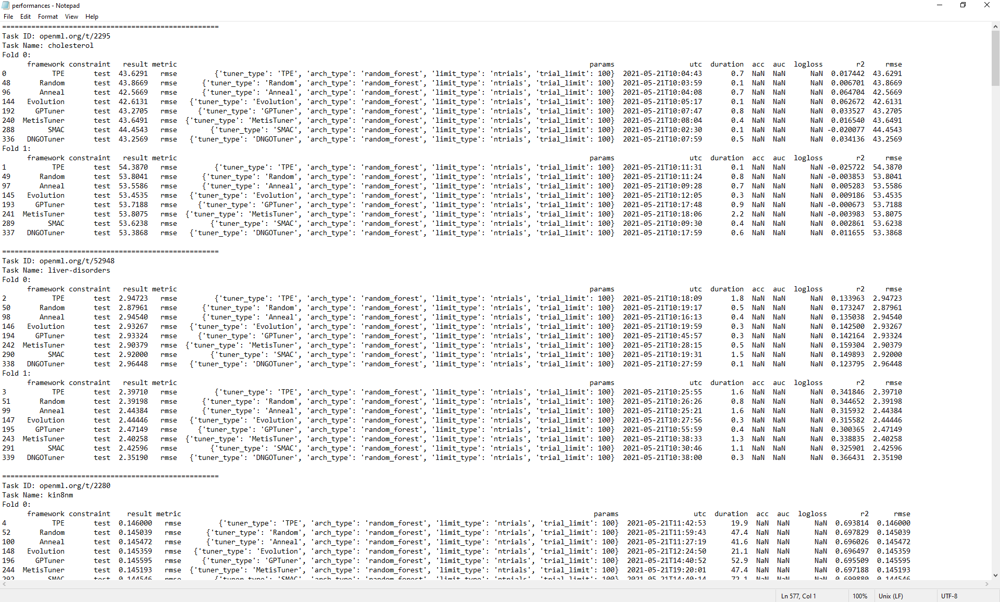

Benchmark for Tuners
====================

We provide a benchmarking tool to compare the performances of tuners provided by NNI (and users' custom tuners) on different tasks. The implementation of this tool is based on the automlbenchmark repository (https://github.com/openml/automlbenchmark), which provides services of running different *frameworks* against different *benchmarks* consisting of multiple *tasks*. The tool is located in ``examples/trials/benchmarking/automlbenchmark``. This document provides a brief introduction to the tool and its usage. 

Terminology
^^^^^^^^^^^

* **task**\ : a task can be thought of as a tuple (dataset, metric). It provides train and test datasets to the frameworks. Then, based on the returns predictions on the test set, the task evaluates the metric (e.g., mse for regression, f1 for classification) and reports the score. 
* **benchmark**\ : a benchmark is a set of tasks, along with other external constraints such as time limits. 
* **framework**\ : given a task, a framework solves the proposed regression or classification problem using train data and produces predictions on the test set. The automlbenchmark framework does not pose any restrictions on the hypothesis space of a framework. In our implementation, each framework is a tuple (tuner, architecture), where architecture provides the hypothesis space, and tuner optimizes the hyperparameters of the architecture. In our implementation, to solve a task, we let the tuner continuously tune the hyperparameters (by giving it cross-validation score on the train data as feedback) until the time or trial limit is reached. Then, the architecture is retrained on the entire train set using the best set of hyperparameters. 
* **tuner**\ : a tuner or advisor defined in the hpo folder, or a custom tuner provided by the user. 
* **architecture**\ : an architecture is a specific method for solving the tasks, along with a set of hyperparameters to optimize (i.e., the search space). See ``./nni/extensions/NNI/architectures`` for examples.

Note: currently, the only architecture supported is random forest. The architecture implementation and search space definition can be found in ``./nni/extensions/NNI/architectures/run_random_forest.py``. The tasks in benchmarks "nnivalid" and "nnismall" are suitable to solve with random forests. 
  
Setup
^^^^^

Due to some incompatibilities between automlbenchmark and python 3.8, python 3.7 is recommended for running experiments contained in this folder. First, run the following shell script to clone the automlbenchmark repository. Note: it is recommended to perform the following steps in a separate virtual environment, as the setup code may install several packages. 

.. code-block:: bash

   ./setup.sh

Run predefined benchmarks on existing tuners
^^^^^^^^^^^^^^^^^^^^^^^^^^^^^^^^^^^^^^^^^^^^

.. code-block:: bash

   ./runbenchmark_nni.sh [tuner-names]

This script runs the benchmark 'nnivalid', which consists of a regression task, a binary classification task, and a multi-class classification task. After the script finishes, you can find a summary of the results in the folder results_[time]/reports/. To run on other predefined benchmarks, change the ``benchmark`` variable in ``runbenchmark_nni.sh``. Some benchmarks are defined in ``/examples/trials/benchmarking/automlbenchmark/nni/benchmarks``\ , and others are defined in ``/examples/trials/benchmarking/automlbenchmark/automlbenchmark/resources/benchmarks/``. One example of larger benchmarks is "nnismall", which consists of 8 regression tasks, 8 binary classification tasks, and 8 multi-class classification tasks. We also provide three separate 8-task benchmarks "nnismall-regression", "nnismall-binary", and "nnismall-multiclass" corresponding to the three types of tasks in nnismall.

By default, the script runs the benchmark on all embedded tuners in NNI. If provided a list of tuners in [tuner-names], it only runs the tuners in the list. Currently, the following tuner names are supported: "TPE", "Random", "Anneal", "Evolution", "SMAC", "GPTuner", "MetisTuner", "DNGOTuner", "Hyperband", "BOHB". It is also possible to run the benchmark on custom tuners. See the next sections for details. 

By default, the script runs the specified tuners against the specified benchmark one by one. To run the experiment for all tuners simultaneously in the background, set the "serialize" flag to false in ``runbenchmark_nni.sh``. 

Note: the SMAC tuner, DNGO tuner, and the BOHB advisor has to be manually installed before running benchmarks on them. Please refer to `this page <https://nni.readthedocs.io/en/stable/Tuner/BuiltinTuner.html?highlight=nni>`_ for more details on installation.

Run customized benchmarks on existing tuners
^^^^^^^^^^^^^^^^^^^^^^^^^^^^^^^^^^^^^^^^^^^^

You can design your own benchmarks and evaluate the performance of NNI tuners on them. To run customized benchmarks, add a benchmark_name.yaml file in the folder ``./nni/benchmarks``\ , and change the ``benchmark`` variable in ``runbenchmark_nni.sh``. See ``./automlbenchmark/resources/benchmarks/`` for some examples of defining a custom benchmark.

Run benchmarks on custom tuners
^^^^^^^^^^^^^^^^^^^^^^^^^^^^^^^

You may also use the benchmark to compare a custom tuner written by yourself with the NNI built-in tuners. To use custom tuners, first make sure that the tuner inherits from ``nni.tuner.Tuner`` and correctly implements the required APIs. For more information on implementing a custom tuner, please refer to `here <https://nni.readthedocs.io/en/stable/Tuner/CustomizeTuner.html>`_. Next, perform the following steps:

#. Install the custom tuner via the command ``nnictl algo register``. Check `this document <https://nni.readthedocs.io/en/stable/Tutorial/Nnictl.html>`_ for details. 
#. In ``./nni/frameworks.yaml``\ , add a new framework extending the base framework NNI. Make sure that the parameter ``tuner_type`` corresponds to the "builtinName" of tuner installed in step 1.
#. Run the following command

.. code-block:: bash

      ./runbenchmark_nni.sh new-tuner-builtinName

The benchmark will automatically find and match the tuner newly added to your NNI installation.
      
A Benchmark Example 
^^^^^^^^^^^^^^^^^^^

As an example, we ran the "nnismall" benchmark on the following 8 tuners: "TPE", "Random", "Anneal", "Evolution", "SMAC", "GPTuner", "MetisTuner", "DNGOTuner". As some of the tasks contains a considerable amount of training data, it took about 2 days to run the whole benchmark on one tuner. For a more detailed description of the tasks, please check ``/examples/trials/benchmarking/automlbenchmark/nni/benchmarks/nnismall_description.txt``. For binary and multi-class classification tasks, the metric "auc" and "logloss" were used for evaluation, while for regression, "r2" and "rmse" were used. 

After the script finishes, the final scores of each tuner are summarized in the file ``results[time]/reports/performances.txt``. Since the file is large, we only show the following screenshot and summarize other important statistics instead. 

When the results are parsed, the tuners are also ranked based on their final performance. The following three tables show the average ranking of the tuners for each metric (logloss, rmse, auc). 

Also, for every tuner, their performance for each type of metric is summarized (another view of the same data). We present this statistics in the fourth table. Note that this information can be found at ``results[time]/reports/rankings.txt``. 

Average rankings for metric rmse (for regression tasks). We found that Anneal performs the best among all NNI built-in tuners. 

.. list-table::
   :header-rows: 1

   * - Tuner Name
     - Average Ranking
   * - Anneal
     - 3.75
   * - Random
     - 4.00
   * - Evolution
     - 4.44
   * - DNGOTuner
     - 4.44
   * - SMAC
     - 4.56
   * - TPE
     - 4.94
   * - GPTuner
     - 4.94
   * - MetisTuner
     - 4.94

Average rankings for metric auc (for classification tasks). We found that SMAC performs the best among all NNI built-in tuners.

.. list-table::
   :header-rows: 1

   * - Tuner Name
     - Average Ranking
   * - SMAC
     - 3.67
   * - GPTuner
     - 4.00
   * - Evolution
     - 4.22
   * - Anneal
     - 4.39
   * - MetisTuner
     - 4.39
   * - TPE
     - 4.67
   * - Random
     - 5.33
   * - DNGOTuner
     - 5.33

Average rankings for metric logloss (for classification tasks). We found that Random performs the best among all NNI built-in tuners. 

.. list-table::
   :header-rows: 1

   * - Tuner Name
     - Average Ranking
   * - Random
     - 3.36
   * - DNGOTuner
     - 3.50
   * - SMAC
     - 3.93
   * - GPTuner
     - 4.64
   * - TPE
     - 4.71
   * - Anneal
     - 4.93
   * - Evolution
     - 5.00
   * - MetisTuner
     - 5.93

To view the same data in another way, for each tuner, we present the average rankings on different types of metrics. From the table, we can find that, for example, the DNGOTuner performs better for the tasks whose metric is "logloss" than for the tasks with metric "auc". We hope this information can to some extent guide the choice of tuners given some knowledge of task types. 

.. list-table::
   :header-rows: 1

   * - Tuner Name
     - rmse
     - auc
     - logloss
   * - TPE
     - 4.94
     - 4.67
     - 4.71
   * - Random
     - 4.00
     - 5.33
     - 3.36
   * - Anneal
     - 3.75
     - 4.39
     - 4.93
   * - Evolution
     - 4.44
     - 4.22
     - 5.00
   * - GPTuner
     - 4.94
     - 4.00
     - 4.64
   * - MetisTuner
     - 4.94
     - 4.39
     - 5.93
   * - SMAC
     - 4.56
     - 3.67
     - 3.93
   * - DNGOTuner
     - 4.44
     - 5.33
     - 3.50

Besides these reports, our script also generates two graphs for each fold of each task: one graph presents the best score received by each tuner until trial x, and another graph shows the score that each tuner receives in trial x. These two graphs can give some information regarding how the tuners are "converging" to their final solution. We found that for "nnismall", tuners on the random forest model with search space defined in ``/examples/trials/benchmarking/automlbenchmark/nni/extensions/NNI/architectures/run_random_forest.py`` generally converge to the final solution after 40 to 60 trials. As there are too much graphs to incldue in a single report (96 graphs in total), we only present 10 graphs here.

.. image:: ../img/hpo_benchmark/car_fold1_1.jpg
   :target: ../img/hpo_benchmark/car_fold1_1.jpg
   :alt: 

.. image:: ../img/hpo_benchmark/car_fold1_2.jpg
   :target: ../img/hpo_benchmark/car_fold1_2.jpg
   :alt: 

The previous two graphs are generated for fold 1 of the task "car". In the first graph, we observe that most tuners find a relatively good solution within 40 trials. In this experiment, among all tuners, the DNGOTuner converges fastest to the best solution (within 10 trials). Its best score improved for three times in the entire experiment. In the second graph, we observe that most tuners have their score flucturate between 0.8 and 1 throughout the experiment. However, it seems that the Anneal tuner (green line) is more unstable (having more fluctuations) while the GPTuner has a more stable pattern. This may be interpreted as the Anneal tuner explores more aggressively than the GPTuner and thus its scores for different trials vary a lot. Regardless, although this pattern can to some extent hint a tuner's position on the explore-exploit tradeoff, it is not a comprehensive evaluation of a tuner's effectiveness. 

.. image:: ../img/hpo_benchmark/christine_fold0_1.jpg
   :target: ../img/hpo_benchmark/christine_fold0_1.jpg
   :alt: 

.. image:: ../img/hpo_benchmark/christine_fold0_2.jpg
   :target: ../img/hpo_benchmark/christine_fold0_2.jpg
   :alt: 

.. image:: ../img/hpo_benchmark/cnae-9_fold0_1.jpg
   :target: ../img/hpo_benchmark/cnae-9_fold0_1.jpg
   :alt: 

.. image:: ../img/hpo_benchmark/cnae-9_fold0_2.jpg
   :target: ../img/hpo_benchmark/cnae-9_fold0_2.jpg
   :alt: 

.. image:: ../img/hpo_benchmark/credit-g_fold1_1.jpg
   :target: ../img/hpo_benchmark/credit-g_fold1_1.jpg
   :alt: 

.. image:: ../img/hpo_benchmark/credit-g_fold1_2.jpg
   :target: ../img/hpo_benchmark/credit-g_fold1_2.jpg
   :alt: 

.. image:: ../img/hpo_benchmark/titanic_2_fold1_1.jpg
   :target: ../img/hpo_benchmark/titanic_2_fold1_1.jpg
   :alt: 

.. image:: ../img/hpo_benchmark/titanic_2_fold1_2.jpg
   :target: ../img/hpo_benchmark/titanic_2_fold1_2.jpg
   :alt: 

