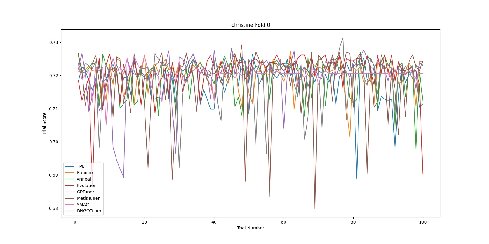

HPO Benchmark Example Statistics
================================

A Benchmark Example 
^^^^^^^^^^^^^^^^^^^

As an example, we ran the "nnismall" benchmark on the following 8 tuners: "TPE", "Random", "Anneal", "Evolution", "SMAC", "GPTuner", "MetisTuner", "DNGOTuner". As some of the tasks contains a considerable amount of training data, it took about 2 days to run the whole benchmark on one tuner using a single CPU core. For a more detailed description of the tasks, please check ``/examples/trials/benchmarking/automlbenchmark/nni/benchmarks/nnismall_description.txt``. For binary and multi-class classification tasks, the metric "auc" and "logloss" were used for evaluation, while for regression, "r2" and "rmse" were used. 

After the script finishes, the final scores of each tuner are summarized in the file ``results[time]/reports/performances.txt``. Since the file is large, we only show the following screenshot and summarize other important statistics instead. 

.. image:: ../img/hpo_benchmark/performances.png
   :target: ../img/hpo_benchmark/performances.png
   :alt: 

In addition, when the results are parsed, the tuners are ranked based on their final performance. ``results[time]/reports/rankings.txt`` presents the average ranking of the tuners for each metric (logloss, rmse, auc). Here we present the data in the first three tables. Also, for every tuner, their performance for each type of metric is summarized (another view of the same data). We present this statistics in the fourth table. 

Average rankings for metric rmse:

.. list-table::
   :header-rows: 1

   * - Tuner Name
     - Average Ranking
   * - Anneal
     - 3.75
   * - Random
     - 4.00
   * - Evolution
     - 4.44
   * - DNGOTuner
     - 4.44
   * - SMAC
     - 4.56
   * - TPE
     - 4.94
   * - GPTuner
     - 4.94
   * - MetisTuner
     - 4.94

Average rankings for metric auc:

.. list-table::
   :header-rows: 1

   * - Tuner Name
     - Average Ranking
   * - SMAC
     - 3.67
   * - GPTuner
     - 4.00
   * - Evolution
     - 4.22
   * - Anneal
     - 4.39
   * - MetisTuner
     - 4.39
   * - TPE
     - 4.67
   * - Random
     - 5.33
   * - DNGOTuner
     - 5.33

Average rankings for metric logloss:

.. list-table::
   :header-rows: 1

   * - Tuner Name
     - Average Ranking
   * - Random
     - 3.36
   * - DNGOTuner
     - 3.50
   * - SMAC
     - 3.93
   * - GPTuner
     - 4.64
   * - TPE
     - 4.71
   * - Anneal
     - 4.93
   * - Evolution
     - 5.00
   * - MetisTuner
     - 5.93

Average rankings for tuners:

.. list-table::
   :header-rows: 1

   * - Tuner Name
     - rmse
     - auc
     - logloss
   * - TPE
     - 4.94
     - 4.67
     - 4.71
   * - Random
     - 4.00
     - 5.33
     - 3.36
   * - Anneal
     - 3.75
     - 4.39
     - 4.93
   * - Evolution
     - 4.44
     - 4.22
     - 5.00
   * - GPTuner
     - 4.94
     - 4.00
     - 4.64
   * - MetisTuner
     - 4.94
     - 4.39
     - 5.93
   * - SMAC
     - 4.56
     - 3.67
     - 3.93
   * - DNGOTuner
     - 4.44
     - 5.33
     - 3.50

Besides these reports, our script also generates two graphs for each fold of each task. The first graph presents the best score seen by each tuner until trial x, and the second graph shows the scores of each tuner in trial x. These two graphs can give some information regarding how the tuners are "converging". We found that for "nnismall", tuners on the random forest model with search space defined in ``/examples/trials/benchmarking/automlbenchmark/nni/extensions/NNI/architectures/run_random_forest.py`` generally converge to the final solution after 40 to 60 trials. As there are too much graphs to incldue in a single report (96 graphs in total), we only present 10 graphs here.

.. image:: ../img/hpo_benchmark/car_fold1_1.jpg
   :target: ../img/hpo_benchmark/car_fold1_1.jpg
   :alt: 

.. image:: ../img/hpo_benchmark/car_fold1_2.jpg
   :target: ../img/hpo_benchmark/car_fold1_2.jpg
   :alt: 

For example, the previous two graphs are generated for fold 1 of the task "car". In the first graph, we can observe that most tuners find a relatively good solution within 40 trials. In this experiment, among all tuners, the DNGOTuner converges fastest to the best solution (within 10 trials). Its score improved three times in the entire experiment. In the second graph, we observe that most tuners have their score flucturate between 0.8 and 1 throughout the experiment duration. However, it seems that the Anneal tuner (green line) is more unstable (having more fluctuations) while the GPTuner has a more stable pattern. Regardless, although this pattern can to some extent be interpreted as a tuner's position on the explore-exploit tradeoff, it cannot be used for a comprehensive evaluation of a tuner's effectiveness. 

.. image:: ../img/hpo_benchmark/christine_fold0_1.jpg
   :target: ../img/hpo_benchmark/christine_fold0_1.jpg
   :alt: 

.. image:: ../img/hpo_benchmark/cnae-9_fold0_1.jpg
   :target: ../img/hpo_benchmark/cnae-9_fold0_1.jpg
   :alt: 

.. image:: ../img/hpo_benchmark/cnae-9_fold0_2.jpg
   :target: ../img/hpo_benchmark/cnae-9_fold0_2.jpg
   :alt: 

.. image:: ../img/hpo_benchmark/credit-g_fold1_1.jpg
   :target: ../img/hpo_benchmark/credit-g_fold1_1.jpg
   :alt: 

.. image:: ../img/hpo_benchmark/credit-g_fold1_2.jpg
   :target: ../img/hpo_benchmark/credit-g_fold1_2.jpg
   :alt: 

.. image:: ../img/hpo_benchmark/titanic_2_fold1_1.jpg
   :target: ../img/hpo_benchmark/titanic_2_fold1_1.jpg
   :alt: 

.. image:: ../img/hpo_benchmark/titanic_2_fold1_2.jpg
   :target: ../img/hpo_benchmark/titanic_2_fold1_2.jpg
   :alt: 

