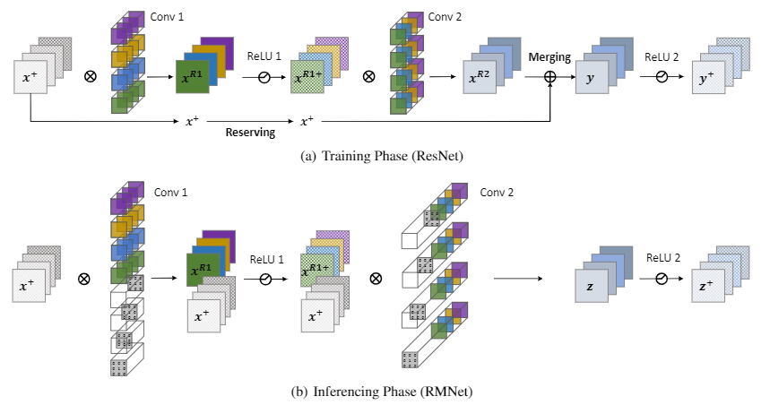
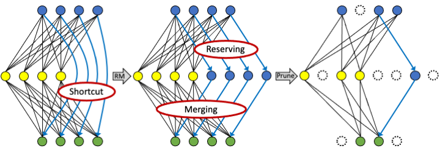

#################
RM -R: Removing Residual Connection Equivalently (`Paper <https://arxiv.org/abs/2111.00687>`__, `Code <https://github.com/fxmeng/RMNet>`__ )
#################

The existence of residual connection requires that the number of channels of the input featuremap is equal to the number of channels of the output featuremap which constrains the ability for pruning.
We propose to equivalently remove the residual connection in a vanilla ResNet and MobileNetV2 architecture by a reserving and merging(RM) operation on ResBlocks.
This plug-in method can improve previous pruning methods by a large margin.

RM -R & Pruning
^^^^^^^
The residual connection reserves the input feature map and merges them into the residual function's output. 
Our goal is to equivalently implement the function of reserving and merging in a plain model. 
The whole process of RM operation is shown in the following figures. 
Figure a) shows a ResBlock during the training phase. Figure b) is the converted RMBlock for inference, which has no residual connections. Both blocks have equal output given the same input.



We first remove residual connection from MobileNetV2 with RM Operaion and then apply pruning on it.
As shown in the following figure, there doesn't exists residual connections within residual blocks. 
Channels within different ResBlocks will no longer have correlations, which is friendly for pruning.


   
   
How to Use
^^^^^^^

The following one shows how to apply RM -R on NNI model compression. More use cases and solutions will be added in the future.

  Step 1: train a model for pruning:
  
  ```bash
  python3 amc_train.py --model_type mobilenetv2
  ```

  Step 2: Converting mobilenetv2 to mobilenetv1 and finetune this model:
  
  ```bash
  python3 amc_train.py --model_type mobilenetv1 --dataset cifar10 --ckpt logs/mobilenetv2_cifar10_train-run1/ckpt.best.pth
  ```

  Step 3: Pruning with AMCPruner:
  
  ```bash
  python3 amc_search.py --model_type mobilenetv1 --dataset cifar10 --ckpt logs/mobilenetv1_cifar10_finetune-run2/ckpt.best.pth --flops_ratio 0.5
  ```

  Step 4: Finetune pruned model:
  
  ```bash
  python3 amc_train.py --model_type mobilenetv1 --dataset cifar10 --ckpt logs/mobilenetv1_cifar10_r0.5_search-run3/best_model.pth --mask logs/mobilenetv1_cifar10_r0.5_search-run3/best_mask.pth
  ```

Results
^^^^^^^

.. list-table::
   :header-rows: 1
   :widths: auto
   
   * - Method	
     - Acc(%)
     - A100(fps)
     - V100(fps)
     - P40(fps)
     - 3090(fps)
     - 2080Ti(fps)
     - 1060(fps)
     - T4(fps)
     - CPU(fps)
     
   * - Baseline
     - 71.79
     - 6253
     - 3759
     - 1131
     - 4136
     - 2650	
     - 667
     - 550
     - 43
   * - AMC
     - 70.84
     - 8234
     - 4982
     - 1520
     - 5421
     - 3474
     - 891
     - 732
     - 54
   * - RM+AMC
     - 71.88
     - 9671
     - 5675
     - 1860
     - 6346
     - 4333
     - 990
     - 863
     - 77
     
More details are on: https://github.com/fxmeng/nni/blob/81f35adb6df1c5907897d30929dfccdd8ec4d888/examples/model_compress/pruning/amc/README.md
