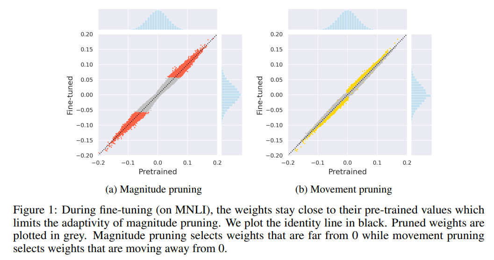

Supported Pruning Algorithms in NNI
===================================

NNI provides several pruning algorithms that reproducing from the papers. In pruning v2, NNI split the pruning algorithm into more detailed components.
This means users can freely combine components from different algorithms,
or easily use a component of their own implementation to replace a step in the original algorithm to implement their own pruning algorithm.

Right now, pruning algorithms with how to generate masks in one step are implemented as pruners,
and how to schedule sparsity in each iteration are implemented as iterative pruners.

**Pruner**

* `Level Pruner <#level-pruner>`__
* `L1 Norm Pruner <#l1-norm-pruner>`__
* `L2 Norm Pruner <#l2-norm-pruner>`__
* `FPGM Pruner <#fpgm-pruner>`__
* `Slim Pruner <#slim-pruner>`__
* `Activation APoZ Rank Pruner <#activation-apoz-rank-pruner>`__
* `Activation Mean Rank Pruner <#activation-mean-rank-pruner>`__
* `Taylor FO Weight Pruner <#taylor-fo-weight-pruner>`__
* `ADMM Pruner <#admm-pruner>`__
* `Movement Pruner <#movement-pruner>`__

**Iterative Pruner**

* `Linear Pruner <#linear-pruner>`__
* `AGP Pruner <#agp-pruner>`__
* `Lottery Ticket Pruner <#lottery-ticket-pruner>`__
* `Simulated Annealing Pruner <#simulated-annealing-pruner>`__
* `Auto Compress Pruner <#auto-compress-pruner>`__
* `AMC Pruner <#amc-pruner>`__

Level Pruner
------------

This is a basic pruner, and in some papers called it magnitude pruning or fine-grained pruning.

It will mask the weight in each specified layer with smaller absolute value by a ratio configured in the config list.

Usage
^^^^^^

.. code-block:: python

   from nni.algorithms.compression.v2.pytorch.pruning import LevelPruner
   config_list = [{ 'sparsity': 0.8, 'op_types': ['default'] }]
   pruner = LevelPruner(model, config_list)
   masked_model, masks = pruner.compress()

For detailed example please refer to :githublink:`examples/model_compress/pruning/v2/level_pruning_torch.py <examples/model_compress/pruning/v2/level_pruning_torch.py>`

User configuration for Level Pruner
^^^^^^^^^^^^^^^^^^^^^^^^^^^^^^^^^^^

**PyTorch**

.. autoclass:: nni.algorithms.compression.v2.pytorch.pruning.LevelPruner

L1 Norm Pruner
--------------

L1 norm pruner computes the l1 norm of the layer weight on the first dimension,
then prune the weight blocks on this dimension with smaller l1 norm values.
i.e., compute the l1 norm of the filters in convolution layer as metric values,
compute the l1 norm of the weight by rows in linear layer as metric values.

For more details, please refer to `PRUNING FILTERS FOR EFFICIENT CONVNETS <https://arxiv.org/abs/1608.08710>`__\.

In addition, L1 norm pruner also supports dependency-aware mode.

Usage
^^^^^^

.. code-block:: python

   from nni.algorithms.compression.v2.pytorch.pruning import L1NormPruner
   config_list = [{ 'sparsity': 0.8, 'op_types': ['Conv2d'] }]
   pruner = L1NormPruner(model, config_list)
   masked_model, masks = pruner.compress()

For detailed example please refer to :githublink:`examples/model_compress/pruning/v2/norm_pruning_torch.py <examples/model_compress/pruning/v2/norm_pruning_torch.py>`

User configuration for L1 Norm Pruner
^^^^^^^^^^^^^^^^^^^^^^^^^^^^^^^^^^^^^

**PyTorch**

.. autoclass:: nni.algorithms.compression.v2.pytorch.pruning.L1NormPruner

L2 Norm Pruner
--------------

L2 norm pruner is a variant of L1 norm pruner. It uses l2 norm as metric to determine which weight elements should be pruned.

L2 norm pruner also supports dependency-aware mode.

Usage
^^^^^^

.. code-block:: python

   from nni.algorithms.compression.v2.pytorch.pruning import L2NormPruner
   config_list = [{ 'sparsity': 0.8, 'op_types': ['Conv2d'] }]
   pruner = L2NormPruner(model, config_list)
   masked_model, masks = pruner.compress()

For detailed example please refer to :githublink:`examples/model_compress/pruning/v2/norm_pruning_torch.py <examples/model_compress/pruning/v2/norm_pruning_torch.py>`

User configuration for L2 Norm Pruner
^^^^^^^^^^^^^^^^^^^^^^^^^^^^^^^^^^^^^

**PyTorch**

.. autoclass:: nni.algorithms.compression.v2.pytorch.pruning.L2NormPruner

FPGM Pruner
-----------

FPGM pruner prunes the blocks of the weight on the first dimension with the smallest geometric median.
FPGM chooses the weight blocks with the most replaceable contribution.

For more details, please refer to `Filter Pruning via Geometric Median for Deep Convolutional Neural Networks Acceleration <https://arxiv.org/abs/1811.00250>`__.

FPGM pruner also supports dependency-aware mode.

Usage
^^^^^^

.. code-block:: python

   from nni.algorithms.compression.v2.pytorch.pruning import FPGMPruner
   config_list = [{ 'sparsity': 0.8, 'op_types': ['Conv2d'] }]
   pruner = FPGMPruner(model, config_list)
   masked_model, masks = pruner.compress()

For detailed example please refer to :githublink:`examples/model_compress/pruning/v2/fpgm_pruning_torch.py <examples/model_compress/pruning/v2/fpgm_pruning_torch.py>`

User configuration for FPGM Pruner
^^^^^^^^^^^^^^^^^^^^^^^^^^^^^^^^^^^

**PyTorch**

.. autoclass:: nni.algorithms.compression.v2.pytorch.pruning.FPGMPruner

Slim Pruner
-----------

Slim pruner adds sparsity regularization on the scaling factors of batch normalization (BN) layers during training to identify unimportant channels.
The channels with small scaling factor values will be pruned.

For more details, please refer to `Learning Efficient Convolutional Networks through Network Slimming <https://arxiv.org/abs/1708.06519>`__\.

Usage
^^^^^^

.. code-block:: python

   import nni
   from nni.algorithms.compression.v2.pytorch.pruning import SlimPruner

   # make sure you have used nni.trace to wrap the optimizer class before initialize
   traced_optimizer = nni.trace(torch.optim.Adam)(model.parameters())

   config_list = [{ 'sparsity': 0.8, 'op_types': ['BatchNorm2d'] }]
   pruner = SlimPruner(model, config_list, trainer, traced_optimizer, criterion, training_epochs=1)
   masked_model, masks = pruner.compress()

For detailed example please refer to :githublink:`examples/model_compress/pruning/v2/slim_pruning_torch.py <examples/model_compress/pruning/v2/slim_pruning_torch.py>`

User configuration for Slim Pruner
^^^^^^^^^^^^^^^^^^^^^^^^^^^^^^^^^^^

**PyTorch**

.. autoclass:: nni.algorithms.compression.v2.pytorch.pruning.SlimPruner

Activation APoZ Rank Pruner
---------------------------

Activation APoZ rank pruner is a pruner which prunes on the first weight dimension,
with the smallest importance criterion ``APoZ`` calculated from the output activations of convolution layers to achieve a preset level of network sparsity.
The pruning criterion ``APoZ`` is explained in the paper `Network Trimming: A Data-Driven Neuron Pruning Approach towards Efficient Deep Architectures <https://arxiv.org/abs/1607.03250>`__.

The APoZ is defined as:

:math:`APoZ_{c}^{(i)} = APoZ\left(O_{c}^{(i)}\right)=\frac{\sum_{k}^{N} \sum_{j}^{M} f\left(O_{c, j}^{(i)}(k)=0\right)}{N \times M}`

Activation APoZ rank pruner also supports dependency-aware mode.

Usage
^^^^^^

.. code-block:: python

   import nni
   from nni.algorithms.compression.v2.pytorch.pruning import ActivationAPoZRankPruner

   # make sure you have used nni.trace to wrap the optimizer class before initialize
   traced_optimizer = nni.trace(torch.optim.Adam)(model.parameters())

   config_list = [{ 'sparsity': 0.8, 'op_types': ['Conv2d'] }]
   pruner = ActivationAPoZRankPruner(model, config_list, trainer, traced_optimizer, criterion, training_batches=20)
   masked_model, masks = pruner.compress()

For detailed example please refer to :githublink:`examples/model_compress/pruning/v2/activation_pruning_torch.py <examples/model_compress/pruning/v2/activation_pruning_torch.py>`

User configuration for Activation APoZ Rank Pruner
^^^^^^^^^^^^^^^^^^^^^^^^^^^^^^^^^^^^^^^^^^^^^^^^^^

**PyTorch**

.. autoclass:: nni.algorithms.compression.v2.pytorch.pruning.ActivationAPoZRankPruner

Activation Mean Rank Pruner
---------------------------

Activation mean rank pruner is a pruner which prunes on the first weight dimension,
with the smallest importance criterion ``mean activation`` calculated from the output activations of convolution layers to achieve a preset level of network sparsity.
The pruning criterion ``mean activation`` is explained in section 2.2 of the paper `Pruning Convolutional Neural Networks for Resource Efficient Inference <https://arxiv.org/abs/1611.06440>`__.

Activation mean rank pruner also supports dependency-aware mode.

Usage
^^^^^^

.. code-block:: python

   import nni
   from nni.algorithms.compression.v2.pytorch.pruning import ActivationMeanRankPruner

   # make sure you have used nni.trace to wrap the optimizer class before initialize
   traced_optimizer = nni.traces(torch.optim.Adam)(model.parameters())

   config_list = [{ 'sparsity': 0.8, 'op_types': ['Conv2d'] }]
   pruner = ActivationMeanRankPruner(model, config_list, trainer, traced_optimizer, criterion, training_batches=20)
   masked_model, masks = pruner.compress()

For detailed example please refer to :githublink:`examples/model_compress/pruning/v2/activation_pruning_torch.py <examples/model_compress/pruning/v2/activation_pruning_torch.py>`

User configuration for Activation Mean Rank Pruner
^^^^^^^^^^^^^^^^^^^^^^^^^^^^^^^^^^^^^^^^^^^^^^^^^^

**PyTorch**

.. autoclass:: nni.algorithms.compression.v2.pytorch.pruning.ActivationMeanRankPruner

Taylor FO Weight Pruner
-----------------------

Taylor FO weight pruner is a pruner which prunes on the first weight dimension,
based on estimated importance calculated from the first order taylor expansion on weights to achieve a preset level of network sparsity.
The estimated importance is defined as the paper `Importance Estimation for Neural Network Pruning <http://jankautz.com/publications/Importance4NNPruning_CVPR19.pdf>`__.

:math:`\widehat{\mathcal{I}}_{\mathcal{S}}^{(1)}(\mathbf{W}) \triangleq \sum_{s \in \mathcal{S}} \mathcal{I}_{s}^{(1)}(\mathbf{W})=\sum_{s \in \mathcal{S}}\left(g_{s} w_{s}\right)^{2}`

Taylor FO weight pruner also supports dependency-aware mode.

What's more, we provide a global-sort mode for this pruner which is aligned with paper implementation.

Usage
^^^^^^

.. code-block:: python

   import nni
   from nni.algorithms.compression.v2.pytorch.pruning import TaylorFOWeightPruner

   # make sure you have used nni.trace to wrap the optimizer class before initialize
   traced_optimizer = nni.trace(torch.optim.Adam)(model.parameters())

   config_list = [{ 'sparsity': 0.8, 'op_types': ['Conv2d'] }]
   pruner = TaylorFOWeightPruner(model, config_list, trainer, traced_optimizer, criterion, training_batches=20)
   masked_model, masks = pruner.compress()

For detailed example please refer to :githublink:`examples/model_compress/pruning/v2/taylorfo_pruning_torch.py <examples/model_compress/pruning/v2/taylorfo_pruning_torch.py>`

User configuration for Activation Mean Rank Pruner
^^^^^^^^^^^^^^^^^^^^^^^^^^^^^^^^^^^^^^^^^^^^^^^^^^

**PyTorch**

.. autoclass:: nni.algorithms.compression.v2.pytorch.pruning.TaylorFOWeightPruner

ADMM Pruner
-----------

Alternating Direction Method of Multipliers (ADMM) is a mathematical optimization technique,
by decomposing the original nonconvex problem into two subproblems that can be solved iteratively.
In weight pruning problem, these two subproblems are solved via 1) gradient descent algorithm and 2) Euclidean projection respectively. 

During the process of solving these two subproblems, the weights of the original model will be changed.
Then a fine-grained pruning will be applied to prune the model according to the config list given.

This solution framework applies both to non-structured and different variations of structured pruning schemes.

For more details, please refer to `A Systematic DNN Weight Pruning Framework using Alternating Direction Method of Multipliers <https://arxiv.org/abs/1804.03294>`__.

Usage
^^^^^^

.. code-block:: python

   import nni
   from nni.algorithms.compression.v2.pytorch.pruning import ADMMPruner

   # make sure you have used nni.trace to wrap the optimizer class before initialize
   traced_optimizer = nni.trace(torch.optim.Adam)(model.parameters())

   config_list = [{ 'sparsity': 0.8, 'op_types': ['Conv2d'] }]
   pruner = ADMMPruner(model, config_list, trainer, traced_optimizer, criterion, iterations=10, training_epochs=1)
   masked_model, masks = pruner.compress()

For detailed example please refer to :githublink:`examples/model_compress/pruning/v2/admm_pruning_torch.py <examples/model_compress/pruning/v2/admm_pruning_torch.py>`

User configuration for ADMM Pruner
^^^^^^^^^^^^^^^^^^^^^^^^^^^^^^^^^^

**PyTorch**

.. autoclass:: nni.algorithms.compression.v2.pytorch.pruning.ADMMPruner

Movement Pruner
---------------

Movement pruner is an implementation of movement pruning.
This is a "fine-pruning" algorithm, which means the masks may change during each fine-tuning step.
Each weight element will be scored by the opposite of the sum of the product of weight and its gradient during each step.
This means the weight elements moving towards zero will accumulate negative scores, the weight elements moving away from zero will accumulate positive scores.
The weight elements with low scores will be masked during inference.

The following figure from the paper shows the weight pruning by movement pruning.

For more details, please refer to `Movement Pruning: Adaptive Sparsity by Fine-Tuning <https://arxiv.org/abs/2005.07683>`__.

Usage
^^^^^^

.. code-block:: python

   import nni
   from nni.algorithms.compression.v2.pytorch.pruning import MovementPruner

   # make sure you have used nni.trace to wrap the optimizer class before initialize
   traced_optimizer = nni.trace(torch.optim.Adam)(model.parameters())

   config_list = [{'op_types': ['Linear'], 'op_partial_names': ['bert.encoder'], 'sparsity': 0.9}]
   pruner = MovementPruner(model, config_list, trainer, traced_optimizer, criterion, 10, 3000, 27000)
   masked_model, masks = pruner.compress()

User configuration for Movement Pruner
^^^^^^^^^^^^^^^^^^^^^^^^^^^^^^^^^^^^^^

**PyTorch**

.. autoclass:: nni.algorithms.compression.v2.pytorch.pruning.MovementPruner

Reproduced Experiment
^^^^^^^^^^^^^^^^^^^^^

.. list-table::
   :header-rows: 1
   :widths: auto

   * - Model
     - Dataset
     - Remaining Weights
     - MaP acc.(paper/ours)
     - MvP acc.(paper/ours)
   * - Bert base
     - MNLI - Dev
     - 10%
     - 77.8% / 73.6%
     - 79.3% / 78.8%

Linear Pruner
-------------

Linear pruner is an iterative pruner, it will increase sparsity evenly from scratch during each iteration.
For example, the final sparsity is set as 0.5, and the iteration number is 5, then the sparsity used in each iteration are ``[0, 0.1, 0.2, 0.3, 0.4, 0.5]``.

Usage
^^^^^^

.. code-block:: python

   from nni.algorithms.compression.v2.pytorch.pruning import LinearPruner
   config_list = [{ 'sparsity': 0.8, 'op_types': ['Conv2d'] }]
   pruner = LinearPruner(model, config_list, pruning_algorithm='l1', total_iteration=10, finetuner=finetuner)
   pruner.compress()
   _, model, masks, _, _ = pruner.get_best_result()

For detailed example please refer to :githublink:`examples/model_compress/pruning/v2/iterative_pruning_torch.py <examples/model_compress/pruning/v2/iterative_pruning_torch.py>`

User configuration for Linear Pruner
^^^^^^^^^^^^^^^^^^^^^^^^^^^^^^^^^^^^

**PyTorch**

.. autoclass:: nni.algorithms.compression.v2.pytorch.pruning.LinearPruner

AGP Pruner
----------

This is an iterative pruner, which the sparsity is increased from an initial sparsity value :math:`s_{i}` (usually 0) to a final sparsity value :math:`s_{f}` over a span of :math:`n` pruning iterations,
starting at training step :math:`t_{0}` and with pruning frequency :math:`\Delta t`:

:math:`s_{t}=s_{f}+\left(s_{i}-s_{f}\right)\left(1-\frac{t-t_{0}}{n \Delta t}\right)^{3} \text { for } t \in\left\{t_{0}, t_{0}+\Delta t, \ldots, t_{0} + n \Delta t\right\}`

For more details please refer to `To prune, or not to prune: exploring the efficacy of pruning for model compression <https://arxiv.org/abs/1710.01878>`__\.

Usage
^^^^^^

.. code-block:: python

   from nni.algorithms.compression.v2.pytorch.pruning import AGPPruner
   config_list = [{ 'sparsity': 0.8, 'op_types': ['Conv2d'] }]
   pruner = AGPPruner(model, config_list, pruning_algorithm='l1', total_iteration=10, finetuner=finetuner)
   pruner.compress()
   _, model, masks, _, _ = pruner.get_best_result()

For detailed example please refer to :githublink:`examples/model_compress/pruning/v2/iterative_pruning_torch.py <examples/model_compress/pruning/v2/iterative_pruning_torch.py>`

User configuration for AGP Pruner
^^^^^^^^^^^^^^^^^^^^^^^^^^^^^^^^^

**PyTorch**

.. autoclass:: nni.algorithms.compression.v2.pytorch.pruning.AGPPruner

Lottery Ticket Pruner
---------------------

`The Lottery Ticket Hypothesis: Finding Sparse, Trainable Neural Networks <https://arxiv.org/abs/1803.03635>`__\ ,
authors Jonathan Frankle and Michael Carbin,provides comprehensive measurement and analysis,
and articulate the *lottery ticket hypothesis*\ : dense, randomly-initialized, feed-forward networks contain subnetworks (*winning tickets*\ ) that
-- when trained in isolation -- reach test accuracy comparable to the original network in a similar number of iterations.

In this paper, the authors use the following process to prune a model, called *iterative prunning*\ :

..

   #. Randomly initialize a neural network f(x;theta_0) (where theta\ *0 follows D*\ {theta}).
   #. Train the network for j iterations, arriving at parameters theta_j.
   #. Prune p% of the parameters in theta_j, creating a mask m.
   #. Reset the remaining parameters to their values in theta_0, creating the winning ticket f(x;m*theta_0).
   #. Repeat step 2, 3, and 4.

If the configured final sparsity is P (e.g., 0.8) and there are n times iterative pruning,
each iterative pruning prunes 1-(1-P)^(1/n) of the weights that survive the previous round.

Usage
^^^^^^

.. code-block:: python

   from nni.algorithms.compression.v2.pytorch.pruning import LotteryTicketPruner
   config_list = [{ 'sparsity': 0.8, 'op_types': ['Conv2d'] }]
   pruner = LotteryTicketPruner(model, config_list, pruning_algorithm='l1', total_iteration=10, finetuner=finetuner, reset_weight=True)
   pruner.compress()
   _, model, masks, _, _ = pruner.get_best_result()

For detailed example please refer to :githublink:`examples/model_compress/pruning/v2/iterative_pruning_torch.py <examples/model_compress/pruning/v2/iterative_pruning_torch.py>`

User configuration for Lottery Ticket Pruner
^^^^^^^^^^^^^^^^^^^^^^^^^^^^^^^^^^^^^^^^^^^^

**PyTorch**

.. autoclass:: nni.algorithms.compression.v2.pytorch.pruning.LotteryTicketPruner

Simulated Annealing Pruner
--------------------------

We implement a guided heuristic search method, Simulated Annealing (SA) algorithm. As mentioned in the paper, this method is enhanced on guided search based on prior experience.
The enhanced SA technique is based on the observation that a DNN layer with more number of weights often has a higher degree of model compression with less impact on overall accuracy.

* Randomly initialize a pruning rate distribution (sparsities).
* While current_temperature < stop_temperature:

  #. generate a perturbation to current distribution
  #. Perform fast evaluation on the perturbated distribution
  #. accept the perturbation according to the performance and probability, if not accepted, return to step 1
  #. cool down, current_temperature <- current_temperature * cool_down_rate

For more details, please refer to `AutoCompress: An Automatic DNN Structured Pruning Framework for Ultra-High Compression Rates <https://arxiv.org/abs/1907.03141>`__.

Usage
^^^^^^

.. code-block:: python

   from nni.algorithms.compression.v2.pytorch.pruning import SimulatedAnnealingPruner
   config_list = [{ 'sparsity': 0.8, 'op_types': ['Conv2d'] }]
   pruner = SimulatedAnnealingPruner(model, config_list, pruning_algorithm='l1', evaluator=evaluator, cool_down_rate=0.9, finetuner=finetuner)
   pruner.compress()
   _, model, masks, _, _ = pruner.get_best_result()

For detailed example please refer to :githublink:`examples/model_compress/pruning/v2/simulated_anealing_pruning_torch.py <examples/model_compress/pruning/v2/simulated_anealing_pruning_torch.py>`

User configuration for Simulated Annealing Pruner
^^^^^^^^^^^^^^^^^^^^^^^^^^^^^^^^^^^^^^^^^^^^^^^^^

**PyTorch**

.. autoclass:: nni.algorithms.compression.v2.pytorch.pruning.SimulatedAnnealingPruner

Auto Compress Pruner
--------------------

For total iteration number :math:`N`, AutoCompressPruner prune the model that survive the previous iteration for a fixed sparsity ratio (e.g., :math:`1-{(1-0.8)}^{(1/N)}`) to achieve the overall sparsity (e.g., :math:`0.8`):

.. code-block:: bash

       1. Generate sparsities distribution using SimulatedAnnealingPruner
       2. Perform ADMM-based pruning to generate pruning result for the next iteration.

For more details, please refer to `AutoCompress: An Automatic DNN Structured Pruning Framework for Ultra-High Compression Rates <https://arxiv.org/abs/1907.03141>`__.

Usage
^^^^^^

.. code-block:: python

   import nni
   from nni.algorithms.compression.v2.pytorch.pruning import AutoCompressPruner

   # make sure you have used nni.trace to wrap the optimizer class before initialize
   traced_optimizer = nni.trace(torch.optim.Adam)(model.parameters())

   config_list = [{ 'sparsity': 0.8, 'op_types': ['Conv2d'] }]
   admm_params = {
        'trainer': trainer,
        'traced_optimizer': traced_optimizer,
        'criterion': criterion,
        'iterations': 10,
        'training_epochs': 1
    }
    sa_params = {
        'evaluator': evaluator
    }
    pruner = AutoCompressPruner(model, config_list, 10, admm_params, sa_params, finetuner=finetuner)
    pruner.compress()
    _, model, masks, _, _ = pruner.get_best_result()

The full script can be found :githublink:`here <examples/model_compress/pruning/v2/auto_compress_pruner.py>`.

User configuration for Auto Compress Pruner
^^^^^^^^^^^^^^^^^^^^^^^^^^^^^^^^^^^^^^^^^^^

**PyTorch**

.. autoclass:: nni.algorithms.compression.v2.pytorch.pruning.AutoCompressPruner

AMC Pruner
----------

AMC pruner leverages reinforcement learning to provide the model compression policy.
According to the author, this learning-based compression policy outperforms conventional rule-based compression policy by having a higher compression ratio,
better preserving the accuracy and freeing human labor.

For more details, please refer to `AMC: AutoML for Model Compression and Acceleration on Mobile Devices <https://arxiv.org/pdf/1802.03494.pdf>`__.

Usage
^^^^^

PyTorch code

.. code-block:: python

   from nni.algorithms.compression.v2.pytorch.pruning import AMCPruner
   config_list = [{'op_types': ['Conv2d'], 'total_sparsity': 0.5, 'max_sparsity_per_layer': 0.8}]
   pruner = AMCPruner(400, model, config_list, dummy_input, evaluator, finetuner=finetuner)
   pruner.compress()

The full script can be found :githublink:`here <examples/model_compress/pruning/v2/amc_pruning_torch.py>`.

User configuration for AMC Pruner
^^^^^^^^^^^^^^^^^^^^^^^^^^^^^^^^^

**PyTorch**

..  autoclass:: nni.algorithms.compression.v2.pytorch.pruning.AMCPruner
