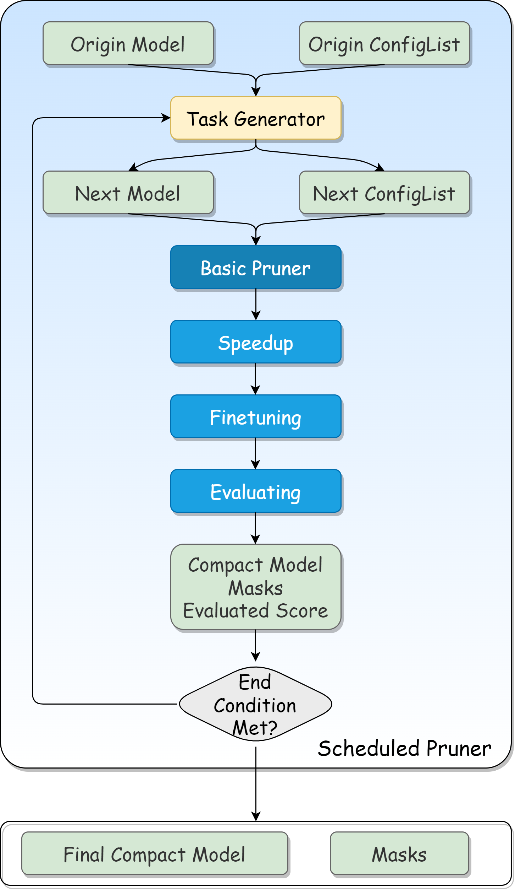

.. 1ec93e31648291b0c881655304116b50

剪枝（V2版本）
===============

剪枝（V2版本）是对旧版本的重构，提供了更强大的功能。
与旧版本相比，迭代剪枝过程与剪枝器（pruner）分离，剪枝器只负责剪枝且生成掩码一次。
更重要的是，V2版本统一了剪枝过程，并提供了更自由的剪枝组件组合。
任务生成器（task generator）只关心在每一轮中应该达到的修剪效果，并使用配置列表（config list）来表示下一步如何修剪。
剪枝器将使用任务生成器提供的模型和配置列表重置，然后在当前步骤中生成掩码。

有关更清晰的架构，请参考下图。

在V2版本中，修剪过程通常由剪枝调度器（pruning scheduler）驱动，它包含一个特定的剪枝器和一个任务生成器。
但是用户也可以像V1版本中那样直接使用剪枝器。

有关详细信息，请参阅以下教程：

..  toctree::
    :maxdepth: 1

    剪枝算法 <v2_pruning_algo>
    剪枝调度器接口 <v2_scheduler>
    剪枝配置 <v2_pruning_config_list>
